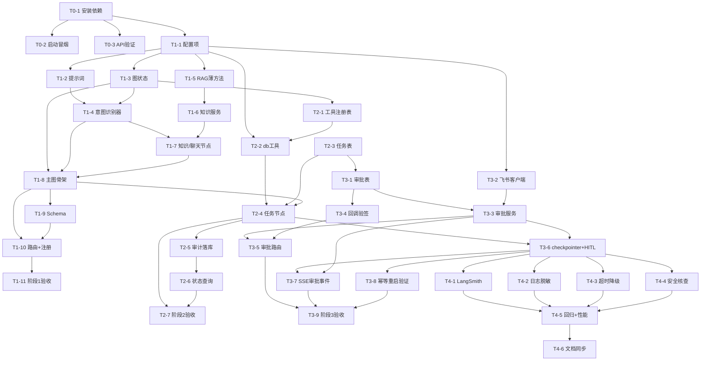

# lingxi-agent 智能化改造开发任务拆分文档

> 版本：v1.0
> 日期：2026-09-07
> 状态：待评审
> 源文档：[lingxi_agent_langgraph_redesign.md](./lingxi_agent_langgraph_redesign.md)

***

## 目录

1. [文档说明](#1-文档说明)
2. [任务总览](#2-任务总览)
3. [阶段 0：环境准备](#3-阶段-0环境准备)
4. [阶段 1：意图识别 + 主图骨架](#4-阶段-1意图识别--主图骨架)
5. [阶段 2：任务执行子图 + 工具层](#5-阶段-2任务执行子图--工具层)
6. [阶段 3：飞书审批（HITL）](#6-阶段-3飞书审批hitl)
7. [阶段 4：观测与加固](#7-阶段-4观测与加固)
8. [任务依赖与并行关系](#8-任务依赖与并行关系)
9. [关键风险与注意事项](#9-关键风险与注意事项)
10. [附录：实施前需核对的 API](#10-附录实施前需核对的-api)

***

## 1. 文档说明

### 1.1 目标

依据设计文档《lingxi_agent_langgraph_redesign.md》，将整个智能化改造拆分为**可独立开发、可独立验收**的详细任务，明确每个任务的：目标、涉及文件、实施要点、产出、验收标准、前置依赖，供排期与分工使用。

### 1.2 拆分原则

1. **可独立验收**：每个任务有明确验收标准，完成后即可自测，不依赖后续任务；
2. **最小改动**：严格遵循设计文档 §12 影响范围——`agent/**` 为新增模块；对现有文件的修改仅限设计文档列出的 6 个文件（requirements.txt / core/config.py / .env.dev / app/main.py / prompt/prompt_storage.py / rag/rag_conversation_service.py），**改动前需与用户确认改动点与影响范围**；
3. **阶段对齐**：任务按设计文档 §13 的 5 个阶段（0~4）组织，阶段间有明确里程碑；
4. **先骨架后细节**：意图识别 + 主图骨架先行，任务执行与审批逐层叠加，保证任意阶段服务均可启动；
5. **API 先行确认**：`langchain.agents.create_agent` / `HumanInTheLoopMiddleware` 等新 API 在编码前先行验证（见 §10 附录），避免返工。

### 1.3 任务编号规则

- 编号格式：`T{阶段}-{序号}`，如 `T1-3` 表示阶段 1 的第 3 个任务；
- 复杂度标注：`S`（小，单人短期可完成）/ `M`（中）/ `L`（大，建议专项投入）；
- 优先级标注：`P0`（阻塞后续所有任务）/ `P1`（主路径）/ `P2`（增强/兜底）。

### 1.4 同步要求

> 本拆分文档不新增业务需求，仅对设计文档的实施细化。若实施过程中**产生新的需求/方案变更**，按《增量优化开发规则》同步更新 [lingxi_agent_langgraph_redesign.md](./lingxi_agent_langgraph_redesign.md)。

***

## 2. 任务总览

| 阶段  | 内容                             | 里程碑                                  | 对应设计文档章节                                        |
| --- | ------------------------------ | ------------------------------------ | ----------------------------------------------- |
| 0   | 环境准备                           | 依赖安装完成、服务可启动、新 API 验证通过              | §3.1、§13                                        |
| 1   | 意图识别 + 主图骨架（路由到知识库/聊天）         | `/api/agent/chat` 可流式问答              | §5.1~5.4、§5.8、§6.1、§7.1~7.2、§7.6、§9             |
| 2   | 任务执行子图 + 工具层（只读/插入）            | 查询/插入任务可完成并出审计报告                     | §5.5、§6.3、§7.4、§8.1、§9                          |
| 3   | 飞书审批（写操作拦截 + interrupt + 回调恢复） | update/delete 触发审批，通过后执行、拒绝后终止，重启可恢复 | §5.6、§5.8.2、§6.4~6.5、§6.7、§7.2~7.3、§7.5、§8.2、§9 |
| 4   | 观测与加固                          | 全链路可追踪，异常可降级，安全核查通过                  | §11、§13、§14                                     |

### 2.1 任务清单

| 任务    | 内容                                     | 复杂度 | 优先级 | 前置依赖           |
| ----- | -------------------------------------- | --- | --- | -------------- |
| T0-1  | 安装依赖并验证版本                              | S   | P0  | -              |
| T0-2  | 服务启动冒烟（回归基线）                           | S   | P0  | T0-1           |
| T0-3  | 新 API 可用性验证                            | M   | P0  | T0-1           |
| T1-1  | 配置项扩展（core/config.py + .env.dev）       | S   | P0  | T0-1           |
| T1-2  | 提示词新增（prompt_storage.py）               | S   | P0  | T1-1           |
| T1-3  | AgentState 图状态定义                       | S   | P0  | T1-1           |
| T1-4  | IntentRouter 意图识别器                     | M   | P0  | T1-2、T1-3      |
| T1-5  | RAG 服务公开薄方法                            | S   | P0  | T1-1           |
| T1-6  | 知识服务薄适配层（KnowledgeService）             | M   | P0  | T1-5           |
| T1-7  | 知识库/聊天节点（KnowledgeNode/ChatNode）       | M   | P0  | T1-4、T1-6      |
| T1-8  | 主图骨架（graph_builder + merge + finalize） | L   | P0  | T1-3、T1-4、T1-7 |
| T1-9  | Agent 请求/响应 Schema                     | S   | P0  | T1-8           |
| T1-10 | `/api/agent/chat` 路由 + 路由注册            | M   | P0  | T1-8、T1-9      |
| T1-11 | 阶段 1 自测与验收                             | M   | P0  | T1-10          |
| T2-1  | 工具注册表（registry.py）                     | S   | P0  | T1-3           |
| T2-2  | 数据库工具执行器（db_tools.py）                  | L   | P0  | T1-1、T2-1      |
| T2-3  | task_execution 表与 Schema               | S   | P0  | T0-1           |
| T2-4  | 任务节点（task_node，无审批路径）                  | L   | P0  | T1-8、T2-2、T2-3 |
| T2-5  | 任务审计落库                                 | M   | P0  | T2-3、T2-4      |
| T2-6  | 任务状态查询接口                               | S   | P1  | T2-5           |
| T2-7  | 阶段 2 自测与验收                             | M   | P0  | T2-4、T2-6      |
| T3-1  | approval_request 表与 Schema             | S   | P0  | T0-1           |
| T3-2  | 飞书审批客户端（feishu_client.py）              | M   | P0  | T1-1           |
| T3-3  | 审批服务（approval_service.py）              | L   | P0  | T3-1、T3-2      |
| T3-4  | 回调验签解密（callback.py）                    | M   | P0  | T1-1、T3-1      |
| T3-5  | 审批路由（callback + 查询）                    | M   | P0  | T3-3、T3-4      |
| T3-6  | 图挂载 checkpointer + HITL 中间件            | M   | P0  | T2-4、T3-3      |
| T3-7  | SSE 审批事件 + 心跳 + 轮询兜底                   | M   | P1  | T3-3、T3-6      |
| T3-8  | 幂等与重启恢复验证                              | M   | P0  | T3-6           |
| T3-9  | 阶段 3 自测与验收                             | M   | P0  | T3-5、T3-7、T3-8 |
| T4-1  | LangSmith 追踪完善                         | M   | P2  | T3-6           |
| T4-2  | 日志与敏感信息脱敏                              | S   | P2  | T3-6           |
| T4-3  | 超时保护与降级                                | M   | P1  | T3-6           |
| T4-4  | 安全加固核查                                 | M   | P1  | T3-6           |
| T4-5  | 全链路回归 + 性能评估                           | M   | P1  | T4-1~T4-4      |
| T4-6  | 文档同步确认                                 | S   | P2  | T4-5           |

***

## 3. 阶段 0：环境准备

### T0-1 安装依赖并验证版本（S / P0）

- **目标**：安装设计文档 §3.1 锁定的依赖版本，保证 `pip install` 成功。
- **涉及文件**：`requirements.txt`（已改，无需再动）。
- **实施要点**：
  1. 执行 `pip install -r requirements.txt`；
  2. 验证关键版本：`langchain==1.3.10`、`langgraph==1.2.10`、`langchain-core==1.6.1`、`lark-oapi==1.7.3`、`openai==3.8.0`；
  3. 确认 `langgraph-checkpoint-mysql==3.0.0` 已随依赖拉取。
- **产出**：可运行的 Python 环境。
- **验收标准**：`pip install` 无报错；`pip show` 各包版本与锁定版本一致。
- **前置依赖**：无。

### T0-2 服务启动冒烟（S / P0）

- **目标**：确认升级依赖后旧功能无回归，建立改造前的行为基线。
- **实施要点**：
  1. 启动 `run.py`，确认服务可正常启动（lifespan 初始化成功或可降级）；
  2. 冒烟旧接口：登录、会话 CRUD、`/api/conversations/chat`（use_rag=true/false）各调用一次；
  3. 记录检索结果与回答，作为阶段 1 回归对比基线。
- **验收标准**：旧接口全部可用，检索/对话行为与改造前一致。
- **前置依赖**：T0-1。

### T0-3 新 API 可用性验证（M / P0）

- **目标**：在编码前验证设计文档涉及的新 API 在本锁定版本下的真实签名，消除实现期的不确定性（见 §10 附录）。
- **涉及文件**：临时验证脚本（验证后可删除，不落入业务代码）。
- **实施要点**：
  1. 验证 `langchain.agents.create_agent` 的导入路径、参数（model/tools/system_prompt/middleware/checkpointer）；
  2. 验证 `langchain.agents.middleware.HumanInTheLoopMiddleware`：`interrupt_on` 取值格式、`allowed_decisions`、`description_prefix`、`when` 回调；
  3. 验证中断产生的 `HITLRequest` 结构（`action_requests` / `review_configs`）与恢复所需 `Command(resume=...)` 的载荷格式（`HITLResponse` / `Decision` 的构造方式）；
  4. 验证 `langgraph.checkpoint.mysql.aio.MySQLAsyncSaver` 初始化与连接串格式；
  5. 验证 `ChatOpenAI.with_structured_output` 在多标签 list 输出上的表现；
  6. 验证 `StateGraph` 条件路由返回值支持节点名**列表**（并行 fan-out）。
- **产出**：API 验证结论（记录真实签名与用法），更新 §10 附录。
- **验收标准**：所有待用 API 有可运行的示例代码，签名与设计文档一致；不一致处已记录并在任务 T1-4/T2-4/T3-3/T3-6 实施时按真实 API 落地。
- **前置依赖**：T0-1。

***

## 4. 阶段 1：意图识别 + 主图骨架

### T1-1 配置项扩展（S / P0）

- **目标**：新增飞书审批与任务执行相关配置（设计文档 §10）。
- **涉及文件**：`core/config.py`（纯新增字段）、`.env.dev`（占位）。
- **实施要点**：
  1. 在 `Settings` 中新增字段（均带默认值兜底，避免无配置时报错）：
     - 飞书：`feishu_app_id` / `feishu_app_secret` / `feishu_approval_code` / `feishu_encrypt_key` / `feishu_verification_token` / `feishu_callback_url`；
     - 任务执行：`agent_db_allowed_tables`（逗号分隔字符串）/ `agent_query_max_rows`（默认 50）/ `agent_task_timeout_seconds`（默认 120）/ `agent_insert_requires_approval`（默认 False）；
  2. `.env.dev` 增加对应注释占位（空值即可，飞书功能未配置时对应模块应优雅降级）。
- **产出**：配置类与 .env.dev 占位。
- **验收标准**：不配置飞书相关值时服务可正常启动；`settings.agent_db_allowed_tables` 可解析为列表。
- **前置依赖**：T0-1。
- **注意**：本任务为对现有文件的最小改动（纯新增字段），按用户最小改动规则，改动前向用户确认改动点与影响范围。

### T1-2 提示词新增（S / P0）

- **目标**：集中管理意图识别 / 任务执行 / 汇总提示词（设计文档 §5.2、§7.2）。
- **涉及文件**：`prompt/prompt_storage.py`（纯追加）。
- **实施要点**：新增并注释完整：
  1. `INTENT_CLASSIFICATION_PROMPT`：定义三类意图（knowledge_base / task / chat）判定标准、多标签输出要求、置信度说明、安全约束（仅处理授权范围内的数据库操作）；
  2. `TASK_AGENT_SYSTEM_PROMPT`：任务 Agent 角色、可用工具说明、写操作需审批提示、禁止自行执行未授权操作、双重确认要求；
  3. `MERGE_ANSWERS_PROMPT`：知识库结论 + 任务结果 + 综合建议 的三段式合并润色要求。
- **产出**：三个提示词常量。
- **验收标准**：无语法错误；提示词内容与设计文档 §5.2 的意图定义一致。
- **前置依赖**：T1-1（无硬依赖，可并行）。

### T1-3 AgentState 图状态定义（S / P0）

- **目标**：定义主图状态（设计文档 §5.1）。
- **涉及文件**：新增 `agent/state.py`。
- **实施要点**：
  1. 定义 `AgentState(TypedDict, total=False)`，字段与设计文档 §5.1 完全对齐：会话上下文、意图识别、知识库问答、任务执行、输出五大块；
  2. `messages` 字段使用 `Annotated[list, add_messages]` reducer；
  3. 并行分支隔离字段：`rag_answer` 与 `task_answer` 分离，`final_response` 供 merge/finalize 使用。
- **产出**：`agent/state.py`。
- **验收标准**：字段齐全、类型正确、`add_messages` reducer 生效；`total=False` 保证可选字段兼容并行/单分支。
- **前置依赖**：T1-1。

### T1-4 IntentRouter 意图识别器（M / P0）

- **目标**：多标签意图识别 + 降级策略（设计文档 §5.2、§7.1）。
- **涉及文件**：新增 `agent/intent_router.py`。
- **实施要点**：
  1. 定义 `IntentResult(BaseModel)`：`intents: list[Literal["knowledge_base","task","chat"]]`、`reason`、`confidence`；
  2. `IntentRouter` 使用 `ChatOpenAI(...).with_structured_output(IntentResult)`（temperature=0，模型默认 qwen-turbo）；
  3. 实现 `classify()`：调用失败/输出非法 → 降级 `["chat"]`；置信度 < 0.5 → 降级 `["chat"]`；
  4. 实现 `_normalize()`：去重保序、丢弃 chat（多意图并存时）、异常组合（空 / 超 2 个）按 `task > knowledge_base > chat` 收敛；
  5. 关键点加注释，LLM 失败降级打 warning 日志（不抛异常）。
- **产出**：`agent/intent_router.py`。
- **验收标准**：单元验证各输入组合的归一化结果符合设计文档 §5.2 意图组合规则；LLM 异常时返回 chat 不抛错。
- **前置依赖**：T1-2、T1-3。

### T1-5 RAG 服务公开薄方法（S / P0）

- **目标**：为图节点复用现有检索/历史能力暴露公开方法（设计文档 §12.2）。
- **涉及文件**：`rag/rag_conversation_service.py`（**仅新增方法，不改现有逻辑**）。
- **实施要点**：
  1. 新增 `retrieve_context_public(query, k=4, login_username=None, precomputed_embedding=None)`：内部委托现有 `_retrieve_context`；
  2. 新增 `get_compressed_history_public(conversation_id)`：构造 `MySQLChatMessageHistory` 并委托现有 `_build_compressed_history`；
  3. 新增 `format_context_public(docs)`：委托现有 `_format_context`；
  4. 各方法加 docstring，注明"供 Agent 图节点复用，内部逻辑不变"。
- **产出**：3 个公开方法。
- **验收标准**：旧接口行为零变化；新方法返回与现有私有方法一致。
- **前置依赖**：T1-1。
- **注意**：涉及现有文件修改，改动前向用户确认改动点与影响范围（仅新增公开方法）。

### T1-6 知识服务薄适配层（M / P0）

- **目标**：封装知识库分支的完整流程（设计文档 §5.3）。
- **涉及文件**：新增 `agent/knowledge_service.py`。
- **实施要点**：
  1. `KnowledgeService.__init__(db_session, hybrid_retriever=None)` 复用 `RAGConversationService`；
  2. `get_cached(user_input, username, embedding)`：调用语义缓存 get；
  3. `retrieve(user_input, username, embedding, k=4)`：调用 `retrieve_context_public` + `format_context_public`；
  4. `build_history(conversation_id)`：调用 `get_compressed_history_public`；
  5. 提供 `save_answer(conversation_id, user_input, answer)`（消息落库）+ `put_cache(...)`（写语义缓存），供节点收尾复用。
- **产出**：`agent/knowledge_service.py`。
- **验收标准**：不修改 `rag/**` 内部实现；返回结构满足节点使用。
- **前置依赖**：T1-5。

### T1-7 知识库/聊天节点（M / P0）

- **目标**：实现 `knowledge` 与 `chat` 两个图节点（设计文档 §5.3、§5.4）。
- **涉及文件**：新增 `agent/nodes/__init__.py`、`agent/nodes/knowledge_node.py`、`agent/nodes/chat_node.py`。
- **实施要点**：
  1. `knowledge_node(state) -> dict`：
     - 预计算 query embedding（复用 `DashScopeEmbedding.embed_query`，`asyncio.to_thread`）；
     - 语义缓存命中 → 直接产出 `rag_answer`，跳过检索；
     - 未命中 → `KnowledgeService.retrieve` → 组装 RAG Prompt（复用 `RAG_SYSTEM_PROMPT_WITH_CONTEXT/WITHOUT_CONTEXT`）→ LLM 流式生成，产出 `rag_answer`；
     - 落库消息 + 写语义缓存（收尾统一由 finalize 处理亦可，节点内只产出状态）；
  2. `chat_node(state) -> dict`：复用 `ConversationService.chat_with_memory` 的 Prompt 与记忆逻辑，走 `CHAT_SYSTEM_PROMPT`，产出 `rag_answer`（单分支时合并后即为最终回答）；
  3. 节点函数需支持流式（内部将 token 推入 SSE 队列，见 T1-10）。
- **产出**：两个节点实现。
- **验收标准**：知识库问答检索结果与旧接口一致；聊天不检索；缓存命中直接返回。
- **前置依赖**：T1-4、T1-6。

### T1-8 主图骨架（L / P0）

- **目标**：组装主图：意图路由 + 知识库/聊天分支 + merge + finalize（设计文档 §7.2）。
- **涉及文件**：新增 `agent/graph_builder.py`。
- **实施要点**：
  1. 实现 `route_by_intents(state)`：返回节点名或节点名列表（`["knowledge","task_agent"]` 并行 fan-out 预留；阶段 1 先支持单分支，task_agent 分支用占位节点，待 T2-4 替换）；
  2. `build_graph(checkpointer=None)`：`StateGraph(AgentState)`，注册 `intent_router` / `knowledge` / `chat` / `merge` / `finalize`；
  3. `merge` 节点：仅一个分支有结果时直接透传，两个分支有结果时 LLM 合并润色（阶段 1 为单分支，透传即可，合并逻辑 T3-6 后全量生效）；
  4. `finalize` 节点：写入 `final_response`，为 SSE 收尾与消息落库留出状态（具体落库逻辑随 T2/T3 扩展）；
  5. 阶段 1 checkpointer 可传 None（先不启用审批持久化），T3-6 再挂 `MySQLAsyncSaver`；
  6. 图编译失败不阻塞应用启动：`build_graph` 抛异常时由调用方捕获并降级为纯聊天兜底。
- **产出**：`agent/graph_builder.py` 主图（阶段 1 可用版本）。
- **验收标准**：knowledge / chat 单分支可完成 路由→生成→merge→finalize 全流程；`route_by_intents` 返回列表的并行分支在接入 task_agent 后可用。
- **前置依赖**：T1-3、T1-4、T1-7。

### T1-9 Agent 请求/响应 Schema（S / P0）

- **目标**：定义 `/api/agent/chat` 请求与响应结构（设计文档 §9.1）。
- **涉及文件**：新增 `models/agent_schema.py`（或并入 task_schema，建议独立文件）。
- **实施要点**：
  1. `AgentChatRequest`：`conversation_id`、`messages`、`model`、`stream`，与现有 `ChatRequest` 对齐但**不包含 use_rag**；
  2. 校验 `messages` 非空、末条为 user 消息。
- **产出**：`models/agent_schema.py`。
- **验收标准**：字段与设计文档 §9.1 请求体一致。
- **前置依赖**：T1-8。

### T1-10 `/api/agent/chat` 路由 + 注册（M / P0）

- **目标**：新增 SSE 流式接口并注册（设计文档 §7.6、§9）。
- **涉及文件**：新增 `api/routes/agent.py`；修改 `app/main.py`（注册路由，纯追加）。
- **实施要点**：
  1. `POST /api/agent/chat`：JWT 鉴权（复用 `get_current_user`），`StreamingResponse` 返回 SSE；
  2. 以 `graph.astream(inputs, config, stream_mode="updates")` 驱动主图；节点内部将生成 token 写入 SSE 队列；
  3. 沿用现有 SSE 帧格式，扩展 `event` 字段：`content` / `status` / `ping` / `done`（阶段 1 先实现 `content` 与 `done`）；
  4. 异常处理：图执行异常 → 返回 `event=status, status=error` + 降级文案，不中断连接；
  5. `app/main.py` lifespan 中初始化主图（失败降级，不阻塞现有功能）并 `include_router(agent.router, prefix="/api")`。
- **产出**：可用的 `/api/agent/chat` 接口。
- **验收标准**：knowledge / chat 意图请求均能 SSE 流式返回；错误场景不崩溃且返回可读错误。
- **前置依赖**：T1-8、T1-9。
- **注意**：涉及 `app/main.py` 修改（lifespan + 注册路由），改动前向用户确认改动点。

### T1-11 阶段 1 自测与验收（M / P0）

- **目标**：阶段 1 完整验收（设计文档 §13 阶段 1 验收标准）。
- **实施要点**：
  1. 构造三类输入验证意图路由：知识库提问 / 闲聊 / 边界输入（低置信度）；
  2. 与旧接口 `/api/conversations/chat` 对比：知识库问答检索结果一致、普通聊天行为一致；
  3. 校验 SSE 帧格式与 `done` 标记。
- **验收标准**：知识库问答与普通聊天流式正常，检索结果与旧接口一致；意图日志可观测（reason/confidence）。
- **前置依赖**：T1-10。

***

## 5. 阶段 2：任务执行子图 + 工具层

### T2-1 工具注册表（S / P0）

- **目标**：工具元数据集中声明（设计文档 §5.5.1）。
- **涉及文件**：新增 `agent/tools/__init__.py`、`agent/tools/registry.py`。
- **实施要点**：
  1. 定义 `ToolSpec`：名称、能力描述、风险等级（read/write）、`requires_approval`（bool）、对应执行函数；
  2. 注册 5 个工具：`list_tables`（只读）/ `query_data`（只读）/ `insert_data`（写，默认不审批）/ `update_data`（写，审批）/ `delete_data`（写，审批）；
  3. `AGENT_INSERT_REQUIRES_APPROVAL` 配置为 True 时动态覆盖 insert 的审批开关；
  4. 提供按名称获取 ToolSpec 的接口，供节点与审批模块复用（未来新增工具只需在此声明）。
- **产出**：`agent/tools/registry.py`。
- **验收标准**：工具清单与设计文档 §5.5.1 表一致；审批开关可被配置动态控制。
- **前置依赖**：T1-3。

### T2-2 数据库工具执行器（L / P0）

- **目标**：结构化参数 + 白名单 + 参数化执行（设计文档 §5.5.2、§7.4、§11）。
- **涉及文件**：新增 `agent/tools/db_tools.py`。
- **实施要点**：
  1. `DbToolExecutor` 五个方法：`list_tables()` / `query_data(table, columns, filters, limit=50)` / `insert_data(table, values)` / `update_data(table, values, filters)` / `delete_data(table, filters)`；
  2. **安全基线**：
     - `_assert_table_allowed`：table 必须在 `AGENT_DB_ALLOWED_TABLES` 白名单；
     - `_assert_columns_allowed`：列名严格白名单（或正则校验 `^[a-zA-Z_][a-zA-Z0-9_]*$`，并排除敏感列）；
     - 全部语句用 `text()` + 绑定参数，禁止拼接 SQL；
     - `query_data` 强制 `LIMIT :limit`（默认 50）、结果字段裁剪；
     - 单次执行超时保护（`AGENT_TASK_TIMEOUT_SECONDS`）；
  3. 返回结构化结果（list[dict]），执行耗时与行数随结果返回；
  4. 每次调用通过回调/返回值提供审计信息（工具名、参数摘要、行数），由 T2-5 落库。
- **产出**：`agent/tools/db_tools.py`。
- **验收标准**：白名单外表/非法列名/超 LIMIT 均被拦截；注入样例（`'; DROP TABLE...`）作为参数值无害；只读/写工具执行正确。
- **前置依赖**：T1-1、T2-1。
- **注意**：本任务涉及真实数据库写路径，生产白名单务必收敛到最小集合（设计文档 §14-6）。

### T2-3 task_execution 表与 Schema（S / P0）

- **目标**：任务执行记录表（审计）与 Schema（设计文档 §8.1）。
- **涉及文件**：新增 `models/task_model.py`、`models/task_schema.py`。
- **实施要点**：
  1. `TaskExecution` ORM 模型：字段与 §8.1 完全对齐（id / conversation_id / user_id / intent / status / tool_calls(JSON) / rag_answer / task_answer / result / error / created_at / updated_at），沿用现有模型风格（UUID 主键、func.current_timestamp）；
  2. `task_schema.py`：`TaskExecutionCreate/Out`、`TaskStatus` 枚举（running/completed/rejected/failed/canceled）；
  3. 新表由 `Base.metadata.create_all` 启动时自动创建（无需迁移脚本）。
- **产出**：任务表 + Schema。
- **验收标准**：服务启动后表自动创建；字段与设计文档一致。
- **前置依赖**：T0-1。

### T2-4 任务节点（L / P0）

- **目标**：任务执行子图节点（无审批路径），替换 T1-8 的占位（设计文档 §5.5.3、§7.2）。
- **涉及文件**：新增 `agent/nodes/task_node.py`；更新 `agent/graph_builder.py`。
- **实施要点**：
  1. 用 `langchain.agents.create_agent` 构建任务 Agent（绑定 `list_tables/query_data/insert_data` 3 个工具，阶段 2 暂不绑 update/delete）；
  2. 阶段 2 暂不挂 `HumanInTheLoopMiddleware`（T3-6 挂载），先验证 create_agent + 工具循环正常；
  3. 图节点调用 Agent 执行，产出 `task_answer`（人类可读执行报告）；
  4. 写操作（insert）执行成功后审计落库；Agent 规划异常/工具异常 → 捕获并产出可读错误，不中断图；
  5. `graph_builder` 将 `task_agent` 节点接入 `route_by_intents` 并行分支映射（`["knowledge","task_agent"]`）。
- **产出**：任务节点实现 + 主图接入并行分支。
- **验收标准**：`task` 单意图请求可完成查询/插入任务并输出执行报告；`task+knowledge_base` 双意图并行执行，两分支结果均产出。
- **前置依赖**：T1-8、T2-2、T2-3。
- **注意**：create_agent 的 HITL 中间件构造方式以 T0-3 验证结果为准。

### T2-5 任务审计落库（M / P0）

- **目标**：每次工具调用与结果写入 task_execution（设计文档 §5.5.2、§8.1）。
- **涉及文件**：`agent/nodes/task_node.py`、`models/task_model.py`。
- **实施要点**：
  1. 图开始时创建 `TaskExecution`（status=running，intent 记录路由意图）；
  2. Agent 执行期间收集 `tool_calls`（名称、参数摘要、结果摘要、耗时）；
  3. 完成/失败/拒绝时更新 status 与 result/error；
  4. **脱敏**：日志与 tool_calls 中不记录完整参数值（设计文档 §11）。
- **产出**：任务审计落库逻辑。
- **验收标准**：task_execution 表存在完整执行记录（含工具序列与结果摘要）。
- **前置依赖**：T2-3、T2-4。

### T2-6 任务状态查询接口（S / P1）

- **目标**：轮询兜底接口（设计文档 §9.1）。
- **涉及文件**：`api/routes/agent.py`。
- **实施要点**：`GET /api/agent/tasks/{task_execution_id}`，JWT 鉴权，返回任务状态、各分支结果快照（rag_answer/task_answer）、最终 result。
- **验收标准**：可查询到任务状态与最终回答。
- **前置依赖**：T2-5。

### T2-7 阶段 2 自测与验收（M / P0）

- **实施要点**：
  1. 查询类任务：`query_data` / `list_tables` 正常执行并返回报告；
  2. 插入类任务：`insert_data` 执行成功，数据落库，审计可见；
  3. 双意图并行：`task+knowledge_base` 输入验证两分支并行与 merge 汇总；
  4. 非法输入：白名单外表、注入样例验证拦截。
- **验收标准**：查询/插入任务可完成并出审计报告；并行分支汇总正确（设计文档 §13 阶段 2 验收标准）。
- **前置依赖**：T2-4、T2-6。

***

## 6. 阶段 3：飞书审批（HITL）

### T3-1 approval_request 表与 Schema（S / P0）

- **目标**：审批单表与 Schema（设计文档 §8.2）。
- **涉及文件**：新增 `models/approval_model.py`、`models/approval_schema.py`。
- **实施要点**：
  1. `ApprovalRequest` ORM：字段与 §8.2 对齐（含 `tool_params` JSON、`callback_payload` JSON、`feishu_instance_code` 等）；
  2. 索引：`idx_appr_instance(instance_code)`、`idx_appr_conv(conversation_id, status)`；
  3. `approval_schema.py`：状态枚举（pending/approved/rejected/canceled）、查询 Schema。
- **验收标准**：启动自动建表；索引正确。
- **前置依赖**：T0-1。

### T3-2 飞书审批客户端（M / P0）

- **目标**：创建飞书审批实例（设计文档 §7.3）。
- **涉及文件**：新增 `agent/approval/__init__.py`、`agent/approval/feishu_client.py`。
- **实施要点**：
  1. `FeishuApprovalClient(app_id, app_secret)`：基于 lark-oapi 构建客户端；
  2. `create_instance(approval_code, user_id, form_fields) -> instance_code`：构造 `CreateInstanceRequest`（表单摘要：操作类型/目标表/参数摘要/发起人等），审批人由审批流自动路由；
  3. 表单中**不展示完整参数值**（脱敏）；
  4. 飞书配置缺失/调用失败 → 抛可识别异常，由上层决定降级（如标记审批创建失败并回滚图状态）。
- **产出**：`agent/approval/feishu_client.py`。
- **验收标准**：配置正确时可创建审批实例并返回 instance_code；配置缺失时不崩溃。
- **前置依赖**：T1-1。

### T3-3 审批服务（L / P0）

- **目标**：执行包装层——中断检测、审批单落库、创建飞书实例、SSE 通知、回调恢复（设计文档 §5.6、§7.2）。
- **涉及文件**：新增 `agent/approval/approval_service.py`。
- **实施要点**：
  1. `run_and_handle_approval(graph, inputs, config, sse_queue)`：
     - `astream(..., stream_mode="updates")` 逐块消费，检测 `__interrupt__`；
     - 命中中断 → 解析 HITLRequest 的 `action_requests`，提取待审批工具名/参数；
     - 落库 `ApprovalRequest`（status=pending，tool_params 保存恢复用参数）→ 创建飞书审批实例 → 回填 instance_code → SSE 推送 `event=approval_required` + approval_id；
  2. 中断期间发送心跳（`event=ping`），连接断开可轮询兜底（T3-7）；
  3. `resume_graph(approval_id, decision)`：校验审批单状态为 pending（幂等守卫）→ `graph.ainvoke(Command(resume=...))` 恢复同一 thread（thread_id=conversation_id）；approve → 执行写工具；reject → 终止并生成拒绝回答；
  4. 双写一致性：审批单状态与图状态一致，重复回调/重复恢复被状态机拦截（设计文档 §5.6 关键点）。
- **产出**：`agent/approval/approval_service.py`。
- **验收标准**：中断被正确检测；审批单 + 飞书实例创建成功；恢复后写工具执行或拒绝终止。
- **前置依赖**：T3-1、T3-2。
- **注意**：HITLRequest / Command(resume) 载荷以 T0-3 验证结果为准。

### T3-4 回调验签解密（M / P0）

- **目标**：飞书事件回调安全处理（设计文档 §7.5、§11）。
- **涉及文件**：新增 `agent/approval/callback.py`。
- **实施要点**：
  1. 校验 `verification_token`（拒绝伪造回调）；
  2. 解密 `encrypt_key`（AES-256-CBC）得到 event JSON；
  3. 解析 `approval.instance` 事件：提取 `instance_code` 与 `status`（APPROVED / REJECTED / CANCELED）；
  4. 以 instance_code 反查 approval_request，幂等更新状态并触发图恢复（异步后台任务）；
  5. 处理失败记录日志，支持定时补偿（以 approval_request.status 为准，可后续 T4 补）。
- **产出**：`agent/approval/callback.py`。
- **验收标准**：验签失败/解密失败被拦截；合法回调正确更新状态并触发恢复。
- **前置依赖**：T1-1、T3-1。

### T3-5 审批路由（M / P0）

- **目标**：回调与查询接口（设计文档 §9.1）。
- **涉及文件**：新增 `api/routes/approval.py`；修改 `app/main.py`（注册路由，纯追加）。
- **实施要点**：
  1. `POST /api/approval/callback`：飞书验签（无 JWT），调用 T3-4 处理；
  2. `GET /api/approvals/{approval_id}`：JWT 鉴权，返回审批单状态；
  3. `app/main.py` 注册路由。
- **产出**：两个接口。
- **验收标准**：回调可被飞书事件推送命中；查询接口可读状态。
- **前置依赖**：T3-3、T3-4。

### T3-6 图挂载 checkpointer + HITL 中间件（M / P0）

- **目标**：启用审批中断与持久化（设计文档 §5.5.3、§5.6、§7.2）。
- **涉及文件**：`agent/graph_builder.py`、`agent/nodes/task_node.py`、`app/main.py`。
- **实施要点**：
  1. 创建 `MySQLAsyncSaver`（独立库表权限，连接串与业务库一致或按配置隔离），注入主图 `compile(checkpointer=...)` 与任务 Agent；
  2. 任务 Agent 挂载 `HumanInTheLoopMiddleware`：
     - `interrupt_on={"update_data": {"allowed_decisions": ["approve","reject"]}, "delete_data": {"allowed_decisions": ["approve","reject"]}, "insert_data": <按 agent_insert_requires_approval 配置>}`；
     - `description_prefix="数据库写操作待审批"`；
  3. `thread_id` 统一使用 `conversation_id`（主图与子图检查点一致）；
  4. `merge` 节点补全两分支 LLM 合并润色逻辑（审批中断场景：rag_answer 已产出保留，恢复后汇聚）；
  5. `app/main.py` lifespan 初始化 checkpointer，失败降级为无审批模式（写操作直接拒绝并提示未配置审批）。
- **产出**：完整 HITL 能力。
- **验收标准**：update/delete 触发 interrupt 且状态可持久化；`Command(resume=...)` 后可恢复执行。
- **前置依赖**：T2-4、T3-3。
- **注意**：`MySQLAsyncSaver` 需数据库建表权限（设计文档 §14-3）。

### T3-7 SSE 审批事件 + 心跳 + 轮询兜底（M / P1）

- **目标**：审批等待期连接保活与断连兜底（设计文档 §5.8.2、§7.6）。
- **涉及文件**：`api/routes/agent.py`。
- **实施要点**：
  1. 审批中断时推送 `event=status, status=approval_required, approval_id=...`；
  2. 审批等待期定时推送 `event=ping` 心跳（防网关/代理超时）；
  3. 完成后推送最终回答与 `done`；
  4. 前端断连时通过 `GET /api/agent/tasks/{task_execution_id}` 轮询获得合并后的 final_response。
- **验收标准**：等待期间连接不断；断连后可轮询拿到结果。
- **前置依赖**：T3-3、T3-6。

### T3-8 幂等与重启恢复验证（M / P0）

- **目标**：重复回调/恢复被拦截；服务重启后审批流可继续（设计文档 §5.6、§14）。
- **实施要点**：
  1. 模拟重复回调与重复恢复，验证状态机单向流转（pending→approved/rejected）；
  2. 审批中断后重启服务，验证检查点可恢复、图可继续执行到 merge；
  3. 验证 `approval_request.id` 与图状态关联一致性。
- **验收标准**：重复操作被幂等拦截；重启后审批结果可恢复执行。
- **前置依赖**：T3-6。

### T3-9 阶段 3 自测与验收（M / P0）

- **实施要点**：
  1. update/delete 触发审批：通过后执行、拒绝后终止并生成拒绝回答；
  2. 双意图并行 + 审批中断：rag_answer 不丢失，恢复后 merge 汇总正确；
  3. 心跳保活与轮询兜底联调。
- **验收标准**：满足设计文档 §13 阶段 3 验收标准（update/delete 触发审批，通过后执行、拒绝后终止，重启可恢复）。
- **前置依赖**：T3-5、T3-7、T3-8。

***

## 7. 阶段 4：观测与加固

### T4-1 LangSmith 追踪完善（M / P2）

- **目标**：全链路可观测（设计文档 §2.1、§13 阶段 4）。
- **实施要点**：
  1. 意图识别、知识库检索、任务工具调用、审批中断/恢复等关键 span 命名统一；
  2. 在 agent 各节点与工具执行处补齐 tracing（复用现有 LangSmith 接入）。
- **验收标准**：一次完整请求（含审批）可在 LangSmith 中还原全链路。
- **前置依赖**：T3-6。

### T4-2 日志与敏感信息脱敏（S / P2）

- **目标**：审计与日志不泄露完整参数（设计文档 §11）。
- **实施要点**：统一日志脱敏工具（过滤字段值/Token），覆盖 intent 原始输入回显、tool_calls 参数、审批表单、异常堆栈中的上下文。
- **验收标准**：日志中无完整敏感参数值。
- **前置依赖**：T3-6。

### T4-3 超时保护与降级（M / P1）

- **目标**：任务超时与链路降级（设计文档 §5.5.2、§13 阶段 4）。
- **实施要点**：图执行/工具调用超时（`AGENT_TASK_TIMEOUT_SECONDS`）；意图识别失败降级 chat；审批配置缺失降级（写操作拒绝并提示）；合并分支失败容错输出剩余分支结果。
- **验收标准**：构造超时/失败场景，链路不悬挂、有可读降级结果。
- **前置依赖**：T3-6。

### T4-4 安全加固核查（M / P1）

- **目标**：对照设计文档 §11 逐项核查。
- **实施要点**：SQL 注入（参数化全覆盖）、表/列白名单、查询 LIMIT、飞书回调验签/解密、提示词注入防护、敏感信息泄露、并发/重复审批状态机——逐项自查并形成核查记录。
- **验收标准**：§11 各风险点均有对应代码措施与核查结论。
- **前置依赖**：T3-6。

### T4-5 全链路回归 + 性能评估（M / P1）

- **实施要点**：
  1. 旧接口回归（确保零改动模块无回归）；
  2. 新链路全流程回归（意图→知识库/任务/并行→审批→汇总）；
  3. 性能抽样：意图识别时延、检索时延、并行分支耗时、审批恢复耗时。
- **验收标准**：回归全通过；性能指标记录成文，无不可接受的退化。
- **前置依赖**：T4-1~T4-4。

### T4-6 文档同步确认（S / P2）

- **实施要点**：将实施中产生的需求/方案变更按《增量优化开发规则》同步回 `lingxi_agent_langgraph_redesign.md`；本任务文档标记完成状态。
- **验收标准**：设计文档与本任务文档一致。
- **前置依赖**：T4-5。

***

## 8. 任务依赖与并行关系

### 8.1 依赖 DAG

### 8.2 可并行开发的任务

| 并行组 | 任务                  | 说明                                      |
| --- | ------------------- | --------------------------------------- |
| 组 A | T1-2、T1-3、T1-5      | 相互独立，均仅依赖 T1-1                          |
| 组 B | T2-1、T2-3、T3-1、T3-2 | 相互独立（T3-1 仅依赖 T0-1），可与阶段 1 后半段并行        |
| 组 C | T1-4、T1-6、T2-2      | 分别依赖组 A 的不同产出，可并行                       |
| 组 D | T1-8、T1-7           | T1-7 是 T1-8 依赖，二者顺序执行；但 T1-9 可与 T1-8 并行 |
| 组 E | T4-1~T4-4           | 相互独立，可并行                                |

### 8.3 推荐排期要点

1. **T0-3（API 验证）先行且必须**：`create_agent` / `HumanInTheLoopMiddleware` / `MySQLAsyncSaver` / 中断恢复载荷的真实 API 若不验证，T2-4、T3-3、T3-6 存在返工风险；
2. 阶段 1 是**整个改造的地基**（主图骨架 + 意图路由），建议串行推进；
3. 阶段 2、3 与阶段 1 后半段（T1-8 之后）可部分并行（组 B / 组 D）；
4. 每个阶段完成后做一次阶段验收，验收不通过不进入下一阶段。

***

## 9. 关键风险与注意事项

| 风险                 | 应对                                             | 涉及任务                 |
| ------------------ | ---------------------------------------------- | -------------------- |
| HITL/检查点 API 与设计不符 | T0-3 编码前验证真实 API，结论记录到 §10 附录，落地按真实签名          | T0-3、T2-4、T3-3、T3-6  |
| 依赖版本被 yanked/升级冲突  | 严格锁定 requirements.txt 版本；后续升级重新验证（设计文档 §14-1）  | T0-1                 |
| LLM 意图误判           | 结构化输出 + 置信度阈值降级 + 任务写操作双重确认；上线初期抽查意图日志         | T1-4、T4-5            |
| 写操作越权/注入           | 表/列白名单 + 参数化 + LIMIT；生产白名单收敛最小集合               | T2-2、T4-4            |
| 审批中断与并行分支冲突        | rag_answer 与 task_answer 字段隔离；中断恢复后继续执行到 merge | T3-6、T3-8、T3-9       |
| 审批恢复依赖 MySQL 检查点   | 独立建表权限；生产与业务库隔离或单独 Schema（设计文档 §14-3）          | T3-6                 |
| SSE 长连接断开          | 心跳保活 + `/api/agent/tasks/{id}` 轮询兜底            | T3-7                 |
| 飞书审批流配置错误          | 审批人自动路由在飞书后台配置；应用仅传 approval_code 与表单          | T3-2                 |
| 对现有文件的改动           | 仅限设计文档 §12.2 列出的 6 个文件且为最小改动，改动前与用户确认          | T1-1、T1-5、T1-10、T3-5 |

***

## 10. 附录：实施前需核对的 API

> 由 T0-3 负责验证并在编码阶段落地；以下为设计文档中标注"以实际 API 为准"的点。
> **✅ 2026-09-07 T0-3 已验证（langchain 1.3.10 / langgraph 1.2.10 / langgraph-checkpoint-mysql 3.0.0）：**

| #   | API / 用法                            | 验证结论                                                                                                                                                                                              | 落地任务      |
| --- | ----------------------------------- | ------------------------------------------------------------------------------------------------------------------------------------------------------------------------------------------------- | --------- |
| 1   | `langchain.agents.create_agent`     | ✅ `create_agent(model, tools, system_prompt, middleware, checkpointer)`                                                                                                                           | T2-4、T3-6 |
| 2   | `HumanInTheLoopMiddleware`          | ✅ `(interrupt_on: dict[str, bool\|InterruptOnConfig], description_prefix="Tool execution requires approval")`；`InterruptOnConfig` 字段：`allowed_decisions` / `description` / `args_schema` / `when` | T3-6      |
| 3   | HITL 中断载荷 `HITLRequest`             | ✅ `HITLRequest(action_requests: list[ActionRequest], review_configs)`；`ActionRequest(name, args, description)`                                                                                    | T3-3      |
| 4   | 恢复载荷 `Command(resume=...)`          | ✅ `Command(resume={"decisions": [...]})`，决策列表与中断工具调用**按位置一一对应**；`ApproveDecision={"type":"approve"}`，`RejectDecision={"type":"reject","message":...}`                                             | T3-3、T3-8 |
| 5   | MySQL 检查点 saver                     | ⚠️ **非 `MySQLAsyncSaver`**，实为 `AIOMySQLSaver`（`langgraph.checkpoint.mysql.aio`）：`AIOMySQLSaver.from_conn_string(url)` + `await saver.setup()`                                                     | T3-6      |
| 6   | `StateGraph` 条件路由返回节点名列表            | ✅ `g.add_conditional_edges(node, fn, path_map)`，`fn` 可返回节点名或节点名**列表**（并行 fan-out）                                                                                                                 | T1-8      |
| 7   | `ChatOpenAI.with_structured_output` | ✅ 存在，`temperature=0` 下可输出 `list[Literal]`                                                                                                                                                         | T1-4      |
| 8   | `lark-oapi` 审批 v4 API               | ⏳ 待 T3-2 编码时验证 `CreateInstanceRequest` 构造与 `instance.code` 判空                                                                                                                                     | T3-2、T3-4 |

> 注：`Decision` 为 TypedDict Union（approve/reject/edit/respond），恢复时按位置对齐 `action_requests`。

***

> 本文档与 [lingxi_agent_langgraph_redesign.md](./lingxi_agent_langgraph_redesign.md) 配套使用；若两文档出现不一致，以设计文档为准，并同步修订本文档。
