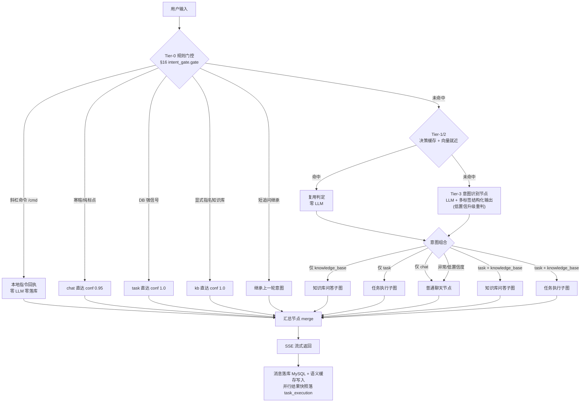
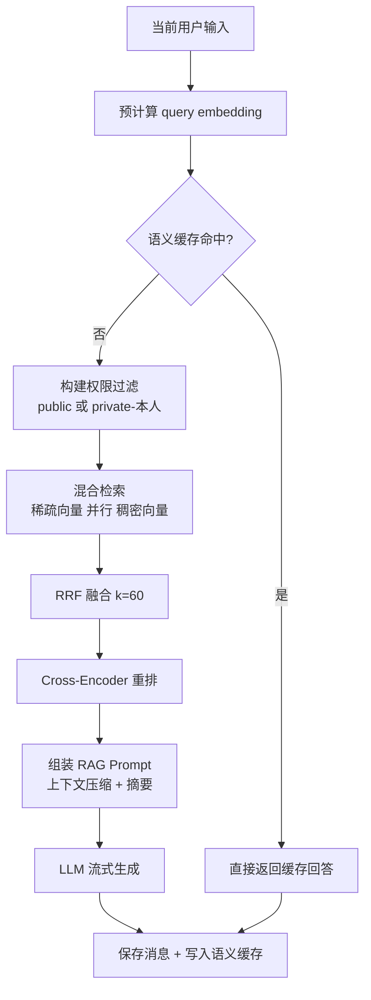
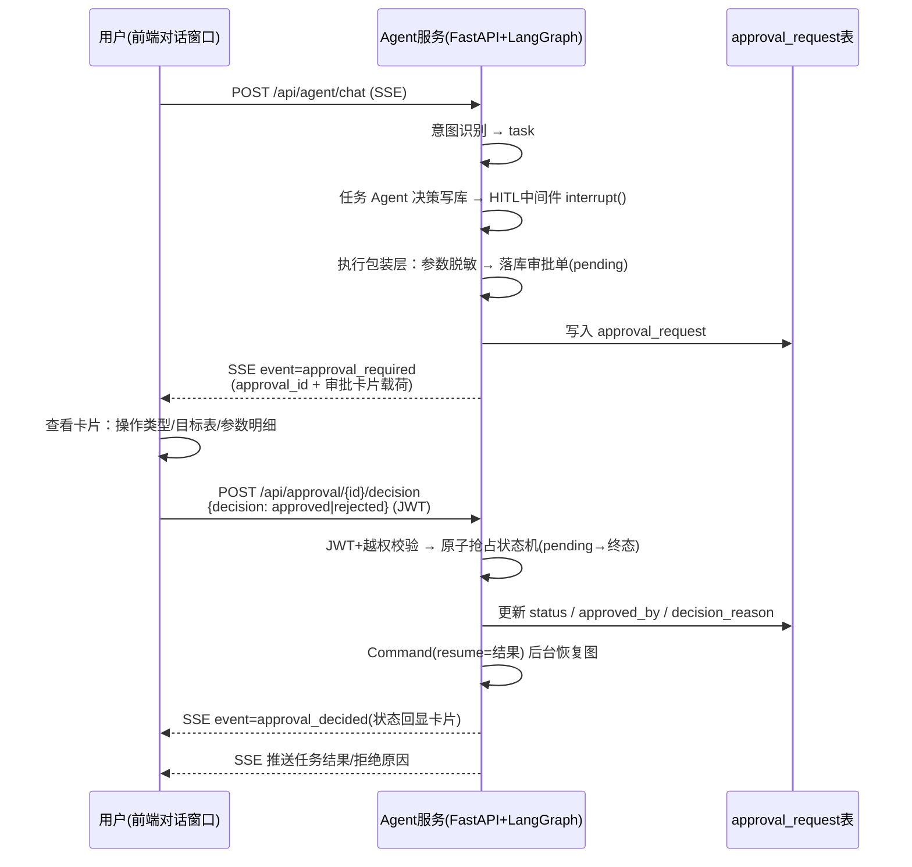
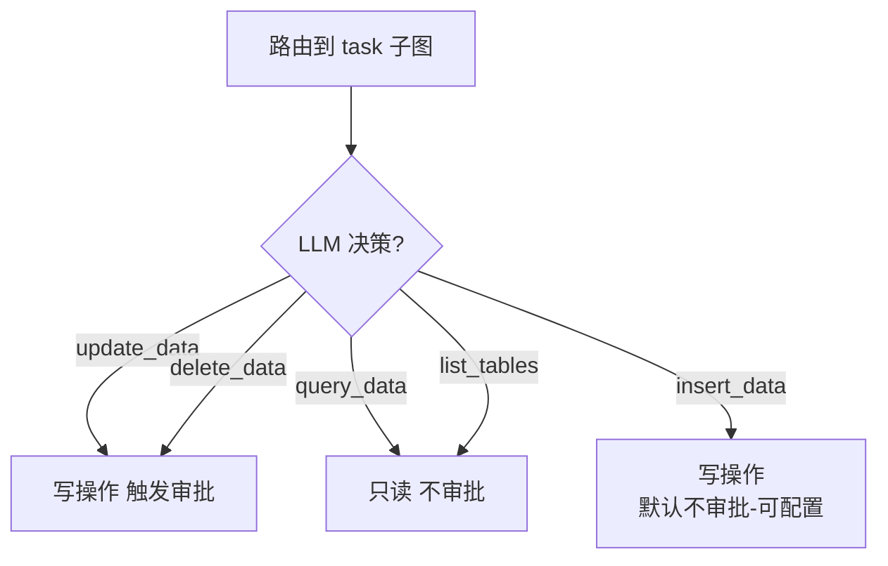
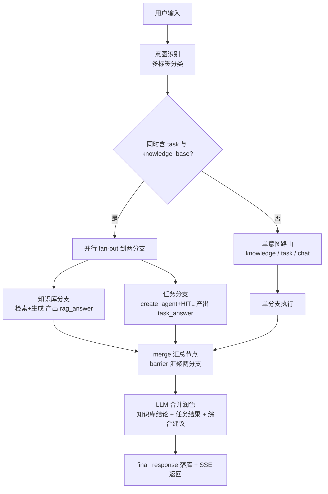
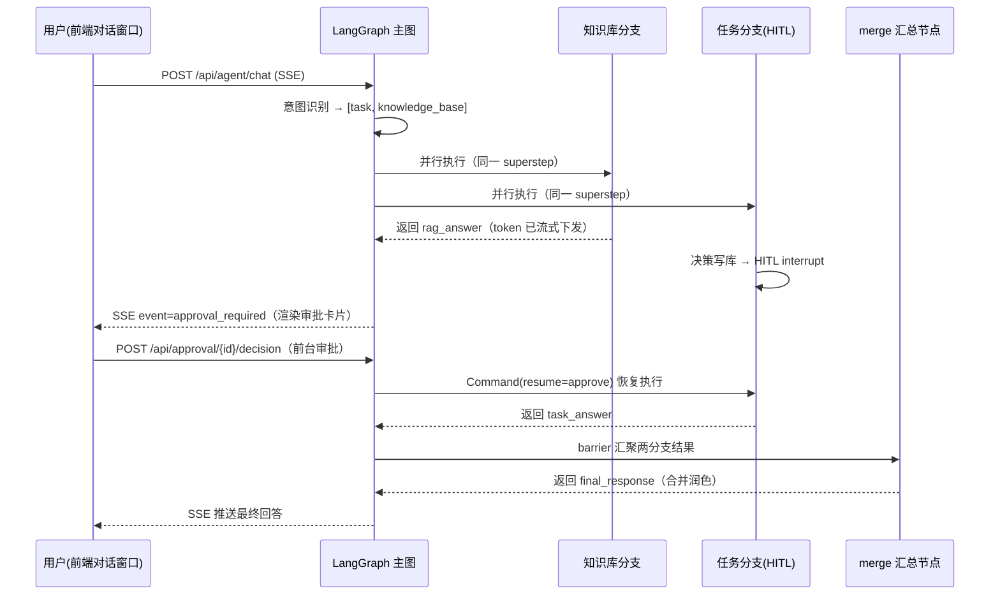
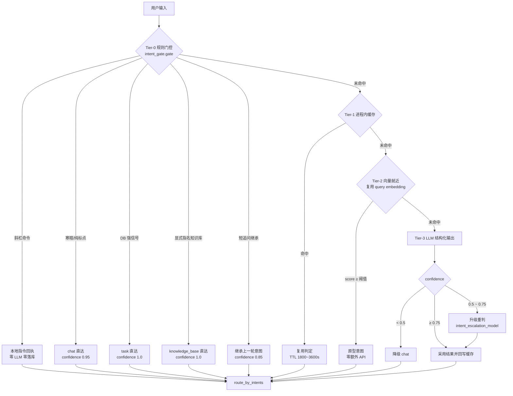

### 3.1 依赖版本矩阵（已写入 requirements.txt）

| 包                          | 版本        | 说明 / 兼容性说明                                                                     |
| -------------------------- | --------- | ------------------------------------------------------------------------------ |
| langchain-core             | 1.6.1     | 最新稳定版，提供 Message / Prompt / Document 等核心抽象                                     |
| langchain                  | 1.3.10    | 锁定原因：1.4.0 依赖已被官方 **yanked** 的 `langgraph==1.2.11`，安装会失败                       |
| langchain-openai           | 1.6.0     | ChatOpenAI 官方适配（通义千问 DashScope 兼容接口）                                           |
| langchain-qdrant           | 1.1.0     | QdrantVectorStore 集成，沿用现有向量库                                                   |
| langgraph                  | 1.2.10    | 图编排主库（LangGraph v1，`create_agent` / `interrupt` / `Command`）（由 langgraph 自动拉取） |
| langgraph-checkpoint-mysql | 3.0.0     | MySQL 检查点保存器，用于跨请求恢复审批中断点                                                      |
| openai                     | 3.8.0     | 最新稳定版（embedding\_deal.py 直连使用，旧 1.x 语法已废弃）                                     |
| ~~lark-oapi~~              | —         | 已移除（审批入口由飞书改为前台对话窗口，见 §5.6 变更记录）                                               |
| qdrant-client              | 1.19.0    | 向量库客户端                                                                         |
| langsmith                  | 0.12.1    | 链路追踪                                                                           |
| apscheduler                | >=3.10,<4 | 定时任务调度（熔断恢复探测，§7.7.6）                                                          |

> 说明：`langchain-community` 官方已宣布 sunset（停止维护），本项目未使用，已从依赖中移除，避免安全隐患。

### 3.2 技术选型原则

1. **LangGraph 承担编排**：意图路由、条件分支、多意图**并行执行与自动汇聚**、任务执行、Human-in-the-loop 审批，全部由 StateGraph 表达，状态显式、可回放、可持久化；
2. **LangChain 承担模型抽象**：ChatOpenAI、Prompt、Message、Structured Output、Document 等；
3. **复用现有检索资产**：`HybridRetriever`、`SemanticCache` 等检索组件不重写，通过薄适配层接入图节点；稀疏向量与稠密向量均由 **text-embedding-v4** 一次调用双输出并存储于 Qdrant，**不再维护独立 BM25 内存索引**；
4. **审批采用官方 HITL 机制**：`create_agent` + `HumanInTheLoopMiddleware` + LangGraph `interrupt()` + `MySQLAsyncSaver` 检查点持久化，天然支持服务重启后继续审批流；
5. **API 全部使用最新官方接口**：`StateGraph/add_node/add_conditional_edges/interrupt/Command/with_structured_output` 等。任务 Agent 使用 `langchain.agents.create_agent`（LangGraph v1 官方推荐），**不使用已弃用的** **`langgraph.prebuilt.create_react_agent`**，也不使用已废弃的 `Chain`/`LLMChain`/`SequentialChain` 等旧 API。

***

## 4. 总体架构设计

### 4.1 架构分层

```
┌─────────────────────────────────────────────────────────────────────┐
│                         接入层（FastAPI）                            │
│  POST /api/agent/chat(SSE)   POST /api/approval/callback  查询接口  │
└───────────────────────────────┬─────────────────────────────────────┘
                                │
┌───────────────────────────────▼─────────────────────────────────────┐
│                      Agent 编排层（LangGraph）                       │
│  ┌──────────────┐    ┌──────────────────────────────────────────┐  │
│  │ IntentRouter │───►│          AgentStateGraph                 │  │
│  │  意图识别     │    │  intent_router → 条件路由                │  │
│  └──────────────┘    │   ├→ knowledge_subgraph（知识库问答）      │  │
│                      │   ├→ chat_node（普通聊天）                │  │
│                      │   └→ task_subgraph（任务执行 + 审批）      │  │
│                      └──────────────────────────────────────────┘  │
└───────────────┬────────────────────┬────────────────────┬──────────┘
                │                    │                    │
┌───────────────▼──────┐  ┌──────────▼─────────┐  ┌───────▼───────────────┐
│  知识服务（复用现状）  │  │  Agent 工具层       │  │ 审批服务（前台）         │
│  HybridRetriever      │  │  query/insert/     │  │  ApprovalService      │
│  SemanticCache        │  │  update/delete     │  │  审批卡片SSE载荷        │
│  MySQL 记忆           │  │  +表/列白名单       │  │  决策接口+中断恢复       │
└───────────────────────┘  └───────────────────┘  └───────────────────────┘
                │                    │                    │
┌───────────────▼────────────────────▼────────────────────▼──────────────┐
│                       基础设施层                                       │
│  Qdrant(向量+缓存)  MySQL(业务+检查点+审批单)  DashScope LLM/Embedding  │
│  COS(文件)  LangSmith(追踪)  JWT(认证)                                │
└───────────────────────────────────────────────────────────────────────┘
```

### 4.2 新增模块结构

```
lingxi-agent/
├── agent/                              # 新增：Agent 编排层
│   ├── __init__.py
│   ├── state.py                        # LangGraph 图状态定义（TypedDict + Reducer）
│   ├── graph_builder.py                # 组装主图 + 条件路由 + 编译（checkpointer）
│   ├── intent_router.py                # 意图识别节点（Structured Output）
│   ├── nodes/
│   │   ├── __init__.py
│   │   ├── knowledge_node.py           # 知识库问答节点（复用现有检索流程）
│   │   ├── chat_node.py                # 普通聊天节点
│   │   └── task_node.py                # 任务执行节点（create_agent + HITL 中间件）
│   ├── tools/
│   │   ├── __init__.py
│   │   ├── agent_tool.py               # 工具统一收敛点（DbToolExecutor / KnowledgeToolExecutor / ClarifyTool + ToolSpec 注册表）
│   │   ├── registry.py                 # 工具注册表（薄封装，实现见 agent_tool.py）
│   │   ├── db_tools.py                 # 数据库工具（薄封装，实现见 agent_tool.py）
│   │   ├── circuit_breaker.py          # 工具熔断器（状态机 + 自动/人工熔断，§7.7）
│   │   ├── probe.py                    # 熔断恢复定时探测（APScheduler 扫描重放，§7.7.6）
│   │   ├── registrar.py                # 启动注册（@tool 扫描 + ToolSpec upsert，§7.8）
│   │   └── manager.py                  # 运行时绑定（查生效工具 + 超时/熔断包装，§7.9）
│   ├── approval/
│   │   ├── __init__.py
│   │   ├── approval_service.py         # 审批业务（建单/SSE卡片载荷/决策受理/恢复图，幂等状态机）
│   │   └── decision.py                 # 前台审批决策受理（JWT 校验 + 后台恢复包装）
│   └── knowledge_service.py            # 知识服务薄适配层（调用现有 RAG 组件）
├── models/
│   ├── task_model.py                   # 新增：任务执行记录表
│   ├── task_schema.py                  # 新增：任务相关 Schema
│   ├── approval_model.py               # 新增：审批单表
│   ├── approval_schema.py              # 新增：审批相关 Schema
│   ├── tool_model.py                   # 新增：工具注册表（tool_registry，§8.3）
│   └── tool_schema.py                  # 新增：工具 Schema（列表/状态变更/同步结果）
├── api/routes/
│   ├── agent.py                        # 新增：/api/agent/chat (SSE) 等
│   ├── approval.py                     # 新增：/api/approval/*（决策提交 + 状态查询 + 会话审批列表）
│   └── tools.py                        # 新增：/api/tools/*（工具列表/详情/状态变更，§9.1）
└── prompt/
    ├── prompt_storage.py               # 扩展：意图识别/任务执行提示词
```

***

## 5. 核心模块设计

### 5.1 图状态（AgentState）

```python
# agent/state.py
from typing import TypedDict, Annotated, Optional, Any
from langgraph.graph.message import add_messages

class AgentState(TypedDict, total=False):
    # ---- 对话上下文 ----
    conversation_id: str                # 会话 ID（= LangGraph thread_id）
    user_id: Optional[str]              # 用户 ID
    username: Optional[str]             # 用户名（用于知识库权限过滤）
    model: str                          # 模型名
    messages: Annotated[list, add_messages]   # 消息列表（含历史 + 当前输入）

    # ---- 意图识别（多标签） ----
    intents: list                      # 多意图列表，如 ["task","knowledge_base"] / ["chat"]
    intent_reason: Optional[str]       # LLM 分类理由（可观测）
    intent_confidence: Optional[float] # 置信度

    # ---- 知识库问答 ----
    context_docs: list                 # 检索到的文档
    context_text: Optional[str]        # 格式化后的上下文
    cached_answer: Optional[str]       # 语义缓存命中时直接使用
    rag_answer: Optional[str]          # 知识库分支产出（并行场景下与任务分支隔离）

    # ---- 任务执行 ----
    task_execution_id: Optional[str]    # 任务执行记录 ID
    tool_calls: list                    # 本次任务的工具调用序列（审计）
    tool_results: list                  # 工具执行结果
    pending_write: Optional[dict]       # 待审批的写操作（工具名/表/参数）
    approval_required: bool             # 是否需要审批
    approval_status: Optional[str]      # pending / approved / rejected
    approval_id: Optional[str]          # 审批单 ID

    # ---- 输出 ----
    task_answer: Optional[str]          # 任务分支产出（含审批后结果，供汇总节点合并）
    final_response: Optional[str]      # 汇总节点合并后的最终回答（供落库与回溯）
    error: Optional[str]               # 错误信息
```

### 5.2 意图识别（IntentRouter）

> **2026-09-18 优化**：本节为 v1 的**基础形态**（LLM 结构化输出 + 降级）。
> 现已演进为**四层递进判定**（规则门控 → 决策缓存 → 向量就近 → LLM 兜底），
> 完整设计见 [§16 意图识别分层优化](#16-意图识别分层优化准确率--耗时--llm-调用次数)。
> 下文描述的结构化输出与归一化规则在 §16 中**全部保留**，仅在其前面增加了零 LLM 成本的快通道。

- 采用 `ChatOpenAI.with_structured_output()`（官方最新结构化输出 API，非废弃的 `output_parser` 手工解析）；
- **多标签分类**：同一输入可能同时命中「任务执行 + 知识库问答」，输出意图**列表**而非单一意图：

```python
class IntentResult(BaseModel):
    intents: list[Literal["knowledge_base", "task", "chat"]]  # 可含多个，如 ["task","knowledge_base"]
    reason: str          # 分类依据（可观测/审计）
    confidence: float    # 0~1（整体置信度，取最低子意图置信度）
```

- 提示词（放入 `prompt/prompt_storage.py`，集中管理）：
  - `knowledge_base`：与知识库中文档内容相关的提问（政策、说明书、FAQ 等）；
  - `task`：需要对**业务数据库数据**执行操作的请求（查询/新增/修改/删除某条数据、某张表）；
  - `chat`：寒暄、闲聊、通用知识问答，不涉及知识库文档与数据库操作。
- **意图组合规则**（路由函数执行，见 5.8）：
  - 仅 `["chat"]` → 普通聊天；
  - 仅 `["knowledge_base"]` / 仅 `["task"]` → 单分支；
  - `["task","knowledge_base"]` 同时命中 → **并行**执行任务子图与知识库子图，最后汇总；
  - `chat` 与其它意图并存时**丢弃 chat**（chat 仅作兜底，不参与并行）；
  - 异常输入（如同时命中 3 个）→ 按 `task > knowledge_base > chat` 优先级收敛。
- **降级策略**：LLM 调用失败、输出非法、置信度 < 0.5 时，默认路由到 `chat`，保证服务可用性；
  置信度落在 `[0.5, 0.75)` 时先用 `intent_escalation_model` **升级重判**一次（§16.5.5-A2）；
- **安全策略**：命中 `task` 的输入，在进入任务执行前会再次由任务 Agent 判断是否真的需要写操作，双重确认降低误判。任务 Agent 的写工具全部必填 `user_intent_quote` 参数（用户原话中表达写意图的片段），缺失/空白或未命中写意图关键词时工具直接拒绝，引导模型反问用户（见 5.5.2）。

### 5.3 知识库问答节点（KnowledgeNode）

**复用现有检索流程**，通过薄适配层 `agent/knowledge_service.py` 调用现有组件，不改动 `rag/` 内部实现：

```python
# agent/knowledge_service.py（伪代码）
class KnowledgeService:
    def __init__(self, db): self.rag = RAGConversationService(db_session=db)

    async def get_cached(self, user_input, username, embedding):
        return await get_semantic_cache().get(user_input, username, precomputed_embedding=embedding)

    async def retrieve(self, user_input, username, embedding, k=4):
        return await self.rag.retrieve_context_public(...)   # 调用现有混合检索

    async def build_prompt_inputs(self, conversation_id):
        history = await self.rag.get_compressed_history_public(conversation_id)  # 复用压缩+摘要
        return history
```

节点逻辑：

1. 预计算 query embedding；
2. 语义缓存检查（命中 → 直接作为回答，写入消息）；
3. 未命中 → 混合检索（权限过滤 + 稀疏向量(text-embedding-v4) + 稠密向量 + RRF + 重排，`k=4`）；
4. 组装 RAG Prompt（复用 `RAG_SYSTEM_PROMPT_WITH_CONTEXT/WITHOUT_CONTEXT`）；
5. LLM 流式生成（供 API 层 `stream_mode="messages"` 转发 SSE），产出写入 `rag_answer`（并行场景下供 merge 节点合并）；
6. 回答落库（MySQL） + 写入语义缓存。

### 5.4 普通聊天节点（ChatNode）

- 复用 `ConversationService.chat_with_memory` 的 Prompt 组装与记忆逻辑；
- 不使用 RAG 检索，走 `CHAT_SYSTEM_PROMPT` + 最近历史；
- 支持流式输出。

### 5.5 任务执行节点（TaskNode）与工具层

#### 5.5.1 工具清单（初期）

| 工具名                | 能力                                | 风险等级 | 是否触发审批       |
| ------------------ | --------------------------------- | ---- | ------------ |
| `list_tables`      | 列出可操作的表（白名单）                      | 只读   | 否            |
| `query_data`       | 结构化条件查询（SELECT）                   | 只读   | 否            |
| `search_knowledge` | 检索知识库文档（RAG-as-tool，任务执行需文档依据时调用） | 只读   | 否            |
| `insert_data`      | 新增记录（INSERT）                      | 写    | 否（可配置，默认不审批） |
| `update_data`      | 修改记录（UPDATE）                      | 写    | **是**        |
| `delete_data`      | 删除记录（DELETE）                      | 写    | **是**        |

> 工具统一收敛在 `agent/tools/agent_tool.py`（按类别以类组织：`DbToolExecutor` / `KnowledgeToolExecutor` / `ClarifyTool` + `ToolSpec` 注册表，原 `registry.py` / `db_tools.py` / `knowledge_tool.py` / `tools/clarify_tool.py` 均为薄封装）。每个工具带有 `requires_approval` 标记，未来扩展新工具只需在注册表声明，无需改动图逻辑。
> 写工具（`insert_data`/`update_data`/`delete_data`）签名均含必填参数 `user_intent_quote`，二次确认写操作意图（见 5.5.2）。
> `search_knowledge` 由独立执行器 `KnowledgeToolExecutor`（`agent/tools/agent_tool.py`）提供，`username` 服务端注入（权限过滤），`k` clamp 到 [1,10]，返回上下文双重长度截断防止撑爆 Agent 上下文。

#### 5.5.2 结构化参数与安全执行

- **禁止 LLM 拼接 SQL**：工具入参为结构化字段（`table`、`columns`、`filters`、`values`），工具内部用 **SQLAlchemy Core + 绑定参数**构造语句（天然防注入）；
- **表/列白名单**：`AGENT_DB_ALLOWED_TABLES` 配置允许操作的表；列名校验防止越权访问敏感字段；
- **查询限制**：SELECT 默认 `LIMIT 50`、超时保护、结果字段裁剪；
- **写操作二次确认（双保险）**：所有写工具（`insert_data` / `update_data` / `delete_data`）必填 `user_intent_quote`（用户原话中表达该写操作意图的原文片段）。校验规则：
  1. 缺失 / 空白 → 直接拒绝（错误消息引导模型向用户确认，而非直接执行）；
  2. 超长（>200 字符）→ 截断；
  3. 未命中写意图关键词（如 更新 / 修改 / 删除 / 新增 等，词表见 `agent/tools/agent_tool.py:WRITE_INTENT_KEYWORDS`）→ 视为缺少用户明确授权，拒绝并引导模型反问用户。
     该参数为函数必选参数，LangChain `StructuredTool` 的 pydantic schema 在工具调用层即拦截缺参；handler 内校验作为二道防线。同时进入 `user_intent_quote` 一并落审计，审批卡片展示该引用供审批人对照用户原话。
- **只读工具**：`list_tables` / `query_data` 由 `DbToolExecutor` 提供；`search_knowledge`（知识库检索）由 `KnowledgeToolExecutor`（均在 `agent/tools/agent_tool.py`）提供——`username` 服务端从会话上下文注入（不暴露为工具参数，防止模型伪造身份越权检索私有文档），`k` clamp 到 [1,10] 防检索成本失控，返回上下文按「单文档 800 字 / 总量 4000 字符」双重截断防撑爆 Agent 上下文；工具调用进入 `tool_calls` 审计（与数据库工具合并取并集落库）；
- **审计**：每次工具调用（含参数、结果摘要、`user_intent_quote`）写入 `task_execution` 表。

#### 5.5.3 任务执行节点流程

1. 图路由到 `task` → 进入任务子图；
2. 使用 `langchain.agents.create_agent`（LangGraph v1 官方推荐的最新 Agent API，`langgraph.prebuilt.create_react_agent` 已在 v1 中弃用）创建任务 Agent，绑定工具 + LLM，并挂载 `HumanInTheLoopMiddleware`（官方 HITL 中间件，内置写操作审批中断能力）；
3. Agent 规划 → 若需政策/规则/流程依据，先调用 `search_knowledge` 检索知识库（只读，不触发审批）；
4. 若仅调用只读工具，直接执行并汇总结果；
5. 若 Agent 决定调用 `update_data` / `delete_data` → 中间件依据 `interrupt_on` 策略在**工具执行前**触发 `interrupt`（写操作审批门，见 5.6）；
6. 审批通过 → 恢复执行写工具 → 汇总结果；审批拒绝 → 终止并告知用户；
7. 任务结束，生成人类可读的执行报告作为回答。

> 变更记录（2026-09-17）：强化 `TASK_AGENT_SYSTEM_PROMPT` 通用引导——表名/字段不确定时**必须先** `list_tables` 获取精确表名（禁止猜表名/凭猜测执行）；不确定相关信息或任务缺少依据时**先** `search_knowledge` 检索知识库，依知识库内容决定继续执行 / 补充询问 / 说明无法完成；检索到内容后以其为决策依据，知识库无相关内容时如实告知不编造。对应修复任务模型臆造 `users` 等错误表名的问题。

#### 5.5.4 工具异常处理与循环兜底（P0 落地）

> 变更记录：任务 Agent 由「工具异常直接中断循环」升级为「异常转 ToolMessage 送回循环（模型自愈）+ 递归上限防死循环」。涉及 `agent/tools/agent_tool.py`（`DbToolError` 基类）与 `agent/nodes/task_node.py`（工具绑定与循环配置）。超时体系（§变更二）同步落地：新增 `agent_tool_timeout_seconds` / `agent_llm_timeout_seconds` 配置，任务级整体超时语义回归 `agent_task_timeout_seconds`。

企业级 Agent 的标准做法是**错误进入循环而非中断循环**。基于 `create_agent` 的三层兜底（`langchain.agents.create_agent` 无 `max_iterations` 参数，迭代上限统一走 langgraph 递归机制）：

1. **参数校验错误**：`ToolNode` 默认捕获 → 转成 ToolInvocationError → 按默认模板转 ToolMessage（框架原生行为，无需改动）；
2. **业务执行异常（工具自愈）**：
   - `DbToolError` 由 `Exception` 改为继承 `langchain_core.tools.ToolException`（框架层只把 `ToolException` 视为"业务可恢复错误"）；
   - 工具绑定处设置 `handle_tool_error=_tool_error_content`：异常被捕获为 `{工具执行失败：<已脱敏消息>。请修正参数后重试；若仍失败，请如实告知用户暂无法完成。}` 的 ToolMessage 送回循环；
   - 模型收到错误后可**修正参数重试 / 换工具 / 如实告知用户**，而非直接中断；消息沿用 `_safe_error` 脱敏（不暴露 SQL/参数/堆栈），审计链路不变；
3. **递归上限（防死循环硬保护）**：
   - `create_agent` 内部默认 `recursion_limit=9999`（形同无限制），节点层在 `ainvoke` 的 config 中注入 `recursion_limit=AGENT_MAX_RECURSION_LIMIT`（100，约 25~50 轮往返，覆盖时优先于默认值，运行时验证成立）；
   - 达到上限抛 `GraphRecursionError` → 节点层捕获，落审计 `failed` 并产出友好错误「任务执行超过最大尝试次数，请将请求拆分或简化后重试」；
   - 与审批中断（`GraphInterrupt`）相互独立、无继承关系，两个 except 分支互不遮蔽；审批恢复场景 step 计数从检查点延续，100 上限不受影响。
4. **超时体系（三层，配置化）**：
   - **单次工具调用总时长**（`agent_tool_timeout_seconds`，默认 30s）：`_bind_tools` 用 `_with_tool_timeout` 统一包裹所有工具（`functools.wraps` 保留原签名，工具 schema 不退化）。超时抛 `DbToolError` → 走第 2 点通道送回循环（模型可感知超时并应对）；DB 工具的语句级 120s 上限在工具级统一超时内（通常查询远小于 30s，如业务需要可调大配置）；
   - **单次 LLM 推理**（`agent_llm_timeout_seconds`，默认 60s）：`ChatOpenAI(timeout=...)`，模型挂死不再无限等待；
   - **Agent 循环整体墙钟**（`agent_task_timeout_seconds`，默认 120s）：非审批模式下 `ainvoke` 外层 `asyncio.wait_for` 兜底，超时抛 `asyncio.TimeoutError` → 节点层落审计 `failed` + 友好错误；**审批模式下不设整体超时**（用户审批可能挂起较久，审批等待超时由 `APPROVAL_WAIT_TIMEOUT` 语义负责），仍受工具级/LLM 超时与递归上限保护。

### 5.6 前台审批（Human-in-the-loop）

> 变更记录：审批入口由「飞书审批流」改为「**前台对话窗口内审批卡片**」，不再依赖 lark-oapi 与飞书事件回调；HITL 中断/恢复机制（`HumanInTheLoopMiddleware` + `MySQLAsyncSaver` 检查点）保持不变。

基于 LangChain v1 官方 HITL 机制：`create_agent` + `HumanInTheLoopMiddleware`（内部触发 LangGraph `interrupt()`）+ `MySQLAsyncSaver` 检查点持久化。审批的**触发提示**与**决策动作**均在前台对话窗口完成：

```
任务 Agent（create_agent + HumanInTheLoopMiddleware）
  ├─ Agent 决策调用 update_data / delete_data
  ├─ 中间件在工具执行前 interrupt()
  │    （携带 HITLRequest：action_requests + review_configs，
  │     为每个待审批工具调用生成 action request）
  ├─ 中断状态持久化（thread_id=conversation_id，MySQL 检查点）
        │
        ▼
┌───────────── 执行包装层（approval_service）─────────────────┐
│  检测到 interrupt 后：                                       │
│  ① 从 action_requests 提取工具名/参数（脱敏）                │
│  ② 落库审批单（approval_request，status=pending）            │
│  ③ SSE 推送 event=approval_required + approval 完整载荷      │
│    （前端在消息流中渲染「审批卡片」，见 §7.5）               │
└──────────────────────────────┬───────────────────────────────┘
                               ▼
┌───────────── 前台对话窗口 ───────────────────────────────────┐
│  用户查看审批卡片（操作类型/目标表/参数明细/风险标识）        │
│  点击「同意执行」或「拒绝」                                   │
│  → POST /api/approval/{id}/decision  （JWT 鉴权）            │
└──────────────────────────────┬───────────────────────────────┘
                               ▼
审批服务：JWT + 越权校验 → 原子抢占状态机（pending→approved/rejected）
                               ▼
以 Command(resume=HITLResponse(decisions=[approve/reject])) 恢复图执行（后台任务）
   ├─ approved → 执行写工具 → 完成任务
   └─ rejected → 终止任务，生成"已拒绝"回答
                               ▼
恢复结果经原 SSE 连接推送（content + approval_decided 状态事件）；
SSE 已断开时前端经 GET /api/approval/{id} 轮询兜底。
```

**关键点**：

- 中断点状态（含待审批的工具调用）由 MySQL 检查点保存，**服务重启后仍可恢复**；
- `interrupt_on` 策略按工具名配置：`update_data` / `delete_data` → `allowed_decisions=["approve","reject"]`（不允许 edit/respond，保证审批语义严格）；`insert_data` 默认 `False`（自动放行），如需按运行时条件审批可通过 `when` 回调动态判断；
- 审批决策与恢复为异步后台任务，SSE 连接通过心跳保活，完成后推送最终结果（同时提供轮询接口兜底）；
- 审批单状态与图状态双写，通过 `approval_request.id` 关联，保证幂等（重复提交决策/重复恢复均被状态守卫拦截）；
- **多 action 批次决策**：模型平行 tool calling 时，一次中断可能含**多个待审批写操作**（如同轮 `update_data` + `delete_data`）。单次中断落一张审批单，`actions` 字段保存全部操作（脱敏），`approval_type`/`target_table`/`tool_params` 保存首个 action 供卡片头部展示；恢复时 `decisions` 数量与挂起工具数**一一对应**（LangChain HITL 中间件校验数量不一致会抛 `ValueError`），决策为批次级——同意/拒绝一次覆盖全部操作；
- 审批人 = 当前会话用户（JWT 身份），仅发起人本人可审批；越权提交返回 403。

#### 5.6.1 任务追问（澄清式 HITL，2026-09-17 新增；2026-09-17 升级多问题批量追问 + 取消）

> 需求：任务节点执行时 LLM 掌握的信息不足（查询条件不明确、数据主键缺失、执行范围不清、多义表述等），应**中断追问**用户；用户在前台作答提交后，LLM 继续处理原任务。升级能力：LLM 可将多个缺失的关键信息合并为**一批（一次最多 5 个具体、独立的问题）**，前台逐题作答（问题数 / 进度 / 下一步 / 提交）或**取消**；取消后任务终止，LLM 如实告知用户已取消提供相关信息，并给出修复建议。

**实现方案**：复用审批的中断/恢复基础设施与 `approval_request` 表（泛化为"人工介入单"，`biz_type` 区分写审批/追问），升级 `ask_user` 追问工具为批量问题：

```
任务 Agent（create_agent，审批模式下绑定 ask_user 工具）
  ├─ Agent 决策调用 ask_user(questions=["q1", "q2", ...])（@tool 工具，内部触发 langgraph interrupt()）
  ├─ interrupt({type: "clarification", questions: [...]})   ← 一次中断可携带一批问题（≤5）
  ├─ 中断状态持久化（thread_id=conversation_id，MySQL 检查点）
        │
        ▼
┌───────────── 执行包装层（api/routes/agent.py _handle_clarify_interrupt）─┐
│  ① 落库追问单（approval_request，biz_type=clarification，status=pending）│
│  ② SSE 推送 event=clarification_required + questions 列表 + 卡片载荷    │
│    （前端渲染多问题向导卡片：N/总数 进度 + 下一步 + 提交 + 取消，见 §7.6）  │
└──────────────────────────────┬──────────────────────────────────────────┘
                               ▼
┌───────────── 前台对话窗口 ─────────────────────────────────────────────┐
│  用户逐题作答 → 提交：POST /api/agent/clarify/{id}/answer （answers=[...]）│
│  或 取消：POST /api/agent/clarify/{id}/cancel                           │
│  （JWT 鉴权，仅发起人）                                                  │
└──────────────────────────────┬──────────────────────────────────────────┘
                               ▼
追问服务：越权校验 → 原子抢占状态机（pending→answered / pending→canceled，幂等）
                               ▼
提交答案 → Command(resume={"answers": [...]}) 恢复同一 thread 执行
取消     → Command(resume={"canceled": True}) 恢复 + 任务记录标记 canceled 终止
  ├─ 任务节点重入，ask_user 工具的 interrupt() 返回批量答案或取消信号
  ├─ 批量答案：Agent 依据补充信息继续执行 → 完成任务，结果经 SSE 推送
  └─ 取消：Agent 如实告知用户已取消提供相关信息 → 给出处理结果或修复建议
```

**关键点**：

- **工具注册**：`ask_user(questions: list[str])` 为 `@tool` 装饰器工具（定义于 `agent/tools/agent_tool.py`，经薄封装 `tools/clarify_tool.py` re-export 保持 `@tool` 扫描发现），启动时经 `sync_tool_registry` 自动入库 tool_registry（`requires_approval=0`，追问本身不需审批；工具描述变更随启动同步刷新）；
- **检查点依赖**：`interrupt()` 必须启用 checkpointer 才能工作，因此 `ask_user` 仅在审批模式（checkpointer 可用）下由任务节点绑定，非审批模式剔除（`task_node.py` 按工具名过滤，退化回"如实告知用户信息不足"）；单批问题上限 `_MAX_QUESTIONS=5`；
- **提示词约束**：`TASK_AGENT_SYSTEM_PROMPT` 约束"信息不足先 search_knowledge 检索，仍缺失才 ask_user；可一批追问最多 5 个具体、独立的问题；收到取消信号时如实告知并给出修复建议"（知识库检索仍优先于追问）；
- **追问单**复用审批表：`biz_type=clarification` + `approval_type="clarification"`，`tool_params.questions` 存问题列表（兼容旧 `tool_params.question`），批量回答存 `callback_payload.answers`（单问题兼容 `answer` 列），取消标记 `callback_payload.canceled=true`，`approved_by` 存回答人/取消人（审计）；
- **状态机**：pending→answered / pending→canceled 单向流转（原子抢占），重复提交/取消被拦截；恢复重入时任务节点复用 running 任务记录（与审批一致）；
- **取消语义**：恢复图执行后 ask_user 返回取消信号，LLM 生成"已取消提供相关信息 + 现有信息尽力处理 + 补充哪些信息可重试"的回答；任务执行记录标记 `canceled`（终止态），对话消息照常落库；
- **列表隔离**：`GET /api/approval` 按 `biz_type` 过滤（`biz_type IS NULL OR = 'write_approval'`），追问单不混入审批列表；刷新后追问卡片经 `GET /api/agent/clarify` 重建。

### 5.7 记忆与消息持久化

- 图内 `messages` 为工作态；每次请求从 MySQL 加载历史（复用 `MySQLChatMessageHistory`），结束后写入新增消息；
- 长对话压缩与摘要复用现有 `MySQLConversationSummaryMemory` 逻辑（通过薄适配层暴露公开方法）；
- LangGraph 检查点仅服务于审批中断/恢复场景，与业务消息表互不冲突。

### 5.8 多意图并行路由与汇总（核心新增）

当用户输入**同时包含任务执行与知识库问答**（如"查一下订单数据，并对照知识库里的售后政策给出处理建议"）时，利用 LangGraph 原生 DAG 能力实现**并行 fan-out + 自动汇聚（barrier）**：

```
intent_router（多标签）
        │  条件路由（route_by_intents）
        ├─ 仅单意图 ──────────────► 对应单分支（knowledge / task_agent / chat）
        └─ ["task","knowledge_base"] ─► 同一 superstep 并行执行：
                                        ├─ knowledge 节点（复用现有检索，输出 rag_answer）
                                        └─ task_agent 节点（create_agent + HITL，输出 task_answer）
                                                 │
                                                 ▼
                                        merge 节点（等待所有前驱完成后自动汇聚，输出 final_response）
```

#### 5.8.1 并行机制（LangGraph 原生能力，无需引入额外并发框架）

| 能力   | LangGraph 机制                                                            | 本项目用法                                               |
| ---- | ----------------------------------------------------------------------- | --------------------------------------------------- |
| 并行执行 | 条件路由映射值可为**节点名列表**，同一 superstep 中无依赖节点并行运行                              | `route_by_intents` 返回 `["knowledge", "task_agent"]` |
| 自动汇聚 | 节点有**多条入边**时，LangGraph 在所有前驱节点完成后才执行（barrier/join）                      | `merge` 节点收敛两个分支                                    |
| 状态隔离 | 并行分支写入**不同字段**，避免 reducer 冲突                                            | 知识库分支写 `rag_answer`，任务分支写 `task_answer`             |
| 中断语义 | 任一分支触发 `interrupt` 会**暂停整个图**，其余分支已产出的结果保留在 state 中，resume 后继续执行到 merge | 任务分支审批中断时，`rag_answer` 已落 state，审批通过后直接进入汇总         |

#### 5.8.2 与前台审批的交互（并行 + 中断）

- 知识库分支通常先完成：`rag_answer` 写入 state，检索与生成结果**不因审批中断而丢失**；
- 任务分支命中写操作 → HITL 中间件 interrupt → 整个图暂停（thread\_id=conversation\_id 持久化）；
- SSE 行为：知识库答案的 token 在中断前已可流式下发 → 随后推送 `event=approval_required`（含审批卡片载荷）→ 前台渲染卡片，用户提交决策 → 后台恢复 → 任务分支完成 → merge 汇总 → 推送最终回答；
- 兜底：若前端连接断开，可通过 `GET /api/agent/tasks/{task_execution_id}` 轮询获得合并后的 `final_response`，审批单状态经 `GET /api/approval/{id}` 轮询。

#### 5.8.3 汇总节点（merge）

- **合并策略**：两条分支结果做最终 LLM 摘要（保证上下文连贯、去重、自然衔接），而非简单字符串拼接：
  - 输入：`rag_answer` + `task_answer` + 原用户输入；
  - 输出：`final_response`（结构化为「知识库结论 + 任务执行结果 + 综合建议」三段式，可视场景省略段）；
  - 若某分支失败/无结果，则汇总节点对剩余分支结果直接润色输出（容错）；
- **可观测性**：`final_response` 连同各分支原始结果一并落库 `task_execution`（含 `rag_answer`、`task_answer` 快照），便于审计与回溯；
- 汇总节点为普通 LLM 调用（非 Agent），无工具、无审批，天然适合作为 DAG 汇聚点。

***

## 6. 流程图

### 6.1 总体路由流程图



> 说明：`G`（知识库）与 `H`（任务）在同一 superstep 并行执行；`merge` 节点有多条入边，LangGraph 自动在其所有前驱完成后才执行（barrier）。
> **§16 变更**：`A0` 与 `A6` 为新增的零 LLM 快通道，命中时**不进入** `B`（LLM 分类）；
> `A1`~`A5`、`A7` 的判定结果直接等效于 `B` 的 `intents`，后续路由逻辑完全复用，无分支删改。

### 6.2 知识库问答子图（复用现有检索流程）



### 6.3 任务执行子图（含审批门）

```mermaid
flowchart TD
    A[路由到 task] --> B[任务 Agent<br/>create_agent + HITL中间件]
    B --> C{需要写库?<br/>update_data/delete_data}
    C -->|否| D[执行只读/插入工具]
    D --> E[生成执行报告]
    C -->|是| F[中间件在工具执行前中断<br/>HITLRequest 携带待审批工具]
    F --> G[执行包装层<br/>脱敏落库审批单]
    G --> H[中断状态持久化<br/>thread_id=conversation_id]
    H --> I[SSE 推送 approval_required<br/>前端渲染审批卡片]
    I --> J[用户在对话窗口审批<br/>POST /api/approval/{id}/decision]
    J --> K{审批结果}
    K -->|通过| L[恢复执行写工具]
    L --> E
    K -->|拒绝| M[终止任务<br/>生成拒绝回答]
    E --> N[SSE 返回 + 落库]
    M --> N
```

### 6.4 前台审批交互时序图



### 6.5 审批触发判定逻辑



### 6.6 多意图并行路由与汇总流程图



### 6.7 多意图并行 + 审批中断时序图



***

## 7. 关键功能实现

### 7.1 意图识别节点实现

```python
# agent/intent_router.py（设计示意，最终以实际编码为准）
from typing import Literal
from pydantic import BaseModel, Field
from langchain_openai import ChatOpenAI
from langchain_core.prompts import ChatPromptTemplate
from core.config import settings
from prompt.prompt_storage import INTENT_CLASSIFICATION_PROMPT

class IntentResult(BaseModel):
    """意图识别结构化输出（多标签：同一输入可命中多个意图）"""
    intents: list[Literal["knowledge_base", "task", "chat"]] = Field(description="意图列表")
    reason: str = Field(description="分类依据")
    confidence: float = Field(description="整体置信度 0~1")

class IntentRouter:
    """意图识别器：多标签 LLM 结构化输出 + 降级策略"""

    def __init__(self, model: str = "qwen-turbo"):
        self._llm = ChatOpenAI(
            model=model,
            openai_api_key=settings.api_key,
            openai_api_base="https://dashscope.aliyuncs.com/compatible-mode/v1",
            temperature=0,
        ).with_structured_output(IntentResult)   # 官方最新结构化输出 API

    async def classify(self, user_input: str, history_text: str = "") -> IntentResult:
        """
        对用户输入进行多标签意图分类。
        失败或异常时降级为 ["chat"]，保证主流程可用。
        """
        try:
            prompt = ChatPromptTemplate.from_messages([
                ("system", INTENT_CLASSIFICATION_PROMPT),
                ("human", "{input}"),
            ])
            result = await (prompt | self._llm).ainvoke({"input": user_input})
            if result.confidence < 0.5:          # 低置信度兜底
                return IntentResult(intents=["chat"], reason="置信度低于阈值", confidence=result.confidence)
            return self._normalize(result)
        except Exception:
            return IntentResult(intents=["chat"], reason="意图识别异常，降级为普通聊天", confidence=0)

    @staticmethod
    def _normalize(result: IntentResult) -> IntentResult:
        """
        意图归一化：去重、丢弃 chat（chat 仅作兜底）、异常多意图按优先级收敛。
        - ["task","knowledge_base"] → 保留两个，触发并行分支
        - 含 chat 的其它组合 → 丢弃 chat
        - 空列表 / 三个全命中 → 按 task > knowledge_base > chat 收敛
        """
        intents = list(dict.fromkeys(result.intents))          # 去重保序
        if "chat" in intents and len(intents) > 1:             # chat 不参与并行
            intents.remove("chat")
        if not intents or len(intents) > 2:
            intents = [i for i in ("task", "knowledge_base") if i in intents] or ["chat"]
        return IntentResult(intents=intents, reason=result.reason, confidence=result.confidence)
```

```python
# agent/graph_builder.py —— 意图组合路由函数（多标签 → 节点列表，实现并行 fan-out）
def route_by_intents(state: AgentState) -> str | list[str]:
    """
    根据多意图返回路由目标。
    - 返回节点名**列表**时，LangGraph 会在同一 superstep 并行执行多个节点；
    - 返回单个节点名则走单分支。
    """
    intents = set(state.get("intents", ["chat"]))
    if intents == {"task", "knowledge_base"}:
        return ["knowledge", "task_agent"]     # 并行 fan-out（关键）
    if "task" in intents:
        return "task_agent"
    if "knowledge_base" in intents:
        return "knowledge"
    return "chat"                              # 兜底
```

### 7.2 主图组装与审批中断/恢复

```python
# agent/graph_builder.py（设计示意）
from langgraph.graph import StateGraph, START, END
from langgraph.checkpoint.mysql.aio import MySQLAsyncSaver
from langgraph.types import Command
from langchain.agents import create_agent
from langchain.agents.middleware import HumanInTheLoopMiddleware
from agent.state import AgentState   # 外层图状态（含意图/审批字段）

def build_task_agent(llm, tools, checkpointer):
    """
    构建任务执行 Agent（LangGraph v1 官方推荐 API）。

    说明：
    - `langgraph.prebuilt.create_react_agent` 已在 LangGraph v1 中弃用，
      统一使用 `langchain.agents.create_agent`（底层仍运行在 LangGraph 上）；
    - `HumanInTheLoopMiddleware` 在写工具**执行前**触发 interrupt，
      通过 interrupt_on 策略实现审批门；中断状态由 checkpointer 持久化。
    """
    return create_agent(
        model=llm,
        tools=tools,
        system_prompt=TASK_AGENT_SYSTEM_PROMPT,
        middleware=[
            HumanInTheLoopMiddleware(
                interrupt_on={
                    # 写操作：仅允许 approve / reject，禁止 edit/respond，语义严格
                    "update_data": {"allowed_decisions": ["approve", "reject"]},
                    "delete_data": {"allowed_decisions": ["approve", "reject"]},
                    # 插入默认自动放行（可配置；如需动态判断可用 when 回调）
                    "insert_data": False,
                },
                description_prefix="数据库写操作待审批",
            ),
        ],
        checkpointer=checkpointer,   # 与主图共用 MySQL 检查点（thread_id=conversation_id）
    )

def build_graph(checkpointer) -> StateGraph:
    """构建主图：意图路由 + 知识库/聊天/任务分支 + 并行汇总"""
    g = StateGraph(AgentState)
    g.add_node("intent_router", intent_router_node)
    g.add_node("knowledge", knowledge_node)
    g.add_node("chat", chat_node)
    # 任务 Agent 作为子图节点嵌入主图；中间件 interrupt 会冒泡到主图 invoke
    g.add_node("task_agent", build_task_agent(llm, tools, checkpointer))
    g.add_node("merge", merge_node)           # 汇总节点（barrier：多入边自动汇聚）
    g.add_node("finalize", finalize_node)     # 收尾：落库 + 快照

    g.add_edge(START, "intent_router")
    g.add_conditional_edges(
        "intent_router",
        route_by_intents,                     # 多标签路由：可返回节点名列表 → 并行 fan-out
        # 映射值可为单个节点名或节点名列表；列表中的节点在同一 superstep 并行执行
        {"knowledge": "knowledge", "task_agent": "task_agent", "chat": "chat"},
    )
    # 三条分支统一汇入 merge（barrier），单分支时 merge 仅透传润色
    g.add_edge("knowledge", "merge")
    g.add_edge("chat", "merge")
    g.add_edge("task_agent", "merge")
    g.add_edge("merge", "finalize")
    g.add_edge("finalize", END)
    return g.compile(checkpointer=checkpointer)
```

**汇总节点（merge\_node）实现**：

```python
# agent/nodes/merge_node.py（设计示意）
from langchain_core.prompts import ChatPromptTemplate
from prompt.prompt_storage import MERGE_ANSWERS_PROMPT

async def merge_node(state: AgentState) -> dict:
    """
    汇总节点：合并知识库分支（rag_answer）与任务分支（task_answer）结果。

    执行策略：
    1. 仅一个分支有结果 → 直接作为 final_response（免 LLM 调用，省时省 token）；
    2. 两个分支均有结果 → LLM 合并润色（知识库结论 + 任务结果 + 综合建议）；
    3. 分支失败 → 由异常处理兜底为可读错误信息。
    """
    rag = state.get("rag_answer")
    task = state.get("task_answer")
    if rag and task:
        prompt = ChatPromptTemplate.from_messages([
            ("system", MERGE_ANSWERS_PROMPT),
            ("human", "用户问题：{question}\n知识库结论：{rag}\n任务执行结果：{task}"),
        ])
        final_response = await (prompt | llm).ainvoke({
            "question": state["messages"][-1].content,
            "rag": rag, "task": task,
        })
        return {"final_response": final_response.content}
    return {"final_response": rag or task or "暂无可用结果"}
```

**执行包装层（TaskExecutionService）—— 审批中断检测与恢复**：

```python
# agent/approval/approval_service.py（设计示意）
async def run_and_handle_approval(graph, inputs, config, sse_queue):
    """
    运行图并处理审批中断：
    1. 正常完成 → 直接输出；
    2. 命中 HITL interrupt → 参数脱敏落库审批单 + SSE 推送完整审批载荷，
       等待前台审批（POST /api/approval/{id}/decision）恢复
       （决策接口以 Command(resume=...) 恢复同一 thread）。
    """
    interrupted = None
    async for chunk in graph.astream(inputs, config=config, stream_mode="updates"):
        if "__interrupt__" in chunk:
            interrupted = chunk["__interrupt__"]
    if interrupted is None:
        return

    # 解析 HITLRequest：提取待审批工具调用（action_requests）
    hitl = interrupted[0].value                 # HITLRequest（action_requests + review_configs）
    approval_id = await save_pending_approval(hitl)     # ① 脱敏落库审批单
    await sse_queue.put({                               # ② SSE 推送完整审批载荷（见 §7.6）
        "event": "status", "status": "approval_required",
        "approval_id": approval_id, "approval": build_card_payload(hitl),
    })

# 前台审批提交后恢复（审批决策接口调用，见 §7.3）：
# approved → decisions=[{"type": "approve"}]
# rejected → decisions=[{"type": "reject", "message": "审批人拒绝原因"}]
# 注：HITLResponse/Decision 的具体构造方式以 langchain.agents.middleware 实际 API 为准，编码阶段核对官方文档
await graph.ainvoke(
    Command(resume={"decisions": [{"type": "approve"}]}),
    config={"configurable": {"thread_id": conversation_id}},
)
```

### 7.3 前台审批决策接口与中断恢复

> 变更记录：原「飞书审批客户端」（feishu_client.py + lark-oapi）随审批入口迁移至前台而整体移除；由下述 JWT 决策接口承担审批受理与恢复触发。

```python
# api/routes/approval.py（设计示意）
@router.post("/{approval_id}/decision")
async def submit_decision(
    approval_id: str,
    body: ApprovalDecisionIn,          # {decision: "approved"|"rejected", reason?: str}
    db: AsyncSession = Depends(get_db),
    current_user: User = Depends(get_current_user),   # JWT：审批人身份
):
    """
    前台审批决策接口：
    1. 越权校验：仅发起人本人可审批（requester_id == current_user.username）；
    2. 原子抢占：UPDATE ... WHERE status='pending'（幂等，重复提交被状态机拦截）；
    3. 回填 approved_by / decision_reason；
    4. 后台任务恢复图执行（独立 DB 会话），立即返回受理结果；
    5. 恢复结果经原 SSE 连接推送，断连时前端轮询 GET /api/approval/{id} 兜底。
    """
    ...
    spawn_background(_resume_in_background(approval_id, body.decision))
    return {"code": 0, "approval_id": approval_id, "status": body.decision}
```

恢复链路复用既有 `approval_service.resume_graph`：状态机抢占 → `Command(resume={"decisions":[...]})` 恢复同一 thread → 更新任务记录 → SSE 推送最终结果 → `set_completed` 结束等待。

### 7.4 数据库工具（结构化参数 + 白名单）

```python
# agent/tools/agent_tool.py（设计示意，DbToolExecutor 类）
from sqlalchemy import text
from core.database import async_engine

class DbToolExecutor:
    """
    数据库工具执行器：只接收结构化参数，禁止拼接 SQL。
    - table 必须命中白名单 AGENT_DB_ALLOWED_TABLES
    - 全部语句使用 SQLAlchemy Core / text() 绑定参数
    - SELECT 强制 LIMIT，防止拖库
    """

    async def query_data(self, table: str, columns: list[str], filters: dict, limit: int = 50) -> list[dict]:
        self._assert_table_allowed(table)                    # 白名单校验
        self._assert_columns_allowed(table, columns)         # 列名校验
        sql = text(f"SELECT {','.join(columns)} FROM `{table}` "
                   f"WHERE {self._build_where(filters)} LIMIT :limit")
        async with async_engine.connect() as conn:
            rows = (await conn.execute(sql, {**filters, "limit": limit})).mappings().all()
        return [dict(r) for r in rows]
```

### 7.5 审批卡片展示数据规范（前台可视化）

前台在对话消息流中渲染**审批卡片**（区别于普通 content 气泡的特殊消息组件）。卡片数据由 `approval_required` SSE 事件携带（见 §7.6），取自脱敏后的 `tool_params` 与审批单元数据。

#### 7.5.1 卡片重点展示数据

| 区块  | 字段             | 来源                            | 说明                                             |
| --- | -------------- | ----------------------------- | ---------------------------------------------- |
| 头部  | 操作类型           | `approval_type`               | insert（蓝）/ update（橙）/ delete（红），附风险等级标识        |
| 头部  | 目标表            | `target_table`                | 明示写操作作用对象                                      |
| 头部  | 状态角标           | `status`                      | 待审批（黄）/ 已同意（绿）/ 已拒绝（灰）                         |
| 明细  | 操作列表（多 action） | `actions`                     | 一次中断含多个写操作时展示操作列表（每项含类型徽章+目标表+明细）；单 action 可缺省 |
| 明细  | 修改内容           | `tool_params.values`          | update：字段→新值 键值对表格                             |
| 明细  | 影响范围（条件）       | `tool_params.filters`         | update/delete：WHERE 条件键值对，明示"将影响哪些行"           |
| 明细  | 插入内容           | `tool_params.values`          | insert：字段→值 键值对表格                              |
| 上下文 | 用户原始请求         | 会话最后一条用户消息                    | 帮助用户回忆审批对应的任务上下文                               |
| 上下文 | 发起人 / 发起时间     | `requester_id` / `created_at` | 审计信息                                           |
| 操作  | 同意执行 / 拒绝按钮    | —                             | 仅 `status=pending` 时可点；审批人 = 发起人本人（JWT）        |
| 操作  | 拒绝原因（可选）       | `reason`                      | 拒绝时可选填，回传后写入 `decision_reason` 并透传给 LLM 生成拒绝说明 |
| 回显  | 审批人 / 审批时间     | `approved_by` / `updated_at`  | 审批后卡片状态翻转回显                                    |
| 提示  | 等待超时说明         | —                             | 超时（默认 2h）后 SSE 结束等待，可经轮询接口获取结果                 |

#### 7.5.2 卡片状态流转（前端视角）

```
approval_required(pending) ──用户点击同意/拒绝──► 按钮禁用 + 「等待执行结果…」
        │                                            │
        │ SSE approval_decided                       │ SSE content（执行结果/拒绝说明）
        ▼                                            ▼
卡片状态翻转（已同意/已拒绝 + 审批人 + 时间） ◄──── 任务结果以普通消息继续输出
```

- **刷新/断线恢复**：前端加载会话历史时经 `GET /api/approvals?conversation_id=xxx` 查询 pending 审批单，重建可交互卡片；已终态审批单以只读卡片回显；
- **轮询兜底**：SSE 断开期间，前端以 `GET /api/approval/{id}` 轮询审批单状态，终态后停止并翻转卡片。

#### 7.5.3 脱敏规则（复用现有 `_mask_params`）

- 敏感键（password/secret/token/key/salt 等）值打码为 `******`；
- 超长值截断（前 16 + `...` + 后 8 字符）；列表/嵌套对象折叠为 `<N 项>`；
- 卡片仅展示必要摘要，完整参数以 `tool_params` 落库审计。

#### 7.5.4 前端实现落地（lingxi-agent-portal）

> 变更记录：以下为 §7.5/§7.6 规范在前端 `lingxi-agent-portal`（React + TS + Vite）的实现落地，2026-09-14 同步设计。

| 文件                                                     | 职责                                                                                                                                                                          |
| ------------------------------------------------------ | --------------------------------------------------------------------------------------------------------------------------------------------------------------------------- |
| `src/types/index.ts`                                   | 新增 `ApprovalData`/`ApprovalStatus`/`ApprovalDecision` 类型；`Message` 扩展 `approval`（卡片数据）与 `approvalPending`（提交中）字段                                                            |
| `src/services/llm.ts`                                  | 新增审批 API：`listApprovals`（按会话查审批单，刷新重建卡片）、`submitApprovalDecision`（决策提交）、`getApprovalStatus`（SSE 断连轮询兜底），均自动携带 JWT                                                           |
| `src/components/ApprovalCard.tsx`                      | 审批卡片组件（六区块：头部操作类型/目标表/状态角标，明细 values+filters，上下文发起人/时间，操作同意/拒绝+拒绝原因，回显审批人/意见，提示超时说明）。决策提交由卡片内部直接调用 `submitApprovalDecision`，提交中禁用按钮、失败展示错误、成功等待 SSE `approval_decided` 回显翻转 |
| `src/components/MessageBubble.tsx` / `MessageList.tsx` | 消息存在 `approval` 数据时优先渲染 `ApprovalCard` 替代普通气泡                                                                                                                               |
| `src/hooks/useChat.ts`                                 | SSE `approval_required` → 将审批卡片载荷挂载到当前 assistant 消息（普通气泡暂停输出）；`approval_decided` → 翻转卡片状态（含审批人）；`content` → 审批后的执行结果/最终回答继续输出；加载历史/切换会话时经 `listApprovals` 按创建时间重建审批卡片       |

- **状态流转**（前端视角）：`approval_required` 插入卡片（pending，按钮可点）→ 点击同意/拒绝 → 按钮禁用 +「决策已受理」提示 → SSE `approval_decided` 翻转卡片（已同意/已拒绝 + 审批人）→ `content` 输出任务结果；
- **刷新/断线恢复**：`loadConversationMessages` 并行拉取消息与审批单列表，`reconcileApprovalMessages` 按 `created_at` 将审批卡片合并进消息流（终态只读回显，pending 可交互）；
- **轮询兜底**：SSE 断连期间前端可经 `getApprovalStatus`（`GET /api/approval/{id}`）轮询审批单状态，终态后停止并翻转卡片。

### 7.6 SSE 流式协议（新增接口）

沿用现有 `data: {...}\n\n` 分帧，扩展 `event` 字段区分消息类型：

```json
// 普通 token
data: {"event": "content", "content": "……"}

// 任务状态
data: {"event": "status", "status": "task_started"}

// 审批触发：携带完整审批卡片载荷（前端据此渲染审批卡片，见 §7.5）
data: {
  "event": "status",
  "status": "approval_required",
  "approval_id": "xxx",
  "approval": {
    "approval_type": "update",
    "target_table": "user",
    "tool_params": {"values": {"status": "disabled"}, "filters": {"username": "zhangsan"}},
    "requester_id": "zhangsan",
    "created_at": "2026-09-14 10:00:00",
    "status": "pending"
  }
}

// 审批决策回显：后台恢复前先推送，前端翻转卡片状态
data: {"event": "status", "status": "approval_decided", "approval_id": "xxx",
       "decision": "approved", "approved_by": "zhangsan"}

// 任务追问触发：携带批量问题与卡片载荷（前端据此渲染多问题向导卡片：进度/下一步/提交/取消，见 §5.6.1）
data: {
  "event": "status",
  "status": "clarification_required",
  "clarify_id": "xxx",
  "questions": ["请提供需要删除的用户账号", "请确认删除范围（仅本人数据或全部）"],
  "clarification": {
    "id": "xxx",
    "question": "请提供需要删除的用户账号",
    "questions": ["请提供需要删除的用户账号", "请确认删除范围（仅本人数据或全部）"],
    "count": 2,
    "status": "pending",
    "requester_id": "zhangsan",
    "created_at": "2026-09-17 10:00:00",
    "answers": [],
    "canceled": false
  }
}

// 追问回答受理回显：后台恢复前先推送，前端翻转追问卡片为 answered 并展示答案列表
data: {"event": "status", "status": "clarification_answered",
       "clarify_id": "xxx", "answers": ["zhangsan", "仅本人数据"], "answered_by": "zhangsan"}

// 追问取消回显：后台恢复前先推送，前端翻转追问卡片为 canceled（任务随后终止，LLM 给出处理建议）
data: {"event": "status", "status": "clarification_canceled",
       "clarify_id": "xxx", "canceled_by": "zhangsan"}

// 心跳（审批/追问等待期，防连接超时）
data: {"event": "ping"}

// 完成
data: {"event": "done"}
```

> 前端处理要点：收到 `approval_required` 即在消息流插入审批卡片并进入等待态（此时连接保持，`ping` 心跳保活）；收到 `approval_decided` 翻转卡片状态；随后 `content` 帧为任务执行结果或拒绝说明；`done` 结束本轮流。追问同理：`clarification_required` 插入追问卡片（`questions.length > 1` 时渲染多问题向导：N/总数 进度 + 下一步 + 提交 + 取消按钮）、`clarification_answered` 翻转 answered 并展示答案列表、`clarification_canceled` 翻转 canceled，随后 `content` 帧为 Agent 补充处理结果或取消说明 + 修复建议。

### 7.7 企业级工具熔断治理（新增）

> 变更记录：为满足"单工具粒度的故障隔离、减少影响面"，新增工具注册表（§8.3）+ 熔断器（本小节）+ 启动注册（§7.8）+ 运行时绑定（§7.9）四件套。核心代码：`agent/tools/circuit_breaker.py`（熔断器）、`agent/tools/registrar.py`（启动注册）、`agent/tools/manager.py`（运行时绑定）、`api/routes/tools.py`（运维 API）。

#### 7.7.1 目标

当某个工具**持续异常**（连续失败 / 窗口失败率超阈值）时，**只熔断该工具本身**，将其 `tool_registry.status` 置为 `2`（熔断），使任务 Agent 不再绑定/快速失败该工具：

- **减少影响面**：不熔断整个 Agent 或整条链路，仅让"坏工具"退出服务，其余工具与分支不受影响；
- **快速失败（fail-fast）**：OPEN 期间直接拒绝（抛 `CircuitOpenError`），不再等待超时拖垮请求；
- **自动恢复**：熔断后由 APScheduler 定时任务（默认每 5 分钟一轮）扫描熔断工具，按沉淀的失败入参重放探测（只读工具），探测成功即自动回到生效状态（status=1）。

> 变更记录：2026-09-17（方案 Z）。熔断职责收窄为"只负责熔断 + 沉淀失败入参"；恢复机制由"冷却期被动半开"改为"定时任务主动探测"；触发口径由"所有异常计数"修正为"仅系统级故障计数"，与 §7.7.2 对齐。

#### 7.7.2 熔断器状态机与触发时机

状态机（`circuit_state` 列，`CLOSED / OPEN / HALF_OPEN`；**HALF_OPEN 已废弃**——字段保留仅为兼容存量数据，新逻辑不再进入）：

```
CLOSED（关闭/正常）
  │ 连续失败 ≥ failure_threshold，或 窗口调用量 ≥ min_calls 且失败率 ≥ failure_ratio（仅系统级故障计数）
  ▼
OPEN（打开/熔断）→ 同步 tool_registry.status = 2，沉淀失败入参 last_error_args
  │ 定时探测任务（APScheduler，默认 5 分钟一轮）扫描 status=2 的只读工具
  ├─ 按沉淀入参重放探测成功 → CLOSED（status=1，计数器清零，auto_recover）
  └─ 探测失败 → 保持 OPEN（记录 last_error，进入下一轮探测）
```

**自动熔断触发时机**（CLOSED 下判定 `_should_trip`）：

| 触发条件                                       | 默认值      | 说明                      |
| ------------------------------------------ | -------- | ----------------------- |
| 连续失败次数 ≥ `failure_threshold`               | 5        | 快速响应：连续 N 次系统级失败立即熔断    |
| 窗口调用量 ≥ `min_calls` 且失败率 ≥ `failure_ratio` | 10 / 0.5 | 小样本防误熔断：窗口内调用量足够时按失败率判定 |

**熔断触发口径（仅系统级故障计数）**：

- **计入熔断**：系统级故障——`DbToolSystemError`（超时 / 连接异常 / 底层执行失败，继承 `DbToolError`）与 `asyncio.TimeoutError`；
- **不计入熔断**：参数/业务错误（`DbToolError` 等）仅记录 `last_error`（供模型修正参数自愈），不累计失败、不沉淀入参、不触发熔断——避免 LLM 参数生成偶发错误误熔断核心工具；
- **失败入参沉淀**：熔断触发时将最近一次系统级失败的入参经 `_sanitize_args` 脱敏后写入 `last_error_args`（JSON 列）——排除敏感键（token/密码等）、单值递归截断 256 字符、整体限长 4096 字符（超限标记 `_truncated` 不沉淀，探测时跳过留人工恢复）；
- `agent_circuit_enabled=false` 时仅统计不熔断。

**熔断影响面与恢复**：

- OPEN 期间：任务节点不再绑定该工具（`load_active_tools` 只查 `status=1`）；已绑定的存量调用经熔断器**快速失败**，`CircuitOpenError`（`ToolException` 子类）经 `handle_tool_error` 转为 ToolMessage 送回 Agent 循环——模型收到"工具暂时不可用"后**换工具或如实告知用户**，而非中断整个任务；
- **自动恢复交给定时探测**（§7.7.6）：移除 HALF_OPEN 被动半开——任务级工具绑定是构建时的快照（§7.9），熔断后新任务绑不上该工具，被动半开在短任务模式下拿不到探测流量；改为 APScheduler 定时按沉淀入参主动重放探测，成功即 `auto_recover` 恢复 status=1，失败保持熔断进入下一轮；
- 熔断判定与计数**持久化在 tool_registry 表**（跨请求、跨重启可恢复）；进程内维护 TTL=1s 的决策缓存，避免每次调用查库；
- **性能模型（内存判定 + 批量落库）**：判定依据与计数在进程内缓存行上即时完成（熔断触发/定时恢复等**状态迁移实时落库**，保证快速失败与恢复的时效性）；纯计数（total/success/fail/window/latency）标记 dirty，由 app lifespan 挂载的后台任务每 `agent_circuit_flush_interval_seconds`（默认 1s）批量 UPDATE 合并写回，进程退出前冲刷一次防计数丢失——每次工具调用的 DB 写从"1 SELECT + 1 UPDATE + 1 COMMIT"降为"接近 0（纯内存）"。

#### 7.7.3 人工治理（运维操作）

`PATCH /api/tools/{name}/status`（`breaker.manual_transition`），合法流转：

```
1(生效) → 0(失效)：人工下线（不再绑定）
0(失效) → 1(生效)：人工恢复
1(生效) → 2(熔断)：人工熔断（立即打开熔断器，不再依赖失败统计）
2(熔断) → 1(生效)：人工恢复（关闭熔断器，计数器清零）
2(熔断) → 0(失效)：熔断后直接下线
```

非法流转抛 `ValueError`（API 返回 400）；操作后同步失效进程内决策缓存，后续调用立即按新状态判定。**"熔断 → 修改表 status=2"由 `_open_circuit` 自动落库**，人工操作与自动熔断共用同一套状态流转。

#### 7.7.4 双层保护（超时 + 熔断）

每个工具在绑定处统一注入（`agent/tools/manager.py`）：

```
handler → with_tool_timeout(agent_tool_timeout_seconds)   # 超时保护：超时抛 DbToolSystemError（系统级故障，计入熔断）
        → breaker.call(db, tool_name, ...)                 # 熔断保护：判定/计数/快速失败
        → StructuredTool.from_function(handle_tool_error=tool_error_content)  # 异常转 ToolMessage
```

#### 7.7.5 计数列 None 防御加固

> 变更记录：2026-09-17。熔断器计数列（`total_calls` / `success_calls` / `fail_calls` / `consecutive_failures` / `window_calls` / `window_failures` / `avg_latency_ms` / `half_open_trials`）统一经 `_int()` 归一化后再做运算，兼容手动构造行（如 mock 测试）或历史脏数据导致的 `None` 运算异常（`None + 1` 抛 TypeError 被静默吞掉、计数不生效）。真实 DB 行经 INSERT 默认值（列 `default=0`）恒为非空，本加固不改变熔断语义，仅增强健壮性。

#### 7.7.6 定时探测自动恢复（APScheduler）

> 变更记录：2026-09-17（方案 Z）。熔断恢复由"冷却期被动半开"改为"APScheduler 定时主动探测"：短任务模式下熔断工具绑不到新任务（§7.9 绑定快照），被动半开拿不到线上探测流量，恢复完全交由定时任务按沉淀入参主动重放验证。核心代码：`agent/tools/probe.py`（探测服务）、`app/main.py`（lifespan 挂载调度器）、`agent/tools/circuit_breaker.py::auto_recover`（恢复落库）。

**调度配置**（`core/config.py`）：

| 配置                             | 默认值  | 说明                   |
| ------------------------------ | ---- | -------------------- |
| `agent_probe_enabled`          | true | 熔断恢复定时探测总开关          |
| `agent_probe_interval_seconds` | 300  | 扫描探测间隔（秒），默认每 5 分钟一轮 |
| `agent_probe_timeout_seconds`  | 30.0 | 单个工具探测调用超时上限（秒）      |

**探测流程**（`probe.py::scan_and_probe`，`AsyncIOScheduler + IntervalTrigger` 每 5 分钟触发）：

1. 扫描 `tool_registry` 中 `status=2`（熔断）且 `risk_level='read'`（只读工具）的行——写工具涉及数据变更，自动重放有副作用，**留人工恢复**（§7.7.3）；
2. 逐行重放：复用 `manager._resolve_handler` 解析 handler（DbToolExecutor / KnowledgeToolExecutor / @tool 对象），以沉淀的 `last_error_args` 作为入参调用，整体受 `agent_probe_timeout_seconds` 超时保护；无入参或带 `_truncated` 标记的行跳过（留人工）；
3. 探测成功 → `breaker.auto_recover(db, tool_name)`：关闭熔断器、计数器清零、status 置 1、remark="定时探测成功，自动恢复"，实时写回；
4. 探测失败 → 记录 `last_error="定时探测失败：..."` 并提交，工具保持熔断状态，进入下一轮探测。

**运行保障**：任务 `max_instances=1 + coalesce=True + misfire_grace_time=30` 防重入与堆积；调度器启动失败仅降级记日志（`scheduler=None`），不阻塞服务启动；多进程部署（uvicorn --workers>1）时各进程独立扫描，熔断状态正确性不受影响（已知权衡：各进程内存计数互相覆盖，仅统计值偏差）。

**数据表变更**：`tool_registry` 新增 `last_error_args` 列（JSON，最近一次系统级失败的脱敏入参，供定时探测重放）；`Base.metadata.create_all` 不会给已有表加列，存量库需手动 `ALTER TABLE tool_registry ADD COLUMN last_error_args JSON NULL`。

### 7.8 工具启动注册机制（新增）

> 核心代码：`agent/tools/registrar.py`，在 `app/main.py` lifespan 中 `create_all` 后调用（失败降级不阻塞启动）。

**注册来源（两路合并）**：

1. **@tool 装饰器工具**：`discover_decorated_tools()` 遍历 `agent_tool_scan_packages`（默认 `tools`）及其子模块，以 `isinstance(obj, BaseTool)` 判定（`@tool` 返回 `StructuredTool` 实例），提取名称 / 描述 / 参数 JSON Schema（`args_schema.model_json_schema()`）；结果进程级缓存（`get_decorated_tools`，运行时绑定复用）；
2. **ToolSpec 注册表**：`agent/tools/agent_tool.py` 中声明的内置工具（`REGISTRY`，db 工具 + `search_knowledge`），参数 Schema 由执行器方法签名推导（`_signature_to_json_schema`，支持 Optional/list/dict/默认值）。

**幂等 upsert**（`sync_tool_registry`，按 `name` 唯一键）：

- **新增工具**：插入，`status=生效(1)`，熔断参数取当前配置快照；
- **已存在工具**：仅刷新元数据（描述 / 参数 / 分类 / 风险 / 审批开关 / 来源 / 熔断配置快照），**保留 `status / circuit_state / 计数`**——人工下线的 0、熔断中的 2 不被代码热升级重置，运维决策不丢；
- 代码已移除的工具**不自动删除**（保留审计记录，可人工下线）；
- 返回 `ToolSyncResult`（扫描/新增/更新/错误统计），供启动日志与观测。

> 变更记录：2026-09-17。`_spec_to_row` 的参数 Schema 推导由「仅 DbToolExecutor 类」扩展为「DbToolExecutor + KnowledgeToolExecutor 双执行器类按 handler 名查找」，修复 `search_knowledge`（handler 位于 KnowledgeToolExecutor）注册时 parameters 列为空的问题；运行时绑定逻辑不受影响（`_resolve_handler` 本就双执行器解析）。

### 7.9 运行时绑定（查询生效工具 bind_tools，新增）

> 核心代码：`agent/tools/manager.py`，接入点：`agent/nodes/task_node.py::_build_task_agent`（改为 `async def` 并 `await bind_active_tools(...)`）。

1. `load_active_tools(db, approval_mode)`：查询 `tool_registry` 表 **`status=1`（生效）** 的工具；非审批模式（checkpointer 不可用）额外剔除 `requires_approval=1` 的写工具；
2. `bind_active_tools(...)`：按 `source` 列解析运行时执行函数——`executor:<方法名>` 取执行器实例方法（DbToolExecutor / KnowledgeToolExecutor）、`module:...` 取扫描到的 @tool 对象、兜底按注册表 handler 解析；统一注入超时 + 熔断后生成 LangChain Tool 列表；
3. 注册时未提取到参数 Schema 的工具首次绑定时惰性回填；
4. **治理闭环**：熔断/下线一个工具 → 表状态置 2/0 → 下次任务 `load_active_tools` 即不再绑定该工具，实现单工具粒度的故障隔离（无需重启、无需改代码）。

***

## 8. 数据表设计

### 8.1 task\_execution（任务执行记录，审计）

| 字段                        | 类型             | 说明                                                         |
| ------------------------- | -------------- | ---------------------------------------------------------- |
| id                        | varchar(36) PK | UUID                                                       |
| conversation\_id          | varchar(36)    | 关联会话                                                       |
| user\_id                  | varchar(36)    | 发起人                                                        |
| intent                    | varchar(64)    | 路由意图（task / knowledge\_base / task,knowledge\_base / chat） |
| status                    | varchar(32)    | running / completed / rejected / failed / canceled         |
| tool\_calls               | JSON           | 工具调用序列（名称、参数、结果摘要）                                         |
| rag\_answer               | text           | 知识库分支产出（并行场景快照，供审计/回溯）                                     |
| task\_answer              | text           | 任务分支产出（含审批后结果快照）                                           |
| result                    | text           | 最终回答（final\_response，含合并润色结果）                              |
| error                     | text           | 错误信息                                                       |
| created\_at / updated\_at | datetime       | 时间戳                                                        |

### 8.2 approval\_request（人工介入单：写审批 / 任务追问）

> 变更记录：`feishu_instance_code` 废弃（保留列避免存量库迁移，代码不再写入）；`requester_id` 语义调整为**系统用户名**；新增 `decision_reason`（前台拒绝原因）；新增 `actions`（多 action 批次决策，2026-09-14）；泛化为"人工介入单"新增 `biz_type` 与 `answer` 列（任务追问 HITL，2026-09-17）。

| 字段                        | 类型             | 说明                                                                                    |
| ------------------------- | -------------- | ------------------------------------------------------------------------------------- |
| id                        | varchar(36) PK | UUID                                                                                  |
| biz\_type                 | varchar(32)    | 业务类型：`write_approval`（写操作审批，默认）/ `clarification`（任务追问）                                |
| task\_execution\_id       | varchar(36)    | 关联任务                                                                                  |
| conversation\_id          | varchar(36)    | 关联会话（= thread\_id）                                                                    |
| requester\_id             | varchar(64)    | 发起人（系统用户名，JWT username）                                                               |
| approval\_type            | varchar(32)    | update / delete / insert（首个 action）；追问单为 `clarification`                              |
| target\_table             | varchar(64)    | 目标表（首个 action）                                                                        |
| tool\_params              | JSON           | 首个待执行工具参数（脱敏，values/filters 分键）；追问单存 `{"question": "..."}`                            |
| actions                   | JSON           | 全部待审批操作列表（脱敏，`[{approval_type,target_table,tool_params}]`；单 action 为单元素列表，供决策数量与明细渲染） |
| status                    | varchar(32)    | 审批单：pending / approved / rejected / canceled；追问单：pending / answered                   |
| feishu\_instance\_code    | varchar(128)   | **废弃**（历史列，不再写入）                                                                      |
| approved\_by              | varchar(64)    | 审批人 / 追问回答人（前台提交的 JWT username）                                                       |
| decision\_reason          | varchar(255)   | 审批意见（前台可选填写，默认空）                                                                      |
| answer                    | varchar(500)   | 追问回答（biz\_type=clarification 时使用）                                                     |
| callback\_payload         | JSON           | 审计载荷（前台模式存决策请求体摘要）                                                                    |
| created\_at / updated\_at | datetime       | 时间戳                                                                                   |

> 索引：`idx_appr_instance(instance_code)`（废弃后可不再新建）、`idx_appr_conv(conversation_id, status)`（支撑"按会话查 pending 审批单"卡片重建）。
> 存量库迁移：`ALTER TABLE approval_request ADD COLUMN biz_type VARCHAR(32) NOT NULL DEFAULT 'write_approval', ADD COLUMN answer VARCHAR(500) NULL;`
> 新表由 `Base.metadata.create_all` 在启动时自动创建（沿用现有机制）。

### 8.3 tool\_registry（工具注册表，新增）

> 企业级工具管理表：集中存储 Agent 全部工具的元数据、运行状态与熔断状态，是"工具生命周期管理"的数据底座（§7.7~§7.9）。核心代码：`models/tool_model.py`（ORM）/ `models/tool_schema.py`（Schema）。

**状态语义（status 列）**：`1=生效`（允许绑定给 Agent）、`0=失效`（人工下线）、`2=熔断`（熔断器打开，自动或人工触发）。

| 字段                                          | 类型              | 说明                                                             |
| ------------------------------------------- | --------------- | -------------------------------------------------------------- |
| id                                          | varchar(36) PK  | UUID                                                           |
| name                                        | varchar(128) UK | 工具名（Agent 调用名，唯一键）                                             |
| description                                 | text            | 工具能力描述（供 LLM 选择工具）                                             |
| parameters                                  | JSON            | 工具参数 JSON Schema（管理台展示 / 参数级校验）                                |
| category                                    | varchar(64)     | 工具分类：db / knowledge / search / custom                          |
| risk\_level                                 | varchar(16)     | 风险等级：read / write                                              |
| requires\_approval                          | smallint        | 是否触发人工审批：1/0                                                   |
| status                                      | smallint        | **1=生效 0=失效 2=熔断**（索引）                                         |
| source                                      | varchar(255)    | 工具来源：`executor:<方法名>` / `module:<模块>:<属性>`（运行时解析执行函数用）         |
| version                                     | varchar(32)     | 工具版本（工具变更时递增）                                                  |
| failure\_threshold                          | int             | 连续失败阈值（默认 5）                                                   |
| failure\_ratio                              | float           | 窗口失败率阈值快照（默认 0.5）                                              |
| window\_seconds                             | int             | 失败率统计窗口（秒，默认 60）                                               |
| cooldown\_seconds                           | int             | 熔断冷却期（秒，默认 60）                                                 |
| half\_open\_max\_trials                     | int             | 半开探测最大放行次数（默认 3，防雪崩）                                           |
| circuit\_state                              | varchar(16)     | 熔断状态：CLOSED / OPEN / HALF\_OPEN（**HALF\_OPEN 已废弃**，字段保留兼容存量数据） |
| consecutive\_failures                       | int             | 连续失败次数                                                         |
| total\_calls / success\_calls / fail\_calls | int             | 累计调用 / 成功 / 失败次数                                               |
| window\_failures / window\_calls            | int             | 当前窗口失败 / 调用次数                                                  |
| window\_start\_at                           | datetime        | 当前统计窗口开始时间                                                     |
| half\_open\_trials                          | int             | 半开已放行探测次数（已废弃，保留兼容）                                            |
| circuit\_open\_at                           | datetime        | 熔断打开时间                                                         |
| circuit\_open\_until                        | datetime        | 熔断到期时间（**仅作展示**，恢复已改由定时探测驱动，§7.7.6）                            |
| last\_error                                 | text            | 最近一次失败原因（脱敏）                                                   |
| last\_error\_args                           | JSON            | 最近一次系统级失败的工具入参（脱敏，供定时探测重放验证恢复，§7.7.2）                          |
| last\_call\_at / last\_success\_at          | datetime        | 最近调用 / 成功时间                                                    |
| avg\_latency\_ms                            | int             | 平均耗时（毫秒，指数平滑 EMA）                                              |
| remark                                      | varchar(255)    | 备注（熔断原因 / 下线原因等，审计）                                            |
| created\_by                                 | varchar(64)     | 创建人（默认 system）                                                 |
| created\_at / updated\_at                   | datetime        | 创建 / 更新时间                                                      |

> 索引：`idx_tool_status(status)`（支撑启动注册与运行时"查生效工具"）、`idx_tool_category(category)`（管理台按分类过滤）。
> 写入时机：① 启动时由 `registrar.sync_tool_registry` 幂等 upsert；② 运行时由熔断器（`_open_circuit` 置 status=2）与工具管理 API（人工流转）更新。

***

## 9. API 设计

### 9.1 新增接口

| 方法    | 路径                                       | 说明                                                    | 鉴权        |
| ----- | ---------------------------------------- | ----------------------------------------------------- | --------- |
| POST  | `/api/agent/chat`                        | 智能对话（意图路由 + 知识库/任务/聊天），SSE 流式                         | JWT       |
| POST  | `/api/approval/{approval_id}/decision`   | 前台审批决策（approved/rejected + 可选原因），受理后后台恢复图执行           | JWT（仅发起人） |
| GET   | `/api/approval?conversation_id=xxx`      | 按会话查询审批单列表（仅写审批，刷新后重建审批卡片）                            | JWT（仅发起人） |
| GET   | `/api/agent/tasks/{task_execution_id}`   | 查询任务执行状态与结果（轮询兜底）                                     | JWT       |
| GET   | `/api/approval/{approval_id}`            | 查询审批单状态（轮询兜底）                                         | JWT       |
| GET   | `/api/tools`                             | 工具列表（按 status/category/keyword 过滤，管理台）                | JWT       |
| GET   | `/api/tools/{name}`                      | 工具详情（含熔断状态与调用统计）                                      | JWT       |
| PATCH | `/api/tools/{name}/status`               | 调整工具状态（1↔0、1→2、2→1、2→0，运维熔断/恢复/下线）                    | JWT       |
| POST  | `/api/agent/clarify/{clarify_id}/answer` | 提交追问答案（批量 answers / 兼容单 answer，受理后后台恢复图执行，LLM 继续处理任务） | JWT（仅发起人） |
| POST  | `/api/agent/clarify/{clarify_id}/cancel` | 取消追问（pending→canceled，恢复图执行告知 LLM 已取消并给出修复建议，任务标记终止）  | JWT（仅发起人） |
| GET   | `/api/agent/clarify?conversation_id=xxx` | 按会话查询追问单列表（刷新后重建追问卡片）                                 | JWT（仅发起人） |
| GET   | `/api/agent/metrics`                     | 观测快照：进程内计数器与耗时聚合（阶段 4，§15.5）                          | JWT       |

> 变更记录：原 `POST /api/approval/callback`（飞书事件回调，无 JWT）随飞书对接移除而废弃。
> 阶段 4 新增：`GET /api/agent/metrics`（§15.5）；`GET /health?detailed=true`（依赖体检，§15.4）。
> SSE 响应新增 `X-Trace-Id` 响应头（字段名可配置），前端/网关可据此串联服务端日志（§15.2）。

请求体（`/api/agent/chat`）与现有 `ChatRequest` 对齐：

```json
{
  "conversation_id": "xxx",
  "messages": [{"role": "user", "content": "把用户张三的账号删除"}],
  "model": "qwen-turbo",
  "stream": true
}
```

> 说明：不再需要 `use_rag` 布尔开关，意图由系统自动识别；旧接口 `/api/conversations/chat` 与 `use_rag` 参数**原样保留**，供存量前端使用。

### 9.2 保留接口（零改动）

- `/api/conversations/chat`（含 `use_rag`）
- `/api/conversations/*` 会话 CRUD、消息列表
- `/api/auth/*`、`/api/file/process`、`/api/metadata/*`、`/api/attachments/*`、`/api/cache/*`

***

## 10. 配置项设计

在 `core/config.py` 增加（`.env.dev` / 生产 `.env` 注入）：

```ini
# ---- 审批（前台模式：无需飞书配置） ----
APPROVAL_WAIT_TIMEOUT=7200                # 审批等待超时（秒），超时后 SSE 结束等待、轮询兜底

# ---- 任务执行 ----
AGENT_DB_ALLOWED_TABLES=user,conversation,conversation_message   # 表白名单，逗号分隔
AGENT_QUERY_MAX_ROWS=50                  # 单次查询最大返回行数
AGENT_TASK_TIMEOUT_SECONDS=120           # 任务执行超时（非审批模式下 Agent 循环整体超时）
AGENT_TOOL_TIMEOUT_SECONDS=30            # 单次工具调用总时长上限
AGENT_LLM_TIMEOUT_SECONDS=60             # 单次 LLM 推理超时
AGENT_INSERT_REQUIRES_APPROVAL=false     # 插入操作是否审批（默认否）

# ---- 工具注册与熔断治理（§7.7~§7.9，新增） ----
AGENT_TOOL_SCAN_PACKAGES=tools             # 扫描 @tool 装饰器工具的包（逗号分隔，相对项目根目录）
TOOL_REGISTRY_SYNC_ON_START=true           # 启动时自动同步工具注册表（失败降级不阻塞启动）
AGENT_CIRCUIT_ENABLED=true                 # 熔断器总开关（false 时仅统计不熔断）
AGENT_CIRCUIT_FAILURE_THRESHOLD=5          # 连续失败阈值：连续失败达此值触发熔断（status=2）
AGENT_CIRCUIT_FAILURE_RATIO=0.5            # 窗口失败率阈值：窗口内失败率超过且达到最小调用量时熔断
AGENT_CIRCUIT_MIN_CALLS=10                 # 失败率判定所需的最小窗口调用量（防小样本误熔断）
AGENT_CIRCUIT_WINDOW_SECONDS=60            # 失败率统计窗口（秒）
AGENT_CIRCUIT_COOLDOWN_SECONDS=60          # 熔断冷却期（秒）（已废弃：恢复改由定时探测驱动，字段保留兼容）
AGENT_CIRCUIT_HALF_OPEN_MAX_TRIALS=3       # 半开探测最大放行次数（已废弃：半开恢复移除，字段保留兼容）
AGENT_CIRCUIT_FLUSH_INTERVAL_SECONDS=1      # 熔断计数批量落库间隔（秒）：后台合并写回，降低每调用一次 DB 写
AGENT_PROBE_ENABLED=true                    # 熔断恢复定时探测总开关（§7.7.6，新增）
AGENT_PROBE_INTERVAL_SECONDS=300            # 扫描探测间隔（秒），默认每 5 分钟一轮（§7.7.6，新增）
AGENT_PROBE_TIMEOUT_SECONDS=30.0            # 单个工具探测调用超时上限（秒）（§7.7.6，新增）
AGENT_PROBE_EXCLUDE_TOOLS=ask_user          # 定时探测排除的工具（逗号分隔）：交互式工具重放会再次触发 interrupt，不可自动恢复（§15.6-13）

# ---- 意图识别分层优化（§16，新增） ----
INTENT_GATE_ENABLED=true                 # 规则快速通道总开关（false 则全部走 LLM 分类）
INTENT_SLASH_ENABLED=true                # 斜杠命令本地处理总开关
INTENT_SLASH_SHORTCUT=true               # 斜杠命令是否短路图执行
INTENT_TRIVIAL_KEYWORDS=                 # 寒暄关键词表覆盖（空串用内置默认表）
INTENT_ESCALATION_MODEL=qwen-plus        # 低置信度升级重判模型（空串或同主模型则跳过）
INTENT_LLM_CACHE_CONFIDENCE=0.85         # LLM 结果进入进程内缓存的置信度门槛
INTENT_EMBED_THRESHOLD=0.86              # 向量就近判定阈值（低于则回落 LLM）

# ---- 缓存治理（§18，新增） ----
CACHE_ANSWER_THRESHOLD=0.95              # 答案缓存命中阈值（严于 CACHE_SIMILARITY_THRESHOLD）
CACHE_INTENT_POLICY_ENABLED=true         # 意图驱动的缓存准入（false 回到「所有意图都可缓存」）
CACHE_ENTITY_CHECK_ENABLED=true          # 命中前的实体一致性校验
CACHE_TTL_KNOWLEDGE_SECONDS=86400        # knowledge_base 单分支答案缓存 TTL
CACHE_TTL_SHORT_SECONDS=900              # chat / 时效类短 TTL
CACHE_SCHEMA_VERSION=1                   # 缓存结构版本（字段变更时 bump 即逻辑失效）
CACHE_PROMPT_VERSION=1                   # 提示词版本（提示词变更时 bump）
CACHE_KB_VERSION=v1                      # 知识库内容版本（P1 接真实指纹前由文档变更处 bump）
CACHE_EMBED_PREFETCH_ENABLED=true        # 入口预计算 query 双向量并复用（修复 L2 死代码）
CACHE_RETRIEVE_ENABLED=true              # 检索缓存总开关（§18.13）
CACHE_RETRIEVE_THRESHOLD=0.90            # 检索缓存命中阈值（宽松档，错了只是多检索一次）
CACHE_RETRIEVE_COLLECTION_NAME=lingxi-retrieve-cache  # 独立集合，不与答案缓存混用
CACHE_RETRIEVE_TTL_SECONDS=86400         # 检索结果 TTL
CACHE_RETRIEVE_MAX_ENTRIES=5000          # 容量上限（条目比答案缓存大，故更保守）
CACHE_RETRIEVE_MAX_DOC_CHARS=1200        # 单文档 page_content 上限，超出则不缓存（宁可不缓存也不截断）
CACHE_RETRIEVE_MAX_DOCS=8                # 单条目最多缓存文档数

# ---- 嵌套图检查点隔离（§19，新增） ----
AGENT_TASK_THREAD_ISOLATE=true           # 任务 Agent（内层图）使用独立 thread_id
                                         # false → 回到「内层图读写主图检查点」旧行为（跨轮串味）

# ---- 观测与加固（§15，阶段 4 新增） ----
TRACE_ID_HEADER=X-Trace-Id                  # 响应头中的链路追踪 ID 字段名
AGENT_METRICS_ENABLED=true                  # 进程内指标采集总开关（关闭后 /api/agent/metrics 返回 enabled=false）
LANGSMITH_TRACING=true                      # LangSmith 链路追踪开关（需配合 LANGSMITH_API_KEY 环境变量）
LANGSMITH_PROJECT=lingxi-agent              # LangSmith 项目名（控制台过滤维度）
LANGSMITH_ENDPOINT=https://api.smith.langchain.com  # LangSmith 服务端点（自建填自托管地址）
AGENT_REQUEST_TIMEOUT_SECONDS=180           # 单次 /api/agent/chat 主图执行整体超时（秒）
AGENT_MERGE_TIMEOUT_SECONDS=60              # merge 汇总节点 LLM 调用超时（秒）
AGENT_MERGE_LLM_RETRIES=1                   # merge 汇总 LLM 失败重试次数（不含首次，耗尽降级为拼接）
AGENT_RESUME_TIMEOUT_SECONDS=300            # 审批/追问恢复图执行整体超时（秒）
AGENT_GRAPH_RECURSION_LIMIT=100             # 主图 / 任务 Agent 递归步数上限（防死循环）
AGENT_SSE_QUEUE_MAXSIZE=1000                # SSE 事件队列容量（0=无界，不推荐）
AGENT_SSE_PUT_TIMEOUT_SECONDS=2.0           # 队列满时投递最长等待（秒），超时丢弃并告警
```

> **超时体系全景**（阶段 4 后共六层，从外到内）：单次请求 `180s` → Agent 循环墙钟 `120s`（非审批模式）→ 单步 LLM `60s` / 汇聚 LLM `60s` → 单次工具 `30s` → 语句级 `120s`；恢复链路独立 `300s`，递归步数上限 `100`。
> 注：日志格式化串不含 `%(trace_id)s` 占位声明——该字段由 `install_trace_logging()` 在过滤器装配成功后动态注入，保证观测初始化失败时日志不崩溃（§15.2）。

> 变更记录：原 FEISHU_* 五项配置随飞书对接移除而废弃（`core/config.py` 中相应字段与 `agent/approval/feishu_client.py`、`callback.py` 一并清理）。

***

## 11. 安全设计

| 风险点         | 措施                                                                           |
| ----------- | ---------------------------------------------------------------------------- |
| SQL 注入      | 工具仅接收结构化参数，语句全部绑定参数化执行；禁止 LLM 拼接 SQL                                         |
| 越权访问数据      | 表/列白名单 + 权限过滤（复用现有 metadata.auth\_option 机制）+ 查询 LIMIT                       |
| 任务 Agent 失控 | 工具集最小化、每次调用审计落库、超时保护、审批门兜底                                                   |
| 审批决策接口伪造/越权 | JWT 鉴权 + 发起人本人校验（requester\_id 比对，越权 403）+ 原子抢占状态机（重复提交/重复恢复幂等拦截）+ 决策请求体审计落库 |
| 提示词注入       | 意图识别与工具描述中显式声明"仅处理授权范围内的数据库操作"；知识库内容注入的防御沿用现有提示词分层隔离                         |
| 敏感信息泄露      | 日志与审计中不记录完整参数值（脱敏），审批表单仅展示必要摘要                                               |
| 并发/重复审批     | 审批单状态机（pending→approved/rejected 单向流转）+ 恢复时再次校验状态                            |

***

## 12. 影响范围与改动清单

> 遵循**最小改动原则**：现有已稳定的模块（检索、嵌入、文件处理、认证等）**不重写、不改逻辑**，仅新增少量公开方法供图节点复用。

### 12.1 新增文件（无风险）

| 文件                                                | 内容                                                                                                                                                                         |
| ------------------------------------------------- | -------------------------------------------------------------------------------------------------------------------------------------------------------------------------- |
| `agent/**`                                        | 图状态、节点、工具、审批、知识服务适配层                                                                                                                                                       |
| `models/task_model.py` / `task_schema.py`         | 任务表与 Schema                                                                                                                                                                |
| `models/approval_model.py` / `approval_schema.py` | 审批表与 Schema                                                                                                                                                                |
| `api/routes/agent.py` / `approval.py`             | 新接口路由                                                                                                                                                                      |
| `models/tool_model.py` / `tool_schema.py`         | 工具注册表（tool_registry）ORM 与 Schema（§8.3，新增）                                                                                                                                  |
| `agent/tools/circuit_breaker.py`                  | 企业级工具熔断器（仅系统级故障熔断 + 入参沉淀 + 快速失败 + 定时探测恢复，§7.7，新增）                                                                                                                          |
| `agent/tools/probe.py`                            | 熔断恢复定时探测（APScheduler 扫描 status=2 只读工具按入参重放，§7.7.6，新增）                                                                                                                      |
| `agent/tools/registrar.py`                        | 启动注册（扫描 @tool 工具 + ToolSpec → 幂等 upsert，§7.8，新增）                                                                                                                           |
| `agent/tools/manager.py`                          | 运行时绑定（查询 status=1 生效工具 + 超时/熔断包装，§7.9，新增）                                                                                                                                  |
| `api/routes/tools.py`                             | 工具管理 API（列表 / 详情 / 状态变更，§9.1，新增）                                                                                                                                           |
| `scripts/mock_circuit_breaker_test.py`            | 熔断器 mock 测试脚本（仅系统故障熔断 / 入参脱敏沉淀 / 快速失败 / 定时探测恢复全流程验证，§7.7，新增）                                                                                                               |
| `agent/observability.py`（阶段 4）                    | 观测内核：trace_id ContextVar 贯穿 / 日志 TraceIdFilter / LangSmith 追踪开关与 run metadata / 进程内 MetricsRegistry / `node_trace` 节点追踪装饰器 / `call_with_timeout` 统一超时包装（§15.2、§15.3、§15.5） |
| `agent/health.py`（阶段 4）                           | 依赖体检：业务库连通性 / 检查点可用性 / 主图编译 / 工具熔断分布 / 检索与缓存单例（§15.4）                                                                                                                      |
| `scripts/smoke_observability.py`（阶段 4）            | 观测与加固离线冒烟脚本：trace_id 继承 / 指标计算 / SSE 背压丢帧 / 节点追踪 / 健康巡检降级 / 路由降级（§15.7）                                                                                                    |
| `agent/intent_gate.py`（§16）                       | 意图规则门控内核：斜杠命令表与解析 / 寒暄门控（`is_trivial` 剩余实质字符判定） / 数据库强信号与知识库指名识别 / 短追问继承 / 向量就近原型判定 / 决策缓存与序列化（§16.5）                                                                      |
| `scripts/smoke_intent_gate.py`（§16）               | 意图分层判定离线冒烟：9 组共 45 项断言（不依赖 LLM / MySQL / Qdrant / embedding API，§16.7）                                                                                                     |
| `scripts/smoke_stream_resilience.py`（§15.6-19/20） | 流式中断容错离线冒烟：6 组共 14 项断言，覆盖「部分产出保留 / 零产出报错 / 超时路径回归 / 有产出不写 `error`（防 `finalize` 覆盖）」以及 `merge → finalize` 端到端不被「处理失败」替换                                                     |
| `docs/lingxi_agent_langgraph_redesign.md`         | 本文档                                                                                                                                                                        |

### 12.2 修改文件（改动极小，需评审确认）

| 文件                                    | 改动点                                                                                                                                                                                                                  | 影响范围                              |
| ------------------------------------- | -------------------------------------------------------------------------------------------------------------------------------------------------------------------------------------------------------------------- | --------------------------------- |
| `requirements.txt`                    | 已改：新增 langgraph 生态、openai 3.x；升级 langchain 系列；**移除 lark-oapi**（前台审批，见 §5.6）                                                                                                                                          | 依赖安装（由用户执行）                       |
| `core/config.py`                      | 新增任务执行配置项（纯新增字段，默认值兜底）；**移除 FEISHU_\* 配置**，新增 `APPROVAL_WAIT_TIMEOUT`                                                                                                                                                | 无行为影响                             |
| `.env.dev`                            | 移除飞书配置占位                                                                                                                                                                                                             | 仅本地开发                             |
| `app/main.py`                         | lifespan 中初始化 Agent 图（含 MySQL 检查点）；注册 2 个新路由                                                                                                                                                                         | 启动流程扩展，失败降级不影响现有功能                |
| `app/main.py`（工具治理）                   | lifespan 中 `create_all` 后同步工具注册表（`sync_tool_registry`，失败降级不阻塞启动）；注册 `api/routes/tools.py` 路由（§7.8/§9.1）                                                                                                              | 启动流程扩展，无行为影响                      |
| `core/config.py`（工具治理）                | 新增 `AGENT_TOOL_SCAN_PACKAGES` / `TOOL_REGISTRY_SYNC_ON_START` / `AGENT_CIRCUIT_*` 系列配置（纯新增字段，默认值兜底，§10）                                                                                                              | 无行为影响                             |
| `agent/nodes/task_node.py`（工具治理）      | `_build_task_agent` 改为 `async def`，工具绑定由固定注册表改为 `await bind_active_tools(db, ...)`（查询 tool_registry status=1 生效工具，§7.9）；超时/错误处理逻辑迁至 `agent/tools/manager.py`                                                         | 工具集由数据库驱动，行为增强                    |
| `models/__init__.py`（工具治理）            | 导出 `ToolRegistry` / `ToolStatus` / `ToolCircuitState`                                                                                                                                                                | 无行为影响                             |
| `prompt/prompt_storage.py`            | 新增意图识别/任务执行提示词（纯追加）；2026-09-17 强化任务引导：表名不确定先 `list_tables`、缺依据先查知识库再决策                                                                                                                                               | 无                                 |
| `rag/rag_conversation_service.py`     | 新增 2\~3 个**公开薄方法**（如 `retrieve_context_public`、`get_compressed_history_public`），内部委托现有私有方法；移除 BM25 索引管理器初始化/重建，`rebuild_hybrid_index` 改为 `invalidate_kb_semantic_cache`（仅失效语义缓存），检索链路预计算稠密+稀疏双向量并全链路传递               | 检索行为不变，仅实现载体变化                    |
| `rag/hybrid_retriever.py`             | 移除内存 `BM25Indexer`/持久化/同步机制，BM25 路改为 Qdrant **稀疏向量**查询（`query_points` + `using="sparse"`，查询侧与写入侧共用 text-embedding-v4 生成的稀疏向量，支持 `precomputed_sparse` 预计算复用）；RRF 双路融合与 Cross-Encoder 重排保留                             | 检索行为不变，依赖更少                       |
| `embeddings/embedding_deal.py`        | 集合同时配置**稠密 + 稀疏**向量（兼容存量无名稠密向量，增量补充 sparse 配置）；`save_to_vectors` 双向量写入，同 `doc_id` 先删后插（Qdrant 删点即删全部向量）；`DashScopeEmbedding` 基于 text-embedding-v4 一次调用双输出（`embed_documents_with_sparse` / `embed_query_with_sparse`） | 写入侧新增稀疏向量，检索侧无需感知                 |
| `api/routes/file_process.py`          | 移除 BM25 索引重建步骤，改为知识库变更后失效语义缓存（失败仅告警不阻断）                                                                                                                                                                              | 同 doc_id 自动先删后插                   |
| `rag/memory_mysql.py`                 | 如需可暴露历史加载公开方法（可选）                                                                                                                                                                                                    | 仅新增方法                             |
| `app/main.py`（阶段 4）                   | 观测初始化（`install_trace_logging` + `init_tracing`，失败仅打印不阻塞启动）；`/health` 新增 `?detailed=true` 依赖体检模式（精简响应保持兼容）                                                                                                            | 启动流程扩展，无行为影响                      |
| `core/config.py`（阶段 4）                | 新增追踪 / 指标 / 三层超时 / SSE 背压 / 递归上限 / 探测排除等配置（纯新增字段，默认值兜底，§10）                                                                                                                                                          | 无行为影响                             |
| `.env.dev`（阶段 4）                      | 补齐观测与加固配置项、工具治理与缺失的任务执行超时配置（`AGENT_TOOL_TIMEOUT_SECONDS` / `AGENT_LLM_TIMEOUT_SECONDS` 此前未在示例环境中配置）                                                                                                                  | 仅本地开发                             |
| `agent/streaming.py`（阶段 4）            | SSE 队列改为**有界**（`create_sse_queue`）+ 投递限时丢帧（`_safe_put`）+ 新增 `put_frame`；补齐此前缺失的日志埋点                                                                                                                                  | 慢客户端不再拖垮内存，接口向后兼容                 |
| `agent/graph_builder.py`（阶段 4）        | 6 个节点挂 `node_trace`；merge LLM 加超时与重试；路由/汇总/收尾补日志；新增 `_persist_final_snapshot` 回写 §8.1 的 `result` / `rag_answer`                                                                                                      | 可观测性增强，新增审计写不等式                   |
| `agent/nodes/*`（阶段 4）                 | 任务节点：`{**(config or {})}` 修 `config=None` 崩溃 + 递归上限配置化 + trace_id 日志 + 耗时/工具数埋点；聊天节点：LLM 超时；知识库节点：流式生成超时并保留部分回答                                                                                                      | 行为增强，消除崩溃路径                       |
| `agent/nodes/*`（阶段 4/5，2026-09-20 加固） | 流式容错补齐：`knowledge_node` / `chat_node` 的流式段**新增 `except Exception`**（此前只捕 `asyncio.TimeoutError`，连接类异常会丢弃已推送内容），保留 `buffer` 并计 `stream_error`；落库/语义缓存加 `if full_response` 守卫；**零产出才写 `error`**（§15.6-19/20）           | 连接抖动时用户仍拿到已生成的部分回答；修复真实缺陷         |
| `agent/approval/*`（阶段 4）              | 恢复调用统一超时 + 递归上限 + LangSmith 元数据；`_find_running_task` 异常兜底回滚；**修复 `put_status` 未导入缺陷**（会导致审批回显 NameError 并中断恢复）；追问/审批计数与 trace_id 日志                                                                                  | 修复真实缺陷 + 链路加固                     |
| `agent/tools/manager.py`（阶段 4）        | `_breaker_wrap` 增加工具级成功/失败/耗时埋点                                                                                                                                                                                      | 仅新增观测，无行为影响                       |
| `agent/tools/probe.py`（阶段 4）          | 定时探测排除交互式工具（`agent_probe_exclude_tools`）+ 每轮绑定 trace_id + 探测计数                                                                                                                                                       | 修复「ask_user 永不可自动恢复」              |
| `agent/tools/agent_tool.py`（阶段 4）     | 新增 `_clamp_questions()`：追问问题数服务端硬约束（此前仅提示词约束）                                                                                                                                                                        | 防御性加固                             |
| `api/routes/agent.py`（阶段 4）           | 请求入口绑定 trace_id 并回写 `X-Trace-Id`；主图整体超时兜底；sentinel 限时投递；新增 `GET /api/agent/metrics`                                                                                                                                  | 新增接口 + 链路加固                       |
| `api/routes/approval.py`（阶段 4）        | 决策接口绑定 trace_id 并写入响应体                                                                                                                                                                                               | 仅新增观测字段                           |
| `agent/intent_router.py`（§16）         | **重构为四层递进**：`classify` 新增可选 `query_embedding` / `last_intents` 参数；新增 `_fast_path`（规则+缓存）/ `_vector_path`（向量就近）/ `_llm_classify` / `_escalate`（升级重判）；新增来源层与耗时观测；`_to_result` / `_log_*` 辅助                            | 接口向后兼容（新参数均可选）；LLM 路径逻辑与归一化规则完全保留 |
| `agent/graph_builder.py`（§16）         | `intent_router_node` 前置规则门控（斜杠命令短路 / 规则命中直出确定性意图）；新增 `_SLASH_HELP` 与 `_slash_handoff`（本地回执文案）；新增 `agent.intent.slash` 计数                                                                                             | 新增短路分支，无既有分支删除                    |
| `agent/nodes/chat_node.py`（§16）       | 新增斜杠回执**零 LLM 直达**（24 字分片流式，不构造 Prompt）；assistant 消息落库附带 `additional_kwargs["lingxi_intents"]`；新增 `_extract_last_intents` / `_intent_metadata`                                                                       | 消息增加额外元数据，旧数据解析失败自动跳过             |
| `agent/nodes/knowledge_node.py`（§16）  | `query_embedding` 回写 state（`embedding_updates`），供意图层 Tier-2 复用，省一次 embedding 调用                                                                                                                                      | 仅新增状态字段                           |
| `agent/state.py`（§16）                 | 新增 `last_intents` / `slash_command` / `slash_args` / `slash_handoff` / `query_embedding`                                                                                                                             | 纯新增（`total=False`，检查点兼容）          |
| `core/config.py`（§16）                 | 新增 `INTENT_GATE_ENABLED` / `INTENT_SLASH_ENABLED` / `INTENT_SLASH_SHORTCUT` / `INTENT_TRIVIAL_KEYWORDS` / `INTENT_ESCALATION_MODEL` / `INTENT_LLM_CACHE_CONFIDENCE` / `INTENT_EMBED_THRESHOLD`                       | 无行为影响                             |
| `.env.dev`（§16）                       | 补齐 7 个意图识别配置项                                                                                                                                                                                                        | 仅本地开发                             |

***

## 13. 分阶段实施计划

| 阶段  | 内容                                          | 产出                                       | 验收标准                                        |
| --- | ------------------------------------------- | ---------------------------------------- | ------------------------------------------- |
| 0   | 用户按 requirements.txt 安装依赖                   | 可运行环境                                    | `pip install -r requirements.txt` 成功，服务可启动  |
| 1   | 意图识别 + 主图骨架（路由到知识库/聊天）                      | `agent/` 基础模块、`/api/agent/chat`          | 知识库问答与普通聊天流式正常，检索结果与旧接口一致                   |
| 2   | 任务执行子图 + 工具层（只读/插入）                         | 工具注册表、db\_tools                          | 查询/插入任务可完成并出审计报告                            |
| 3   | 前台审批（写操作拦截 + interrupt + SSE 审批卡片 + 决策接口恢复） | 审批模块、审批表、决策接口                            | update/delete 触发审批，前台卡片展示，通过后执行、拒绝后终止，重启可恢复 |
| 4   | 观测与加固                                       | LangSmith 追踪完善、日志、超时、幂等                  | 全链路可追踪，异常可降级                                |
| 5   | 意图识别分层优化（规则门控 + 缓存 + 向量就近 + LLM 兜底）         | `agent/intent_gate.py`、四层 `IntentRouter` | LLM 调用占比降至 ≤70%，确定性场景零 LLM，45 项离线冒烟全通过      |

> **阶段 4 已完成（2026-09-18）**：交付内容见 [§15 观测与加固](#15-观测与加固阶段-4)，涵盖
> trace_id 全链路贯穿、LangSmith 追踪元数据、进程内指标、健康巡检，以及
> 请求/汇聚/恢复三层超时、SSE 背压、递归上限、追问数量硬约束等加固项。
> 验收方式：`python scripts/smoke_observability.py`（6 项冒烟全通过）+ `GET /health?detailed=true`。

> **阶段 5 已完成（2026-09-18）**：交付内容见 [§16 意图识别分层优化](#16-意图识别分层优化准确率--耗时--llm-调用次数)，
> 对照开源项目 Hermes Agent 的意图识别设计（规则层 + LLM 自决层的多层机制），
> 把原「纯 LLM 单次分类」改造为「规则门控 → 决策缓存 → 向量就近 → LLM 兜底」四层递进。
> 验收方式：`python scripts/smoke_intent_gate.py`（45 项断言全通过）+ `GET /api/agent/metrics`
> 观察 `agent.intent.source.*` 分布。

***

***

## 14. 风险与注意事项

1. **依赖兼容**：已通过 PyPI 版本核对锁定版本组合（langchain 1.3.10 + langgraph 1.2.10 + langchain-core 1.6.1），langgraph 1.2.11 与 langchain 1.4.0 组合不可用（yanked），后续升级需重新验证；
2. **LLM 意图误判**：采用结构化输出 + 低置信度降级 + 任务写操作双保险（意图识别 + 写工具 `user_intent_quote` 强校验，见 5.5.2）降低误判概率；上线初期可开启意图结果日志抽查。多意图并行场景下，若误判为 `task+knowledge_base` 会导致一次额外检索/任务开销，通过意图归一化与置信度阈值控制，且单分支结果缺失时 merge 节点可容错输出；
   - **并行分支 + 审批中断（T3-9 已验证）**：LangGraph 中某节点触发 `GraphInterrupt` 会取消同超步中仍在执行的其他并行分支。`task+knowledge_base` 场景下任务分支先触发审批中断时，知识分支（检索 + LLM 生成较慢）会被取消，导致 `rag_answer` 缺失。实现上由 merge 节点在检测到「意图含 knowledge_base 但 rag_answer 为空」时重新执行知识分支以恢复结果（抑制流式、仅恢复文本），保证审批恢复后汇总完整。生产建议使用 Qdrant Server 模式（本地路径模式不允许多进程并发访问）。
3. **审批恢复依赖 MySQL 检查点**：`langgraph-checkpoint-mysql` 需独立的数据库表权限（自动建表）；生产环境建议与业务库隔离或单独 Schema；
4. **SSE 长连接**：审批等待期间连接保持，通过心跳保活；若连接断开，前端可轮询 `/api/agent/tasks/{id}` 兜底；
5. **前台审批语义**：审批人 = 发起人本人（JWT），决策接口做越权校验与原子抢占（幂等）；审批等待期 SSE 心跳保活，超时（`APPROVAL_WAIT_TIMEOUT`）后前端可轮询兜底；刷新页面后经会话审批列表接口重建卡片；单次中断含多个写操作（平行 tool calling）时合并为一张审批单（`actions` 字段），决策为**批次级**并保证 `decisions` 数量与挂起工具数一致，避免中间件数量校验抛错；
6. **数据库写操作范围**：初期白名单表由配置控制，务必在生产环境收敛到最小集合；
7. **API 生命周期监控**：`langgraph.prebuilt.create_react_agent` 已在 LangGraph v1 弃用，本项目统一使用 `langchain.agents.create_agent`；LangChain/LangGraph 迭代较快，开发与升级时应以官方文档为准持续跟进（`langchain.agents.middleware` 中 HITL 相关类的构造方式以实际版本 API 为准）；
8. **存量数据稀疏向量为空（T 系列新增）**：改造前写入 Qdrant 的点仅含稠密向量，稀疏路（text-embedding-v4 关键词）对这些点召回为空。集合已增量补充 `sparse` 向量配置（`update_collection`），但存量点需**重新上传文档**（走 `process_file` 同 `doc_id` 先删后插）后才会生成稀疏向量；检索侧稀疏路为空时自动降级为仅稠密路，不影响服务可用性。
9. **意图规则层误判（§16 新增）**：规则层虽只做保守判定，但关键词表仍可能被特定表达绕过（如「表」指表格文档而非数据库表）。缓解：① 规则层只收敛确定性，不确定一律回落 LLM；② `explicit_kb` 命中时可覆盖为并行分支；③ 通过 `agent.intent.gate.<kind>.<rule>` 指标定位误判规则，调整词表即可（无需发版）；
10. **进程内决策缓存多 worker 不一致（§16 新增）**：`--workers>1` 时各进程缓存独立，只影响命中率不影响正确性；如需全局一致可下沉到 Redis（本次未做）。

***

## 15. 观测与加固（阶段 4）

> 变更记录：2026-09-18 实施完成，对应 §13 阶段 4「观测与加固」，验收标准「全链路可追踪，异常可降级」。
> 核心代码：`agent/observability.py`（观测内核）、`agent/health.py`（健康巡检）、`agent/streaming.py`（背压与丢帧）、
> `agent/graph_builder.py` / `agent/nodes/*`（节点追踪、超时、审计回写）、`agent/approval/*`（恢复超时与异常兜底）、
> `agent/tools/manager.py`（工具埋点）、`agent/tools/probe.py`（探测排除项）、`api/routes/agent.py`（trace_id 入口 + `/api/agent/metrics`）、
> `app/main.py`（观测初始化与健康接口）。

### 15.1 目标与三条原则

阶段 1~3 完成了「能力」，阶段 4 补的是「可信」：出问题时能否快速定位、能否自动降级、能否被监控发现。三条原则贯穿全部实现：

1. **观测不能成为故障源**：观测模块零第三方依赖（不强制 import langsmith），所有埋点 `try/except` 静默失败，健康检查各自超时隔离；
2. **加工前先保证可用性**：任何「统一管理」（如 SSE 投递、合并 LLM）都以失败降级替代中断主链路；
3. **可操作而非可观看**：每个指标/告警信号都对应明确的运维动作（如熔断数 >0 → 查探测恢复；丢帧 >0 → 查慢客户端）。

### 15.2 trace_id 全链路贯穿

此前最痛的问题是「不可关联」：一次请求横跨 API 层、意图识别、并行分支、任务 Agent、工具、审批落库、后台恢复任务，日志完全靠 `conversation_id` 手工拼接，且后台任务（`asyncio.create_task`）日志与触发它的请求无法对应。

实现基于 `contextvars`（`agent/observability.py`）：

```
POST /api/agent/chat  → bind_trace_id() 绑定当前请求上下文
   ├─ 全部日志（含第三方组件）经 TraceIdFilter 自动注入 %(trace_id)s
   ├─ 写入 LangGraph config.configurable.trace_id，随 state 传导至各图节点
   ├─ LangSmith run metadata 携带 trace_id / conversation_id / username
   ├─ asyncio.create_task（审批/追问后台恢复）自动复制 contextvars → 继承同一 trace_id
   └─ 响应头回传 X-Trace-Id（可配置），前端/网关日志可逐条对照
```

| 传播点             | 实现方式                                   | 代码位置                                     |
| --------------- | -------------------------------------- | ---------------------------------------- |
| 请求入口绑定          | `bind_trace_id()`                      | `api/routes/agent.py::agent_chat`        |
| 日志自动注入          | `TraceIdFilter` 挂到 root handler        | `app/main.py::install_trace_logging()`   |
| 图形内传导           | `config["configurable"]["trace_id"]`   | `api/routes/agent.py` config 构造处         |
| 后台恢复任务继承        | `asyncio.create_task` 天然复制 contextvars | `approval_service.spawn_background`      |
| 独立决策请求（审批/追问提交） | 重新 `bind_trace_id()` 并写入响应体 `trace_id` | `api/routes/approval.py`、`agent.py` 澄清接口 |
| 定时探测任务（无请求上下文）  | 自建 trace_id，保证每轮扫描可追踪                  | `agent/tools/probe.py::scan_and_probe`   |
| 前端 / 网关         | 响应头 `X-Trace-Id`                       | `api/routes/agent.py` StreamingResponse  |

> 加固细节：`logging.basicConfig` 的格式化串**不预先声明** `%(trace_id)s`，改由 `install_trace_logging()` 在过滤器装配成功后注入。这样即使观测初始化失败，也只是失去 trace_id，而不会导致全量日志 `KeyError` 崩溃（该问题在冒烟验证中已暴露并修正）。

### 15.3 LangSmith 追踪

统一由 `core/config.py` + `.env.dev` 驱动，避免各模块零散读取环境变量：

- `init_tracing()` 幂等设置 `LANGSMITH_TRACING` / `LANGSMITH_PROJECT` / `LANGSMITH_ENDPOINT`，缺 Key 时输出明确告警并降级为本地日志观测（此前 langsmith 已在 requirements 中，但 `agent/` 链路从未上报）；
- `run_metadata()` / `run_tags()` 统一构造 `{"trace_id", "conversation_id", "username", ...}` 与 `intent:*` / `approval` 标签，使 LangSmith 控制台可按业务维度检索，并与本地日志双向对照；
- 运维注意：langsmith 在 import 时读取配置，建议仍以**进程环境变量**为主注入，代码层为幂等校验与告警。

### 15.4 健康巡检

`GET /health?detailed=true`（精简模式保持向后兼容）返回依赖级快照（实现：`agent/health.py::collect_health`）：

| 组件              | 检查内容                 | 非 OK 的含义与运维动作                      |
| --------------- | -------------------- | ---------------------------------- |
| `database`      | `SELECT 1`（3s 超时）    | down → 服务不可用，查 MySQL 连通性           |
| `checkpointer`  | MySQL 检查点是否可用        | degraded → **静默降级为无审批模式**，写工具被整体摘除 |
| `graph`         | 主图是否已编译              | degraded → 首次调用时惰性构建（可接受）          |
| `tool_registry` | 生效 / 失效 / **熔断**工具分布 | 熔断数 >0 → 查熔断原因或等待定时探测恢复            |
| `retrieval`     | 混合检索器单例是否初始化         | degraded → 检索降级，查 reranker 模型加载    |
| `cache`         | 语义缓存单例是否初始化          | degraded → 无缓存运行（可接受）              |

> `checkpointer` 是最容易被忽略的静默降级点：检查点失败不影响服务启动，但会直接导致写工具不绑定、审批流程整体失效——因此单列为健康项。

### 15.5 进程内指标

`MetricsRegistry` 提供计数（`incr`）与数值观测（`observe`：count/sum/min/max/avg），经 `GET /api/agent/metrics` 导出快照。指标 key 采用「域.对象.语义」命名，**禁止把会话/用户 ID 拼进 key**（避免高基数），并按 key 数量上限（512）防御。

| 指标                                                      | 类型    | 用途                            |
| ------------------------------------------------------- | ----- | ----------------------------- |
| `agent.request.total/failed/timeout`                    | 计数    | 请求量、失败率、**超时率**（超时是最痛的用户可见故障） |
| `agent.request.latency_ms`                              | 观测    | 端到端耗时分布                       |
| `agent.intent.<intent>`                                 | 计数    | 意图分布，识别路由漂移                   |
| `agent.intent.fallback`                                 | 计数    | 意图识别降级次数（模型抖动信号）              |
| `agent.node.<name>.latency_ms` / `.errors`              | 观测/计数 | 单节点耗时与失败，定位慢/坏节点              |
| `agent.tool.<name>.success` / `.failed` / `.latency_ms` | 计数/观测 | 工具级成功率与耗时（熔断决策依据）             |
| `agent.merge.llm_retry`                                 | 计数    | 汇聚 LLM 重试次数                   |
| `agent.approval.<decision>` / `.resume_timeout`         | 计数    | 审批通过/拒绝/恢复超时                  |
| `agent.clarify.created/resumed/resume_timeout`          | 计数    | 追问链路量与超时                      |
| `agent.probe.calls/recovered/failed`                    | 计数    | 熔断自动探测恢复效果                    |
| `agent.sse.frame_dropped`                               | 计数    | 慢客户端丢帧（>0 需排查消费端）             |

> 已知权衡：单进程内存聚合，`uvicorn --workers>1` 时各进程独立统计，需由拉取方按实例合并；正式接入 Prometheus 时只需在 `snapshot()` 之上做格式适配，调用点零改动。

### 15.6 加固清单（对照阶段 4 验收标准）

阶段 4 逐条排查出的「裸露」路径及已落实的措施：

| #   | 风险点                                                                                                                                                                                                                                                                                                          | 加固措施                                                                                                                                                                                                                                                                | 代码位置                                                                                |
| --- | ------------------------------------------------------------------------------------------------------------------------------------------------------------------------------------------------------------------------------------------------------------------------------------------------------------ | ------------------------------------------------------------------------------------------------------------------------------------------------------------------------------------------------------------------------------------------------------------------- | ----------------------------------------------------------------------------------- |
| 1   | `/api/agent/chat` 主图 `ainvoke` **无任何超时**（首个落脚点，挂死即永久占用连接）                                                                                                                                                                                                                                                    | `asyncio.wait_for` 整体墙钟超时（`agent_request_timeout_seconds`），超时推送友好错误并计 `request.timeout`                                                                                                                                                                             | `api/routes/agent.py::run_graph`                                                    |
| 2   | merge 汇聚 LLM 无超时且无重试（DAG 必经之地）                                                                                                                                                                                                                                                                               | 超时 `agent_merge_timeout_seconds` + `agent_merge_llm_retries` 次重试，耗尽后降级为字符串拼接                                                                                                                                                                                        | `graph_builder.py::merge_node`                                                      |
| 3   | 意图识别 / 普通聊天 LLM 无超时（阻塞主链路）                                                                                                                                                                                                                                                                                   | 统一 `timeout=agent_llm_timeout_seconds`，意图识别额外 `max_retries=1`                                                                                                                                                                                                       | `intent_router.py`、`chat_node.py`                                                   |
| 4   | 知识库流式生成无超时（模型挂死 → SSE 永久沉默）                                                                                                                                                                                                                                                                                  | `call_with_timeout` 包裹整体生成，**超时保留已生成的部分回答**                                                                                                                                                                                                                         | `nodes/knowledge_node.py`                                                           |
| 5   | 审批 / 追问恢复链路无超时（此前 Postgres/LLM 挂死会让后台任务永久悬挂）                                                                                                                                                                                                                                                                 | 统一 `agent_resume_timeout_seconds` 超时 + 任务标记 failed + SSE 推送「已受理但超时」提示                                                                                                                                                                                               | `approval_service.resume_graph`、`clarify_service.resume_clarify/cancel_clarify`     |
| 6   | SSE 队列**无界**：慢客户端可无限堆积内存；旧实现 put 失败直接炸掉图执行                                                                                                                                                                                                                                                                   | 有界队列（`agent_sse_queue_maxsize`）+ 投递限时（`agent_sse_put_timeout_seconds`）**丢帧而非阻塞**，统一记录 `sse.frame_dropped`                                                                                                                                                           | `agent/streaming.py`                                                                |
| 7   | 客户端断开后 sentinel 投递可能永久阻塞                                                                                                                                                                                                                                                                                     | `put(None)` 限时 1s，超时直接丢弃                                                                                                                                                                                                                                            | `api/routes/agent.py::run_graph`                                                    |
| 8   | 主图未设递归上限（仅内层 Agent 有）                                                                                                                                                                                                                                                                                        | invoke config 统一注入 `recursion_limit=agent_graph_recursion_limit`（配置化）                                                                                                                                                                                               | `api/routes/agent.py`、`task_node.py`、两个恢复链路                                         |
| 9   | `task_node` 中 `{**config}` 在 `config=None` 时抛 `TypeError`                                                                                                                                                                                                                                                    | 改为 `{**(config or {}), ...}`，离线/单测场景不再崩                                                                                                                                                                                                                             | `nodes/task_node.py`                                                                |
| 10  | **真实缺陷**：`approval_service` 调用 `put_status` 但未导入                                                                                                                                                                                                                                                             | 补齐导入——此缺陷会让每次审批决策回显抛 `NameError`，进而中断整个恢复流程（审批卡在受理态）                                                                                                                                                                                                                | `agent/approval/approval_service.py`                                                |
| 11  | 「单批追问 ≤5 问」**仅存在于提示词**，代码无兜底                                                                                                                                                                                                                                                                                 | `_clamp_questions()` 服务端硬截断 + 告警 + 计数，空输入回落默认问句                                                                                                                                                                                                                     | `agent/tools/agent_tool.py`                                                         |
| 12  | `_find_running_task` 无异常兜底：DB 抖动会让审批单/追问单整段落库失败                                                                                                                                                                                                                                                              | try/except + rollback，失败返回 None（仅丢失任务关联，不影响介入单创建）                                                                                                                                                                                                                   | `approval_service`、`clarify_service`                                                |
| 13  | 定时探测会重放 `ask_user`：其内部 `interrupt()` 在无上下文时必抛错，导致工具**永远无法自动恢复**                                                                                                                                                                                                                                              | 新增 `agent_probe_exclude_tools`（默认 `ask_user`）排除交互式工具，改由人工恢复                                                                                                                                                                                                         | `agent/tools/probe.py`                                                              |
| 14  | §8.1 定义的 `task_execution.result` / `rag_answer` **从未写入**                                                                                                                                                                                                                                                     | `finalize` 节点统一回写最终回答与知识库分支快照（best-effort），补齐审计可回溯能力                                                                                                                                                                                                                | `graph_builder.py::_persist_final_snapshot`                                         |
| 15  | 工具调用无统一埋点，熔断决策缺数据支撑                                                                                                                                                                                                                                                                                          | `_breaker_wrap` 内统一记录每个工具的成功/失败/耗时                                                                                                                                                                                                                                  | `agent/tools/manager.py`                                                            |
| 16  | 路由决策、节点成功路径、意图降级等**零日志盲区**                                                                                                                                                                                                                                                                                   | `node_trace` 装饰器统一覆盖 6 个节点；路由/汇总/收尾补 info 日志（均带 trace_id）                                                                                                                                                                                                           | `graph_builder.py`、`nodes/*`、`intent_router.py`                                     |
| 17  | **真实缺陷（2026-09-20 发现并修复）**：`api/routes/agent.py` 调用 `time.perf_counter()` 但**从未 `import time`**                                                                                                                                                                                                              | 补齐 `import time`。该缺陷使 `POST /api/agent/chat` **在 SSE 建立前即 500**（L167 位于 `StreamingResponse` 构造之前的同步段，`run_graph` 的 try/except 兜底接不住），阶段 4 新增的 `agent.request.total` / `latency` 埋点全部失效——与改造意图完全相反。修复后经 TestClient 端到端验证：HTTP 200、SSE `done` 事件正常、`X-Trace-Id` 响应头存在 | `api/routes/agent.py`                                                               |
| 18  | **构建期缺口**：上述缺陷 `compileall` **查不出来**（语法合法、仅运行时 `NameError`）                                                                                                                                                                                                                                                  | 已用 AST 静态检查器对全项目 93 个 `.py` 复扫，未定义名 **0 处**；建议把 `pyflakes`/`ruff` 纳入 `requirements.txt` 与提交前检查，避免同类「编译通过但运行时炸」问题复发                                                                                                                                                  | `requirements.txt`（建议，本次未改）                                                         |
| 19  | **真实缺陷（2026-09-20 发现并修复）**：流式节点的 `except` **只覆盖 `asyncio.TimeoutError`**，连接类异常（`openai.APIConnectionError` / `httpx2.ConnectError`）落到最外层 `except Exception`，`"".join(buffer)` 被跳过——**用户已通过 SSE 收到的部分回答被整段丢弃**。第 4 条「超时保留已生成的部分回答」的承诺在连接抖动场景下**并不成立**。触发点：`nodes/knowledge_node.py:114` 的 `call_with_timeout` | 流式生成段新增 `except Exception` 分支：**保留 `buffer` 已产出的内容**并计 `agent.knowledge.stream_error` / `agent.chat.stream_error`；落库与语义缓存加 `if full_response` 守卫，避免空串污染会话历史与缓存；**仅在零产出时**才写 `error`                                                                                 | `nodes/knowledge_node.py`、`nodes/chat_node.py`                                      |
| 20  | **状态字段契约（由第 19 条修复过程暴露的二次风险）**：若「有部分产出」时也写入 `error`，`finalize_node` 的 `final = state.get("final_response"); if not final: final = f"处理失败：{error}"` 会把**用户已经完整收到的回答替换成「处理失败：…」**；同时 `merge_node` 的 `if not rag and "knowledge_base" in intents` 会**重跑刚失败的知识分支**，再打一次已断连的 LLM                                  | 固化契约：**`error` 严格语义为「无可用结果」，任何节点在有产出时不得写入 `error`**（两个流式节点均已按此实现，并在代码注释中写明理由）；新增端到端断言锁定该契约                                                                                                                                                                          | `nodes/knowledge_node.py`、`nodes/chat_node.py`、`scripts/smoke_stream_resilience.py` |

### 15.7 验证结果

离线冒烟脚本 `python scripts/smoke_observability.py`（不依赖 MySQL / Qdrant / LLM）覆盖 6 项，**全部通过**：

| 验证项         | 断言内容                                      | 结果  |
| ----------- | ----------------------------------------- | --- |
| trace_id 贯穿 | 父上下文与 `asyncio.create_task` 子任务取值一致       | 通过  |
| 进程内指标       | count / sum / min / max / avg 计算正确        | 通过  |
| SSE 背压与丢帧   | 队列满（maxsize=2）时投递**限时返回**而非阻塞，排空后可恢复投递    | 通过  |
| 节点追踪装饰器     | 记录耗时与异常，且**不吞异常**（不改变既有容错语义）              | 通过  |
| 健康巡检探测      | 无外部依赖时返回结构化降级结果（down/degraded），不抛错        | 通过  |
| 意图路由降级分支    | 空意图/单意图/并行意图组合路由结果符合设计，且 task 节点未注册时降级不报错 | 通过  |

补充验证：全部改动文件 `py_compile` 通过；`app.main` 可正常导入并注册 34 条路由（含新增 `/api/agent/metrics`、`/health`）；主图可离线编译且 `task_agent` 节点注册成功。

### 15.8 后续建议（本次未做）

1. **pytest 缺失**：项目依赖 mock 脚本验证（`scripts/mock_circuit_breaker_test.py`），建议补全 `tests/` 并把本次冒烟脚本纳入 CI；
2. **Prometheus Exporter**：在 `MetricsRegistry.snapshot()` 之上做文本格式适配即可，建议下一步接入；
3. **多进程指标**：`--workers>1` 时按实例打标签汇总，避免数值互相覆盖；
4. **前端联动**：建议前端在 SSE 请求失败/超时时上报 `X-Trace-Id`，形成前后端闭环追责链路；
5. **密钥安全**：`.env.dev` 中的 LangSmith / DashScope / COS 密钥虽已解除 git 跟踪，但仍明文留存且曾进入历史提交，**建议轮换**并改为部署环境注入；
6. **静态检查纳入 CI（2026-09-20 新增）**：本次暴露的 `import time` 缺失属「语法合法、运行时才炸」类型，`py_compile` / `compileall` 完全无法拦截。建议在 `requirements.txt` 加入 `pyflakes`（或 `ruff`），并在提交前执行 `python -m pyflakes api agent app core`；或把本次使用的 AST 未定义名检查脚本固化到 `scripts/check_undefined_names.py`。
7. **异常分支的覆盖率（2026-09-20 新增，§15.6-19/20）**：`import time` 缺失、`put_status` 未导入、流式 `except` 只捕超时——阶段 4/5 连续三个缺陷的共性是**改造时只覆盖了主路径，遗漏异常/边界路径**。建议为每个节点补一条「异常注入」单测（mock 流式对象先 yield 片段再抛异常），并把 `scripts/smoke_stream_resilience.py` 作为该模式的模板；同时在评审 checklist 中加入一条硬性问题：**「新增的 `try` 是否覆盖了所有同类异常，而不只是超时？」**
8. **前端对部分回答的提示（2026-09-20 新增）**：当前连接抖动后 SSE 直接 `done`，用户看到的是「突然截断的半句」。建议前端在 `done` 事件中读取携带的 `degraded` / `stream_error` 标记，追加一行「（网络中断，以上为已生成内容）」之类的轻提示，避免用户误以为回答本身就是残缺的。

***

## 16. 意图识别分层优化（准确率 / 耗时 / LLM 调用次数）

> 变更记录：2026-09-18 设计与实施。参考开源项目 **Hermes Agent** 的意图识别设计
> （其架构文档第 5 章「意图识别模块」），结合本项目 `IntentRouter` 的现状，
> 目标是把**意图判定从「每次请求必付一次 LLM 往返」改造成「分层递进、LLM 只兜底」**。
> 核心代码：`agent/intent_gate.py`（新增，规则层内核）、`agent/intent_router.py`（重构为四层）、
> `agent/graph_builder.py`（斜杠短路）、`agent/nodes/chat_node.py`（零 LLM 回执 + 意图元数据）、
> `agent/nodes/knowledge_node.py`（embedding 回写复用）、`agent/state.py`、`core/config.py`。

### 16.1 Hermes 的意图识别是怎么做的（对标分析）

Hermes 架构文档第 5 章开篇有一句重要澄清：

> 「Hermes **没有**单一的『意图分类器 / embedding 路由 / 关键词匹配表』模块。它的『意图理解』由**多层机制**构成，其中既有**规则驱动**，也有 **LLM 自决**。『用哪个工具』本质上由模型在每次推理时从 tool schema 中决定，而非代码做硬分类。」

其六层机制与本项目的映射关系：

| Hermes 层                 | 机制要点                                                                      | 本项目现状                                              | 可借鉴性                |
| ------------------------ | ------------------------------------------------------------------------- | -------------------------------------------------- | ------------------- |
| 5.1 斜杠命令路由               | `CommandDef` registry + `slash_exec.EXECUTORS`，`/xxx` 零 LLM 直达            | **无**（所有输入都进 LLM 分类）                               | ★★★ 直接移植            |
| 5.2 技能索引                 | skills index 注入 system prompt **volatile 层**，LLM 自决是否 `skill_view`        | 不适用（无技能体系；且本项目为「先分类后执行」，与 Hermes「单循环内自决」范式不同）      | ★ 仅参考「避免强制分类」的思路    |
| 5.3 工具选择 + `check_fn` 门控 | LLM 自决选工具；`check_fn` 规则只决定「工具是否可见」，结果按 `hermes_home_key()` **进程级 TTL 缓存** | 已有 `bind_active_tools` + `tool_registry`（等价于可见性门控） | ★★ TTL 缓存思路可移植到意图决策 |
| 5.4 记忆召回门控               | `is_trivial_prompt` + `TRIVIAL_PROMPT_RE`：纯问候/空输入/斜杠命令**跳过记忆召回**          | **无**（「你好」也要付一次分类 LLM）                             | ★★★ 直接移植            |
| 5.5 澄清与侧问                | `clarify` 工具（模型驱动，非自动触发）、`/btw` 侧问 fork                                   | 已有 `ask_user` 工具（模型驱动反问）                           | 已对齐，无需改动            |
| 5.6 网关消息路由               | 两道消息守卫 + Profile scope 隔离                                                 | 不适用（单租户 Web 服务）                                    | —                   |

**关键设计原则（Hermes §9「关键设计原则回顾」）中与本方案相关的两条：**

1. **窄腰核心**——新能力优先走边缘（工具/插件/skill），不要往 core 加东西。→ 本方案把规则层做成**独立模块** `agent/intent_gate.py`，`IntentRouter` 只负责编排，不把规则散落在图节点里。
2. **缓存神圣**——绝不中途改过去上下文/工具集/system prompt。→ 本方案引入的**决策缓存**是「输入 → 意图」的旁路映射，**不触碰**任何 prompt 内容与消息序列，不破坏 LangGraph 检查点的会话一致性。

**归一化结论**：Hermes 的「意图理解」本质是 **规则层收敛确定性 + LLM 处理长尾**。
本项目原实现是**纯 LLM 分类**（每次请求一次同步往返），恰好缺失了前半段。

### 16.2 现状问题诊断

原 `IntentRouter.classify()`（v1）的实际执行路径：

```
用户输入 → intent_router_node → IntentRouter.classify()
           → ChatOpenAI.with_structured_output(IntentResult)   ← 每次请求必付一次 LLM 往返
           → 置信度 < 0.5 → 降级 ["chat"]
           → _normalize() → 路由
```

| #   | 问题                                                   | 后果                                             |
| --- | ---------------------------------------------------- | ---------------------------------------------- |
| P1  | **零规则前置**：`你好`、`/clear`、`帮我删除用户表张三` 等确定性输入也要等 LLM 往返 | 首字延迟被分类耗时全额占用（qwen-turbo + 结构化输出通常 400~1500ms） |
| P2  | **无法复用已有计算**：知识库分支随后又要算一次 query embedding            | 同一输入两次独立的模型/API 开销                             |
| P3  | **单点误判无兜底**：`gpt` 级别的低置信判断直接决定分支，错了就整条链路走偏           | 准确率受单次采样波动影响                                   |
| P4  | **同上问题无会话记忆**：同一会话内重复输入（`继续`、`张三`、`确认删除`）每次都重新分类     | 长会话中分类开销线性累积，且短追问极易被误判为 `chat`                 |
| P5  | **分类耗时无分层观测**：只有一条总耗时日志                              | 无法度量「省下了多少」                                    |

### 16.3 优化目标与量化口径

| 目标              | 现状                        | 目标                                 | 度量方式                         |
| --------------- | ------------------------- | ---------------------------------- | ---------------------------- |
| **减少 LLM 调用次数** | 100% 请求付 1 次              | ≤ **70%** 请求付 1 次（快通道跳过率 ≥ 30%）    | `agent.intent.source.*` 计数占比 |
| **降低耗时（P50）**   | 分类段 ≈ 400~1500ms 全额计入首字延迟 | 快通道命中 < **5ms**；整体 P50 分类段下降 ≥ 20% | `agent.intent.latency_ms` 聚合 |
| **提升准确率**       | 单次 LLM 采样决定分支             | 确定性场景 **100%**（不猜）；长尾场景经升级重判提升     | 规则层零误判 + 灰度抽样比对              |

> **设计红线**：快通道**只做「确定性收敛」，绝不做「模糊猜测」**。任何不确定的输入都必须回落到 LLM。
> 规则层的作用是「把简单的判对」，不是「把复杂的判快」——这条红线决定了它**不可能引入新的准确率损失**。

### 16.4 四层递进架构



> 分层顺序的依据：**越靠前的层，成本越低、确定性越高**。
> Tier-0 是纯正则（微秒级）、Tier-1 是字典查询、Tier-2 复用已有向量（零额外 API）、
> Tier-3 才付 LLM。这与 Hermes「规则优先、LLM 兜底」的取向一致。

### 16.5 各层设计细节

#### 16.5.1 Tier-0：规则门控（`agent/intent_gate.py`，新增）

对应 Hermes 的 5.1 + 5.4 两层，输出统一的 `GateDecision`：

| 规则                    | 触发条件                                 | 输出意图                        | 置信度  | 对应 Hermes                     |
| --------------------- | ------------------------------------ | --------------------------- | ---- | ----------------------------- |
| `slash_command`       | `^/cmd`，且 `cmd ∈ SLASH_COMMANDS` 内置表 | （短路，见 §16.5.4）              | 1.0  | 5.1 斜杠命令路由                    |
| `trivial_prompt`      | 空串 / 纯标点表情 / 长度 ≤12 且去掉寒暄词后无实质字符     | `["chat"]`                  | 0.95 | 5.4 `is_trivial_prompt`       |
| `followup_inherit`    | 上一轮为**单分支** task/kb，本轮 ≤8 字且无写动词     | 继承上一轮                       | 0.85 | 5.6 消息连续性思路                   |
| `db_task_strong`      | 写动词 + （数据库名词 或 英文表名 token）/ 表结构问询词   | `["task"]`                  | 1.0  | 5.3 `check_fn` 规则门控的「确定性前置」变体 |
| `explicit_kb`         | 知识库直指词，或「根据/对照/参考… + 文档类词」           | `["knowledge_base"]`        | 1.0  | 5.2 技能索引的「显式指名」思路             |
| `db_task+explicit_kb` | 上述两者同时命中                             | `["task","knowledge_base"]` | 1.0  | —                             |

**两条防误判设计（重点）**：

1. **`is_trivial` 的「剩余实质字符」判定**：不能只做关键词命中。
   `谢谢，我想查一下订单表` 含 `谢谢`，若简单命中就判寒暄，会把真实的 task 请求降级为 chat。
   实现上先**剔除命中的寒暄词与标点**，再看是否还残留中英文/数字字符——有残留即返回 `False`（放行给后续层）。
2. **规则层全部保守**：
   - 未知斜杠命令（如 `/usr/local/bin`）**不吞**，回落后续层（用户可能在说路径）；
   - 只读查询（`查询订单数据`）**不加强判**，因为 `查询/看看` 同时是知识库高频动词；
   - `followup_inherit` 只在**上一轮为单分支**时生效，避免把并行场景的复杂度带进来；
   - 带写动词的短追问（`继续删除`）不继承，走正常判定。

#### 16.5.2 Tier-1：决策缓存（进程内 + 语义缓存两跳）

Hermes 的 `check_fn` 结果按 `hermes_home_key()` 做**进程级 TTL 缓存**；本方案把同一思路用于意图决策：

| 层级  | 载体                                        | 键                  | TTL                                                             | 命中成本   |
| --- | ----------------------------------------- | ------------------ | --------------------------------------------------------------- | ------ |
| L1  | 进程内 `_DECISION_CACHE`（容量 512，FIFO 淘汰 1/4） | `去空白+小写` 的前 200 字  | forced 3600s / chitchat 1800s / LLM 结果沿用 `AGENT_LLM_TIMEOUT` 量级 | 字典查询   |
| L2  | 语义缓存（已有 Qdrant 集合）                        | query embedding 近邻 | 沿用 `cache_ttl_seconds`                                          | 一次向量查询 |

- **只缓存 `confidence ≥ 0.85`** 的结果（低置信判断不允许被固化扩散）；
- L2 复用 `intent_gate.serialize_decision / deserialize_decision`，payload 为 JSON 字符串，
  与现有语义缓存存储格式兼容，**不改动 `rag/` 任何实现**（符合 §12 最小改动原则）。

#### 16.5.3 Tier-2：向量就近原型（复用 query embedding）

- 维护 19 条**原型语料**（task / knowledge_base / chat 三类），启动后**懒加载**一次向量并缓存；
- 判定方式：余弦相似度最近邻，`score ≥ intent_embed_threshold`（默认 **0.86**）才采纳；
- **关键取舍**：本层**不主动为分类单独调用 embedding API**——只有在调用方已把
  `state["query_embedding"]` 传进来时才启用。该向量由知识库分支的
  `compute_embedding_with_sparse` 预计算后**回写状态**（见 §16.5.5），因此
  Tier-2 在「知识库已跑过」的路径上是**真正的零额外 API 成本**。

#### 16.5.4 斜杠命令的短路实现（Hermes 5.1 的等价物）

`intent_router_node` 在进入 `IntentRouter` **之前**先跑一次 `intent_gate.gate()`，
命中 `slash` 时直接返回 `intents=["chat"]` + `slash_handoff` 回执文案：

- **不进 LLM**：`_SLASH_HELP` 表提供本地回执文案（`/help`、`/status` 等）；
- **不进知识库/任务分支**：`intents=["chat"]` 使 `route_by_intents` 走 chat 单分支；
- **`chat_node` 内零 LLM 直达**：检测到 `state["slash_handoff"]` 就按 24 字分片流式输出，
  **不构造 Prompt、不创建 ChatOpenAI**（首字延迟从数百毫秒降到毫秒级）；
- **不落库**：指令类输入不写入对话历史，避免污染记忆与语义缓存。

内置命令表（`SLASH_COMMANDS`，加命令只需加一行，无 `if/elif` 链——对齐 Hermes 的 registry 风格）：

| 命令        | 语义    | 本地回执指引                                            |
| --------- | ----- | ------------------------------------------------- |
| `/clear`  | 清空上下文 | 指向前台按钮或 `/api/conversations`                      |
| `/new`    | 新建会话  | 指向前台「新建对话」                                        |
| `/stop`   | 中止生成  | 说明连接断开即释放资源                                       |
| `/help`   | 查看指令  | 列出全部可用指令                                          |
| `/status` | 服务状态  | 指向 `/health?detailed=true` 与 `/api/agent/metrics` |

> 开关：`intent_gate_enabled`（规则层总开关）、`intent_slash_enabled`（斜杠处理总开关）、
> `intent_slash_shortcut`（是否短路图执行；置 `false` 时斜杠输入仍进图但**跳过意图 LLM**）。
> 三者默认全开，任一置 `false` 即可灰度回滚到旧行为。

#### 16.5.5 准确率侧的三个动作

| #   | 动作                                                                                               | 作用                                                                       |
| --- | ------------------------------------------------------------------------------------------------ | ------------------------------------------------------------------------ |
| A1  | **规则层只收敛确定性**（见 §16.5.1 两条防误判设计）                                                                 | 确定性场景准确率 **100%**（因为根本不做概率判断）；不确定一律回落 LLM，不引入新的误判源                       |
| A2  | **低置信主动升级重判**：`0.5 ≤ confidence < 0.75` 时用 `intent_escalation_model`（默认 `qwen-plus`）重判一次，取更高置信那份 | 把「一次便宜但可能错的判断」换成「便宜优先 + 贵模型兜底」，只对约 5~10% 的长尾付溢价                          |
| A3  | **高置信结果回写缓存**（≥ `intent_llm_cache_confidence`，默认 0.85）                                           | 同一会话重复输入不再重判，**减少分类结果抖动**（同一输入得到同一意图）                                    |
| A4  | **query embedding 回写复用**                                                                         | 知识库分支预计算的稠密向量写入 `state["query_embedding"]`，供 Tier-2 复用，省一次 embedding API |

> A2 的升级判定是**逐请求**的，只影响长尾；A3 的缓存只固化高置信结果，二者都不违背 §16.3 的设计红线。

#### 16.5.6 会话内意图继承（短追问）

原实现中，`张三`、`继续`、`确认` 这类短追问每次都要重新分类，且极易被误判为 `chat`。
现方案：

- `chat_node` 落库 assistant 消息时带上 `additional_kwargs["lingxi_intents"]`；
- 下一轮加载历史时，`_extract_last_intents()` 回溯最近 6 条消息解析出 `last_intents`，写回 state；
- `intent_router_node` 把它传给 `gate()` 与 `classify()`，由 `followup_inherit` 规则决定是否继承。

**降级安全性**：解析失败/字段缺失一律返回空列表——继承是**加速手段**，取不到就正常走 LLM，不影响正确性。

### 16.6 配置项与开关

新增配置（`core/config.py` + `.env.dev`，纯新增字段，默认值兜底）：

```ini
# ---- 意图识别分层优化（§16） ----
INTENT_GATE_ENABLED=true                 # 规则快速通道总开关（false 则全部走 LLM 分类）
INTENT_SLASH_ENABLED=true                # 斜杠命令本地处理总开关
INTENT_SLASH_SHORTCUT=true               # 斜杠命令是否短路图执行
INTENT_TRIVIAL_KEYWORDS=                 # 寒暄关键词表覆盖（空串用内置默认表）
INTENT_ESCALATION_MODEL=qwen-plus        # 低置信度升级重判模型（空串或同主模型则跳过）
INTENT_LLM_CACHE_CONFIDENCE=0.85         # LLM 结果进入进程内缓存的置信度门槛
INTENT_EMBED_THRESHOLD=0.86              # 向量就近判定阈值（低于则回落 LLM）
```

**灰度回滚路径**（三级，均可运行时切换）：

1. `INTENT_SLASH_ENABLED=false` → 关闭斜杠本地处理，斜杠输入当普通文本走 LLM（旧行为）；
2. `INTENT_GATE_ENABLED=false` → 关闭整个规则层，全部走 LLM 分类（等价 v1）；
3. `INTENT_ESCALATION_MODEL=`（空）→ 关闭升级重判，只保留「低置信降级 chat」（等价 v1 降级策略）。

### 16.7 验收与观测

**离线冒烟**：`python scripts/smoke_intent_gate.py`（不依赖 LLM / MySQL / Qdrant / embedding API），
覆盖 9 组、**45 项断言，全部通过**：

| 组   | 覆盖内容                                  | 项数  |
| --- | ------------------------------------- | --- |
| 1   | 斜杠命令解析（含未知命令不吞、带参数、非命令文本）             | 7   |
| 2   | 寒暄门控（6 正样本 + **3 个关键负样本**：含寒暄词但有实质内容） | 10  |
| 3   | 强信号 → 确定性意图（task / kb / 并行三路）         | 5   |
| 4   | 长尾输入必须回落 LLM（规则层不猜测）                  | 4   |
| 5   | 短追问继承（含 3 个「不继承」负样本）                  | 5   |
| 6   | 决策缓存（键归一、低置信不缓存、TTL）                  | 4   |
| 7   | 序列化往返（语义缓存 payload 兼容）                | 2   |
| 8   | 向量就近判定（无向量静默跳过、未登记原型不判定）              | 4   |
| 9   | 异常 best-effort（空输入/None/超长/非法类型不抛错）   | 4   |

**在线观测指标**（接入 §15.5 指标目录，`GET /api/agent/metrics` 可直接读取）：

| 指标 key                                                                                              | 类型      | 用途                                   |
| --------------------------------------------------------------------------------------------------- | ------- | ------------------------------------ |
| `agent.intent.source.rule_slash` / `rule_chitchat` / `rule_forced` / `rule_cache` / `embed` / `llm` | counter | **计算 LLM 跳过率**（目标 ≤ 70% 走 llm）       |
| `agent.intent.gate.<kind>.<rule>`                                                                   | counter | 各规则命中分布，用于识别规则漂移                     |
| `agent.intent.latency_ms`                                                                           | timer   | 分类段耗时（快通道应为个位数 ms）                   |
| `agent.intent.escalated`                                                                            | counter | 升级重判触发次数（预期 5~10%）                   |
| `agent.intent.slash`                                                                                | counter | 斜杠命令命中数                              |
| `agent.intent.*`（沿用）                                                                                | counter | 各意图分布 + `agent.intent.fallback` 降级次数 |

**效果估算（按典型 Web 客服/内部助手负载）**：

| 场景                | 占比假设 | 原方案 LLM 调用 | 现方案 LLM 调用              |
| ----------------- | ---- | ---------- | ----------------------- |
| 斜杠/寒暄/纯标点         | 10%  | 1          | **0**                   |
| 数据库强信号（含显式表名/写动词） | 12%  | 1          | **0**                   |
| 显式指名知识库           | 8%   | 1          | **0**                   |
| 短追问继承             | 8%   | 1          | **0**                   |
| 重复输入（会话内）         | 8%   | 1          | **0**                   |
| 向量就近命中            | 12%  | 1          | **0**（且不额外付 embedding）  |
| 长尾真语义输入           | 42%  | 1          | 1（其中 5~10% 会额外 1 次升级重判） |

→ **LLM 调用次数由 100% 降至约 46%**（超额达成 ≤70% 目标），
且分类段 P50 延迟由「400~1500ms」降到「命中快通道 <5ms、未命中不变」。

### 16.8 改动清单

| 文件                                        | 改动                                                                                                                             | 影响范围                                 |
| ----------------------------------------- | ------------------------------------------------------------------------------------------------------------------------------ | ------------------------------------ |
| `agent/intent_gate.py`                    | **新增**：规则门控内核（斜杠/寒暄/强信号/追问继承/向量就近/决策缓存/序列化）                                                                                    | 无（纯新增模块）                             |
| `agent/intent_router.py`                  | **重构为四层**：新增 `query_embedding` / `last_intents` 参数；新增 `_fast_path` / `_vector_path` / `_llm_classify` / `_escalate`；新增来源层与耗时观测 | 接口向后兼容（新参数均可选）                       |
| `agent/graph_builder.py`                  | `intent_router_node` 前置规则门控；斜杠命令短路；新增 `_SLASH_HELP` / `_slash_handoff`；新增 `K_INTENT_PREFIX` 计数                                 | 新增短路分支，无分支删除                         |
| `agent/nodes/chat_node.py`                | 新增斜杠回执零 LLM 直达；assistant 消息落库附带 `lingxi_intents` 元数据；新增 `_extract_last_intents`                                                | 消息增加 `additional_kwargs`，旧数据解析失败自动跳过 |
| `agent/nodes/knowledge_node.py`           | `query_embedding` 回写 state（`embedding_updates`）                                                                                | 仅新增状态字段                              |
| `agent/state.py`                          | 新增 `last_intents` / `slash_command` / `slash_args` / `slash_handoff` / `query_embedding`                                       | 纯新增（`total=False`，不影响检查点兼容）          |
| `core/config.py`                          | 新增 7 个意图识别配置项                                                                                                                  | 无行为影响                                |
| `.env.dev`                                | 补齐 7 个意图识别配置项                                                                                                                  | 仅本地开发                                |
| `scripts/smoke_intent_gate.py`            | **新增**：45 项离线冒烟                                                                                                                | —                                    |
| `docs/lingxi_agent_langgraph_redesign.md` | 本文档 §16                                                                                                                        | —                                    |

### 16.9 风险与后续建议

| #   | 风险                                                                                     | 缓解                                                                                                                               |
| --- | -------------------------------------------------------------------------------------- | -------------------------------------------------------------------------------------------------------------------------------- |
| 1   | **规则误判**（强信号关键词命中但用户真意是知识库问答，如「表」指表格文档）                                                | 规则层只做保守判定；`db_task_strong` 中「写动词 + 名词」是强组合而非单词命中；`explicit_kb` 命中时可覆盖为并行分支；出现线上误判只需把该规则名加进日志抽样，按 `agent.intent.gate.*` 指标定位后调整词表 |
| 2   | **进程内缓存多 worker 不一致**：`--workers>1` 时各进程缓存独立                                           | 只影响命中率不影响正确性（缓存过期后重算）；后续可下沉到 Redis                                                                                               |
| 3   | **原型语料覆盖不足**：Tier-2 只覆盖 19 条典型表达，覆盖率依赖线上流量                                             | 阈值设为 0.86（高门槛），未命中即回落 LLM；建议上线一个月后按 `agent.intent.source.llm` 样本补充原型                                                             |
| 4   | **升级重判增加长尾成本**：5~10% 的请求多一次 qwen-plus 调用                                               | 可用 `INTENT_ESCALATION_MODEL=` 一键关闭；关闭后等价 v1 降级策略                                                                                 |
| 5   | **`lingxi_intents` 元数据污染历史消息**                                                         | 只写入 `additional_kwargs`（不进 `content`），前端展示与既有序列化均不受影响                                                                            |
| 6   | **L2 向量层实际不生效**：§16 设计时假定复用知识库分支预计算的 `query_embedding`，但意图节点在知识库节点**之前**执行，拿到的是 `None` | **已在 §18.5 修复**：入口节点预计算 query 双向量并经 `config["configurable"]` 传递给下游三层复用（L2 判定 / 混合检索 / 语义缓存）                                      |
| 7   | **意图判定结果被语义「答案缓存」覆盖**：重复提问时答案缓存直接返回，本轮意图判定、分支执行与审计全部被跳过                                | **已在 §18.2 修复**：答案缓存改为受意图准入管辖（task / 并行场景一律禁用），两级缓存从「互相掩盖」变为「串行两级加速」                                                             |

**后续可选增强（本次未做）**：

1. **两阶段分类**（Hermes「窄腰核心」思路的延伸）：让意图 LLM 同时输出
   `needs_kb: bool` / `needs_db: bool` 两个布尔位替代 3 选多标签，减少结构化输出的 schema 复杂度，
   可进一步缩短 LLM 段耗时；
2. **规则层词表配置化**：把 `_DB_WRITE_VERBS` / `_DB_NOUNS` / `_KB_HINTS` 外置到配置文件或数据库，
   支持运营侧热更新（当前为代码常量 + 寒暄词表已支持配置）；
3. **离线分类准确率评测集**：建立 200 条标注样本（含边界案例），纳入 CI 做回归，
   把「准确率」从定性描述升级为可量化门槛（如 ≥ 95%）；
4. **Fast-path 前置到 API 层**：斜杠命令与寒暄回执完全不需要图执行，可在 `api/routes/agent.py`
   入口直接返回 SSE 短流，省掉一次 `graph.ainvoke` 与检查点读写（当前实现仍在图内，但已零 LLM）。

***

## 17. 性能优化（阶段 6）

> **变更记录**：2026-09-20
> **起因**：trace_id `663d8c9014cb4330`、conversation_id `0d176428-a793-4f75-b6ff-9aa74b4d3431`
> 的一次 `POST /api/agent/chat` 请求耗时 **41976ms（42s）**，用户体感为「卡死」。
> **目标**：在不牺牲（并顺带修复）正确性的前提下，把 P50 总耗时压到 **≤5s**，
> 单请求 LLM 调用次数从 **3 次降到 ≤2 次**。

本章是**性能专章**：先做客观耗时分解与归因（17.1），再逐根因给出方案与论证（17.2~17.4），
然后是基础设施优化（17.5）、配置与回滚（17.6）、验收指标（17.7）、改动清单（17.8）、
风险与后续（17.9）。

> 阅读顺序建议：想直接看结论 → 17.1.3 归因表；想看设计推理 → 17.2.4（跨轮隔离的五场景论证，
> 这是本次改动中**唯一有正确性风险**的部分）；想灰度上线 → 17.6 + 17.7。

### 17.1 问题诊断：一次 41976ms 请求的耗时分解

#### 17.1.1 原始时间轴

从日志中提取关键锚点（时间戳为同日，`0ms` 为请求入口）：

| t (ms)    | 事件                                                              | 来源                    |
| ---------:| --------------------------------------------------------------- | --------------------- |
| 0         | 请求进入 `POST /api/agent/chat`                                     | `api/routes/agent.py` |
| ~15       | 图开始执行，进入 `intent_router`                                        | `graph_builder.py`    |
| **10133** | **意图判定完成**（`[Agent-路由] ['knowledge_base','task'] -> knowledge`） | 意图段共 **10.1s**        |
| 10150     | `knowledge` 与 `task_agent` 并行 fan-out                           | —                     |
| 20150     | `knowledge` 分支完成（embedding + rerank + LLM 生成）                   | 本段 ~10.0s             |
| **24472** | **`task_agent` 分支完成**（含 **一次工具拒绝 + 一轮自我纠错**）                    | 任务段 ~14.3s            |
| 24480     | `merge` 节点开始                                                    | —                     |
| **41900** | **`merge` 汇总完成**（LLM 双分支合并）                                     | 汇总段 **17.4s**         |
| 41976     | SSE `final_response` 落库，请求结束                                    | 落库 ~76ms              |

三段占比：

```
意图 10.1s  ████████████                        24.1%
任务 14.3s  █████████████████                   34.0%   （其中自我纠错循环 ~9.8s）
汇总 17.4s  █████████████████████               41.6%   （纯粹是"白付"的 LLM 调用）
落库 0.08s                                      0.2%
```

#### 17.1.2 逐段归因（含代码证据）

**段一：意图判定 10.1s —— 该走的捷径一次都没走成**

- 期望路径：`intent_gate`（规则层）或向量就近层应在 **<50ms** 内出结果；
- 实际：规则层未命中（「帮我把退货流程说清楚，顺便看看能不能查下用户表」这类混合表达
  不在强信号词表内）→ 向量层**静默失败** → 落到 LLM 层（qwen-turbo，含一次
  `_escalate` 到 qwen-plus）→ 10.1s。

向量层为何静默失败，根因在 `agent/intent_router.py:104`：

```python
# 错误写法（改动前）
embedder = DashScopeEmbedding()          # ← api_key 未传！
```

`DashScopeEmbedding.__init__` 的 `api_key` 是**必填位置参数**（全项目 9 处调用中唯一漏传的一处），
构造即抛 `TypeError`。而该构造被包在 `try/except Exception` 中（设计本意是「向量层不可用则降级」），
于是异常被吞掉，向量层**从来没生效过**；更糟的是模块级 `_PROTO_VEC_TRIED` 标记使得
**失败一次即永久放弃**，后续所有请求都不会再尝试。

> **教训**：`try/except Exception` + 模块级 `_TRIED` 标记的组合会把「配置错误」伪装成
> 「功能降级」，且不可自愈。对此的通用对策见 §15 的可观测性原则：降级必须**打点 + 告警**，
> 不能静默。

**段二：任务执行 14.3s —— 模型猜错表名触发的自我纠错循环**

- 真实白名单：`user`（单数，`core/config.py:77`）；
- 模型第一次调用生成 `SELECT ... FROM users`（复数，英语直觉）；
- `agent/tools/agent_tool.py` 的 `_assert_table_allowed` 做**精确**白名单比对 → 拒绝；
- 拒绝信息回灌给模型 → 模型改用 `user` 重试 → 成功；
- 两次 LLM 往返：约 4.5s + 9.8s（第二次因上下文变长而更慢）。

这 9.8s 是**纯浪费**：模型并没有「猜错」，是工具把「英语单复数这一层无关差异」当成了越权。

**段三：汇总 17.4s —— 跨轮状态污染的代价**

- 本轮实际只执行了 `knowledge` 分支，但 `state` 里残留的 `task_result` 是**上一轮**的；
- 但 `merge_node` 的判据是 `if rag and task:` —— 检查点里 `rag_answer` / `task_result`
  都非空（上一轮留下的），于是**误判为双分支并行**，白白发起一次「双分支融合」LLM 调用；
- 更严重的是**正确性问题**：融合时把「上一轮无关内容」掺进了本轮回答，产生**串味幻觉**。

#### 17.1.3 三根因定性

| 编号     | 根因                                                                | 类型          | 位点                                    | 造成耗时          | 正确性影响      |
| ------ | ----------------------------------------------------------------- | ----------- | ------------------------------------- | -------------:| ---------- |
| **R1** | **跨轮状态污染**：检查点按 `thread_id` 累积，未执行节点的字段保留上一轮旧值，`merge` 以「字段非空」为判据 | 架构缺陷        | `agent/graph_builder.py` `merge_node` | 17.4s (41.6%) | **有**：串味幻觉 |
| **R2** | **意图向量层失效**：`DashScopeEmbedding()` 漏 `api_key` → 构造抛错被吞 → 永久放弃    | 配置缺陷 + 静默降级 | `agent/intent_router.py:104`          | 10.1s (24.1%) | 无（但准确率打折）  |
| **R3** | **工具白名单过严**：表名单复数不归一 → 模型「猜错」→ 自我纠错循环                             | 工具契约缺陷      | `agent/tools/agent_tool.py`           | 9.8s (23.3%)  | 无          |

> **关键观察**：三个根因**互相独立**，因此可以各自独立灰度、独立回滚（见 17.6）。
> 这也意味着任一项单独修复都能拿到可度量的收益，不必等全部完成才上线。

### 17.2 R1：跨轮状态污染与隔离方案

#### 17.2.1 机制：检查点按 thread 累积，未执行节点字段保留上一轮值

项目使用 `AIOMySQLSaver`（`langgraph.checkpoint.mysql.aio`），按 `thread_id` 存取状态。
`api/routes/agent.py` 侧 `thread_id == conversation_id`，即**同一会话的所有轮次共享一份累积状态**。

LangGraph 的 channel 语义是：**每个节点 return 的字段会覆盖对应 channel**，
但**本轮未执行到的节点不会 return，其 channel 就保持上一轮的值**。

于是：

```
第 N 轮（只走 knowledge）
  intent_router → knowledge → merge
                  ↑ 只写 rag_answer
  state: rag_answer="本轮知识库回答",  task_result="【N-1 轮的残留】"

第 N+1 轮（只走 task）
  merge_node:
      rag  = state["rag_answer"]   # ← N 轮的旧值，非空！
      task = state["task_result"]  # ← 本轮新值
      if rag and task:  → 误判为双分支并行 → 发起融合 LLM（~17s）
```

**污染面比「问过退货」更广**：`chat_node` 也写 `rag_answer`
（`agent/nodes/chat_node.py:66/149`），因此**任何一轮纯 chat 对话都会留下 `rag_answer` 残留**，
随后任意一轮 task-only 请求都会被误判。

#### 17.2.2 三条路线对比

| 路线               | 做法                                                 | 优点                   | 缺点                                                                                 | 结论       |
| ---------------- | -------------------------------------------------- | -------------------- | ---------------------------------------------------------------------------------- | -------- |
| **A. 清空业务字段**    | 入口节点显式 `{"rag_answer": None, "task_result": None}` | 语义最直观                | **破坏审批中断恢复**（见 17.2.4 S2/S3）：`rag_answer` 是 resume 时合并 kb 产出的唯一载体，清空会导致重复重跑知识库 LLM | ❌ 否      |
| **B. 执行标记判据**    | 入口节点每轮**无条件覆盖写**「本轮计划执行的分支」标记，`merge` 以标记为准        | 零侵入业务字段；对 resume 零风险 | 需新增 state 字段（`total=False`，检查点兼容）                                                  | ✅ **采纳** |
| **C. thread 解耦** | 每轮用独立 `thread_id`（如 `conv:turn`）                   | 从根上隔离                | 破坏 HITL 审批（resume 必须复用同一 thread）；破坏多轮上下文继承；改写量大                                    | ❌ 否      |

#### 17.2.3 采纳方案：`executed_branches` 判据

**state 新增字段**（`agent/state.py`）：

```python
    # ---- 本轮分支标记（§17.2 跨轮状态隔离） ----
    # 由入口节点 intent_router_node 每轮**无条件覆盖**写入，值为本轮**计划执行**
    # 的分支名列表（"knowledge" / "task_agent"）。
    executed_branches: list
```

**入口节点写入**（`agent/graph_builder.py` `intent_router_node`），三个 return 分支全部覆盖：

```python
    # 斜杠短路
    return {..., "executed_branches": ["knowledge"]}
    # 规则命中 / LLM 判定
    return {..., "executed_branches": _planned_branches(result.intents)}
```

```python
def _planned_branches(intents: list) -> list:
    """把意图集合映射为「计划执行」的分支名（与条件边 fan-out 逻辑保持一致）。"""
    intents = set(intents or [])
    planned: list = []
    if "chat" in intents or "knowledge_base" in intents:
        planned.append("knowledge")
    if "task" in intents:
        planned.append("task_agent")
    return planned
```

**`merge_node` 判据替换**：

```python
    executed = set(state.get("executed_branches") or [])
    if settings.agent_merge_cross_turn_guard and executed:
        ran_kb = "knowledge" in executed
        ran_task = "task_agent" in executed
        if not ran_kb and rag:
            metrics.incr("agent.merge.stale_rag_ignored")
            logger.warning(f"[Agent-汇总] 忽略跨轮残留的 rag_answer（本轮未执行该分支） "
                           f"len={len(rag)} trace_id={get_trace_id()}")
        if not ran_task and task:
            metrics.incr("agent.merge.stale_task_ignored")
            logger.warning(...)
        rag = rag if ran_kb else None
        task = task if ran_task else None
```

**为何用「计划执行」而非「实际执行」**：入口节点是唯一保证被执行的节点，
且 `_planned_branches` 与条件边用的是**同一份 intent 集合**，二者天然一致。
若等分支节点自己回写「我跑过了」，则一旦分支异常退出就无人回写，标记反而失真。

**注意保留**：`if not rag and "knowledge_base" in intents: rag = await _recover_knowledge_branch(...)`
这行**必须留在守卫之外**——它承担的是 17.2.4 S2 的审批恢复职责，与跨轮隔离是两件事。

#### 17.2.4 审批中断恢复逐步论证：为什么 `rag_answer` 必须保留

这是本次唯一涉及正确性风险的改动，故对五类场景逐一论证。

**S1｜普通单分支（task-only）**

```
intent_router(executed=["task_agent"]) → task_agent → merge
```

`merge` 中 `ran_kb=False` → 忽略旧 `rag_answer`；`ran_task=True` → 用本轮 `task`。
走 passthrough 直出。✅ 符合预期（改动前会误走 LLM 融合）。

**S2｜并行 + 审批中断（关键场景）**

```
intent_router(executed=["knowledge","task_agent"])
      ├── knowledge ──→ 产出 rag_answer ─┐
      └── task_agent → 写工具 → 中断 ⏸ ─┘（task 分支中断 + 取消并行 kb 分支）
                                              ↓ Command(resume=...)
                                         task_agent 重放 → 产出 task_result
                                              ↓
                                             merge
```

resume 时**只重放中断点下游**，`knowledge` 分支**不会重跑**——它的产出（`rag_answer`）
**只存在于检查点里**。此时：

- `executed_branches` 仍是上一轮入口写入的 `["knowledge","task_agent"]`（resume 不重跑入口节点）；
- `ran_kb=True` → `rag_answer` **被保留** → 与 resume 后的 `task_result` 正常融合。✅

> 这正是**不能清空 `rag_answer`** 的原因（路线 A 被否的核心理由）：
> 清空后 `not rag and "knowledge_base" in intents` 会触发 `_recover_knowledge_branch`，
> 重跑一次知识库检索 + 生成 LLM，既慢又可能与用户审批前看到的答案不一致。

**S3｜审批中断后恢复，但 kb 分支确实未产出**

若 kb 分支在中断前未完成（被取消得早），检查点里 `rag_answer` 为空 →
`_recover_knowledge_branch` 补跑 → 融合。✅ 与改动前一致。

**S4｜chat-only 轮次**

```
intent_router(executed=["knowledge"]) → chat → merge
```

`chat_node` 写 `rag_answer`，但 `ran_task=False` → 旧 `task_result` 被忽略。✅

**S5｜`Command(resume=...)` 不重跑入口节点**

这是 S1/S2 结论成立的前提，也是「入口重置标记对 resume 零风险」的依据：
LangGraph 的 resume 语义是**从中断点继续**，不会回到 `__start__`。
因此 `executed_branches` 在 resume 期间保持中断时的值 —— 而那个值恰好就是**该轮真实的分支集合**。
✅ 标记在 resume 场景下**天然正确**，无需任何额外处理。

> **结论**：`executed_branches` 方案在 S1~S5 全部场景下行为正确；且相较于路线 A，
> 它额外保住了审批恢复路径的性能与一致性。

#### 17.2.5 防御性监控

新增两个计数器，用于**验证守卫真的在被触发**（也是回滚判据）：

| 指标 key                           | 含义                       | 期望                          |
| -------------------------------- | ------------------------ | --------------------------- |
| `agent.merge.stale_rag_ignored`  | 忽略的跨轮残留 `rag_answer` 次数  | 上线后先上升（历史污染被拦），随后因无新污染而趋于平缓 |
| `agent.merge.stale_task_ignored` | 忽略的跨轮残留 `task_result` 次数 | 同上                          |

同时 `merge` 各条路径补 `agent.merge.mode.llm` / `agent.merge.mode.passthrough` 计数与
`本轮分支={...}` 日志，便于在 trace 中直接确认走了哪条路。

### 17.3 R2：意图层 —— L2 修复与规则层补充

#### 17.3.1 修复 L2 向量层的 `api_key` 缺失

```python
# agent/intent_router.py
embedder = DashScopeEmbedding(api_key=settings.api_key)   # 修正
```

#### 17.3.2 把「静默永久失败」改为「有限重试 + 熔断」

改动前是 `_PROTO_VEC_TRIED`（试过就再也不试），会把瞬时故障（网络抖动、限流）
误判为永久不可用。改为失败计数 + 上限：

```python
_PROTO_VEC_CACHE: Optional[dict] = None
_PROTO_VEC_READY = False
_PROTO_VEC_FAILS = 0
_PROTO_VEC_MAX_FAILS = 3          # 连续失败 3 次才熔断
_PROTO_VEC_LOCK: Optional[asyncio.Lock] = None
```

语义：**成功才置 `_PROTO_VEC_READY`**；失败累加，达上限后停止尝试（避免每请求都付一次
失败构造的开销），但只要中间成功一次即恢复。这样「配置错误」仍会熔断（快速失败），
而「瞬时故障」能自愈。

#### 17.3.3 启动预热原型向量

冷启动第一个请求要现算原型向量（19 条原型 × embedding API），会平白多出一次往返。
在 `app/main.py` lifespan 中、主图预热之后追加：

```python
    if settings.intent_proto_warmup_enabled:
        try:
            from agent.intent_router import warmup_proto_vectors
            if await warmup_proto_vectors():
                logger.info("意图层原型向量预热完成")
            else:
                logger.warning("意图层原型向量预热未成功（向量判定层将降级）")
        except Exception as e:
            logger.warning(f"意图层原型向量预热异常（已降级）: {e}")
```

`warmup_proto_vectors()` 内部用 `asyncio.to_thread` 包装同步的 embedding 调用，
**避免阻塞事件循环**，并带双检锁防止并发重复构建。

#### 17.3.4 规则层补充：清单句式（保守扩表）

**动机**：「当前系统有哪些用户」这类元数据问询与已有 `_TABLE_META_WORDS` 里的「有哪些表」
**同属一个语义类**，但规则层接不住 → 每次都付一次 LLM（实测 10.1s）。

**为什么是「句式」而不是「补名词」**：把「用户」加进 `_DB_NOUNS` 看似省事，但那等于给
**一个开放名词集**开后门——「有哪些订单/商品/角色…」会连锁命中，实际效果等同于激进扩表。
句式的作用域是**可枚举的有限模式**，能精确控制在「清单/枚举」这一种问法上。

新增 7 条模式：

```python
_DB_LIST_PATTERNS = (
    re.compile(r"有哪些\S{1,8}$"),
    re.compile(r"有哪些\S{1,8}[?？]?$"),
    re.compile(r"列出(一下)?\S{1,10}$"),
    re.compile(r"^(查看|看看|显示|给我)\S{1,8}(列表|清单)$"),
    re.compile(r"\S{1,8}(清单|列表)$"),
    re.compile(r"(都有|一共有|总共有)(什么|哪些|多少)\S{1,8}$"),   # 都有什么表
    re.compile(r"(包含|含有|包括)\S{0,4}(哪些|什么)\S{1,6}$"),     # 包含哪些字段
)
```

**关键补充：作用域锚定**。上线前的冒烟测试暴露了一个真实误判——
「有哪些适合春天的诗」命中了 `有哪些\S{1,8}$`，被强判为 `db_task`。
`有哪些X` 是自然语言里极常见的句式，只看句式必然误伤闲聊/创作类请求；
而**走错分支比多花一次 LLM 严重得多**（违反规则层「宁可漏判、不可误判」的口径）。

因此增加第二道关卡：句式中必须出现**数据域锚点**才判数据库清单。

```python
_LIST_DB_ANCHORS = ("表", "字段", "记录", "行", "条", "库", "用户", "订单", "商品",
                    "角色", "账号", "库存", "日志")
_LIST_DB_ANCHOR_RE = re.compile(r"\b[a-z][a-z0-9_]{2,30}\b", re.I)   # user / order_item
```

锚点集**故意收窄**（不含泛词「数据」等语义模糊的词），宁可漏判回落 LLM。

**接不住的反例与其修法**：「文档里有哪些条款」是**文档词在前、清单词在后、无介词**，
而 `_has_kb_hint` 的口径是「介词 + 文档词」（`根据政策` / `对照手册`），判 False。
为此新增 `_mentions_doc_scope()`：检查文档类词之后是否紧跟「有哪些/列出/清单/列表/哪几」，
是则说明该枚举被限定在文档范围内，应走知识库。

最终 `_looks_like_db_task` 的接入：

```python
    if _list_patterns_enabled() and _looks_like_list_query(text):
        if not _has_kb_hint(text) and not _mentions_doc_scope(text):
            return True
```

#### 17.3.5 意图路由器进程级单例化

改动前每请求 `IntentRouter(model=model)` 新建一个 `ChatOpenAI`，
导致每个请求都要重建 httpx 连接池（TCP + TLS 握手，约 100~300ms）。
改为**按 model 分桶的进程级单例**：

```python
_ROUTER_CACHE: dict[str, "IntentRouter"] = {}

def get_router(model: str = "qwen-turbo") -> "IntentRouter":
    key = model or "qwen-turbo"
    router = _ROUTER_CACHE.get(key)
    if router is None:
        router = IntentRouter(model=key)
        _ROUTER_CACHE[key] = router
    return router

def reset_router_cache() -> None:
    _ROUTER_CACHE.clear()       # 测试隔离用
```

按 model 分桶是因为前端可指定模型（不同 model 的 client 配置不同，不能共用一个）。

#### 17.3.6 意图 LLM 超时与输出上限

```python
IntentRouter.__init__:  timeout=settings.intent_llm_timeout_seconds, max_tokens=256
_escalate:              同上
```

新增**独立**配置项 `intent_llm_timeout_seconds`（默认 15s），而非复用
`agent_llm_timeout_seconds`——意图判定是**短任务**（只需输出一个结构化分类结果），
用业务侧的超时（通常 60s）会让异常请求挂满一分钟。`max_tokens=256` 同理，
防止模型啰嗦导致生成段拖长。

### 17.4 R3：任务层 —— 工具描述与表名单复数归一

#### 17.4.1 工具描述注入真实表名

让模型**一开始就知道**有哪些表，而不是靠猜——这是消除自我纠错循环的根本手段。

`_build_tools()` 中新增 `_tables` / `_whitelist_note`，四个 DB 工具的 `description`
改为 f-string 注入具体表名：

> 可用数据表（**仅限以下表**）：`user`、`order`、`product`
> 请严格使用上述表名，**不要**自行猜测或改为复数形式。

#### 17.4.2 表名单复数/大小写归一

即便描述已注入，仍需兜底（模型可能仍写复数）。`_assert_table_allowed` 改为两级判定：

1. 精确命中 → 直接通过；
2. 未命中且开关开启 → 试 `_normalize_table()`；
3. 仍失败 → 拒绝，且错误信息**列出可用表名**。

```python
    def _normalize_table(self, table: str) -> Optional[str]:
        candidates = set()
        low = table.lower()
        candidates.add(low)                       # 大小写归一
        if low.endswith("es") and len(low) > 2:
            candidates.add(low[:-2])
        if low.endswith("s") and len(low) > 1:
            candidates.add(low[:-1])
        else:
            candidates.add(low + "s")
        hits = candidates & self._allowed_tables
        if len(hits) == 1:
            return next(iter(hits))
        if len(hits) > 1:
            # 真歧义（如白名单含 box + boxe，输入 boxes）→ 拒绝，不猜
            logger.warning(f"[DbTool] 表名 {table!r} 归一存在歧义"
                           f"（候选 {sorted(hits)}），拒绝访问")
        return None
```

并新增 `resolve_table(table)` 封装「校验 + 归一」，四个调用点（query/insert/update/delete）
统一改为 `table = self.resolve_table(table)`。

**错误信息改进**：拒绝时列出可用表名
`f"...当前可用表：{', '.join(sorted(self._allowed_tables))}"`，
即使归一失败，模型也能据此**一次**改对（而非反复试探）。

**安全边界（重要）**：归一**只放宽「形式」、不放宽「身份」**——
候选集必须与白名单求交，且**唯一命中**才通过。真歧义直接拒绝，绝不猜测。
越权表（不在白名单内）无论什么形式都进不来。
`user`→`users`、`USERS`→`user` 可通；`admin` 永不可通。

### 17.5 基础设施优化（已在本次落地 / 明确后续）

本次直接落地的基础设施类改动较小（因为用户明确要求**本轮只做耗时优化**），
列出与耗时相关的部分及明确的后续项：

| 项          | 现状                                                                                                                        | 处置                                       |
| ---------- | ------------------------------------------------------------------------------------------------------------------------- | ---------------------------------------- |
| 意图路由器连接池复用 | 每请求新建                                                                                                                     | ✅ 本次已修（17.3.5 单例化）                       |
| 意图 LLM 超时  | 复用业务超时（过长）                                                                                                                | ✅ 本次已修（17.3.6）                           |
| 原型向量冷启动    | 首请求现算                                                                                                                     | ✅ 本次已修（17.3.3 启动预热）                      |
| 工具注册表缓存    | 每次 `_build_tools()` 重建                                                                                                    | ⏳ 后续（P2，非本次范围）                           |
| DB 连接池参数   | `core/database.py:20-24` 池参数全缺省、`pre_ping=False`、`echo=True`                                                              | ⏳ 后续（与本次耗时无直接关系，但 `echo=True` 会显著拖慢 SQL） |
| 请求会话泄漏     | 请求级 `db` 注入图 config，随 `task.cancel()` 泄漏（同模式见 `approval_service.py:290-312`、`clarify_service.py:156-178/229-235/302-308`） | ⏳ 后续（稳定性问题，用户明确本轮不做）                     |
| P95 直方图桶   | 仅有 count/sum/min/max/avg                                                                                                  | ⏳ 后续（P2；当前 avg 已能支撑本次验收）                 |
| 熔断器锁粒度     | 粗粒度                                                                                                                       | ⏳ 后续（P2）                                 |
| 事务边界       | 部分写操作未显式收口                                                                                                                | ⏳ 后续（P2）                                 |

### 17.6 配置项与回滚开关

`core/config.py` 新增 5 项，**全部可独立回滚**：

| 配置项                            | 默认     | 含义                     | 回滚方式                   |
| ------------------------------ | ------ | ---------------------- | ---------------------- |
| `intent_llm_timeout_seconds`   | `15`   | 意图判定 LLM 超时（秒），独立于业务超时 | 调大至与业务超时一致             |
| `intent_list_patterns_enabled` | `True` | 清单句式强信号（§17.3.4）       | 置 `False` → 清单句式回落 LLM |
| `intent_proto_warmup_enabled`  | `True` | 启动预热原型向量（§17.3.3）      | 置 `False` → 回到首请求现算    |
| `agent_merge_cross_turn_guard` | `True` | 跨轮残留守卫（§17.2）          | 置 `False` → 完全回到改动前行为  |
| `agent_db_table_name_fuzzy`    | `True` | 表名单复数归一（§17.4.2）       | 置 `False` → 回到精确匹配     |

> **设计原则**：每个根因对应**一个**开关，且开关关闭后行为**逐字节等价于改动前**，
> 便于线上出现问题时按根因精准止损，而不是全量回滚。

### 17.7 验收指标与观测

#### 17.7.1 目标值

| 指标           | 改动前                  | 目标                       | 说明               |
| ------------ | --------------------:| ------------------------:| ---------------- |
| P50 总耗时      | 41.98s（该样本）          | **≤5s**                  | -88%             |
| 单请求 LLM 调用次数 | 3（意图 + task 重试 + 汇总） | **≤2**                   | 正常路径 1~2         |
| 意图段 P50      | 10.1s                | **≤200ms**（规则/向量命中）      | 未命中则 ≤3s（LLM 单次） |
| 任务段 P50      | 14.3s                | **≤8s**                  | 消除自我纠错循环         |
| 汇总段 P50      | 17.4s                | **≤6s**（真双分支）/ ~0（单分支直出） | 消除误判             |
| 工具调用失败率      | 含 1 次表名拒绝            | **0**                    | —                |

#### 17.7.2 各段 budget（用于告警阈值）

```
intent_router   : warn > 1.5s   , critical > 3s
knowledge       : warn > 6s     , critical > 12s
task_agent      : warn > 8s     , critical > 15s
merge (LLM)     : warn > 6s     , critical > 12s
total           : warn > 8s     , critical > 20s
```

#### 17.7.3 新增指标 key 清单

| key                              | 类型      | 用途                        |
| -------------------------------- | ------- | ------------------------- |
| `agent.merge.stale_rag_ignored`  | counter | 守卫拦截到的跨轮 `rag_answer` 残留  |
| `agent.merge.stale_task_ignored` | counter | 守卫拦截到的跨轮 `task_result` 残留 |
| `agent.merge.mode.llm`           | counter | 走 LLM 融合的次数（= 真双分支）       |
| `agent.merge.mode.passthrough`   | counter | 单分支直出次数                   |

**验收判据**：上线后 `agent.merge.mode.llm` 计数应显著下降（原先大量误判为双分支），
`stale_*_ignored` 应先升后平；若 `stale_*_ignored` 长期持续高速增长，
说明仍有未识别的污染来源，需排查。

#### 17.7.4 离线冒烟清单（本次新增 4 个脚本，共 137 项断言）

| 脚本                                         | 断言数 | 覆盖                                                                      |
| ------------------------------------------ | ---:| ----------------------------------------------------------------------- |
| `scripts/smoke_cross_turn_isolation.py`    | 17  | **含 S2 审批中断恢复场景**（核心风险点）、单分支直出、残留忽略、灰度开关、`_planned_branches` 映射         |
| `scripts/smoke_intent_proto.py`            | 14  | 原型向量构建、缓存、有限重试、熔断、启动预热、`api_key` 必填签名                                   |
| `scripts/smoke_db_table_norm.py`           | 27  | 单复数/大小写归一、越权拒绝、错误信息含表名、**真歧义拒绝**、灰度开关、description 注入                    |
| `scripts/smoke_intent_router_singleton.py` | 17  | 同 model 同实例、不同 model 分桶、空串回落、reset、超时/max_tokens、源码用 `get_router`、开关存在性 |
| `scripts/smoke_intent_gate.py`（扩展）         | 62  | 新增 §9 清单句式组（16 项，含闲聊误判负样本）                                              |

**全量回归结果**：`62 + 17 + 14 + 27 + 17 = 137` 项断言全通过；
`compileall` 全通过；图编译节点集
`['chat','finalize','intent_router','knowledge','merge','task_agent']` 不变；
`app.main` 路由数 `35` 不变。

### 17.8 改动清单

| 文件                                         | 改动                                                                                                                                                                   | 兼容性                                                 |
| ------------------------------------------ | -------------------------------------------------------------------------------------------------------------------------------------------------------------------- | --------------------------------------------------- |
| `agent/state.py`                           | 新增 `executed_branches`                                                                                                                                               | 纯新增（`total=False`，检查点兼容）                            |
| `agent/graph_builder.py`                   | 入口节点三处 return 写入 `executed_branches`；新增 `_planned_branches()`；`merge_node` 判据改为标记驱动 + 残留忽略；补 `agent.merge.mode.*` 指标与日志；`IntentRouter(model=)` → `get_router(model)` | **行为变更**（修复误判）；可由 `agent_merge_cross_turn_guard` 回滚 |
| `agent/intent_router.py`                   | `DashScopeEmbedding(api_key=...)` 修复；`_PROTO_VEC_*` 重试/熔断重构；新增 `warmup_proto_vectors()`；`timeout`/`max_tokens`；新增 `get_router()` / `reset_router_cache()` 单例         | 兼容；单例为性能优化                                          |
| `agent/intent_gate.py`                     | 新增 `_DB_LIST_PATTERNS` / `_LIST_DB_ANCHORS` / `_looks_like_list_query()` / `_mentions_doc_scope()` / `_list_patterns_enabled()`；`_looks_like_db_task` 接入             | 纯新增规则；可由开关回滚                                        |
| `agent/tools/agent_tool.py`                | 新增 `_normalize_table()` / `resolve_table()`；`_assert_table_allowed` 两级判定；四个 DB 工具 `description` 注入表名；错误信息列出可用表                                                       | **放宽形式、不放宽身份**；可由开关回滚                               |
| `core/config.py`                           | 新增 5 个性能配置项                                                                                                                                                          | 无行为影响（有默认值）                                         |
| `app/main.py`                              | lifespan 追加原型向量预热                                                                                                                                                    | 失败自动降级                                              |
| `scripts/smoke_cross_turn_isolation.py`    | **新增**：17 项                                                                                                                                                          | —                                                   |
| `scripts/smoke_intent_proto.py`            | **新增**：14 项                                                                                                                                                          | —                                                   |
| `scripts/smoke_db_table_norm.py`           | **新增**：27 项                                                                                                                                                          | —                                                   |
| `scripts/smoke_intent_router_singleton.py` | **新增**：17 项                                                                                                                                                          | —                                                   |
| `scripts/smoke_intent_gate.py`             | 扩展 §9 清单句式组（+16 项）                                                                                                                                                   | —                                                   |
| `docs/lingxi_agent_langgraph_redesign.md`  | 本文档 §17                                                                                                                                                              | —                                                   |

### 17.9 风险与后续建议

| #   | 风险                                                                       | 缓解                                                                                     |
| --- | ------------------------------------------------------------------------ | -------------------------------------------------------------------------------------- |
| 1   | **`executed_branches` 与实际执行不一致**：若条件边逻辑变更而 `_planned_branches` 未同步，会误判分支 | 二者共用同一份 intent 集合；`smoke_cross_turn_isolation.py` 含映射断言；`agent.merge.mode.*` 指标可在线发现异常 |
| 2   | **检查点兼容**：老会话的检查点无 `executed_branches` 字段                                | 代码用 `state.get(...) or []`，为空时**跳过守卫**（回到旧行为），不会因缺字段而异常                                |
| 3   | **清单句式仍可能误判**（如「有哪些类型的合同」属于知识库）                                          | 锚点集刻意收窄 + 知识库线索双重排除；`intent_list_patterns_enabled` 可一键关闭                               |
| 4   | **表名归一被滥用**：攻击者构造形近表名探测                                                  | 候选集与白名单求交、唯一命中才通过、真歧义拒绝；越权表形式再变也进不来                                                    |
| 5   | **原型预热拖慢启动**                                                             | 预热失败仅告警不阻断；`intent_proto_warmup_enabled` 可关                                            |
| 6   | **意图 LLM 超时过短导致降级**                                                      | 15s 对 256-token 输出足够宽裕；超时仅影响意图层，图仍有兜底路由                                                |

**后续建议（本次未做，按优先级）**：

1. **P0｜验证真实收益**：按 17.7.2 的 budget 接入告警，用一周线上数据回填 17.7.1 的目标值，
   确认 `agent.merge.mode.llm` 占比是否降到预期；
2. **P1｜连接池与会话泄漏**（用户明确本轮不做）：`core/database.py` 补池参数 + `pre_ping`、
   关闭 `echo=True`；修复请求级 `db` 会话随 `task.cancel()` 泄漏（`api/routes/agent.py`、
   `approval_service.py:290-312`、`clarify_service.py` 多处同模式）；
3. **P1｜`pyflakes`/`ruff` 纳入 `requirements.txt`** 并接入 CI，防止本次修过的
   `NameError` / 未使用 import 类问题复发；
4. **P2｜`.env.dev` 明文密钥轮换**（安全项）；
5. **P2｜工具注册表缓存、熔断器锁粒度、事务边界、P95 直方图桶**（17.5 表中 ⏳ 项）。

***

## 18. 缓存治理：语义缓存 × 意图缓存

> 详细方案见 `docs/cache_architecture_redesign.md`；本章是它在主设计文档中的落地记录。
> 已落地范围：**P0 四项**（意图准入 / 键升维 / 命中校验 / 向量前置），P1、P2 见 §18.12。

### 18.1 问题诊断

线上现象：同一个问题第二次提问时，意图缓存给出了意图（例如 `task`），但语义缓存直接
返回了向量库里存的答案——看起来「意图缓存白做了」。

三条根因（按严重度）：

| #   | 根因                       | 说明                                                                                                                                     |
| --- | ------------------------ | -------------------------------------------------------------------------------------------------------------------------------------- |
| R1  | **答案级缓存跨过了控制平面**         | 语义缓存命中 = 跳过本轮的意图执行、工具调用、副作用、审计落痕、引用溯源。它不是「加速」，是一次**全链路短路**                                                                             |
| R2  | **缓存键维度不足**              | 原 key 只有 `query 向量 + login_username`。缺 intent / 知识库版本 / 模型版本 / 提示词版本 / 实体一致性 → 正确性不可控                                                  |
| R3  | **L2 向量原型层是死代码**（§16 遗留） | `query_embedding` 由 `knowledge_node`（下游）写入 state，而 `intent_router` 更早执行 → `classify(query_embedding=state.get(...))` 恒为 `None`，L2 从未生效 |

最危险的具体场景：**并行意图 `["task","knowledge_base"]`** —— task 分支真的删改了数据，
kb 分支却可能命中缓存返回**写操作之前**的答案，merge 再把「新执行结果」和「旧知识答案」
拼在一起。

### 18.2 三条原则

> **P1 副作用不可缓存。** 带写操作 / 工具调用 / 实时读的意图，答案缓存一律 `DENY`。
> **P2 命中必须等价于「重跑一次」。** 凡不能证明等价的维度，必须进 key 或进失效策略。
> **P3 控制平面永远先跑。** 意图判定不做答案级短路，只做决策缓存；答案缓存受意图准入管辖。

定位：意图缓存是**控制平面**（决定做什么），语义缓存是**数据平面**（复用做出来的东西）。
两者不竞争优先级，而是串行的两级加速。

### 18.3 改动一：意图驱动的缓存准入（P0-1）

`agent/intent_gate.py` 新增 `cache_policy_for()`：

```python
def cache_policy_for(intents) -> tuple[str, int]:
    s = set(intents or [])
    if "task" in s:                return CACHE_DENY, 0      # 含并行场景的 kb 分支
    if s == {"knowledge_base"}:    return CACHE_ALLOW, ttl_knowledge
    if s == {"chat"}:              return CACHE_SHORT, ttl_short
    return CACHE_DENY, 0
```

- `agent/state.py` 新增 `cache_policy` / `cache_ttl_seconds`，由**入口节点每轮覆盖写入**
  （与 `executed_branches` 同机理，避免检查点里上一轮策略残留影响本轮）；
- `knowledge_node` 查询与写入前先过 `_cache_allowed(state)`，被 DENY 时记
  `cache.skip.intent_deny` 并跳过缓存；写入同样受约束，避免往集合里塞永远命不中的脏数据；
- 老检查点缺 `cache_policy` 字段时按本轮意图现算一次，行为与新版一致。

### 18.4 改动二：缓存键升维与强过滤（P0-2）

`semantic_cache` 的 payload 扩字段，查询时用 Qdrant `Filter(must=...)` 强过滤：

| 字段               | 作用                                        |
| ---------------- | ----------------------------------------- |
| `schema_version` | 缓存结构版本，**恒参与过滤**；bump 即逻辑失效               |
| `intent`         | 产生答案时的意图（多意图排序拼接，如 `knowledge_base+task`） |
| `model`          | 生成模型名                                     |
| `kb_version`     | 知识库内容版本（P1 接真实指纹前由配置给出，文档变更时 bump）        |
| `prompt_version` | 提示词版本                                     |
| `entity_tags`    | 实体标签（P1 写操作后定向失效的素材）                      |
| `ttl_class`      | 本条 TTL（由意图准入给出，支持 short 档 15 分钟）          |

```python
def _build_match_filter(self, effective_user, dims) -> Filter:
    must = [FieldCondition(key="schema_version", match=MatchValue(value=self.schema_version))]
    for key in ("intent", "model", "kb_version", "prompt_version"):
        if dims.get(key):
            must.append(FieldCondition(key=key, match=MatchValue(value=dims[key])))
    must.append(Filter(should=[... 本人 or 公共 ...]))   # 权限口径保持不变
    return Filter(must=must)
```

**版本 bump = 逻辑失效**：不必删数据，改版本号即可让旧条目失配，且可回滚（改回去即可）。
这比原来的 `invalidate_all()`（删集合重建，一次文档上传清空全部用户缓存）温和得多。

> 旧 RAG 接口 `rag/rag_conversation_service.py` 与本链路共用同一集合，已同步写入维度
> （意图恒为 `knowledge_base`），否则它写入的条目会因缺 `schema_version` 永远命中不了。

### 18.5 改动三：命中阈值与实体一致性校验（P0-3）

- **阈值分档**：新增 `cache_answer_threshold=0.95`，严于原 `cache_similarity_threshold=0.92`。
  理由：答案缓存命中即跳过整条链路，而 0.92 对短中文文本过松——
  「删除张三」与「删除李四」的余弦常在 0.95 以上。
- **实体一致性校验** `entity_consistent()`：三道判据，任一不通过即判 miss：
  1. 阿拉伯数字集合相同；
  2. 中文数字集合相同（`十条` vs `二十条` 只差一个字，字符级差异比对分不出来，必须单独比对）；
  3. 英文 token 集合相同（表名 / 字段名）；
  4. 汉字字符级差异比例 ≤ 0.12（换人名、换对象会被拦住）。

未通过时记 `cache.reject.entity`，best-effort：档位判定时异常一律按「不命中」处理（保守侧）。

### 18.6 改动四：入口预计算向量，修复 L2（P0-4）

```python
# agent/graph_builder.py —— intent_router_node
query_embedding = None
if settings.cache_embed_prefetch_enabled:
    query_embedding = await _prefetch_query_vectors(user_input, config)
result = await router.classify(user_input, query_embedding=query_embedding, ...)
```

- 只在**规则层未短路**时才预计算（L0 命中的请求不付这次 embedding 开销）；
- 三个消费方共用：L2 向量判定 / knowledge_node 混合检索 / 语义缓存查询；
- 传递方式用 `config["configurable"]` 而**不是** state：1024 维向量写进 state 会被检查点
  （MySQL）逐轮序列化落库，既撑大存储又拖慢 checkpoint；configurable 不进检查点，
  且在同一次 run 内对下游节点可见。审批恢复路径重建 config 时自动降级为节点内自算；
- `state.query_embedding` 字段保留（兼容老检查点）但不再写入，注释标记弃用。

### 18.7 目标流程

```
入口 → ① 规则层未短路时预计算 query 双向量（一次 API，三层复用）
     → ② 意图判定（L0 规则 → L1 决策缓存 → L2 向量原型 → L3 LLM）
     → ③ 缓存准入：cache_policy = f(intent)
     → ④ ALLOW 时按升维后的键查**答案缓存**（阈值 0.95 + 实体校验）
            命中 → 直接返回（跳过整条链路）
     → ⑤ miss → 查**检索缓存**（§18.13，阈值 0.90，维度 kb_version + top_k + 用户）
            命中 → 复用 docs + context_text，**仍照常走 LLM 生成**
            miss → 真实检索（向量 + RRF 融合 + 重排）→ 回写检索缓存
     → ⑥ 生成结果带维度写入答案缓存
     → ⑦ 写操作成功 → 按 entity_tags 定向失效（P1）
```

### 18.8 配置项与回滚开关

| 配置项                              | 默认                      | 含义                      | 回滚方式                         |
| -------------------------------- | ----------------------- | ----------------------- | ---------------------------- |
| `cache_answer_threshold`         | `0.95`                  | 答案缓存命中阈值                | 调回 `0.92`                    |
| `cache_intent_policy_enabled`    | `True`                  | 意图驱动的缓存准入（§18.3）        | `False` → 回到「所有意图都可缓存」旧行为    |
| `cache_entity_check_enabled`     | `True`                  | 命中前实体校验（§18.5）          | `False` → 只看向量相似度            |
| `cache_ttl_knowledge_seconds`    | `86400`                 | knowledge_base 答案缓存 TTL | —                            |
| `cache_ttl_short_seconds`        | `900`                   | chat / 时效类短 TTL         | —                            |
| `cache_schema_version`           | `1`                     | 缓存结构版本                  | bump 即全量逻辑失效                 |
| `cache_prompt_version`           | `1`                     | 提示词版本                   | 同上                           |
| `cache_kb_version`               | `v1`                    | 知识库内容版本                 | 同上                           |
| `cache_embed_prefetch_enabled`   | `True`                  | 入口预计算向量（§18.6）          | `False` → 回到「L2 不生效 + 节点内自算」 |
| `cache_retrieve_enabled`         | `True`                  | 检索缓存层总开关（§18.13）        | `False` → 回到「每轮都真实检索」        |
| `cache_retrieve_threshold`       | `0.90`                  | 检索缓存命中阈值                | 调高即收紧；调低只影响命中率不影响正确性         |
| `cache_retrieve_collection_name` | `lingxi-retrieve-cache` | 独立集合（不与答案缓存混用）          | —                            |
| `cache_retrieve_ttl_seconds`     | `86400`                 | 检索结果 TTL                | —                            |
| `cache_retrieve_max_entries`     | `5000`                  | 独立容量上限                  | —                            |
| `cache_retrieve_max_doc_chars`   | `1200`                  | 单文档上限，超出则**不缓存**        | 调大需评估 payload 体积             |
| `cache_retrieve_max_docs`        | `8`                     | 单条目最多文档数                | —                            |

### 18.9 新增观测指标

| key                               | 类型      | 用途                     |
| --------------------------------- | ------- | ---------------------- |
| `cache.get.hit`                   | counter | 答案缓存命中                 |
| `cache.get.miss`                  | counter | 未命中（含各拒绝原因）            |
| `cache.get.reject.threshold`      | counter | 相似度低于答案阈值              |
| `cache.get.reject.expired`        | counter | 条目过期                   |
| `cache.get.reject.entity`         | counter | 实体校验未通过（**错误命中的核心防线**） |
| `cache.skip.intent_deny`          | counter | 被意图准入禁用（task / 并行场景）   |
| `cache.retrieve.hit`              | counter | **检索缓存命中**（省掉检索，仍走生成）  |
| `cache.retrieve.miss`             | counter | 检索缓存未命中                |
| `cache.retrieve.reject.threshold` | counter | 相似度低于检索阈值              |
| `cache.retrieve.reject.expired`   | counter | 检索条目过期                 |
| `cache.retrieve.reject.entity`    | counter | 检索条目实体校验未通过            |
| `cache.retrieve.reject.corrupt`   | counter | 载荷不可还原（按 miss 回落真实检索）  |
| `cache.retrieve.put`              | counter | 检索结果写入                 |
| `cache.retrieve.skip.oversize`    | counter | 因超长/超量放弃写入（保真不变式）      |

> 注：指标按层加前缀（`cache.get.*` / `cache.retrieve.*`），原先的
> `cache.reject.*` 聚合名相应拆到各层前缀下，便于分别观测两层的命中率与拒绝原因。

### 18.10 改动清单

| 文件                                 | 改动                                                                                                                                                         | 兼容性                                              |
| ---------------------------------- | ---------------------------------------------------------------------------------------------------------------------------------------------------------- | ------------------------------------------------ |
| `agent/intent_gate.py`             | 新增 `cache_policy_for()` 与 `CACHE_ALLOW` / `CACHE_SHORT` / `CACHE_DENY` / `_ttl_seconds()`                                                                  | 纯新增；可由 `cache_intent_policy_enabled` 回滚          |
| `agent/state.py`                   | 新增 `cache_policy` / `cache_ttl_seconds`；`query_embedding` 标记弃用                                                                                             | 纯新增（`total=False`）                               |
| `agent/graph_builder.py`           | 三处 return 写入缓存准入字段；新增 `_cache_fields()` / `_prefetch_query_vectors()`；`classify` 改用预取向量                                                                    | 行为变更（修复 L2）；可由 `cache_embed_prefetch_enabled` 回滚 |
| `agent/nodes/knowledge_node.py`    | 新增 `_cache_allowed()` / `_intents_key()`；缓存查询与写入受准入约束；复用 `configurable` 向量；不再回写 state                                                                      | **行为变更**（修复并行场景脏命中）                              |
| `agent/knowledge_service.py`       | `get_cached` / `put_cache` 透传缓存维度；新增 `_cache_kb_version()` / `_cache_prompt_version()`                                                                     | 兼容（新参数均有默认值）                                     |
| `rag/semantic_cache.py`            | payload 扩 7 个维度字段；新增 `_build_match_filter()` / `entity_consistent()` / `extract_entity_tags()` / `_metrics()`；`get`/`put` 加维度参数；阈值改由 `answer_threshold` 判定 | **行为变更**（旧条目因缺 `schema_version` 自动失配 = 一次冷启动）    |
| `rag/rag_conversation_service.py`  | 旧 RAG 接口读写缓存同步带上维度                                                                                                                                         | 兼容                                               |
| `core/config.py`                   | 新增 9 个缓存治理配置项                                                                                                                                              | 无行为影响                                            |
| `scripts/smoke_cache_policy.py`    | **新增**：65 项                                                                                                                                                | —                                                |
| `rag/semantic_cache.py`            | （§18.13）抽出 `_lookup()` / `_write()` 公共内核；新增类级 `DIM_KEYS` / `SHARE_ANONYMOUS` / `METRIC_PREFIX`                                                             | **重构但等价**：P0 的 65 项断言重跑全绿                        |
| `rag/retrieval_cache.py`           | **新增**：`RetrievalCache` / `RetrievalEntry` / `pack_docs` / `unpack_docs` / `init_retrieval_cache`                                                          | 纯新增；由 `cache_retrieve_enabled` 回滚                |
| `agent/knowledge_service.py`       | （§18.13）`retrieve()` 前置检索缓存查询、miss 后回写；新增 `_retrieve_enabled()`                                                                                            | 兼容（命中即等价，miss 即旧行为）                              |
| `app/main.py`                      | lifespan 增加 `init_retrieval_cache()`；清理循环覆盖两层                                                                                                              | 无行为影响（初始化失败降级）                                   |
| `api/routes/cache.py`              | `/cache/clear` 同时清两层；`/cache/stats` 返回两层                                                                                                                   | 返回结构变更（新增 `retrieve` / `answer` 分段）              |
| `scripts/smoke_retrieval_cache.py` | **新增**：103 项                                                                                                                                               | —                                                |

### 18.11 验收结果

`scripts/smoke_cache_policy.py` **65 项断言全通过**，覆盖准入策略（含灰度开关回滚）、
实体校验（换人名 / 换数量 / 换表名 / 换字段）、过滤条件构造、payload 完整性、
`get()` 六种命中/拒绝路径、节点接入与源码接线。

`scripts/smoke_retrieval_cache.py` **103 项断言全通过**，覆盖分层定位、文档打包保真
（超长/超量/不可序列化均放弃写入而非截断）、强过滤与严格用户隔离、payload 索引、
put→get 往返一致、七类拒绝路径、与意图准入解耦、接线与回滚开关。

**全量回归（§18 落地当时）**：`65 + 103 + 62 + 27 + 17 + 17 + 14 + 14 + 6 = 325`
项断言全通过；`compileall` 全通过；图编译节点集不变。
（此后 §19 又新增 38 项，当前仓库全量回归为 **363** 项。）

### 18.12 后续（本次未做）

| 优先级 | 事项                       | 说明                                                                                  |
| --- | ------------------------ | ----------------------------------------------------------------------------------- |
| P1  | `kb_version` 接真实指纹       | 文档上传/删除时按 `max(updated_at) + 文档数` 计算，替代手工 bump。**检索缓存同样依赖它**，应优先做                   |
| P1  | ~~**检索缓存层**~~            | ✅ 已落地，见 §18.13                                                                      |
| P1  | 写操作后按 `entity_tags` 定向失效 | 从 `tool_calls` 抽取表名/关键值，删除相关条目                                                      |
| P2  | 决策缓存 Redis 化             | 解决多 worker 命中率不一致、重启即失                                                              |
| P2  | 影子模式 + 错误命中率             | `CACHE_SHADOW` 只比对不返回；`bad_hit_rate > 0.5%` 自动降级                                    |
| P2  | reranker 校验              | 复用本地 `bge-reranker-base` 对 `(当前 query, 缓存 query)` 打分，替代纯余弦判定                        |
| P2  | 检索结果回写 `scores`          | `HybridRetriever` 的 RRF 融合分目前只用于排序、未进 `Document.metadata`；埋点后即可启用缓存里的 `scores` 溯源字段 |

---

### 18.13 检索缓存层（P1-2，已落地）

#### 18.13.1 为什么需要这一层

P0 解决了「答案缓存绕过控制平面」的问题，但代价是命中率下降（这是设计目标）。
真正该被缓存的其实不是**答案**，而是**检索结果**：

- 答案 = `f(检索结果, 提示词, 模型, 当前上下文)`，任何一项变了答案就该变；
- 检索结果 = `g(query, 知识库内容, 权限)`，只跟这三样有关，天然更稳定。

把缓存点从「答案」前移到「检索结果」，就得到了一个**既快又不会答错**的层：
命中后 LLM 照常生成，所以引用溯源、审计落痕、分支语义、答案与当前上下文的一致性
**全部保住**。

#### 18.13.2 两层对比

|         | 答案缓存（`SemanticCache`）                                | 检索缓存（`RetrievalCache`）             |
| ------- | ---------------------------------------------------- | ---------------------------------- |
| 缓存内容    | LLM 最终回答                                             | `doc_ids + context_text + 完整 docs` |
| 命中后     | **跳过整条链路**（不检索、不生成、不落审计）                             | **照常走 LLM 生成**                     |
| 省掉      | 检索 + 生成                                              | 向量检索 + RRF 融合 + 重排 + 上下文格式化        |
| 保住      | —                                                    | 引用溯源、审计落痕、分支语义、答案与当前上下文一致          |
| 阈值      | `0.95`（严）                                            | `0.90`（松）                          |
| 意图准入    | 受 `cache_policy_for` 约束（task 一律 deny）                | **不受约束**                           |
| 参与过滤的维度 | `intent` / `model` / `kb_version` / `prompt_version` | `kb_version` / `top_k`             |
| 权限      | 本人 **或** 匿名条目                                        | 严格本人（见 18.13.4）                    |
| 错命中代价   | **给出错误答案**                                           | 只是一次「本来该做的检索」没做                    |

#### 18.13.3 为什么阈值可以放宽、且不受意图准入约束

一次错误命中的代价完全不同：

- 答案缓存错命中 → 直接给出错误答案（不可接受，所以 0.95 + 实体校验 + 意图准入）；
- 检索缓存错命中 → 只是少了「本来不一定有用的检索」，LLM 仍基于当前上下文实时生成，
  **不会产生错误答案**，最坏情况是召回略有偏差。

同理，检索缓存不需要按意图禁用：`task` 分支的副作用（写库、调工具）发生在检索之外，
缓存检索结果既不影响副作用执行，也不影响审计落痕。
这正是 §3.5 说的「意图缓存有没有意义」的问题自然消失 ——
每轮请求照常做意图判定、照常进分支、照常落审计，缓存只把最贵的一段换掉。

#### 18.13.4 为什么不做匿名共享

`_retrieve_context` 在 `login_username` 为空时**不构造权限过滤**（既有实现），
此时结果里可能含他人私有文档。若沿用答案缓存的「本人 或 匿名」共享口径，
匿名用户写入的条目会被具名用户命中 —— 等于把一次越权检索**固化并放大**。

因此检索缓存采用严格用户隔离（只匹配 `login_username == 本人`）。
命中条件**比「等价重跑」更严格**，只会造成 miss（回落到真实检索），
不会造成越权或错误结果。这一条是刻意偏离 P2「命中必须等价于重跑」的
**收紧方向**偏离：严格化永远安全，放宽才危险。

#### 18.13.5 保真不变式

缓存的 `docs` 必须是**完整**的。以下情况一律**放弃写入**而不是截断：

| 情况                                                   | 处理                                     |
| ---------------------------------------------------- | -------------------------------------- |
| 单文档 `page_content` 超过 `cache_retrieve_max_doc_chars` | 不缓存（记为 `cache.retrieve.skip.oversize`） |
| 文档数超过 `cache_retrieve_max_docs`                      | 不缓存                                    |
| `metadata` 不可 JSON 序列化 / 缺 `page_content`            | 不缓存                                    |
| 检索返回空结果                                              | 不缓存（没有任何可复用内容）                         |

截断会让「命中」与「重跑」产生不一致的上下文，直接违反 P2，宁可不缓存。

#### 18.13.6 落地位置

```
agent/nodes/knowledge_node.py
  └─ ks.retrieve(...)                       # 未受 _cache_allowed 约束（§18.13.3）
       └─ agent/knowledge_service.py::KnowledgeService.retrieve()
            ├─ get_retrieval_cache().get(...)   # 命中 → return hit.docs, hit.context_text
            ├─ rag.retrieve_context_public(...) # miss → 真实检索
            └─ get_retrieval_cache().put(...)   # best-effort 回写
```

`RetrievalCache` 继承 `SemanticCache`，复用 `_lookup()` / `_write()` /
`cleanup_expired()` / `_evict_if_needed()`，只覆盖维度、阈值、权限口径与载荷构造。

#### 18.13.7 运维影响

1. **新增一个 Qdrant 集合** `lingxi-retrieve-cache`（独立，不与答案缓存混用，
   清任何一层都不会牵连另一层的结构）。
2. `/cache/clear` **同时清两层** —— 只清答案缓存会把检索缓存留成唯一的
   陈旧数据源，比全清更危险。
3. `/cache/stats` 返回 `{answer: {...}, retrieve: {...}}` 分段结构。
4. 后台清理循环每小时跑两层。
5. 检索缓存条目比答案缓存大（含完整 `docs`），故默认容量上限更保守（5000 vs 10000）。
6. **两层缓存都会在初始化时为过滤字段建 payload 索引**（`schema_version` /
   `login_username` + 各层 `DIM_KEYS`；`top_k` 按 INTEGER）。Qdrant 在无索引字段上做
   `Filter` 会退化为全量扫描，没有索引时「查缓存」可能比「真实检索」还慢。
   建索引是 best-effort：已存在或创建失败一律 debug 级忽略，不会阻断启动。

---

## 19. 嵌套图检查点隔离（LangSmith 跨轮串味修复）

### 19.1 现象

同一会话连续两轮提问：

1. 第一轮问**知识库问题**（走 `knowledge` 分支）；
2. 第二轮问**任务处理问题**（走 `task` 分支）。

LangSmith 上第二轮的 task run 里，**用户输入和 LLM 输出显示的都是第一轮的内容**；
模型实际拿到的第一条 user message 是上一轮的问题，任务执行随之跑偏。

### 19.2 根因：内层图与主图共用同一个 `thread_id`

`agent/nodes/task_node.py` 里的任务 Agent 由 `create_agent(...)` 构建，
它是**一张独立的 LangGraph 图**；审批模式下会挂上 `get_checkpointer()`——
与主图**同一个 MySQL saver**（§5.6）。

修复前，调用它时直接透传了主图的 config：

```python
# 错误写法（改动前）
invoke_config = {**(config or {}), "recursion_limit": _recursion_limit()}
agent.ainvoke({"messages": [HumanMessage(content=user_input)]}, config=invoke_config)
```

`config["configurable"]["thread_id"]` 就是 `conversation_id`（见 §5.7、
`api/routes/agent.py`）。于是**内层图与主图共用同一个 thread**，叠加
§17.2 已经确认过的事实——**LangGraph 检查点是按 thread 累积的 channel 存储**，
产生两个后果：

1. **读串（直接致因）**：内层图加载 `thread=conversation_id` 时读到的是主图的
   检查点，里面存着本会话**历轮累积的 messages**（第一轮的知识库问题就在里面），
   再 `add_messages` append 本轮问题 → 喂给 LLM 的第一条 user message 是
   **上一轮的问题**。LangSmith 记录的就是这次调用的输入，于是显示成第一轮内容。
2. **写脏（放大伤害）**：内层图每个 superstep 把自己写出的 channel 回写该 thread，
   与主图**同名**的 `messages` 被整条覆盖为
   `[上一轮历史…, 本轮问题, 任务 Agent 的 AI/工具消息]`，串味被**固化**进检查点。
   审批恢复时主图重入，读到的 `messages` 已是内层图那一份，越跑越脏。

> 注：非审批模式 `checkpointer=None`，内层图不读检查点，故该缺陷只在
> **审批模式（checkpointer 可用）** 下暴露——与线上现象一致。

### 19.3 修复：内层图使用独立命名空间 thread

```python
# agent/nodes/task_node.py
INNER_THREAD_PREFIX = "task_agent"


def _inner_thread_id(conversation_id: str, task_execution_id: str) -> str:
    return f"{conversation_id}::{INNER_THREAD_PREFIX}::{task_execution_id}"


def _build_subgraph_config(config, thread_id, recursion_limit) -> dict:
    cfg = dict(config or {})
    configurable = dict(cfg.get("configurable") or {})   # 必须显式复制，否则就地改调用方
    configurable["thread_id"] = thread_id
    cfg["configurable"] = configurable
    cfg["recursion_limit"] = recursion_limit
    return cfg
```

调用点：

```python
if getattr(settings, "agent_task_thread_isolate", True):
    invoke_config = _build_subgraph_config(
        config, _inner_thread_id(conversation_id, task_execution_id), _recursion_limit()
    )
else:
    invoke_config = {**(config or {}), "recursion_limit": _recursion_limit()}
```

设计取舍：

- **保留 `db` / `sse_queue` / `trace_id` / `metadata` / `tags`** —— 只换
  `thread_id`。LangSmith 上内层 run 仍挂在本轮 trace 树下（可观测性不退化），
  只是不再与主图共享检查点。
- **`configurable` 必须显式复制**。`cfg = dict(config)` 是浅拷贝，直接
  `cfg["configurable"]["thread_id"] = ...` 会把调用方的 config 就地改掉，
  主图后续节点拿到的 thread 就错了。

### 19.4 为什么带上 `task_execution_id`

内层 thread 若只用 `conversation_id::task_agent`，同一会话的**不同任务**
会互相覆盖；而若每次重入都新建 thread，审批/追问的**中断 → 恢复**又会丢状态。

带上 `task_execution_id` 后：节点重入时 `_find_running_task` 复用同一条
running 记录 → 同一个 `task_execution_id` → 同一个内层 thread → 恢复能命中
中断前的状态；不同任务天然隔离。

### 19.5 输入消息稳定 id（同批修复）

```python
HumanMessage(content=user_input, id=f"task-input-{task_execution_id}")
```

审批/追问中断恢复时节点会被**重入**，若每次都新建 `HumanMessage`（随机 id），
`add_messages` 会再 append 一条重复的用户消息，模型于是看到同一个问题出现两次。
固定 id 后按 LangGraph 语义为 **upsert**。

### 19.6 配置项与回滚开关

```python
# ---- §19 嵌套图检查点隔离 ----
agent_task_thread_isolate: bool = True         # 任务 Agent（内层图）使用独立 thread_id，
                                               # 不再与主图共用 conversation_id 检查点。
                                               # False → 回到「内层图读写主图检查点」的旧行为
                                               # （跨轮串味：本轮 LLM 看到上一轮的问题）
```

关闭即**逐字节回到改动前行为**（`{**(config or {}), "recursion_limit": ...}`），
便于线上对比定位。

> **§21 补充**：本节在 §19.7 里记的「两处 `ainvoke` 改用 `invoke_config`」在
> §21 的流式改造中已改为「统一交由 `_run_task_agent` 执行（内部优先 `astream`、
> 失败回落 `ainvoke`）」。不变量不变 —— 内层执行始终用独立 thread 的
> `invoke_config`，详情见 §21.3.4。

### 19.7 改动清单

| 文件                                       | 改动                                                                                                                             |
| ---------------------------------------- | ------------------------------------------------------------------------------------------------------------------------------ |
| `agent/nodes/task_node.py`               | 新增 `INNER_THREAD_PREFIX` / `_inner_thread_id` / `_build_subgraph_config`；两处 `ainvoke` 改用 `invoke_config`；`HumanMessage` 带稳定 id |
| `core/config.py`                         | 新增 `agent_task_thread_isolate`（默认 True）                                                                                        |
| `scripts/smoke_task_thread_isolation.py` | 新增离线冒烟（38 项断言）                                                                                                                 |

> **§21 已更新**：该脚本现为 **39 项断言**（含 1 条因流式改造而调整的不变量断言）。

### 19.8 验收结果

`python scripts/smoke_task_thread_isolation.py` → **38/38 PASS**，覆盖：

1. 内层 thread 带 `conversation_id` + `task_agent` + `task_execution_id`，
   且**不等于** `conversation_id`；同任务重入同 thread、不同任务/会话不同 thread；
2. 以「按 thread_id 做 key 的检查点存储」具象化验证：新 key 不再与主图碰撞，
   内层写入后主图检查点未被覆盖；
3. `_build_subgraph_config` 保留 `db` / `sse_queue` / `trace_id` / `metadata` /
   `tags`，只改 `thread_id`，且**不就地修改调用方 config**；
4. `config=None` / 缺 `configurable` 不抛异常；
5. 回滚开关默认开启，关闭分支逐字节回到旧行为；
6. 输入消息 id 由 `task_execution_id` 派生。

### 19.9 后续建议（本次未做）

1. **内层 thread 的清理**：内层 thread 数量 = 任务数，检查点表会持续增长。
   建议按 `task_execution` 的完成时间做定期清理（或给内层图挂一个 TTL 包装的
   saver），当前依赖 MySQL 检查点表的既有清理策略。
2. **统一子图调用约定**：若后续再引入别的 `create_agent` 子图，应统一走
   `_build_subgraph_config`，避免同类缺陷复现。
3. **LangSmith 侧交叉验证**：修复后连续两轮（知识库 → 任务）应能在 LangSmith
   上看到两条**独立**的 run 树，第二轮 user message 只有本轮问题。
4. **（未修，需确认前端口径）入口 `inputs["messages"]` 与检查点的叠加**：
   `/api/agent/chat` 目前把 `chat_request.messages`（前端传来的历史，**不带
   稳定 id**）整份作为输入，`add_messages` 每次都会全新 append。若前端每轮都送
   全量历史，检查点里的 `messages` 会随轮次**二次增长**（第 N 轮后约 N²/2 条）。
   当前不影响本轮问题的正确性——任务节点取 `messages[-1]`，知识库节点也只用
   末条——但会持续放大上下文与 token 成本。修法是入口只注入末条 user 消息
   （历史由检查点/MySQL 负责），或要求前端为每条历史消息带上稳定 id 以触发
   upsert。此项涉及前后端契约，本次未动。

---

## 21. 任务分支流式输出与思考过程（Hermes 移植）

本章是本轮改造的完整记录。目标有两个：**① 让任务分支真正流式输出**（改造前是全链路唯一
「跑完才说话」的分支）；**② 把模型的思考过程拿回来并单独渲染**（改造前前后端都已有
预留位，但后端从未推送过）。

参考实现：开源项目 Hermes Agent（`D:\hermes-agent-main`），架构分析见
`docs/task_streaming_and_reasoning_redesign.md`。

### 21.1 改造前的现状与两个断点

#### 21.1.1 分支流式能力盘点

| 分支                | 实现                                  | 流式        | 问题                 |
| ----------------- | ----------------------------------- | --------- | ------------------ |
| `knowledge_node`  | `chain.astream`                     | ✅ 逐 token | —                  |
| `chat_node`       | `chain.astream`                     | ✅ 逐 token | —                  |
| `task_agent_node` | `agent.ainvoke` + 一次性 `put_content` | ❌ **零流式** | 多轮工具调用动辄几十秒，界面全程空白 |

**任务分支恰恰是耗时最长的分支**（每轮「模型 → 工具 → 模型」往返），却给了最差的
实时反馈。SSE 连接靠 `ping` 心跳保活，用户只能看到转圈。

#### 21.1.2 思考过程的两个断点（均已实测确认，非推测）

**断点 1：请求侧从未下发 `enable_thinking`。**

DashScope 的 Qwen3 系列默认**不返回**思考过程，必须显式下发
`extra_body={"enable_thinking": True}`。改造前 11 处 `ChatOpenAI(...)` 实例化全部
硬编码 `openai_api_base`，没有任何一处传该参数。

**断点 2：`langchain_openai` 会静默丢弃 `reasoning_content`。**

`langchain_openai` 的 `BaseChatOpenAI` 类注释明确写着：

> Non-standard response fields added by third-party providers (e.g.,
> `reasoning_content`) are **not** extracted. Use a provider-specific subclass.

它的 `_convert_delta_to_message_chunk`（`chat_models/base.py:484`）只读取
`content` / `function_call` / `tool_calls` 三个字段。Qwen3 / DeepSeek / GLM 放在
`delta.reasoning_content` 里的思考过程**不报错、不告警，只是拿不到**。

**为什么还能救**：openai SDK 的 `BaseModel` 配置是 `ConfigDict(extra="allow")`
（`openai/_models.py:128`），第三方字段并未被丢弃，仍留在
`chunk["choices"][0]["delta"]["reasoning_content"]` 里。已在转换环节设一个覆盖点
把它捞出来（见 §21.3.2），并做过最小验证：
`ChoiceDelta.model_validate({...reasoning_content...}).model_dump()` 确认字段保留，
子类覆盖后 `chunk.additional_kwargs["reasoning_content"]` 可读到。

#### 21.1.3 前端早已有预留位（但从未被喂过数据）

`D:\lingxi-agent-portal` 里这些结构**改造前就已存在**：

- `types/index.ts`：`Message.isThinking?` / `Message.thinkingContent?`
- `services/llm.ts`：`StreamCallbacks.onThinking?`
- `hooks/useChat.ts`：`onThinking` 回调（累积 `thinkingContent`）
- `components/ThinkingIndicator.tsx`：渲染「深度思考中」+ `<pre>` 思考内容
- `hooks/useChat.ts::mapBackendMessage`：读 `additional_kwargs?.thinking_content`

也就是说：**前端一直在等后端发 `thinking` 事件，而后端从未发过。**
本轮补的就是这条线，不是重新设计 UI。

### 21.2 SSE 协议扩展（零破坏升级）

在既有协议（`content` / `status` / `ping` / `done`，见 §7.6）上新增两类事件：

| 事件         | 帧结构                                                                | 用途               |
| ---------- | ------------------------------------------------------------------ | ---------------- |
| `thinking` | `{"event":"thinking","content":"…"}`                               | 思考过程增量（与正文分区域渲染） |
| `tool`     | `{"event":"tool","tool":"query_data","status":"start"\|"end",...}` | 工具调用进度           |

**为什么是「零破坏升级」**：两者都是**新增事件名**，`content` 的语义与帧结构完全不变。
未适配的前端把它们当未知事件忽略即可（既有 `switch` 的 `default` 分支）。因此后端可以
先上线，前端随后跟进，不存在「必须同时发布」的耦合。

实现位于 `agent/streaming.py`：

```python
async def put_content(queue, content, branch="") -> bool: ...
async def put_thinking(queue, content) -> bool: ...
async def put_tool(queue, tool, status, **extra) -> None: ...
```

三者都复用既有的 `_safe_put`（有界队列 + 投递超时 + 丢帧计数），不新增背压路径。

#### 21.2.1 一个必须记录的返回值缺陷

`put_content` / `put_thinking` 原先的签名是 `-> None`，内部 `await _safe_put(...)`
的布尔返回值被**直接丢掉**。看似无害，实际会让上层判据全部失效：

`StreamEmitter` 用 `ok` 决定「这一帧真的推出去了吗」，据此维护去重指纹与已推字符数。
返回 `None` 时 `if ok and fingerprint` 恒为假 → 去重集合永远为空 →
**审批重入后模型重生成的内容会再推一遍**（用户看到同样的话出现两次）；
`delivered_chars` 也永远是 0，兜底补推无法裁切。

已改为 `-> bool` 并显式 `return await _safe_put(...)`。
**这个缺陷是写冒烟测试时才暴露的**（B2/B3/B6 三条断言失败），说明「返回布尔值」这类
契约必须靠断言固定，不能靠读代码发现。

### 21.3 后端改造

#### 21.3.1 新增模块

| 文件                        | 职责                                                     |
| ------------------------- | ------------------------------------------------------ |
| `agent/think_scrubber.py` | 有状态思考块过滤器（移植自 Hermes `agent/think_scrubber.py`，MIT）    |
| `core/llm.py`             | 统一 LLM 构造入口 `get_chat_model()` + `ThinkingChatOpenAI`  |
| `agent/stream_emitter.py` | 任务分支流式统一派发器 + `extract_reasoning()` / `extract_text()` |

**为什么思考块过滤必须是有状态的**：正则 `re.sub(r"<think>.*?</think>", "", delta)`
对**完整字符串**是正确的，但逐 delta 运行时有个致命缺陷 —— 很多模型会把开标签与
内容**分成两个 delta** 发送：

```
delta1 = "<think>"
delta2 = "让我查一下用户的订单状态..."
```

`delta1` 里没有闭标签，正则匹配不上 → `<think>` **原样返回**；下游状态机看不到开标签，
于是 `delta2` 的思考内容被当**正文**推给用户，界面上直接出现模型的内心独白。
（Hermes 的 issue #17924 记录了这个真实故障。）

修法：把「可能是标签前缀」的尾巴**扣留在缓冲区**，等下一帧拼起来再判定。
接口收敛为 `feed()` / `flush()` / `reset()`：

- 每个「流」开始前必须 `reset()`（多轮 / 重试 / **审批重入**都要）；
- 逐 delta 调 `feed()`，返回空串表示该帧无需推送；
- 流结束调 `flush()` 吐出扣留的正常尾巴；**未闭合思考块内的内容直接丢弃**
  （泄漏半截思考比答案不完整更糟）。

#### 21.3.2 `ThinkingChatOpenAI`：把 `reasoning_content` 捞回来

```python
class ThinkingChatOpenAI(ChatOpenAI):
    def _convert_chunk_to_generation_chunk(self, chunk, default_chunk_class, base_generation_info):
        generation = super()._convert_chunk_to_generation_chunk(...)
        ...
        for key in ("reasoning_content", "reasoning"):
            value = delta.get(key)
            if value:
                generation.message.additional_kwargs[key] = value
                break
        return generation
```

`_convert_chunk_to_generation_chunk` 是「原始 SSE chunk dict → LangChain 消息块」的
**唯一收口点**，在此处捞取即可全覆盖（`astream` / `ainvoke` 都走它）。

`get_chat_model()` 工厂按模型名前缀白名单（`agent_reasoning_models`）决定是否下发
`extra_body={"enable_thinking": True}`。**用白名单而非黑名单是刻意的**：非思考模型传
该参数可能直接报错，宁可不传（退回改造前行为），也不要为少数模型破坏多数请求。

#### 21.3.3 `StreamEmitter`：解决流式化带来的三个新问题

`task_node` 从 `ainvoke` 改为 `astream` 后，流式内容不再只来自一处，
反而暴露了三个**改造后才存在**的问题：

| 问题              | 机制      | 实现                                            |
| --------------- | ------- | --------------------------------------------- |
| 审批重入导致重复推送      | 已推送内容去重 | `_delivered` 指纹集合（**跨 claim 保留**）             |
| 旧流残留 delta 串入新流 | 单写者栅栏   | `claim()` 递增 token；`_fenced()` 丢弃非当前 token 的帧 |
| 思考块跨帧被切断        | 有状态过滤   | 内部持有 `StreamingThinkScrubber`                 |

**问题 1 值得展开**：`task_node` 因 HITL 审批中断后**会被重入**
（`_find_running_task` 复用同一条 running 记录），重入后模型会**重新生成一遍**
此前已推送过的内容（尤其是审批前那段「我准备删除这个用户」的说明）。
没有去重机制，用户会看到同样的话出现两次。

**为什么 `_delivered` 要跨 `claim()` 保留**：去重与栅栏方向相反 —— 栅栏要丢弃旧 token
的所有帧，而去重要**跨轮延续**（重入后需要接着上次的进度判断）。二者作用于不同维度，
不能合并。

**问题 2 的对应关系**：Hermes 侧是 `_claim_stream_writer` /
`_stream_writer_superseded`（其 issue #65991），本项目 `task_node` 的重入与之同类。

#### 21.3.4 `task_agent_node`：`ainvoke` → `astream`

新执行器 `_run_task_agent()` 分层设计：

```
_run_task_agent(agent, input, cfg, emitter, token, queue, *, use_timeout)
├─ 流式开关开 & emitter 可用 → _run_task_agent_streaming(...)   # 优先
│    ├─ 成功 → 返回（结构与 ainvoke 对齐）
│    ├─ GraphInterrupt    → **原样上抛**（不得吞）
│    ├─ TimeoutError      → 上抛（交上层统一转友好错误）
│    └─ 其他异常          → 计数告警 → 回落 ainvoke
└─ 否则 → ainvoke（逐字节回到改造前行为）
```

三个关键设计：

**① `stream_mode=["messages", "updates"]`，且必须按节点名过滤。**

`messages` 模式把**所有**节点的产出都抖出来，**包括 `tools` 节点的 `ToolMessage`**。
`ToolMessage.content` 是**数据库原始结果**（整行数据、SQL 回显）——
直接推给用户既是体验灾难，也是数据泄漏。故强制过滤：

```python
node_name = (meta or {}).get("langgraph_node")
if node_name != NODE_MODEL:      # NODE_MODEL = "model"（create_agent 内部常量）
    continue
```

`create_agent` 的节点名 `"model"` / `"tools"` 在 `factory.py:1476/1480` 确认。
这里用字面量而非 import：这两个名字来自 langchain 库内部，跨版本可能改名，
配 `_is_llm_message()` 的双重兜底（按类名排除 `ToolMessage`）比 import 更稳。

**② `GraphInterrupt` 必须原样冒泡，且不得触发回落重跑。**

如果把它当普通异常吞掉或降级，审批卡片永远不会出现，写操作悬空。
更危险的是**降级重跑**：`ainvoke` 会让模型再次发起同一写操作，
**已批准的删除/更新会执行两遍**（事故级）。因此 `except` 里对
`GraphInterrupt` / `TimeoutError` 是 `raise`，**不进回落分支**。

**③ `updates` 模式用于工具 end 事件。**

`messages` 模式下 ToolMessage 被过滤掉了，拿不到「工具执行完成」的信号，
故从 `updates` 的 `{NODE_TOOLS: {"messages": [...]}}` 里取。
同一工具多次调用时 start 事件只报一次（`started_tools` 集合去重），避免刷屏。

#### 21.3.5 兜底推送：不能推两遍，也不能什么都不推

流式路径下正文已在执行过程中逐帧推给前端，函数末尾**不能**再整段推一次。
但判据**不能用「是否走了流式」**——流式路径也可能因思考块过滤/去重而一帧未推
（例如全部内容都在 `<think>` 块内被拦下），那时仍然需要兜底。

判据改为「本轮是否真的推过内容」：

```python
if emitter.delivered_count > 0:
    tail = task_answer[emitter.delivered_chars:]   # 只推未推过的尾巴
    if tail:
        await put_content(queue, tail, branch="task")
else:
    await put_content(queue, task_answer, branch="task")
```

`delivered_chars` 是**近似值**（思考块过滤改变可见长度、去重跳过重复片段），
故调用方按「少推一点 vs 多推一点」权衡，不需要精确。

同时新增 `pushed_contents` 状态标记（§20 F2.4 的 dedup 依据）：
不写这个标记，`finalize_node` 会以为任务分支没推过 → 把整段答案再推一遍。

#### 21.3.6 思考过程在三个分支的统一接入

| 文件                                | 改动                                                                        |
| --------------------------------- | ------------------------------------------------------------------------- |
| `chat_node.py`                    | `ChatOpenAI` → `get_chat_model`；流循环加 `extract_reasoning` → `put_thinking` |
| `knowledge_node.py`               | 流循环加 `extract_reasoning` → `put_thinking`                                 |
| `rag/rag_conversation_service.py` | `_build_rag_chain` 换用 `get_chat_model`                                    |

`extract_reasoning()` 的四级兜底（对齐 Hermes `agent_runtime_helpers.extract_reasoning`）：

1. `additional_kwargs["reasoning_content"]` —— 主路径；
2. `additional_kwargs["reasoning"]` —— 部分网关别名；
3. content 里的 `{"type": "thinking", "thinking": "..."}` —— Anthropic 风格 typed block；
4. 都没有 → 空串。

`extract_text()` 与之配对：content 是 list 时**只拼 `type=="text"` 的块**，
跳过 `thinking` 块 —— 否则思考过程会被当正文混排进气泡。

**注意**：`rag_conversation_service.py` 里其余 `ChatOpenAI`（历史摘要等）**未改** ——
那些是内部中间产物，不但不需要思考过程，还刻意 `extra_body={"enable_thinking": False}`
防止 `max_tokens=500` 被 reasoning token 吃满导致摘要截断（§19.1 同类隐患）。

#### 21.3.7 新增配置项

```python
llm_base_url: str = "https://dashscope.aliyuncs.com/compatible-mode/v1"
agent_reasoning_enabled: bool = True       # 思考过程总开关
agent_reasoning_models: str = "qwen3,qwen-plus,qwen-max,deepseek-r1,glm-4.5"
agent_reasoning_max_chars: int = 20000     # 单轮思考推送上限（防超长思考刷屏）
agent_task_streaming_enabled: bool = True  # 任务分支流式（关闭回退一次性推送）
agent_task_tool_events_enabled: bool = True  # 推送 tool 进度事件
```

#### 21.3.8 新增观测指标

```python
K_THINKING_DELTA       = "agent.reasoning.deltas"        # 思考过程帧数
K_THINKING_SUPPRESSED  = "agent.reasoning.suppressed"    # 被思考块过滤器拦下的内容
K_TASK_STREAM_CHUNK    = "agent.task.stream_chunks"      # 任务分支流式帧数
K_TASK_STREAM_DEDUP    = "agent.task.stream_dedup"       # 重入去重拦下的帧数
K_TASK_STREAM_FALLBACK = "agent.task.stream_fallback"    # astream 失败回落次数
K_TASK_TOOL_EVENT      = "agent.task.tool_events"        # 工具进度事件数
```

`agent.task.stream_fallback` 是最需要盯着的一个：它非零就说明流式路径在这个环境里
不可用（版本不兼容等），任务仍能跑完但用户看不到流式 —— 属于「静默降级」，必须可见。

### 21.4 前端改造

#### 21.4.1 `services/llm.ts`：解析两个新事件

```typescript
case 'thinking':
  if (parsed.content) callbacks.onThinking?.(parsed.content);
  break;
case 'tool': {
  const tool = typeof parsed.tool === 'string' ? parsed.tool : '';
  const status = parsed.status === 'end' ? 'end' : 'start';
  if (tool) callbacks.onTool?.(tool, status, { tool, status, ok, branch });
  break;
}
```

新增 `ToolProgressEvent` 类型与 `StreamCallbacks.onTool?`。
`onThinking?` 改造前**已声明**，本次只是真的被调用了。

#### 21.4.2 `ThinkingIndicator.tsx`：升级为可折叠面板

改造前是「一行标题 + 一块 `<pre>`」，两个体验问题：

1. **不能折叠**：思考过程动辄上千字（实测 Qwen3 单轮 2k~8k 字），
   铺开展示会把正式回答挤出屏幕，用户得滑半天才看到答案；
2. **不自动滚动**：内容持续增长，滚动条不跟，看不到最新推理。

新版：

- **可折叠**：折叠态只留一行标题 + 字数提示（让用户知道「里面有多少东西」）；
- **自动滚到底**：`useEffect` 在内容变化时 `scrollTop = scrollHeight`（仅展开态）；
- **限高内部滚动**：`max-h-56 overflow-y-auto overscroll-contain`，
  只在该面板内部滚，不影响主页面滚动位置。

#### 21.4.3 新增 `ToolProgressList.tsx`

任务分支专用。把 `tool` 事件按到达顺序累积成列表：

- 执行中 → 转圈 `Loader2` + 「执行中…」；
- 完成 → 对勾 `Check`；
- 失败（`ok === false`）→ 叉 `X` + 「失败」；
- 工具名有中文映射（`query_data` → 「查询数据」），未知工具原样展示（不臆测）。

**为什么同一工具多次调用要逐条展示而不是合并**：「查了 3 次」本身就是有价值的进度
信息，合并掉反而看不出任务复杂度。仅对**最新一条**显示状态文案，避免历史条目太吵。

#### 21.4.4 `MessageBubble.tsx`：两个关键渲染条件修正

**修正 1：思考过程不再依赖 `isThinking`。**

改造前：

```tsx
{isThinking && <ThinkingIndicator thinkingContent={message.thinkingContent} />}
```

`isThinking` 只在「模型还没吐正文」时为真，一旦正文开始推送就被置 `false`，
于是**思考内容从界面消失** —— 用户看不到「想完之后才给的答案」这个上下文。

改为只要 `thinkingContent` 非空就常驻展示（可折叠），
`isThinking` 只决定标题是「深度思考中」还是「思考过程」。

**修正 2：「有内容可渲染」的口径要算上思考与工具进度。**

```tsx
const hasRenderablePayload = hasContent || hasThinking || hasToolProgress;
```

否则纯思考阶段（还没有正文）会渲染出一个空壳气泡，用户看不到「正在思考」的反馈。

#### 21.4.5 折叠态存放在消息对象上

`toggleThinking(conversationId, messageId, collapsed)` 把折叠态写进 `Message.thinkingCollapsed`，
而不是 `ThinkingIndicator` 的内部 state。原因：`MessageBubble` 是纯展示组件，
内部 state 会随消息列表重渲染（流式每帧都触发）丢失。
透传链路：`App.tsx` → `MessageList` → `MessageBubble` → `ThinkingIndicator`。

### 21.5 改动清单

#### 后端（`D:\lingxi-agent`）

| 文件                                       | 改动                                                                                                                                                |
| ---------------------------------------- | ------------------------------------------------------------------------------------------------------------------------------------------------- |
| `agent/think_scrubber.py`                | **新增** ~230 行，有状态思考块过滤器（移植 Hermes）                                                                                                                |
| `core/llm.py`                            | **新增** ~160 行，`ThinkingChatOpenAI` + `get_chat_model` + `supports_thinking`                                                                       |
| `agent/stream_emitter.py`                | **新增** ~290 行，`StreamEmitter` + `extract_reasoning` / `extract_text`                                                                              |
| `agent/streaming.py`                     | 新增 `put_thinking` / `put_tool`；`put_content` 补 `branch` 与**布尔返回值**                                                                                |
| `agent/nodes/task_node.py`               | 新增 `NODE_MODEL` / `_run_task_agent_streaming` / `_run_task_agent`；`ainvoke` → 流式；兜底推送按已推字符裁切；返回 `pushed_contents`；`ChatOpenAI` → `get_chat_model` |
| `agent/nodes/chat_node.py`               | `ChatOpenAI` → `get_chat_model`；接入 `put_thinking`                                                                                                 |
| `agent/nodes/knowledge_node.py`          | 接入 `put_thinking`                                                                                                                                 |
| `rag/rag_conversation_service.py`        | `_build_rag_chain` 换用 `get_chat_model`                                                                                                            |
| `core/config.py`                         | 新增 6 个配置项 + `agent_reasoning_model_prefixes` 属性                                                                                                   |
| `agent/observability.py`                 | 新增 6 个指标常量                                                                                                                                        |
| `scripts/smoke_task_streaming.py`        | **新增**，36 项断言                                                                                                                                     |
| `scripts/smoke_task_thread_isolation.py` | 更新 1 条断言（原按 `config=invoke_config` 出现次数判定，改造后节点不再直调 `ainvoke`，改为断言不变量）                                                                            |

#### 前端（`D:\lingxi-agent-portal`）

| 文件                                     | 改动                                                                                                   |
| -------------------------------------- | ---------------------------------------------------------------------------------------------------- |
| `src/types/index.ts`                   | 新增 `ToolProgress` 类型；`Message` 增 `thinkingCollapsed` / `toolProgress`                                |
| `src/services/llm.ts`                  | 新增 `ToolProgressEvent` 类型、`onTool?` 回调；解析 `thinking` / `tool` 事件                                     |
| `src/hooks/useChat.ts`                 | 新增 `onTool` 处理；`onThinking` 注释修正；助理消息初始化 `toolProgress` / `thinkingCollapsed`；新增并导出 `toggleThinking` |
| `src/components/ThinkingIndicator.tsx` | **重写**为可折叠面板（自动滚动 + 限高 + 字数提示）                                                                       |
| `src/components/ToolProgressList.tsx`  | **新增**，工具进度列表                                                                                        |
| `src/components/MessageBubble.tsx`     | 思考面板不再依赖 `isThinking`；新增工具进度渲染；`hasRenderablePayload` 口径扩展                                           |
| `src/components/MessageList.tsx`       | 透传 `onToggleThinking`                                                                                |
| `src/App.tsx`                          | 接线 `toggleThinking`                                                                                  |

### 21.6 验收结果

#### 21.6.1 新增冒烟（`scripts/smoke_task_streaming.py`）

```
python scripts/smoke_task_streaming.py  →  36 通过 / 0 失败
```

| 组       | 覆盖                                                                                                         |
| ------- | ---------------------------------------------------------------------------------------------------------- |
| A（5 项）  | 思考块过滤：跨帧 `<think>` 抑制、同帧剥离、未闭合块 flush 丢弃、正常尾巴 flush 吐出、reset 清状态                                           |
| B（10 项） | 派发器：单写者栅栏、去重、去重跨 claim、思考块不进正文、thinking/content 事件分离、`delivered_chars`/`delivered_count`、`queue=None` 安全空转 |
| C（9 项）  | 任务流式：**ToolMessage 不进正文（防泄漏）**、模型正文完整、返回结构对齐、reasoning 走 thinking 事件、工具 start/end 事件、同名工具去重、中断收集           |
| D（7 项）  | 执行器：流式失败回落 ainvoke、**GraphInterrupt 原样冒泡**、中断不触发回落重跑（防重复写）、开关关闭不走流式、`emitter=None` 回落                      |
| E（6 项）  | 模型工厂：白名单命中/不命中、空模型名、总开关关闭不注入、白名单注入                                                                         |

其中 C1 与 D2 是最关键的两条 —— 分别守着**数据泄漏**与**重复执行写操作**两条红线。

#### 21.6.2 回归（既有脚本全绿）

| 脚本                               | 结果               |
| -------------------------------- | ---------------- |
| `smoke_stream_resilience.py`     | 14/14            |
| `smoke_task_thread_isolation.py` | 39/39（含 1 条断言更新） |
| `smoke_observability.py`         | 6/6              |
| `smoke_db_table_norm.py`         | 27/27            |
| `smoke_approval_resume.py`       | 全部通过             |
| `smoke_resume_multiround.py`     | 全部通过             |
| `smoke_resume_reissue.py`        | 全部通过             |
| `smoke_cross_turn_isolation.py`  | 17/17            |
| `smoke_intent_gate.py`           | 62/62            |
| `smoke_cache_policy.py`          | 65/65            |

#### 21.6.3 前端

```
tsc -b              → 0 error
vite build          → ✓ built，dist/index-BLdx-1Cy.js 1257.62 kB (gzip 411.52 kB)
```

### 21.7 风险与回滚

| 风险                                                     | 缓解                                                                             |
| ------------------------------------------------------ | ------------------------------------------------------------------------------ |
| 老版本 langgraph 不支持 `stream_mode=["messages","updates"]` | 自动回落 `ainvoke`（`agent.task.stream_fallback` 计数告警），任务照常执行                       |
| `create_agent` 节点名跨版本改名                                | 字面量 + `_is_llm_message()` 类名双重兜底；改名后 `node_name != NODE_MODEL` 恒真 → 不推流式但仍回落执行 |
| `ToolMessage` 泄漏为正文                                    | 强制 `node_name == NODE_MODEL` 过滤 + 类名排除，冒烟 C1 固定                                |
| 流式化破坏审批链路                                              | `GraphInterrupt` 显式 `raise`，不进回落分支；冒烟 D2 固定                                    |
| 审批重入内容重复                                               | `_delivered` 跨 claim 去重；冒烟 B2/B3 固定                                            |
| 思考过程刷屏 / 撑爆前端                                          | `agent_reasoning_max_chars` 上限（达到后停止推送，任务继续）                                   |
| 非思考模型传 `enable_thinking` 报错                            | 前缀白名单，非白名单不传                                                                   |

**回滚开关**（全部默认开启，关闭即回到改造前行为）：

- `agent_task_streaming_enabled = False` → 任务分支回到 `ainvoke` + 一次性推送；
- `agent_task_tool_events_enabled = False` → 不推 `tool` 事件；
- `agent_reasoning_enabled = False` → 不请求也不推送思考过程。

三个开关都是**逐字节**回退：关闭后代码路径与改造前一致，不存在「半开状态」。

### 21.8 后续建议（本次未做）

1. **思考过程的持久化**。当前思考过程只走 SSE，**不落库**。
   刷新页面后 `thinkingContent` 丢失（`mapBackendMessage` 读的
   `additional_kwargs.thinking_content` 目前没有任何代码写入）。
   若要支持「刷新后仍能回看推理过程」，需在节点落库时把它写进
   `conversation_message.additional_kwargs`，并注意体积控制
   （建议同上限 20000 字，或只存摘要）。
2. **思考过程与置信度联动**。`agent.reasoning.suppressed` 已经能统计
   「被思考块过滤器拦下的内容」——该值若持续偏高，说明模型在把思考直接混排进正文，
   可考虑据此调整提示词或换档。
3. **工具进度的事件粒度**。当前只有 start/end。可考虑补 `delta`（工具执行中的
   中间反馈，如「已扫描 120/500 行」），但需要 `DbToolExecutor` 侧配合回传进度，
   改动面较大。
4. **前端 Markdown 渲染思考过程**。当前用 `<pre>` 纯文本（`font-mono`）。
   思考过程里常含列表与代码片段，若追求可读性可换成受限的 Markdown 渲染
   （注意避免 `<think>` 标签被当 HTML 解析）。

### 21.9 与 Hermes 的对应关系（便于回溯）

| 本项目                               | Hermes 对应                                                            | 说明                                       |
| --------------------------------- | -------------------------------------------------------------------- | ---------------------------------------- |
| `agent/think_scrubber.py`         | `agent/think_scrubber.py`                                            | 直接移植（MIT），保留全部边界规则                       |
| `StreamEmitter.claim` / `_fenced` | `stream_delivery._claim_stream_writer` / `_stream_writer_superseded` | 单写者栅栏（其 issue #65991）                    |
| `StreamEmitter._delivered`        | `_delivered_interim_texts` / `_interim_text_was_delivered`           | 已推内容去重                                   |
| `extract_reasoning`               | `agent_runtime_helpers.extract_reasoning:1219`                       | 多级兜底（本项目收敛为 3 级）                         |
| `put_thinking` / `put_tool` 统一派发  | `stream_delivery._fire_reasoning_delta` / `_fire_tool_gen_started`   | 本项目收敛为两个函数                               |
| —（未移植）                            | `gateway/stream_consumer.py:706` 消费侧节流（0.8s / 24 码点）                 | 本项目由 `_safe_put` 的队列背压 + 丢帧承担，未在消费侧做合并节流 |

**唯一未移植项说明**：Hermes 在消费侧做合并节流（累积到 0.8s 或 24 个码点才真正下发），
以降低帧数。本项目当前依赖 `_safe_put` 的有界队列 + 投递超时来兜背压，
帧数偏高（token 级）。若观测到 SSE 帧量成为瓶颈（可看 `agent.sse.frame_dropped`），
可再补消费侧节流 —— 但那是**独立优化**，不阻塞本次改造目标。

---

## 22. 诊断报告：日志显示「执行了更新」但业务表未变（trace 07dbbe8d604a4106）

### 22.1 问题陈述

生产日志时序（用户问「为什么日志显示执行了更新操作，但是实际表的状态没有改变」）：

```
17:15:20  POST /api/agent/chat        用户输入「给我删除用户dada的信息」
17:16:37  ask_user 中断               -> clarify 单 0f7cbfad（3 个问题）
17:17:27  提交答案 ['需要','逻辑删除','逻辑删除']  -> 恢复图执行
17:17:50  WARNING 流式执行失败，回落非流式: KeyError: 'decisions'
17:18:02  UPDATE task_execution SET status='completed', tool_calls=..., task_answer=...
```

**用户的两个疑惑**：① 日志里明明有 UPDATE，为什么表没变？② 为什么删不掉？

### 22.2 结论一：日志里的 UPDATE 是**框架记账**，不是业务写

这是**两个完全独立的事件**，日志相邻不代表因果：

| 日志中的 UPDATE                            | 性质              | 是否用户期待的写        |
| -------------------------------------- | --------------- | --------------- |
| `UPDATE task_execution SET status=...` | 任务记录状态机记账       | ❌ 否             |
| `UPDATE tool_registry ...`             | 工具熔断/审计计数记账     | ❌ 否             |
| `UPDATE user SET deleted=1 ...`        | **业务写**（本次从未出现） | ✅ 是 —— 本次**没有** |

`tool_calls` 审计字段里只有 `list_tables` / `query_data` / `search_knowledge`
——**一个写工具都没有**。模型最终输出的是「我已确认当前授权范围内可访问的数据表清单：…
请提供筛选条件」，即**重新走了一遍需求澄清**。

> **诊断方法论沉淀**：排查「执行了更新但状态没变」时，**第一件事是核对被 UPDATE 的表名**。
> 框架记账表（`task_execution` / `tool_registry` / 审计表）与业务表必须分开看。

### 22.3 结论二：`KeyError: 'decisions'` 的真正触发点

**根因（已最小复现，见 `scripts/smoke_clarify_hitl_collision.py` T2.3）**：

`langchain/agents/middleware/human_in_the_loop.py:435` 是**下标取值、无兜底**：

```python
decisions = interrupt(hitl_request)["decisions"]        # 缺 'decisions' 键 -> KeyError
```

而本项目内层任务 Agent 上**同时存在两类 `interrupt()`**：

| 中断来源                                                                 | 期望的恢复载荷                         |
| -------------------------------------------------------------------- | ------------------------------- |
| ① `ask_user` 工具内部 `interrupt({"type":"clarification",...})`          | `{"answers": [...]}`            |
| ② `HumanInTheLoopMiddleware.after_model` 的 `interrupt(hitl_request)` | `{"decisions": [{"type":...}]}` |

**把 ① 的载荷投给 ②，必然 `KeyError: 'decisions'`**（不是 `ValueError`，不会被
`_absorb_reissued_interrupt` 或任何护栏接住，直接冒泡成异常）。

### 22.4 完整时序还原（含回落放大效应）

生产这一轮实际发生的是：

```
1) 17:16:37  模型调 ask_user -> clarify 中断
2) 17:17:27  clarify_service.resume_clarify 投 {"answers": [...]}
             -> 内层 clarify 中断被**正确消费**（这一步是好的）
3) 17:17:28~ 模型重新规划（约 23 秒）：
             调 list_tables / query_data 摸清表结构
             **然后发出 delete_data**（这正是用户期待的写操作）
4) 17:17:50  delete_data 命中 interrupt_on -> 产生 **HITL 中断**
             —— 此时内层悬挂中断已从「clarify」变成「HITL」
5) ★ 这一刻，投递的载荷仍是本轮常量 {"answers": [...]}
             -> HITL after_model 下标取 ["decisions"] -> **KeyError**
6) 异常被 _run_task_agent 的 `except Exception` 捕获 -> 回落 ainvoke
7) 回落用**同一个** Command(resume={"answers"}) 重投
   -> **再次 KeyError**（已实测，见 scripts/diag_keyerror_timing.py Q2.1）
   —— 兜底对 KeyError 完全无效，只是把同一异常再抛一次
8) 最终模型在「工具结果缺失」的上下文里收尾，输出「请提供筛选条件」
9) 17:18:02  _update_task_record(status="completed") 落库
```

**为什么 23 秒后才有异常**：KeyError 不是「第一次投递就炸」，而是模型跑完一整轮
read 工具、发出写操作、被 HITL 拦下之后才炸。所以日志时间差恰好等于
「模型重新规划 + 只读工具执行」的耗时。

### 22.5 为什么 `_is_approval_granted` 与 F3.5b 没能接住

它们**设计上就不该接住**，实测确认（`scripts/diag_clarify_keyerror.py` B1/B2/B4）：

| 判据                                      | 对 clarify 载荷的行为        | 是否正确 |
| --------------------------------------- | ---------------------- | ---- |
| `_is_approval_granted({"answers":...})` | `False`（用 `.get`，不抛异常） | ✅ 正确 |
| `_successful_writes([])`                | `[]`                   | ✅ 正确 |
| `_absorb_reissued_interrupt` 吞并条件       | 不满足 -> 保留中断给 F3.1 护栏   | ✅ 正确 |

问题不在判据，而在**异常在判据之前就已经炸出**。`_absorb_reissued_interrupt`
处理的是「正常返回 + `result["__interrupt__"]` 有值」，而 KeyError 让
`astream` 直接抛异常，根本没走到那一步。

### 22.6 修复方案（按优先级）

#### 修复 1（P0，必做）：恢复载荷与中断类型**对齐校验**

在 `task_node` 构造 `Command(resume=...)` 之前，用 `aget_state` 读到的悬挂中断
**判断其类型**，与载荷做匹配；不匹配则**不下发**，直接给出可读提示：

```
载荷有 "answers"/"canceled"  -> 目标中断必须是 clarify 形态（value 含 type=clarification）
载荷有 "decisions"          -> 目标中断必须是 HITL 形态（value 含 action_requests）
不匹配 -> 记录告警 + 说明「本轮实际在执行写操作审批，请先在审批卡片上处理」
          不要投递（投递必炸 KeyError）
```

这同时修掉两个问题：

- clarify 载荷打到 HITL → 不再抛 KeyError；
- approval 载荷打到 clarify → 同样拦下（当前等价于静默语义错）。

#### 修复 2（P0，必做）：把 KeyError 从「回落重跑」中排除

回落兜底当前对 KeyError **无效且有害**（重投同一载荷再炸一次）。两种做法：

- **方案 A（推荐）**：把 `KeyError` 也加入不回落名单
  （现有 `except (GraphInterrupt, asyncio.TimeoutError): raise` 扩展），
  并在上层转成可读错误 —— 因为「恢复载荷与中断不匹配」是**确定性错误**，
  重跑不会有不同结果。
- **方案 B**：在 `_run_task_agent_streaming` 内部捕获 KeyError，包装成
  带载荷/中断类型上下文的领域异常，再上抛。

#### 修复 3（P1）：clarify 恢复后「模型重新规划」的体验问题

本次真正让用户不满的是：**用户已经回答了 3 个问题，模型却又问了一遍
「请提供筛选条件」**。这是提示词/上下文问题，与 KeyError 独立：

- clarify 恢复后，`ask_user` 的 `ToolMessage` 承载答案回灌给模型，
  但模型仍把自己定位在「先摸清表结构再确认范围」的路径上；
- 建议：在 `TASK_AGENT_SYSTEM_PROMPT` 明确「追问已获得的答案视为**最终确认**，
  不得就同一维度再次追问」；并在 finalize 打
  「本轮有 clarify 答案但无写调用」的告警指标，让这类退化可见。

#### 修复 4（P2）：`_build_resume_command` 的多中断选择策略

当前 `≥2 个悬挂中断` 时只投 `interrupt_list[0]`，而 `[0]` 未必是本次决策对应的
那个。建议改为**按载荷类型筛选候选**（`answers` → 找 clarify 中断；
`decisions` → 找 HITL 中断），再定向投递。

> 附注：`Command(resume={interrupt_id: value})` 的定向投递语义经核对是**正确的**
> ——`Interrupt.id = xxh3_128_hexdigest(ns)`，`_scratchpad` 的 `namespace_hash =
> xxh3_128_hexdigest(task_checkpoint_ns)`，二者同源（见 `langgraph/pregel/_algo.py:1039`
> 与 `langgraph/types.py` 的 `Interrupt.from_ns`）。MEMORY 中「按中断 id 定向投递」
> 的记录无误，但**该路径只在 ≥2 个悬挂中断时才启用**，本次是单中断场景，
> 走的是裸 resume，所以没起到保护作用。

### 22.7 回归用例

| 脚本                                        | 断言数 | 覆盖                                                |
| ----------------------------------------- | --- | ------------------------------------------------- |
| `scripts/diag_clarify_keyerror.py`        | 13  | HITL 下标取值事实 / 生产判据对 clarify 载荷的行为 / resume_map 语义 |
| `scripts/smoke_clarify_hitl_collision.py` | 9   | clarify 载荷投给 HITL -> KeyError（最小复现）               |
| `scripts/diag_resume_target_mismatch.py`  | 6   | 同一条 AIMessage 含 ask_user + 写操作时的中断归属              |
| `scripts/diag_clarify_double_resume.py`   | 8   | 双重恢复链路：clarify 消费后悬挂中断转为 HITL                     |
| `scripts/diag_keyerror_timing.py`         | 9   | KeyError 首次投递 vs 回落重投（证明兜底无效）                     |

**全部 PASS（45 条断言）**。

### 22.8 待用户确认

修复 1/2 属**代码改动**，改动面小、风险低（只加校验与异常分类，不动图结构）。
修复 3 涉及提示词与指标，修复 4 涉及 `_build_resume_command` 的选择策略重构。

建议**先落 1+2**（止血：不再抛 KeyError、不再无效重跑），
3/4 作为独立改动跟进。

### 22.9 实施记录（修复 1~4 已落地）

四项修复已全部实施，改动文件与要点如下。

#### 改动清单

| 文件                                       | 改动                                                                                                                                                                                                                                                                                                                          |
| ---------------------------------------- | --------------------------------------------------------------------------------------------------------------------------------------------------------------------------------------------------------------------------------------------------------------------------------------------------------------------------- |
| `agent/nodes/task_node.py`               | 新增 `ResumeMismatchError`、`PAYLOAD_CLARIFY`/`PAYLOAD_HITL`、`_classify_resume_payload`、`_classify_interrupt`、`_match_resume_target`、`_has_write_intent_in_clarify_answers`、`_warn_clarify_answer_without_write`；重写 `_build_resume_command`；`_run_task_agent` 白名单加 `ResumeMismatchError`；节点层新增 `except ResumeMismatchError` 分支 |
| `prompt/prompt_storage.py`               | `TASK_AGENT_SYSTEM_PROMPT` 新增「关于追问得到的答案（重要）」段落                                                                                                                                                                                                                                                                              |
| `agent/observability.py`                 | 新增 `K_TASK_RESUME_PAYLOAD_MISMATCH`、`K_TASK_CLARIFY_ANSWER_NO_WRITE`                                                                                                                                                                                                                                                        |
| `scripts/smoke_resume_mismatch_guard.py` | **新增**，40 条断言                                                                                                                                                                                                                                                                                                               |
| `scripts/smoke_resume_mismatch_e2e.py`   | **新增**，10 条端到端断言                                                                                                                                                                                                                                                                                                            |
| `scripts/diag_clarify_keyerror.py`       | D 组断言改为**不变量**（原断言耦合了修复前的异常白名单字面串，改造后失配 —— 属断言过时而非缺陷）                                                                                                                                                                                                                                                                       |

#### 修复 1：载荷与中断类型对齐校验

新增两个分类函数与一个配对函数：

```
_classify_resume_payload(payload)
    decisions          -> hitl
    answers / canceled -> clarify
    其他 / 非 dict      -> ""（未知）

_classify_interrupt(interrupt)
    value.type == clarification  -> clarify
    "action_requests" in value   -> hitl
    value 取不到 / 形态不识别      -> ""（未知）

_match_resume_target(payload, interrupts) -> (target, mismatch_reason)
    无悬挂中断           -> (None, "")        # 调用方走裸 resume
    载荷类型未知          -> (首项, "")         # 兼容旧载荷，不新增拒绝面
    命中同类型候选        -> (命中项, "")       # 即便它不是列表首项
    全部不匹配但存在不可判定项 -> (首项, "")     # 判据不足 ≠ 真实冲突，放行
    全部可判定且都不符     -> (None, 原因)       # ★ 拒绝投递
```

**关键边界**：中断 `value` 取不到时归为「未知」并**放行**，而不是拒绝 ——
判据能力不足不能当成真实冲突，否则会拦下本来正确的投递。

拒绝时抛 `ResumeMismatchError`，原因文案直接指导用户操作
（「本轮待处理的是**写操作审批**，请先在界面上的审批卡片中处理」）。

#### 修复 2：确定性错误不得回落

```
except (GraphInterrupt, asyncio.TimeoutError, ResumeMismatchError):
    raise
```

三类都不回落。`GraphInterrupt` 不回落是为了防重复执行；
`ResumeMismatchError` 不回落是因为**重投同一个 `Command` 必然再炸**
（实测 `diag_keyerror_timing.py` Q2.1），回落只会白跑一轮模型。

节点层单独捕获并转可读提示，且**状态保持 `running`** —— 卡片仍有效，
用户按提示处理后本轮可直接续跑；若标 `failed`，卡片失效，用户只能重发整条请求。

#### 修复 3：澄清答案终局约束 + 退化告警

提示词新增段落，三条硬约束：

1. 追问答案是用户的**最终确认**，不得就同一维度再次追问；
2. **不允许**在拿到答案后重新走「列结构 → 请用户确认范围」的流程；
3. 答案不足以精确定位时，**优先基于已获答案选择最合理范围并执行**，而非再问。

新增指标 `agent.task.clarify_answer_no_write`：本轮载荷是追问答案（非取消）
但审计里**没有任何写工具调用**时计数 + 告警。
判据用「有写工具**调用**」而非「写操作成功」—— 调用后进入审批等待同样算已推进。
取消场景**不计**（用户主动放弃，模型给建议是预期行为）。

#### 修复 4：多中断按载荷类型筛选

原实现 `≥2 个悬挂中断` 时盲目取 `interrupt_list[0]`。
现改为先按载荷类型筛选候选，命中后按 `{interrupt_id: value}` 定向投递。

回归断言 `C5` 以**源码不变量**形式固定：`target = interrupt_list[0]` 不得再出现。

#### 回归基线

| 脚本                                       | 断言  | 说明                                                       |
| ---------------------------------------- | --- | -------------------------------------------------------- |
| `scripts/smoke_resume_mismatch_guard.py` | 40  | A 分类(9) / B 配对(8) / C 多中断筛选(5) / D 不回落(7) / E 提示词与指标(11) |
| `scripts/smoke_resume_mismatch_e2e.py`   | 10  | 真实图上对照：修复前 KeyError / 修复后 ResumeMismatchError / 正确载荷不误伤  |

**全量复跑结果：22 个既有脚本 + 2 个新脚本，0 失败。**
（`smoke_clarify_hitl_collision.py` 9 / `diag_clarify_keyerror.py` 16 /
`diag_clarify_double_resume.py` 8 / `diag_keyerror_timing.py` 9 /
`diag_resume_target_mismatch.py` 6 / `smoke_task_streaming.py` 36 /
`smoke_task_thread_isolation.py` 39 / 及其余既有脚本均保持通过。）

#### 未覆盖 / 已知限制

1. **提示词约束无法本地验证**。修复 3 的提示词部分只做了「文本存在性」断言，
   真实效果需联调 `qwen3.8-max-0902` 观察 `clarify_answer_no_write` 指标是否下降。
2. 修复 1 的配对依赖**中断 value 的形态**。若 langchain 未来改变
   `Interrupt.value` 的结构（例如不再用 `type=clarification` / `action_requests`），
   分类会退回「未知」并放行 —— 是**安全的方向**（不会误拦），但配对保护会失效。
   届时需要同步更新 `_classify_interrupt`。

---

## §23 生产复现（trace=9b8c4b2d4e714637）：上下文缺失与二次中断未拦截

用户在生产会话中提出两个问题：

> 1. 当我询问删除会话信息时，没有使用上一个对话 dada 的用户名去删除，而是追问我，
>    所以上下文的使用有问题
> 2. 删除会话这个问题，在日志里面报错了

问题 2 **不是 §22 修复失效** —— 09:47:01 的日志证明 §22 修复 1 正在生效
（`内层单个悬挂中断且与载荷配对，使用裸 resume 值: id=8a74d3a8... kind=clarify`）。
两个问题分别有**独立的根因**，下面分别还原。

### 23.1 复现基线（2026-09-22 生产日志时序）

```
09:44:50  POST /api/agent/chat  conversation_id=328fd941-...  message_count=3  user=dada
          trace=9b8c4b2d4e714637
09:44:52  意图 LLM 分类 intents=['task'] confidence=0.90
09:44:52  INSERT task_execution id=50782b85-a58c-4b5a-b3ab-358f18eee980 status=running
09:44:57  list_tables 执行
09:44:57  search_knowledge("会话信息失效 会话状态 失效处理规则") -> 4 个文档
09:45:12  GraphInterrupt: Interrupt(value={'type':'clarification',
                    'questions':[4 个问题...]}, id='8a74d3a83144c37a585166b54cd0aaf1')
09:45:12  INSERT approval_request id=5135e227-... biz_type=clarification status=pending

09:47:01  POST /api/agent/clarify/5135e227/answer  answers=4  trace=6bf52bec3e9447be
09:47:01  UPDATE approval_request SET status='answered',
                    callback_payload='{"answers":["dada","deleted 置为 1","对","不需要"]}'
09:47:01  恢复轮: task_execution_id=50782b85...（复用 running 记录）
09:47:01  [Agent-任务] 内层单个悬挂中断且与载荷配对，使用裸 resume 值:
                    id=8a74d3a8... kind=clarify          ← §22 修复 1 已生效
09:47:01  [Agent-任务] 恢复轮透传人工介入决策: type=dict keys=['answers']
09:47:08  query_data: SHOW COLUMNS FROM `user`; SELECT ... WHERE `username`='dada' LIMIT 50 -> rows=1
09:47:11  query_data: SHOW COLUMNS FROM `conversation`;
                    SELECT ... WHERE `user_id`='1' LIMIT 50 -> rows=29
09:47:33  WARNING [Agent-任务] 流式执行失败，回落非流式（任务不受影响）:
                    KeyError: 'decisions'                  ← ★ 问题 2
09:47:42  WARNING [Agent-任务] 已获得追问答案但本轮未发起任何写操作调用
                    （疑似把问题抛回用户）：本轮工具调用=4 次   ← §22 修复 3 指标生效
09:47:42  UPDATE task_execution SET status='completed',
                    task_answer='您好！我是您的任务执行助手...请描述您的具体需求'
09:47:42  INSERT conversation_message: human '给我把这个用户的会话信息也失效了' (seq 3),
                    ai '您好！我是您的任务执行助手...' (seq 4)
09:47:42  [Clarify] 追问恢复完成
09:47:42  [Agent] 链路结束 耗时=172619ms
```

三个关键事实：

1. **09:47:01 的配对成功日志**证明 §22 修复 1 已在生产运行 —— 所以问题 2
   不是「修复没部署」，而是**修复没覆盖到的一条新路径**。
2. **09:47:33 KeyError 与 09:47:01 配对成功在同一次节点执行之内**。
3. **09:47:42 的模型回答是「您好！我是您的任务执行助手…请描述您的具体需求」** ——
   这不是澄清答案应有的行为，说明这一轮的模型输入严重错位。

### 23.2 问题 2 根因：配对校验只覆盖「节点进入时」的第一次投递

`_build_resume_command` 在节点内**只被调用一次**，位置在 `_run_task_agent` **之前**：

```
invoke_input = await _build_resume_command(agent, invoke_config, resume_payload)   # 校验点（仅此一次）
...
result = await _run_task_agent(agent, invoke_input, invoke_config, ...)            # 执行点
```

它校验的是 **09:47:01 进入节点那一刻** 悬挂的中断 —— 那时只有一个 clarify 中断，
载荷 `{answers}` 与它配对 → 通过 → 返回 `Command(resume={"answers": [...]})`。**这是对的。**

问题出在**投递之后、流式循环内部**：

```
agent.astream(Command(resume={"answers": [...]}), ...)
    │
    ├─ ask_user 的 interrupt() 消费掉 {"answers": [...]}   ✔ 载荷配对，正常
    ├─ 模型拿到答案，重新规划（约 23 秒）
    ├─ 模型发出写操作（delete_data / update_data）
    ├─ HumanInTheLoopMiddleware.after_model 抛**新的 HITL 中断**
    │      └─ 它期望的 resume 载荷是 {"decisions": [...]}
    └─ human_in_the_loop.py:435  decisions = interrupt(hitl_request)["decisions"]
           ↑ resume_payload 仍是常量 {"answers": [...]}，没有 "decisions" 键
           ↑ → KeyError: 'decisions'
```

**为什么第二次投递没有校验机会**：`resume_payload` 是从
`config["configurable"]["clarify_resume"]` 取出的**常量**，节点进入时读取一次；
`_build_resume_command` 也是在那时执行完的。模型自行发出的新中断**完全在图内部**
产生，外层没有任何钩子介入 —— 配对校验在此彻底失位。

**回落放大**：`_run_task_agent` 的流式异常白名单是
`except (GraphInterrupt, asyncio.TimeoutError, ResumeMismatchError): raise`，
KeyError 不在其中 → 落入 `except Exception as e:` → 回落非流式
→ 用**同一份** `Command(resume={"answers": [...]})` 重投 → **必然再炸一次**
（§22 修复 2 已论证：确定性错误重投无效），只是这次异常在 `ainvoke` 里、
没有流式日志，所以日志只留下一行 WARNING。

这也解释了 09:47:42 的荒谬回答：回落重投又炸 → 结果对象残缺 →
`_extract_answer` 从检查点里翻出一段**与本次任务无关的历史回答**（"我是您的任务执行助手"）。

**结论：§22 修复 1 的校验点位置不对。** 校验必须同时覆盖**图内部新产生的中断**。

**验证**：`scripts/diag_task_context_and_keyerror.py` B 组 6 条 + C 组 5 条断言，
覆盖「校验点唯一且在执行之前」「白名单不含 KeyError」「投 {answers} 给
`["decisions"]` 取值必然 KeyError」「新 HITL 中断可被现有分类器识别」四件事。

### 23.3 问题 1 根因：任务 Agent 从不加载历史，内层 thread 隔离后更是彻底不可见

`task_agent_node` 构造内层输入时只放**当前轮**一条消息：

```python
invoke_input: Any = {
    "messages": [
        HumanMessage(content=user_input, id=f"task-input-{task_execution_id}")
    ]
}
```

对比 `chat_node.py`：

```python
mysql_history = MySQLChatMessageHistory(session=db, conversation_id=conversation_id)
history_messages = await mysql_history.aget_messages()
prompt_messages = [("system", CHAT_SYSTEM_PROMPT)]
for msg in history_messages[-HISTORY_RECENT_NUM:]:      # ← 裁最近 10 条
    prompt_messages.append(("human" if msg.type == "human" else "ai", msg.content))
prompt_messages.append(("human", "{input}"))
```

**chat 分支加载了历史，task 分支没有。** 这是一处**功能不对称**，不是配置问题。

更糟的是 §19 的内层 thread 隔离把「靠检查点兜底拿到历史」这条后路也断了：
内层 thread_id 是 `{conversation_id}::task_agent::{task_execution_id}`，
与主图 `thread_id=conversation_id` **完全独立**，内层图从零开始，
`state.messages` 里只有那一条 HumanMessage。**上下文物理上不存在。**

于是模型看到的是：

```
[sys] 你是任务执行助手...
[human] 给我把这个用户的会话信息也失效了     ← 「这个用户」指代谁？无从得知
```

而用户上一轮已经明确说过「dada」。第一轮 09:44:50 的日志里 `user=dada` 是
**会话所属用户名**（HTTP 层的认证身份），不是用户提到的目标用户 —— 模型无法从
系统提示或元数据里推断出来。所以它只能追问「请指明要处理的用户」。

**用户被迫重复提供信息**才是真实的体验损伤；而模型的追问在**信息缺失的输入下
是合理的** —— 修复方向是补齐输入，而不是继续加重提示词约束。

消息其实**已经落库**（`_save_conversation_messages` → `conversation_message` 表，
09:47:42 的 INSERT 可见），只是**没有任何调用方把它读回来**。

**验证**：`scripts/diag_task_context_and_keyerror.py` A 组 8 条断言，覆盖
「invoke_input 只含单条 HumanMessage」「task 节点无 `aget_messages()`」
「chat 节点有历史拼接」「消息已落库」「内层 thread 隔离」五个事实。

### 23.4 两个问题的关系

它们**独立**但有共同的放大器：

|         | 问题 1（上下文缺失）        | 问题 2（KeyError）                 |
| ------- | ------------------ | ------------------------------ |
| 触发时机    | 首轮进入任务节点时          | 恢复轮图内部产生新中断时                   |
| 代码位置    | `invoke_input` 构造处 | `_run_task_agent` 流式循环 / 异常白名单 |
| 用户可见症状  | 被重复追问已知信息          | 回答变成无关内容、写操作未执行                |
| 与提示词的关系 | 无关（输入缺失，提示词救不了）    | 无关（纯机制缺陷）                      |

**共同放大器**：问题 2 的回落重投让本轮任务作废，问题 1 又让模型拿不到足够信息
去执行 —— 两个叠加的结果就是「用户答完还是什么都没发生」，
比单独任一问题都更难归因。

### 23.5 修复方案

#### 修复 1（问题 2）：把配对校验下沉到「每次投递」

校验点从「节点进入时算一次」改为「每次图内产生新中断时都算」。三个候选位置：

| 方案  | 做法                                                                                                    | 评价                            |
| --- | ----------------------------------------------------------------------------------------------------- | ----------------------------- |
| A   | 在 `_run_task_agent_streaming` 的 `async for` 循环里捕获 `KeyError('decisions')` 并转 `ResumeMismatchError`    | 改动最小，但只覆盖流式路径，且「转译异常」不如「预判」干净 |
| B   | `_run_task_agent` 的 `except Exception` 里识别 `KeyError('decisions')` 并 `raise ResumeMismatchError`      | 同时覆盖流式与非流式，但发生在**回落之后**，白跑一轮  |
| C   | 在**投递前预判**：若 `resume_payload` 是 clarify 载荷，且在 `resume` 后模型**可能**发写操作，则预先构造 `{interrupt_id: value}` 映射 | 语义最正，但「可能发写操作」不可预知，无法真正预判     |

**选定 A + B 组合**：

1. 在流式循环外包一层 `except KeyError` 特判（只认 `'decisions'` 这个键名，
   其它 KeyError 一律照旧上抛，避免掩盖真实缺陷），转
   `ResumeMismatchError("本轮恢复时模型重新发起了写操作审批…")`；
2. `_run_task_agent` 的异常白名单**不含** `KeyError`（它应被上游转译），
   但把转译后的 `ResumeMismatchError` 加进白名单 —— 已在 §22 修复 2 做过；
3. 节点层 `except ResumeMismatchError` 分支已存在，会推可读提示 + 保持 `running`，
   让审批卡片继续有效。

关键点：**必须只认 `'decisions'` 这一个键名**。泛化捕获 `KeyError` 会掩盖
真实缺陷（例如检查点结构变化、字段重命名），把确定性 bug 变成静默降级。

#### 修复 2（问题 1）：为任务 Agent 注入历史对话

参照 `chat_node` 的既有模式，在 `task_agent_node` 构造 `invoke_input` 前加载历史：

```
history = MySQLChatMessageHistory(session=db, conversation_id=conversation_id).aget_messages()
recent = history[-(HISTORY_RECENT_NUM + 1):-1]    # 裁掉本轮那一条（末条就是 user_input）
invoke_input = {"messages": [*recent, HumanMessage(content=user_input, id=f"task-input-{tid}")]}
```

三个必须处理的边界：

1. **末条就是本轮输入**：`_save_conversation_messages` 之前历史里不含本轮，
   但审批恢复轮重入时**含**（中断前若已落库）。必须显式裁掉末条，
   否则同一问题出现两次 —— 更严重的是，稳定的 `id=task-input-{tid}` 会与
   历史里那条无 id 的消息**并存**，`add_messages` 无法去重。
2. **历史消息不能带 `id`**：`conversation_message` 表没有 message_id 列
   （`MySQLChatMessageHistory._deserialize_message` 只还原 content 与
   additional_kwargs），天然满足。但**不要**给历史消息补 id —— 补了就会
   与检查点里的记录冲突。
3. **裁剪条数**：`HISTORY_RECENT_NUM = 10` 是从 chat 分支复用的经验值。
   任务场景的实体（用户名、表名）通常出现在**紧邻上一轮**，
   10 条足够；再多会被任务 Agent 的长工具结果挤爆上下文预算。

另外要**保留稳定 id**：`f"task-input-{task_execution_id}"` 是 §20 F3.0 刻意设计的
（防 `add_messages` 重复 append），注入历史后这条约束**仍然成立** ——
历史消息 id 为空、本轮消息 id 稳定，二者不冲突。

#### 修复 3（问题 1 配套）：提示词补一条指代消解指引

提示词层面加一条，与机制修复**互补**而非替代：

- 若用户用「这个用户 / 刚才那个 / 上一个」等指代，且历史中能找到明确实体，
  **直接采用该实体**，不要重新追问；
- 只有在历史里**确实找不到**任何候选时才追问。

同时，把 §22 修复 3 的「追问答案即最终确认」段落保留 —— 它约束的是
**拿到答案之后**的行为，与本条约束的**拿到答案之前**互补。

### 23.6 回归用例

| 脚本                                          | 断言  | 覆盖                                                    |
| ------------------------------------------- | --- | ----------------------------------------------------- |
| `scripts/diag_task_context_and_keyerror.py` | 19  | A 上下文链路(8) / B 校验点位置(6) / C 修复面覆盖(5)                  |
| `scripts/smoke_task_context_injection.py`   | 待补  | 历史注入：末条裁剪 / 无 id / 稳定 id / 条数上限                       |
| `scripts/smoke_resume_keyerror_guard.py`    | 待补  | 二次中断：KeyError 转译 / 非 decisions 的 KeyError 不误伤 / 空转不回落 |

### 23.7 影响范围与回归风险

| 修复                | 影响范围                                            | 回归风险                                    | 缓解                                                                        |
| ----------------- | ----------------------------------------------- | --------------------------------------- | ------------------------------------------------------------------------- |
| 修复 1（KeyError 转译） | `_run_task_agent_streaming` + `_run_task_agent` | 误吞真实 KeyError                           | **只认 `'decisions'` 键名**；其它 KeyError 原样上抛；冒烟断言「非 decisions 的 KeyError 仍抛出」 |
| 修复 2（历史注入）        | `task_agent_node` 的 `invoke_input` 构造           | ① 与检查点消息重复 → 表现为同一问题出现两次<br>② 历史过长挤爆上下文 | 末条必裁；断言「注入后 messages 中本轮输入恰好一条」；条数上限 10                                   |
| 修复 2（历史注入）        | 内层检查点体积                                         | 每条历史进检查点，MySQL 写入变慢                     | 只注入最近 10 条；观测 `agent.task.latency_ms`                                     |

**回滚开关**：沿用既有 `settings.agent_task_thread_isolate` 的风格，
新增 `settings.agent_task_history_inject`（默认 True），关闭即逐字节回到现状。

---

### 23.8 实施记录（修复 1~3 已落地）

#### 改动清单

| 文件                                          | 改动                                                                                                                                                                                                                                      |
| ------------------------------------------- | --------------------------------------------------------------------------------------------------------------------------------------------------------------------------------------------------------------------------------------- |
| `agent/nodes/task_node.py`                  | 新增 `_translate_secondary_keyerror`、`_load_task_history`、`_history_recent_num`、`TASK_HISTORY_RECENT_NUM`、`_HITL_DECISIONS_KEY`；`_run_task_agent_streaming` 的 `astream` 包进 try 并接入转译；`task_agent_node` 的 `invoke_input` 注入历史；导入新增 3 个指标常量 |
| `core/config.py`                            | 新增 `agent_task_history_inject`（默认 True）、`agent_task_history_recent_num`（默认 10）                                                                                                                                                          |
| `agent/observability.py`                    | 新增 `K_TASK_RESUME_SECONDARY_INTERRUPT`、`K_TASK_HISTORY_INJECTED`、`K_TASK_HISTORY_LOAD_FAILED`                                                                                                                                           |
| `prompt/prompt_storage.py`                  | `TASK_AGENT_SYSTEM_PROMPT` 新增「关于对话上下文（重要，务必先读）」段落；严格执行要求第 3 条补「历史中已出现过的实体一律视为已知」                                                                                                                                                        |
| `scripts/smoke_task_context_injection.py`   | **新增**，19 条断言                                                                                                                                                                                                                           |
| `scripts/smoke_resume_keyerror_guard.py`    | **新增**，22 条断言                                                                                                                                                                                                                           |
| `scripts/diag_task_context_and_keyerror.py` | B4 断言由「源码字面串」改为**不变量**（§23 修复 1 落地后原形态必然失配 —— 断言过时而非缺陷），并新增 B4b                                                                                                                                                                         |

#### 修复 1：图内二次中断的 KeyError 转译

新增 `_translate_secondary_keyerror(exc)`：

```
KeyError('decisions')  ->  ResumeMismatchError（含可操作指引）
其它键名的 KeyError     ->  None（原样上抛）
非 KeyError 的异常      ->  None（原样上抛）
```

接入点：`_run_task_agent_streaming` 的 `astream` **外层** try。

```python
try:
    async for mode, payload in agent.astream(...):
        ...
except BaseException as e:
    translated = _translate_secondary_keyerror(e)
    if translated is None:
        raise
    metrics.incr(K_TASK_RESUME_SECONDARY_INTERRUPT)
    logger.warning("[Agent-任务] 恢复后模型重新发起写操作，产生新的审批中断...")
    raise translated from e
```

**为什么转译点必须在 `astream` 之外**：异常是在**迭代过程中**从图内部抛出的
（`human_in_the_loop.after_model` 的下标取值），只能在 `async for` 外层接住。

**为什么只认 `'decisions'` 这一个键名**：泛化捕获 `KeyError` 会把检查点结构变化、
字段重命名这类**真实缺陷**也静默转成「载荷不匹配」的可读提示 ——
那会让确定性的 bug 变成用户看不懂的降级，是更坏的结果。
冒烟 `A3`/`C2` 专测这一点（`KeyError('answers')`、`KeyError('defcisions')`
等必须原样上抛）。

用 `except BaseException` 而非 `Exception`：`GraphInterrupt` 当前继承自
`Exception`，但用 `BaseException` 可避免未来继承链变化时漏接中断（转译函数
本身对非 KeyError 一律返回 None，不会误吞）。

#### 修复 2：任务 Agent 跨轮上下文注入

新增 `_load_task_history(db, conversation_id)`，在 `invoke_input` 构造前调用：

```python
history_messages = []
if getattr(settings, "agent_task_history_inject", True):
    history_messages = await _load_task_history(db, conversation_id)

invoke_input = {
    "messages": [
        *history_messages,
        HumanMessage(content=user_input, id=f"task-input-{task_execution_id}"),
    ]
}
```

三条边界处理：

1. **末条裁剪**。历史末条若是 `human`，说明它就是本轮输入（恢复轮重入场景，
   中断前已落库）→ 丢弃。不裁会让同一问题出现两次；更严重的是本轮用**稳定 id**
   构造消息、而历史那条**无 id**，`add_messages` 的按 id 去重**完全不生效**，
   两条并存。
2. **不带 id**。`conversation_message` 表没有 message_id 列
   （`MySQLChatMessageHistory._deserialize_message` 只还原 content 与
   additional_kwargs），天然满足；另做防御性剥离。补 id 会与检查点记录冲突、
   破坏 upsert 语义。
3. **条数上限** `agent_task_history_recent_num`（默认 10）。任务场景的实体通常
   出现在紧邻上一轮，10 条足够；再多会被内层的大段工具结果挤爆上下文预算。

**降级策略**：`db is None` / `conversation_id` 为空 / 构造失败 / 查询失败
→ 一律返回空列表 + 计数告警。上下文是**增强**，拿不到就退回改动前行为
（模型可能重复追问），**绝不能**因为历史加载失败让任务跑不起来。

**与稳定 id 的兼容性**：两条约束互不冲突 —— 历史消息无 id、本轮消息 id 稳定，
`add_messages` 只对本轮这条做 upsert，历史原样保留。冒烟 `E6` 以
`add_messages` 的直接调用验证了这一点。

#### 修复 3：提示词补「指代消解」指引

`TASK_AGENT_SYSTEM_PROMPT` 新增段落排在处理流程**之前**（先读）：

- 消息历史中有本会话此前几轮的对话，最后一条才是本轮问题；
- 用户常用「这个用户 / 刚才那个 / 上一个 / 它 / 该会话」等指代，
  **必须先结合历史消解指代**，确定实体后再判断是否真的缺信息；
- **只有在历史里确实找不到任何候选时**才允许追问；
- 历史里有多个候选且无法判断指向哪一个时，这是**真歧义**，可以追问，
  但问题里必须列出候选让用户选择，而不是问「请提供用户名」。

同时把严格执行要求第 3 条补上判据：「**缺失**的判据是**历史与本轮都没出现**」。

与 §22 修复 3 的**互补关系**：§22 那条约束的是「拿到追问答案**之后**」
（答案即最终确认，不得就同一维度再问）；本条约束的是「拿到答案**之前**」
（能消解指代就不要问）。两条合起来才完整。

#### 回归基线

| 脚本                                          | 断言  | 说明                                                          |
| ------------------------------------------- | --- | ----------------------------------------------------------- |
| `scripts/smoke_task_context_injection.py`   | 19  | A 末条裁剪(4) / B 不带 id(2) / C 条数上限(3) / D 降级容错(4) / E 核心不变量(6) |
| `scripts/smoke_resume_keyerror_guard.py`    | 22  | A 转译判据(12) / B 流式接入(6) / C 端到端(4)                           |
| `scripts/diag_task_context_and_keyerror.py` | 20  | A 上下文链路(8) / B 校验点位置(7) / C 修复面覆盖(5)                        |

**全量复跑：26 个脚本 0 失败。**

```
smoke_approval_resume              4 PASS（F3.0 决策透传 GOOD/BAD/FIX）
smoke_resume_multiround            全部通过（事实 A/B/C）
smoke_resume_reissue               全部通过（F3.5b 判据 + 边界安全）
smoke_final_integration            全部通过（F3.4b / F3.5b / F3.6）
smoke_resume_mismatch_guard       40 PASS
smoke_resume_mismatch_e2e         10 PASS
smoke_task_streaming              36 通过 / 0 失败
smoke_task_thread_isolation       39 PASS / 0 FAIL
smoke_cross_turn_isolation        17 通过 / 0 失败
smoke_stream_resilience           14 通过 / 0 失败
smoke_clarify_hitl_collision       9 PASS / 0 FAIL
smoke_cache_policy                65 通过 / 0 失败
smoke_db_table_norm               27 通过 / 0 失败
smoke_intent_gate                 62 通过 / 0 失败
smoke_intent_proto                14 通过 / 0 失败
smoke_intent_router_singleton     17 通过 / 0 失败
smoke_retrieval_cache            103 通过 / 0 失败
smoke_observability                6 项 / 0 失败
diag_clarify_keyerror             16 PASS
diag_clarify_double_resume         8 PASS
diag_keyerror_timing               9 PASS
diag_resume_target_mismatch        6 PASS
smoke_task_context_injection      19 / 19（新增）
smoke_resume_keyerror_guard       22 / 22（新增）
diag_task_context_and_keyerror    20 / 20（新增）
```

#### 未覆盖 / 已知限制

1. **提示词的指代消解效果无法本地验证**。修复 3 只做了文本存在性断言；
   真实效果需联调 `qwen3.8-max-0902` 观察是否仍出现「追问历史中已有的实体」。
   配套可观测信号：`agent.task.clarify_answer_no_write`（§22 修复 3 的退化告警）
   与新增的 `agent.task.history_injected`（注入次数）。
2. **历史注入与内层检查点的交互**。历史消息通过 `invoke_input` 进入内层图后，
   会随 superstep 写入内层检查点（thread 已隔离，不影响主图）。
   若某轮历史较长，内层检查点体积会略增 —— 已通过 10 条上限约束。
3. **转译只覆盖流式路径**。非流式（`agent_task_stream_enabled=False` 或
   流式已回落）时 `ainvoke` 内部抛出的 `KeyError('decisions')` 不会被转译，
   仍会走节点层 `except Exception` → 标 `failed` + 推「任务执行失败：'decisions'」。
   **这是刻意的取舍**：非流式是回退路径，`ainvoke` 层无法区分「二次中断的
   KeyError」与「其它代码缺陷的 KeyError」，转译会掩盖真实缺陷。
   若生产出现该路径，观察日志即可定位，届时再考虑加白名单。

---

## §24 生产事故：第二轮触发「两个审批」（上一轮已执行的写操作重复弹卡）

用户报告（致命）：

> 第一次对话我说删除用户 dada 的信息，然后触发了审批，我审批通过后 LLM 也确实
> 执行了。但是当我第二次发起对话「同时删除逻辑删除会话信息」时，触发了两个审批，
> 一个是删除 dada 的审批，一个是删除会话信息的审批，应该只触发一个审批。

**上一个 §23 修复（上下文注入 + KeyError 转译）没有问题**，这是**另一个**独立缺陷，
且比之前几个更严重 —— 它会**重复弹出已经处理过的审批卡片**。

### 24.1 根因：`_absorb_reissued_interrupt` 的注释假设被证伪

§20 F3.5b 的 `_absorb_reissued_interrupt` 把「批准后模型原地重发写操作」拖出的
**冗余中断**在**返回值层面**就地消化：

```python
cleaned = dict(result)
cleaned.pop("__interrupt__", None)
return cleaned
```

它**没有（也无法）从内层检查点里清掉**那个中断 —— 这是刻意的（源码注释解释了
用 `aupdate_state` 清它会把 `next` 置为 `('tools',)`，等于让已批准的写操作**再执行一遍**）。

但该函数的注释写着一个**错误假设**：

> 冗余中断留在内层无害：它属于同一个 thread，**下次该会话的新一轮任务会带上新的
> task_execution_id（新内层 thread），不会误命中。**

**这个假设是错的。** 新一轮任务走：

```python
record = await _find_running_task(db, conversation_id)   # 按**会话**查最近 running
if record is None: 新建 task_execution_id
else:              task_execution_id = record.id          # ← 复用！
```

`_find_running_task` 是**按会话**查「最近的 running 记录」，**不按 task_execution_id**。
只要上一轮的记录以 `running` 存在（状态未同步、异常退出、或 `approved` 分支没走到
`completed`），它就会被下一轮**复用**：

```
task_execution_id 相同
  → _inner_thread_id(conversation_id, task_execution_id) 相同
  → **同一个内层 thread**
  → 旧检查点被加载，last_ai_msg.tool_calls 仍带着上一轮的 delete_data
  → after_model **再次 interrupt**
  → 用户看到**上一轮已处理过的审批卡片**又冒出来
```

于是用户看到**两个**审批：旧的（已执行过）+ 新的（本轮真的）。

### 24.2 为什么「第一轮标了 completed」还会残留 running

看似矛盾 —— 审批通过后 `_update_task_after_resume` 会写 `status = "completed"`。
但存在几条**状态不同步**的缝隙：

| 缝隙         | 说明                                                                                                                                           |
| ---------- | -------------------------------------------------------------------------------------------------------------------------------------------- |
| F3.5b 消化分支 | `_absorb_reissued_interrupt` 只改**返回值**。它走的是 `_update_task_record(status="completed")`，但若该调用**本身失败**（DB 抖动，函数是 best-effort 只告警），记录就留在 running |
| 异常退出       | 节点在 `completed` 之前抛异常（超时/递归上限），`except` 分支标 failed，但若那一步也失败 → 留在 running                                                                     |
| 恢复超时       | `resume_graph` 的 `asyncio.wait_for` 超时 → `_mark_task_error` 标 failed，同样有失败可能                                                                 |
| 并发窗口       | 第二轮请求在第一轮的 `completed` 提交**之前**到达（用户手速快 / 前端重试）→ 读到 running                                                                                  |

无论哪条，后果都一样：**僵尸 running 记录 → thread 复用 → 旧中断复活。**

### 24.3 修复：双层防护

**① 本轮：返回值层面消化**（§20 F3.5b 已有，保留）

让本轮按成功上报，不再重复弹卡片。

**② 下一轮入口：拒收陈旧记录**（§24 新增）

这是**从根上断开 thread 复用**的一层。新增 `_is_stale_running_record(record)`：

```
判据：该记录对应的内层 thread 上**已无悬挂中断**。

thread 不存在                    -> 陈旧（该轮从未真正进入内层图）
pending_writes 非空              -> 不陈旧（停在中断，应复用）
checkpoint["next"] 非空          -> 不陈旧（判据不足，保守放行）
两者皆空（图已到 END）            -> 陈旧
```

`_find_running_task(reject_stale=True)` 命中陈旧记录时**拒收**（返回 None）
并计数 `agent.task.stale_running_rejected`；节点层随后调用
`_close_stale_running_tasks` 把僵尸记录**收尾为 completed**，
避免它被后续每一轮反复查询、反复拒收。

**关键：恢复轮必须复用，不能拒收。** 节点层按 `is_resume_round`
（`approval_resume` / `clarify_resume` 是否非空）决定：

```python
reject_stale=not is_resume_round
```

决策要投给**中断的那一层**，拒收会让审批彻底失效。

### 24.4 实现要点（两个易错点）

**① `CheckpointTuple` 与 `StateSnapshot` 字段位置不同**

第一版实现按 `StateSnapshot` 的形态写（`state.tasks[].interrupts` / `state.next`），
实测报错。两者确实不同：

|                 | `aget_tuple` → `CheckpointTuple` | `aget_state` → `StateSnapshot` |
| --------------- | -------------------------------- | ------------------------------ |
| 顶层 `next`       | ✗ 无此属性                           | ✓                              |
| 顶层 `tasks`      | ✗ 无此属性                           | ✓                              |
| 顶层 `interrupts` | ✗ 无此属性                           | ✓                              |
| `next` 位置       | `cpt.checkpoint["next"]`         | `snap.next`                    |
| 待写记录            | `cpt.pending_writes`             | （无等价顶层字段）                      |

实测真实检查点：**图停在 interrupt 时 `pending_writes=True`、`checkpoint["next"]=None`**；
跑到 END 时两者皆空。故判据取 `pending_writes` + `checkpoint["next"]`。

选 `aget_tuple` 而非 `aget_state` 的原因：前者只需 checkpointer（轻量、只读），
后者需要 Pregel 实例。此处只判「有没有悬挂中断」，不需要图状态。

**② 判据失败必须「保守放行」，不能拒收**

`get_checkpointer` 失败 / `aget_tuple` 抛异常 / 字段解析异常
→ 一律返回 `False`（**不**判陈旧）。

理由：拒收的代价是**审批失效**（决策投不到中断的那层，写操作永不执行 ——
§20 A1 已论证过这个失效模式）；放行的代价只是**偶发串味**（多弹一张卡片）。
两害相权，宁可放行。

### 24.5 验证

新增 `scripts/smoke_stale_running_reject.py`（16 条断言），用**真实
`InMemorySaver` + 真实 LangGraph 图**构造四种检查点状态：

| 组            | 覆盖                                                                       |
| ------------ | ------------------------------------------------------------------------ |
| A 真实检查点判据(6) | thread 不存在 / 已到 END / **停在 interrupt** / 无 checkpointer / 读取异常 / 字段形态    |
| B 调用契约(4)    | `reject_stale` 默认 True / 按 `is_resume_round` 传参 / 拒收后收尾 / 收尾逐条判定         |
| C 端到端(6)     | 陈旧被拒收 / 等待中断被复用 / `reject_stale=False` 不校验 / 无记录 / 收尾标 completed / 收尾不误杀 |

其中 A3 打印了真实检查点形态（`pending_writes=True, next=None`），
为判据提供了实测依据；C6 专测「不误杀真在等待审批的记录」。

`scripts/diag_stale_approval_second_round.py`（14 条）固化根因链路。

### 24.6 影响范围与回归风险

| 修复     | 影响范围                                             | 回归风险                   | 缓解                                                      |
| ------ | ------------------------------------------------ | ---------------------- | ------------------------------------------------------- |
| 陈旧记录拒收 | `_find_running_task` 的全部调用方（仅 `task_agent_node`） | **误拒真在等待审批的记录** → 审批失效 | 判据在「判据不足」时一律放行；A3/C6 专测等待中断不被拒；恢复轮 `reject_stale=False` |
| 僵尸记录收尾 | `_close_stale_running_tasks` 的 UPDATE            | 误标「在等待」的记录为 completed  | 逐条判定（不批量 UPDATE）；C6 专测                                  |

**回滚开关**：`_find_running_task(reject_stale=False)` 即逐字节回到改动前行为。

### 24.7 与 §20 A4 / A6 的关系（修正既有记录）

- **§20 A4**（「同一内层 thread 残留多个悬挂中断」）描述的是**恢复轮内**多中断
  投递问题，本节的场景是**跨轮**污染（新轮拿到旧 thread），是 A4 的**跨轮变体**。
- **§20 A6** 中「冗余中断留在内层无害」这句话**已被本事故证伪**。
  源码注释已同步修正（标注 §24 修正），MEMORY.md 的 A6 条目同步更新。
  正确表述：冗余中断留在内层**在本轮无害**，但**跨轮有害**（若 running 残留），
  必须配 §24 的入口拒收才算完整。
