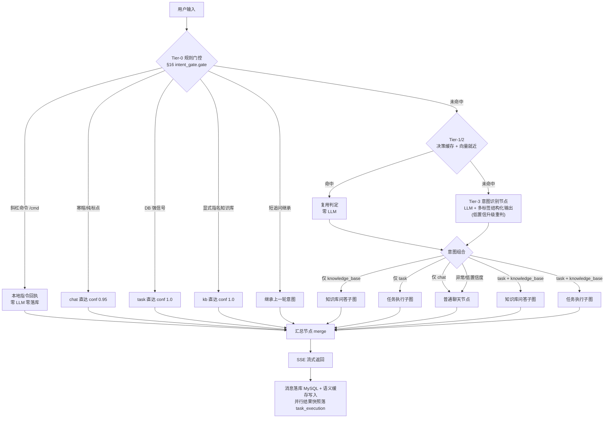
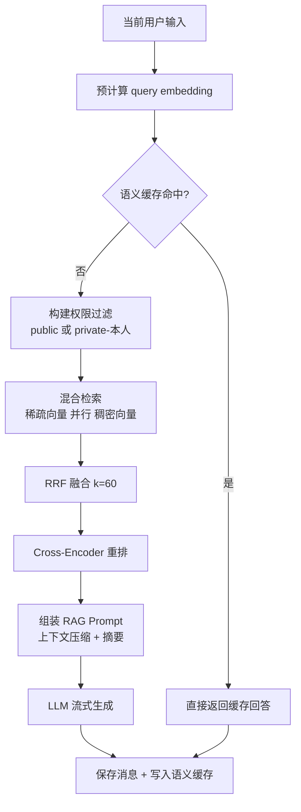
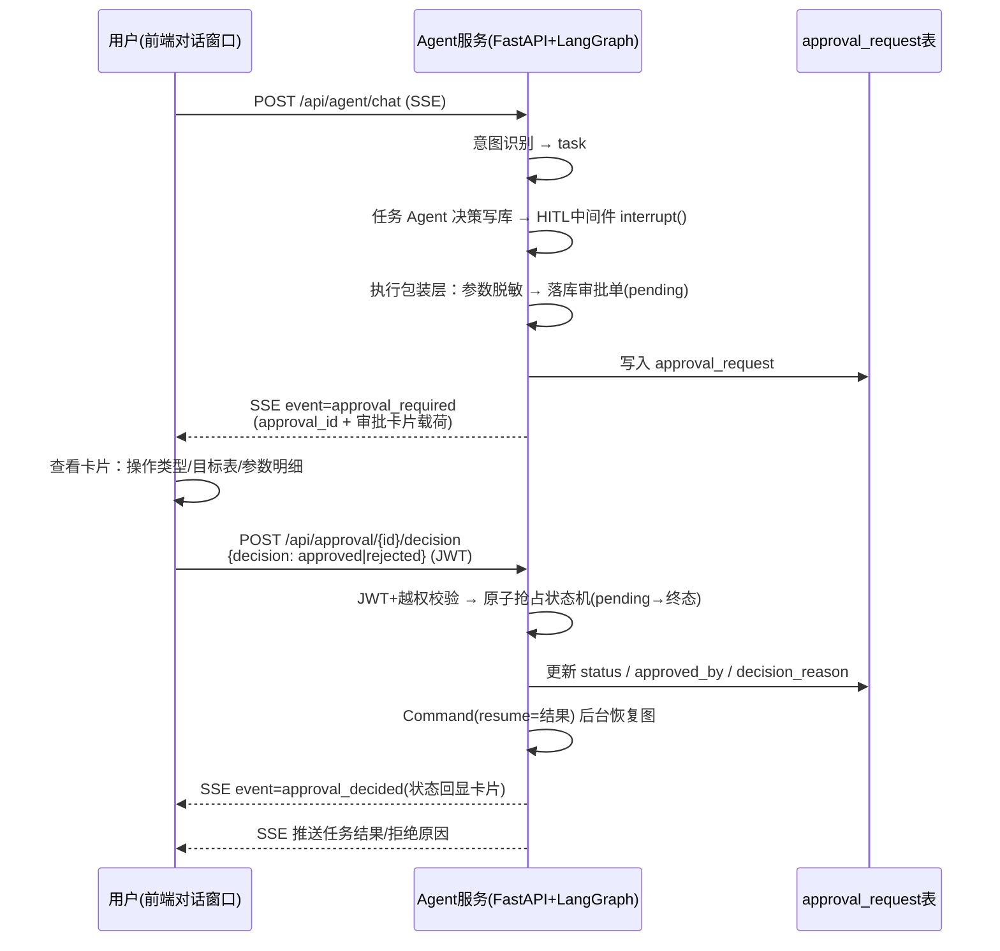
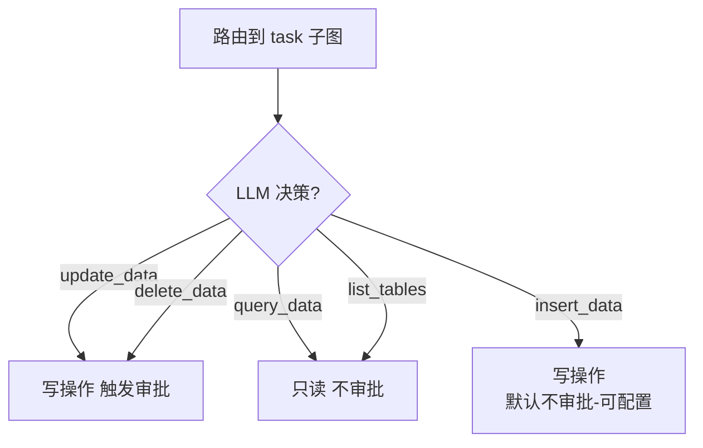
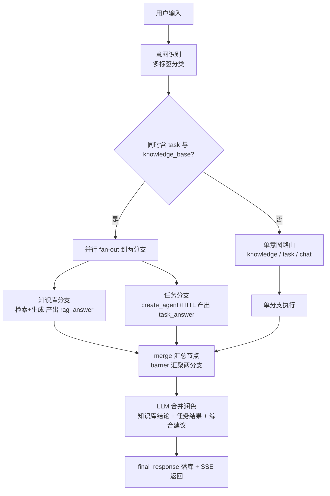
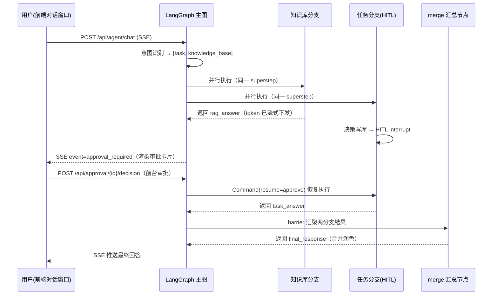
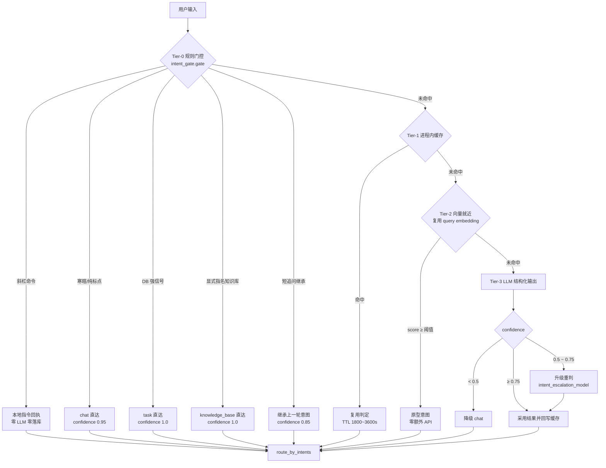

# lingxi-agent 智能化改造开发设计文档（LangChain + LangGraph）

> 版本：v1.0
> 日期：2026-09-04
> 状态：待评审

***

## 目录

1. [文档说明](#1-文档说明)
2. [现状分析](#2-现状分析)
3. [改造目标与技术选型](#3-改造目标与技术选型)
4. [总体架构设计](#4-总体架构设计)
5. [核心模块设计](#5-核心模块设计)
6. [流程图](#6-流程图)
7. [关键功能实现](#7-关键功能实现)
8. [数据表设计](#8-数据表设计)
9. [API 设计](#9-api-设计)
10. [配置项设计](#10-配置项设计)
11. [安全设计](#11-安全设计)
12. [影响范围与改动清单](#12-影响范围与改动清单)
13. [分阶段实施计划](#13-分阶段实施计划)
14. [风险与注意事项](#14-风险与注意事项)
15. [观测与加固（阶段 4）](#15-观测与加固阶段-4)
16. [意图识别分层优化](#16-意图识别分层优化准确率--耗时--llm-调用次数)

***

## 1. 文档说明

### 1.1 背景

当前 lingxi-agent 项目是一个基于 FastAPI 的 RAG 问答系统，已具备知识库混合检索（Qdrant 稀疏向量(基于text-embedding-v4) + 稠密向量 + RRF 融合 + Cross-Encoder 重排序）、语义缓存、对话记忆（MySQL）、文件清洗切分与向量入库等能力。

本次改造的核心诉求：

1. 引入 **LangChain + LangGraph** 技术栈，实现基于**意图识别**的路由能力，将用户输入路由到：**知识库问答 / 任务执行 / 普通聊天** 三条链路；
2. **前台审批（Human-in-the-loop）**：当任务执行涉及**数据库删除或修改**操作时，必须经过**人工审批**后才能执行；审批的触发提示与决策动作均在**前台对话窗口**内完成（审批卡片），不再对接飞书审批流；
3. 知识库检索**完整保留现有检索流程**（混合检索 + 语义缓存 + 权限过滤）；
4. 技术栈使用**最新且稳定**的版本，版本间保证兼容；
5. 代码使用**最新 API**，不使用官方明确废弃的接口；
6. 代码设计符合**企业级**标准，关键点与函数均有详细注释；
7. 版本变更只改 `requirements.txt`，由用户安装依赖后再进入开发；
8. 先输出本设计文档（含流程图、关键功能实现方案、影响范围），评审通过后再实施。

### 1.2 已确认的设计决策

| 决策点          | 结论                                                                    |
| ------------ | --------------------------------------------------------------------- |
| 审批触发条件       | 仅当「路由到任务执行」且「LLM 决策是对数据库某张表做**删除或修改**」时触发审批；查询/插入不触发                  |
| 审批人确定方式      | **前台会话用户本人审批**（JWT 身份，仅发起人可提交决策；越权 403），不再对接飞书审批流                     |
| 接口兼容策略       | **新增接口，保留旧接口**（`/api/conversations/chat` 维持不变，新增 `/api/agent/chat`）   |
| 任务执行工具范围（初期） | 只读查询、数据插入、数据更新（触发审批）、数据删除（触发审批），全部基于**结构化参数 + 表/列白名单**，禁止 LLM 直接拼 SQL |

***

## 2. 现状分析

### 2.1 当前技术栈

| 层次        | 技术                                                                                     | 说明                                 |
| --------- | -------------------------------------------------------------------------------------- | ---------------------------------- |
| Web 框架    | FastAPI 0.115 + Uvicorn                                                                | 异步 API 服务                          |
| ORM       | SQLAlchemy 2.0 (asyncio) + aiomysql                                                    | 异步数据库访问                            |
| 配置        | Pydantic v2 + pydantic-settings                                                        | `.env.dev` 环境配置                    |
| LLM       | `langchain-openai.ChatOpenAI`（通义千问 DashScope 兼容接口）                                     | 对话/摘要/意图                           |
| Embedding | 自研 `DashScopeEmbedding`（DashScope 原生 SDK 直连）                                           | text-embedding-v4，1024 维（稠密+稀疏双输出） |
| 向量库       | Qdrant（本地磁盘模式）                                                                         | 文档向量 + 语义缓存两个集合                    |
| 检索        | 自研 `HybridRetriever`：Qdrant 稀疏向量(text-embedding-v4) + 稠密向量 + RRF 融合 + Cross-Encoder 重排 | 核心检索链路                             |
| 记忆        | 自研 `MySQLChatMessageHistory` / `MySQLConversationSummaryMemory`                        | 消息持久化 + 长对话摘要压缩                    |
| 缓存        | 自研 `SemanticCache`（Qdrant 独立集合）                                                        | 语义级问答缓存                            |
| 认证        | JWT + bcrypt + 图片验证码                                                                   | 用户体系                               |
| 存储        | 腾讯云 COS                                                                                | 文件持久化                              |
| 追踪        | LangSmith                                                                              | 已接入                                |

### 2.2 当前模块结构

```
lingxi-agent/
├── app/main.py                 # FastAPI 入口：lifespan 初始化、路由注册、全局异常
├── api/routes/                 # 路由层
│   ├── auth.py                 # 验证码/注册/登录/me
│   ├── conversation.py         # 会话 CRUD + 流式对话（use_rag 参数二选一）
│   ├── file_process.py         # 文件清洗切分 + 双向量入库（同 doc_id 先删后插）+ 语义缓存失效
│   ├── metadata.py             # 元数据定义 CRUD
│   ├── attachments.py          # 附件
│   └── cache.py                # 语义缓存统计
├── core/                       # config / database / exceptions
├── models/                     # ORM 模型 + Pydantic Schema
├── rag/
│   ├── hybrid_retriever.py     # HybridRetriever（稀疏+稠密双路） / CrossEncoderReranker
│   ├── rag_conversation_service.py  # RAG 对话服务（检索 + 记忆 + 流式）
│   ├── conversation_service.py # 普通对话服务
│   ├── semantic_cache.py       # 语义缓存
│   └── memory_mysql.py         # MySQL 记忆
├── embeddings/embedding_deal.py # Embedding / Qdrant 客户端
├── ingestion/                  # COS / 解析 / 清洗 / 分块
├── prompt/prompt_storage.py    # 提示词集中管理
├── utils/                      # auth / captcha
└── requirements.txt
```

### 2.3 现有对话 API 流程（保持兼容，不修改）

```
POST /api/conversations/chat   (SSE)
  ├─ use_rag=true  → RAGConversationService.chat_with_rag
  │                  ├─ 预计算 query embedding
  │                  ├─ 语义缓存命中？→ 直接流式返回缓存回答
  │                  ├─ 混合检索（权限过滤 + 稀疏向量(text-embedding-v4) + 稠密向量 + RRF + 重排）
  │                  ├─ 上下文压缩 + 摘要（MySQL）
  │                  ├─ RAG Prompt → LLM 流式生成
  │                  └─ 保存消息 + 写缓存
  └─ use_rag=false → ConversationService.chat_with_memory（普通聊天）
```

### 2.4 现有检索流程（本次改造**原样保留**）

```
用户问题
  ├─ 1. 权限过滤：metadata.auth_option ∈ {public} ∪ {private ∧ create_username=当前用户}
  ├─ 2. 并行召回：稀疏向量召回（text-embedding-v4, top_k=k*5）  ∥  稠密向量（相似度搜索, top_k=k*5）
  ├─ 3. RRF 融合：score(d) = Σ 1/(k + rank_i(d))，k=60
  ├─ 4. Cross-Encoder 重排序（bge-reranker-base 本地模型, 候选 12 条）
  └─ 5. 返回 Top-K 文档（新知识优先，按 created_at 倒序）
```

***

## 3. 改造目标与技术选型

### 3.1 依赖版本矩阵（已写入 requirements.txt）

| 包                          | 版本        | 说明 / 兼容性说明                                               |
| -------------------------- | --------- | -------------------------------------------------------- |
| langchain-core             | 1.6.1     | 最新稳定版，提供 Message / Prompt / Document 等核心抽象               |
| langchain                  | 1.3.10    | 锁定原因：1.4.0 依赖已被官方 **yanked** 的 `langgraph==1.2.11`，安装会失败 |
| langchain-openai           | 1.6.0     | ChatOpenAI 官方适配（通义千问 DashScope 兼容接口）                     |
| langchain-qdrant           | 1.1.0     | QdrantVectorStore 集成，沿用现有向量库                             |
| langgraph                  | 1.2.10    | 锁定原因：1.2.11 已被官方 **yanked**（broken），1.2.10 为最新可用稳定版      |
| langgraph-checkpoint       | 4.2.0     | 图状态持久化基础库（由 langgraph 自动拉取）                              |
| langgraph-checkpoint-mysql | 3.0.0     | MySQL 检查点保存器，用于跨请求恢复审批中断点                                |
| openai                     | 3.8.0     | 最新稳定版（embedding\_deal.py 直连使用，旧 1.x 语法已废弃）               |
| ~~lark-oapi~~              | —         | 已移除（审批入口由飞书改为前台对话窗口，见 §5.6 变更记录）                         |
| qdrant-client              | 1.19.0    | 向量库客户端                                                   |
| langsmith                  | 0.12.1    | 链路追踪                                                     |
| apscheduler                | >=3.10,<4 | 定时任务调度（熔断恢复探测，§7.7.6）                                    |

> 说明：`langchain-community` 官方已宣布 sunset（停止维护），本项目未使用，已从依赖中移除，避免安全隐患。

### 3.2 技术选型原则

1. **LangGraph 承担编排**：意图路由、条件分支、多意图**并行执行与自动汇聚**、任务执行、Human-in-the-loop 审批，全部由 StateGraph 表达，状态显式、可回放、可持久化；
2. **LangChain 承担模型抽象**：ChatOpenAI、Prompt、Message、Structured Output、Document 等；
3. **复用现有检索资产**：`HybridRetriever`、`SemanticCache` 等检索组件不重写，通过薄适配层接入图节点；稀疏向量与稠密向量均由 **text-embedding-v4** 一次调用双输出并存储于 Qdrant，**不再维护独立 BM25 内存索引**；
4. **审批采用官方 HITL 机制**：`create_agent` + `HumanInTheLoopMiddleware` + LangGraph `interrupt()` + `MySQLAsyncSaver` 检查点持久化，天然支持服务重启后继续审批流；
5. **API 全部使用最新官方接口**：`StateGraph/add_node/add_conditional_edges/interrupt/Command/with_structured_output` 等。任务 Agent 使用 `langchain.agents.create_agent`（LangGraph v1 官方推荐），**不使用已弃用的** **`langgraph.prebuilt.create_react_agent`**，也不使用已废弃的 `Chain`/`LLMChain`/`SequentialChain` 等旧 API。

***

## 4. 总体架构设计

### 4.1 架构分层

```
┌─────────────────────────────────────────────────────────────────────┐
│                         接入层（FastAPI）                            │
│  POST /api/agent/chat(SSE)   POST /api/approval/callback  查询接口  │
└───────────────────────────────┬─────────────────────────────────────┘
                                │
┌───────────────────────────────▼─────────────────────────────────────┐
│                      Agent 编排层（LangGraph）                       │
│  ┌──────────────┐    ┌──────────────────────────────────────────┐  │
│  │ IntentRouter │───►│          AgentStateGraph                 │  │
│  │  意图识别     │    │  intent_router → 条件路由                │  │
│  └──────────────┘    │   ├→ knowledge_subgraph（知识库问答）      │  │
│                      │   ├→ chat_node（普通聊天）                │  │
│                      │   └→ task_subgraph（任务执行 + 审批）      │  │
│                      └──────────────────────────────────────────┘  │
└───────────────┬────────────────────┬────────────────────┬──────────┘
                │                    │                    │
┌───────────────▼──────┐  ┌──────────▼─────────┐  ┌───────▼───────────────┐
│  知识服务（复用现状）  │  │  Agent 工具层       │  │ 审批服务（前台）         │
│  HybridRetriever      │  │  query/insert/     │  │  ApprovalService      │
│  SemanticCache        │  │  update/delete     │  │  审批卡片SSE载荷        │
│  MySQL 记忆           │  │  +表/列白名单       │  │  决策接口+中断恢复       │
└───────────────────────┘  └───────────────────┘  └───────────────────────┘
                │                    │                    │
┌───────────────▼────────────────────▼────────────────────▼──────────────┐
│                       基础设施层                                       │
│  Qdrant(向量+缓存)  MySQL(业务+检查点+审批单)  DashScope LLM/Embedding  │
│  COS(文件)  LangSmith(追踪)  JWT(认证)                                │
└───────────────────────────────────────────────────────────────────────┘
```

### 4.2 新增模块结构

```
lingxi-agent/
├── agent/                              # 新增：Agent 编排层
│   ├── __init__.py
│   ├── state.py                        # LangGraph 图状态定义（TypedDict + Reducer）
│   ├── graph_builder.py                # 组装主图 + 条件路由 + 编译（checkpointer）
│   ├── intent_router.py                # 意图识别节点（Structured Output）
│   ├── nodes/
│   │   ├── __init__.py
│   │   ├── knowledge_node.py           # 知识库问答节点（复用现有检索流程）
│   │   ├── chat_node.py                # 普通聊天节点
│   │   └── task_node.py                # 任务执行节点（create_agent + HITL 中间件）
│   ├── tools/
│   │   ├── __init__.py
│   │   ├── agent_tool.py               # 工具统一收敛点（DbToolExecutor / KnowledgeToolExecutor / ClarifyTool + ToolSpec 注册表）
│   │   ├── registry.py                 # 工具注册表（薄封装，实现见 agent_tool.py）
│   │   ├── db_tools.py                 # 数据库工具（薄封装，实现见 agent_tool.py）
│   │   ├── circuit_breaker.py          # 工具熔断器（状态机 + 自动/人工熔断，§7.7）
│   │   ├── probe.py                    # 熔断恢复定时探测（APScheduler 扫描重放，§7.7.6）
│   │   ├── registrar.py                # 启动注册（@tool 扫描 + ToolSpec upsert，§7.8）
│   │   └── manager.py                  # 运行时绑定（查生效工具 + 超时/熔断包装，§7.9）
│   ├── approval/
│   │   ├── __init__.py
│   │   ├── approval_service.py         # 审批业务（建单/SSE卡片载荷/决策受理/恢复图，幂等状态机）
│   │   └── decision.py                 # 前台审批决策受理（JWT 校验 + 后台恢复包装）
│   └── knowledge_service.py            # 知识服务薄适配层（调用现有 RAG 组件）
├── models/
│   ├── task_model.py                   # 新增：任务执行记录表
│   ├── task_schema.py                  # 新增：任务相关 Schema
│   ├── approval_model.py               # 新增：审批单表
│   ├── approval_schema.py              # 新增：审批相关 Schema
│   ├── tool_model.py                   # 新增：工具注册表（tool_registry，§8.3）
│   └── tool_schema.py                  # 新增：工具 Schema（列表/状态变更/同步结果）
├── api/routes/
│   ├── agent.py                        # 新增：/api/agent/chat (SSE) 等
│   ├── approval.py                     # 新增：/api/approval/*（决策提交 + 状态查询 + 会话审批列表）
│   └── tools.py                        # 新增：/api/tools/*（工具列表/详情/状态变更，§9.1）
└── prompt/
    ├── prompt_storage.py               # 扩展：意图识别/任务执行提示词
```

***

## 5. 核心模块设计

### 5.1 图状态（AgentState）

```python
# agent/state.py
from typing import TypedDict, Annotated, Optional, Any
from langgraph.graph.message import add_messages

class AgentState(TypedDict, total=False):
    # ---- 对话上下文 ----
    conversation_id: str                # 会话 ID（= LangGraph thread_id）
    user_id: Optional[str]              # 用户 ID
    username: Optional[str]             # 用户名（用于知识库权限过滤）
    model: str                          # 模型名
    messages: Annotated[list, add_messages]   # 消息列表（含历史 + 当前输入）

    # ---- 意图识别（多标签） ----
    intents: list                      # 多意图列表，如 ["task","knowledge_base"] / ["chat"]
    intent_reason: Optional[str]       # LLM 分类理由（可观测）
    intent_confidence: Optional[float] # 置信度

    # ---- 知识库问答 ----
    context_docs: list                 # 检索到的文档
    context_text: Optional[str]        # 格式化后的上下文
    cached_answer: Optional[str]       # 语义缓存命中时直接使用
    rag_answer: Optional[str]          # 知识库分支产出（并行场景下与任务分支隔离）

    # ---- 任务执行 ----
    task_execution_id: Optional[str]    # 任务执行记录 ID
    tool_calls: list                    # 本次任务的工具调用序列（审计）
    tool_results: list                  # 工具执行结果
    pending_write: Optional[dict]       # 待审批的写操作（工具名/表/参数）
    approval_required: bool             # 是否需要审批
    approval_status: Optional[str]      # pending / approved / rejected
    approval_id: Optional[str]          # 审批单 ID

    # ---- 输出 ----
    task_answer: Optional[str]          # 任务分支产出（含审批后结果，供汇总节点合并）
    final_response: Optional[str]      # 汇总节点合并后的最终回答（供落库与回溯）
    error: Optional[str]               # 错误信息
```

### 5.2 意图识别（IntentRouter）

> **2026-09-18 优化**：本节为 v1 的**基础形态**（LLM 结构化输出 + 降级）。
> 现已演进为**四层递进判定**（规则门控 → 决策缓存 → 向量就近 → LLM 兜底），
> 完整设计见 [§16 意图识别分层优化](#16-意图识别分层优化准确率--耗时--llm-调用次数)。
> 下文描述的结构化输出与归一化规则在 §16 中**全部保留**，仅在其前面增加了零 LLM 成本的快通道。

- 采用 `ChatOpenAI.with_structured_output()`（官方最新结构化输出 API，非废弃的 `output_parser` 手工解析）；
- **多标签分类**：同一输入可能同时命中「任务执行 + 知识库问答」，输出意图**列表**而非单一意图：

```python
class IntentResult(BaseModel):
    intents: list[Literal["knowledge_base", "task", "chat"]]  # 可含多个，如 ["task","knowledge_base"]
    reason: str          # 分类依据（可观测/审计）
    confidence: float    # 0~1（整体置信度，取最低子意图置信度）
```

- 提示词（放入 `prompt/prompt_storage.py`，集中管理）：
  - `knowledge_base`：与知识库中文档内容相关的提问（政策、说明书、FAQ 等）；
  - `task`：需要对**业务数据库数据**执行操作的请求（查询/新增/修改/删除某条数据、某张表）；
  - `chat`：寒暄、闲聊、通用知识问答，不涉及知识库文档与数据库操作。
- **意图组合规则**（路由函数执行，见 5.8）：
  - 仅 `["chat"]` → 普通聊天；
  - 仅 `["knowledge_base"]` / 仅 `["task"]` → 单分支；
  - `["task","knowledge_base"]` 同时命中 → **并行**执行任务子图与知识库子图，最后汇总；
  - `chat` 与其它意图并存时**丢弃 chat**（chat 仅作兜底，不参与并行）；
  - 异常输入（如同时命中 3 个）→ 按 `task > knowledge_base > chat` 优先级收敛。
- **降级策略**：LLM 调用失败、输出非法、置信度 < 0.5 时，默认路由到 `chat`，保证服务可用性；
  置信度落在 `[0.5, 0.75)` 时先用 `intent_escalation_model` **升级重判**一次（§16.5.5-A2）；
- **安全策略**：命中 `task` 的输入，在进入任务执行前会再次由任务 Agent 判断是否真的需要写操作，双重确认降低误判。任务 Agent 的写工具全部必填 `user_intent_quote` 参数（用户原话中表达写意图的片段），缺失/空白或未命中写意图关键词时工具直接拒绝，引导模型反问用户（见 5.5.2）。

### 5.3 知识库问答节点（KnowledgeNode）

**复用现有检索流程**，通过薄适配层 `agent/knowledge_service.py` 调用现有组件，不改动 `rag/` 内部实现：

```python
# agent/knowledge_service.py（伪代码）
class KnowledgeService:
    def __init__(self, db): self.rag = RAGConversationService(db_session=db)

    async def get_cached(self, user_input, username, embedding):
        return await get_semantic_cache().get(user_input, username, precomputed_embedding=embedding)

    async def retrieve(self, user_input, username, embedding, k=4):
        return await self.rag.retrieve_context_public(...)   # 调用现有混合检索

    async def build_prompt_inputs(self, conversation_id):
        history = await self.rag.get_compressed_history_public(conversation_id)  # 复用压缩+摘要
        return history
```

节点逻辑：

1. 预计算 query embedding；
2. 语义缓存检查（命中 → 直接作为回答，写入消息）；
3. 未命中 → 混合检索（权限过滤 + 稀疏向量(text-embedding-v4) + 稠密向量 + RRF + 重排，`k=4`）；
4. 组装 RAG Prompt（复用 `RAG_SYSTEM_PROMPT_WITH_CONTEXT/WITHOUT_CONTEXT`）；
5. LLM 流式生成（供 API 层 `stream_mode="messages"` 转发 SSE），产出写入 `rag_answer`（并行场景下供 merge 节点合并）；
6. 回答落库（MySQL） + 写入语义缓存。

### 5.4 普通聊天节点（ChatNode）

- 复用 `ConversationService.chat_with_memory` 的 Prompt 组装与记忆逻辑；
- 不使用 RAG 检索，走 `CHAT_SYSTEM_PROMPT` + 最近历史；
- 支持流式输出。

### 5.5 任务执行节点（TaskNode）与工具层

#### 5.5.1 工具清单（初期）

| 工具名                | 能力                                | 风险等级 | 是否触发审批       |
| ------------------ | --------------------------------- | ---- | ------------ |
| `list_tables`      | 列出可操作的表（白名单）                      | 只读   | 否            |
| `query_data`       | 结构化条件查询（SELECT）                   | 只读   | 否            |
| `search_knowledge` | 检索知识库文档（RAG-as-tool，任务执行需文档依据时调用） | 只读   | 否            |
| `insert_data`      | 新增记录（INSERT）                      | 写    | 否（可配置，默认不审批） |
| `update_data`      | 修改记录（UPDATE）                      | 写    | **是**        |
| `delete_data`      | 删除记录（DELETE）                      | 写    | **是**        |

> 工具统一收敛在 `agent/tools/agent_tool.py`（按类别以类组织：`DbToolExecutor` / `KnowledgeToolExecutor` / `ClarifyTool` + `ToolSpec` 注册表，原 `registry.py` / `db_tools.py` / `knowledge_tool.py` / `tools/clarify_tool.py` 均为薄封装）。每个工具带有 `requires_approval` 标记，未来扩展新工具只需在注册表声明，无需改动图逻辑。
> 写工具（`insert_data`/`update_data`/`delete_data`）签名均含必填参数 `user_intent_quote`，二次确认写操作意图（见 5.5.2）。
> `search_knowledge` 由独立执行器 `KnowledgeToolExecutor`（`agent/tools/agent_tool.py`）提供，`username` 服务端注入（权限过滤），`k` clamp 到 [1,10]，返回上下文双重长度截断防止撑爆 Agent 上下文。

#### 5.5.2 结构化参数与安全执行

- **禁止 LLM 拼接 SQL**：工具入参为结构化字段（`table`、`columns`、`filters`、`values`），工具内部用 **SQLAlchemy Core + 绑定参数**构造语句（天然防注入）；
- **表/列白名单**：`AGENT_DB_ALLOWED_TABLES` 配置允许操作的表；列名校验防止越权访问敏感字段；
- **查询限制**：SELECT 默认 `LIMIT 50`、超时保护、结果字段裁剪；
- **写操作二次确认（双保险）**：所有写工具（`insert_data` / `update_data` / `delete_data`）必填 `user_intent_quote`（用户原话中表达该写操作意图的原文片段）。校验规则：
  1. 缺失 / 空白 → 直接拒绝（错误消息引导模型向用户确认，而非直接执行）；
  2. 超长（>200 字符）→ 截断；
  3. 未命中写意图关键词（如 更新 / 修改 / 删除 / 新增 等，词表见 `agent/tools/agent_tool.py:WRITE_INTENT_KEYWORDS`）→ 视为缺少用户明确授权，拒绝并引导模型反问用户。
     该参数为函数必选参数，LangChain `StructuredTool` 的 pydantic schema 在工具调用层即拦截缺参；handler 内校验作为二道防线。同时进入 `user_intent_quote` 一并落审计，审批卡片展示该引用供审批人对照用户原话。
- **只读工具**：`list_tables` / `query_data` 由 `DbToolExecutor` 提供；`search_knowledge`（知识库检索）由 `KnowledgeToolExecutor`（均在 `agent/tools/agent_tool.py`）提供——`username` 服务端从会话上下文注入（不暴露为工具参数，防止模型伪造身份越权检索私有文档），`k` clamp 到 [1,10] 防检索成本失控，返回上下文按「单文档 800 字 / 总量 4000 字符」双重截断防撑爆 Agent 上下文；工具调用进入 `tool_calls` 审计（与数据库工具合并取并集落库）；
- **审计**：每次工具调用（含参数、结果摘要、`user_intent_quote`）写入 `task_execution` 表。

#### 5.5.3 任务执行节点流程

1. 图路由到 `task` → 进入任务子图；
2. 使用 `langchain.agents.create_agent`（LangGraph v1 官方推荐的最新 Agent API，`langgraph.prebuilt.create_react_agent` 已在 v1 中弃用）创建任务 Agent，绑定工具 + LLM，并挂载 `HumanInTheLoopMiddleware`（官方 HITL 中间件，内置写操作审批中断能力）；
3. Agent 规划 → 若需政策/规则/流程依据，先调用 `search_knowledge` 检索知识库（只读，不触发审批）；
4. 若仅调用只读工具，直接执行并汇总结果；
5. 若 Agent 决定调用 `update_data` / `delete_data` → 中间件依据 `interrupt_on` 策略在**工具执行前**触发 `interrupt`（写操作审批门，见 5.6）；
6. 审批通过 → 恢复执行写工具 → 汇总结果；审批拒绝 → 终止并告知用户；
7. 任务结束，生成人类可读的执行报告作为回答。

> 变更记录（2026-09-17）：强化 `TASK_AGENT_SYSTEM_PROMPT` 通用引导——表名/字段不确定时**必须先** `list_tables` 获取精确表名（禁止猜表名/凭猜测执行）；不确定相关信息或任务缺少依据时**先** `search_knowledge` 检索知识库，依知识库内容决定继续执行 / 补充询问 / 说明无法完成；检索到内容后以其为决策依据，知识库无相关内容时如实告知不编造。对应修复任务模型臆造 `users` 等错误表名的问题。

#### 5.5.4 工具异常处理与循环兜底（P0 落地）

> 变更记录：任务 Agent 由「工具异常直接中断循环」升级为「异常转 ToolMessage 送回循环（模型自愈）+ 递归上限防死循环」。涉及 `agent/tools/agent_tool.py`（`DbToolError` 基类）与 `agent/nodes/task_node.py`（工具绑定与循环配置）。超时体系（§变更二）同步落地：新增 `agent_tool_timeout_seconds` / `agent_llm_timeout_seconds` 配置，任务级整体超时语义回归 `agent_task_timeout_seconds`。

企业级 Agent 的标准做法是**错误进入循环而非中断循环**。基于 `create_agent` 的三层兜底（`langchain.agents.create_agent` 无 `max_iterations` 参数，迭代上限统一走 langgraph 递归机制）：

1. **参数校验错误**：`ToolNode` 默认捕获 → 转成 ToolInvocationError → 按默认模板转 ToolMessage（框架原生行为，无需改动）；
2. **业务执行异常（工具自愈）**：
   - `DbToolError` 由 `Exception` 改为继承 `langchain_core.tools.ToolException`（框架层只把 `ToolException` 视为"业务可恢复错误"）；
   - 工具绑定处设置 `handle_tool_error=_tool_error_content`：异常被捕获为 `{工具执行失败：<已脱敏消息>。请修正参数后重试；若仍失败，请如实告知用户暂无法完成。}` 的 ToolMessage 送回循环；
   - 模型收到错误后可**修正参数重试 / 换工具 / 如实告知用户**，而非直接中断；消息沿用 `_safe_error` 脱敏（不暴露 SQL/参数/堆栈），审计链路不变；
3. **递归上限（防死循环硬保护）**：
   - `create_agent` 内部默认 `recursion_limit=9999`（形同无限制），节点层在 `ainvoke` 的 config 中注入 `recursion_limit=AGENT_MAX_RECURSION_LIMIT`（100，约 25~50 轮往返，覆盖时优先于默认值，运行时验证成立）；
   - 达到上限抛 `GraphRecursionError` → 节点层捕获，落审计 `failed` 并产出友好错误「任务执行超过最大尝试次数，请将请求拆分或简化后重试」；
   - 与审批中断（`GraphInterrupt`）相互独立、无继承关系，两个 except 分支互不遮蔽；审批恢复场景 step 计数从检查点延续，100 上限不受影响。
4. **超时体系（三层，配置化）**：
   - **单次工具调用总时长**（`agent_tool_timeout_seconds`，默认 30s）：`_bind_tools` 用 `_with_tool_timeout` 统一包裹所有工具（`functools.wraps` 保留原签名，工具 schema 不退化）。超时抛 `DbToolError` → 走第 2 点通道送回循环（模型可感知超时并应对）；DB 工具的语句级 120s 上限在工具级统一超时内（通常查询远小于 30s，如业务需要可调大配置）；
   - **单次 LLM 推理**（`agent_llm_timeout_seconds`，默认 60s）：`ChatOpenAI(timeout=...)`，模型挂死不再无限等待；
   - **Agent 循环整体墙钟**（`agent_task_timeout_seconds`，默认 120s）：非审批模式下 `ainvoke` 外层 `asyncio.wait_for` 兜底，超时抛 `asyncio.TimeoutError` → 节点层落审计 `failed` + 友好错误；**审批模式下不设整体超时**（用户审批可能挂起较久，审批等待超时由 `APPROVAL_WAIT_TIMEOUT` 语义负责），仍受工具级/LLM 超时与递归上限保护。

### 5.6 前台审批（Human-in-the-loop）

> 变更记录：审批入口由「飞书审批流」改为「**前台对话窗口内审批卡片**」，不再依赖 lark-oapi 与飞书事件回调；HITL 中断/恢复机制（`HumanInTheLoopMiddleware` + `MySQLAsyncSaver` 检查点）保持不变。

基于 LangChain v1 官方 HITL 机制：`create_agent` + `HumanInTheLoopMiddleware`（内部触发 LangGraph `interrupt()`）+ `MySQLAsyncSaver` 检查点持久化。审批的**触发提示**与**决策动作**均在前台对话窗口完成：

```
任务 Agent（create_agent + HumanInTheLoopMiddleware）
  ├─ Agent 决策调用 update_data / delete_data
  ├─ 中间件在工具执行前 interrupt()
  │    （携带 HITLRequest：action_requests + review_configs，
  │     为每个待审批工具调用生成 action request）
  ├─ 中断状态持久化（thread_id=conversation_id，MySQL 检查点）
        │
        ▼
┌───────────── 执行包装层（approval_service）─────────────────┐
│  检测到 interrupt 后：                                       │
│  ① 从 action_requests 提取工具名/参数（脱敏）                │
│  ② 落库审批单（approval_request，status=pending）            │
│  ③ SSE 推送 event=approval_required + approval 完整载荷      │
│    （前端在消息流中渲染「审批卡片」，见 §7.5）               │
└──────────────────────────────┬───────────────────────────────┘
                               ▼
┌───────────── 前台对话窗口 ───────────────────────────────────┐
│  用户查看审批卡片（操作类型/目标表/参数明细/风险标识）        │
│  点击「同意执行」或「拒绝」                                   │
│  → POST /api/approval/{id}/decision  （JWT 鉴权）            │
└──────────────────────────────┬───────────────────────────────┘
                               ▼
审批服务：JWT + 越权校验 → 原子抢占状态机（pending→approved/rejected）
                               ▼
以 Command(resume=HITLResponse(decisions=[approve/reject])) 恢复图执行（后台任务）
   ├─ approved → 执行写工具 → 完成任务
   └─ rejected → 终止任务，生成"已拒绝"回答
                               ▼
恢复结果经原 SSE 连接推送（content + approval_decided 状态事件）；
SSE 已断开时前端经 GET /api/approval/{id} 轮询兜底。
```

**关键点**：

- 中断点状态（含待审批的工具调用）由 MySQL 检查点保存，**服务重启后仍可恢复**；
- `interrupt_on` 策略按工具名配置：`update_data` / `delete_data` → `allowed_decisions=["approve","reject"]`（不允许 edit/respond，保证审批语义严格）；`insert_data` 默认 `False`（自动放行），如需按运行时条件审批可通过 `when` 回调动态判断；
- 审批决策与恢复为异步后台任务，SSE 连接通过心跳保活，完成后推送最终结果（同时提供轮询接口兜底）；
- 审批单状态与图状态双写，通过 `approval_request.id` 关联，保证幂等（重复提交决策/重复恢复均被状态守卫拦截）；
- **多 action 批次决策**：模型平行 tool calling 时，一次中断可能含**多个待审批写操作**（如同轮 `update_data` + `delete_data`）。单次中断落一张审批单，`actions` 字段保存全部操作（脱敏），`approval_type`/`target_table`/`tool_params` 保存首个 action 供卡片头部展示；恢复时 `decisions` 数量与挂起工具数**一一对应**（LangChain HITL 中间件校验数量不一致会抛 `ValueError`），决策为批次级——同意/拒绝一次覆盖全部操作；
- 审批人 = 当前会话用户（JWT 身份），仅发起人本人可审批；越权提交返回 403。

#### 5.6.1 任务追问（澄清式 HITL，2026-09-17 新增；2026-09-17 升级多问题批量追问 + 取消）

> 需求：任务节点执行时 LLM 掌握的信息不足（查询条件不明确、数据主键缺失、执行范围不清、多义表述等），应**中断追问**用户；用户在前台作答提交后，LLM 继续处理原任务。升级能力：LLM 可将多个缺失的关键信息合并为**一批（一次最多 5 个具体、独立的问题）**，前台逐题作答（问题数 / 进度 / 下一步 / 提交）或**取消**；取消后任务终止，LLM 如实告知用户已取消提供相关信息，并给出修复建议。

**实现方案**：复用审批的中断/恢复基础设施与 `approval_request` 表（泛化为"人工介入单"，`biz_type` 区分写审批/追问），升级 `ask_user` 追问工具为批量问题：

```
任务 Agent（create_agent，审批模式下绑定 ask_user 工具）
  ├─ Agent 决策调用 ask_user(questions=["q1", "q2", ...])（@tool 工具，内部触发 langgraph interrupt()）
  ├─ interrupt({type: "clarification", questions: [...]})   ← 一次中断可携带一批问题（≤5）
  ├─ 中断状态持久化（thread_id=conversation_id，MySQL 检查点）
        │
        ▼
┌───────────── 执行包装层（api/routes/agent.py _handle_clarify_interrupt）─┐
│  ① 落库追问单（approval_request，biz_type=clarification，status=pending）│
│  ② SSE 推送 event=clarification_required + questions 列表 + 卡片载荷    │
│    （前端渲染多问题向导卡片：N/总数 进度 + 下一步 + 提交 + 取消，见 §7.6）  │
└──────────────────────────────┬──────────────────────────────────────────┘
                               ▼
┌───────────── 前台对话窗口 ─────────────────────────────────────────────┐
│  用户逐题作答 → 提交：POST /api/agent/clarify/{id}/answer （answers=[...]）│
│  或 取消：POST /api/agent/clarify/{id}/cancel                           │
│  （JWT 鉴权，仅发起人）                                                  │
└──────────────────────────────┬──────────────────────────────────────────┘
                               ▼
追问服务：越权校验 → 原子抢占状态机（pending→answered / pending→canceled，幂等）
                               ▼
提交答案 → Command(resume={"answers": [...]}) 恢复同一 thread 执行
取消     → Command(resume={"canceled": True}) 恢复 + 任务记录标记 canceled 终止
  ├─ 任务节点重入，ask_user 工具的 interrupt() 返回批量答案或取消信号
  ├─ 批量答案：Agent 依据补充信息继续执行 → 完成任务，结果经 SSE 推送
  └─ 取消：Agent 如实告知用户已取消提供相关信息 → 给出处理结果或修复建议
```

**关键点**：

- **工具注册**：`ask_user(questions: list[str])` 为 `@tool` 装饰器工具（定义于 `agent/tools/agent_tool.py`，经薄封装 `tools/clarify_tool.py` re-export 保持 `@tool` 扫描发现），启动时经 `sync_tool_registry` 自动入库 tool_registry（`requires_approval=0`，追问本身不需审批；工具描述变更随启动同步刷新）；
- **检查点依赖**：`interrupt()` 必须启用 checkpointer 才能工作，因此 `ask_user` 仅在审批模式（checkpointer 可用）下由任务节点绑定，非审批模式剔除（`task_node.py` 按工具名过滤，退化回"如实告知用户信息不足"）；单批问题上限 `_MAX_QUESTIONS=5`；
- **提示词约束**：`TASK_AGENT_SYSTEM_PROMPT` 约束"信息不足先 search_knowledge 检索，仍缺失才 ask_user；可一批追问最多 5 个具体、独立的问题；收到取消信号时如实告知并给出修复建议"（知识库检索仍优先于追问）；
- **追问单**复用审批表：`biz_type=clarification` + `approval_type="clarification"`，`tool_params.questions` 存问题列表（兼容旧 `tool_params.question`），批量回答存 `callback_payload.answers`（单问题兼容 `answer` 列），取消标记 `callback_payload.canceled=true`，`approved_by` 存回答人/取消人（审计）；
- **状态机**：pending→answered / pending→canceled 单向流转（原子抢占），重复提交/取消被拦截；恢复重入时任务节点复用 running 任务记录（与审批一致）；
- **取消语义**：恢复图执行后 ask_user 返回取消信号，LLM 生成"已取消提供相关信息 + 现有信息尽力处理 + 补充哪些信息可重试"的回答；任务执行记录标记 `canceled`（终止态），对话消息照常落库；
- **列表隔离**：`GET /api/approval` 按 `biz_type` 过滤（`biz_type IS NULL OR = 'write_approval'`），追问单不混入审批列表；刷新后追问卡片经 `GET /api/agent/clarify` 重建。

### 5.7 记忆与消息持久化

- 图内 `messages` 为工作态；每次请求从 MySQL 加载历史（复用 `MySQLChatMessageHistory`），结束后写入新增消息；
- 长对话压缩与摘要复用现有 `MySQLConversationSummaryMemory` 逻辑（通过薄适配层暴露公开方法）；
- LangGraph 检查点仅服务于审批中断/恢复场景，与业务消息表互不冲突。

### 5.8 多意图并行路由与汇总（核心新增）

当用户输入**同时包含任务执行与知识库问答**（如"查一下订单数据，并对照知识库里的售后政策给出处理建议"）时，利用 LangGraph 原生 DAG 能力实现**并行 fan-out + 自动汇聚（barrier）**：

```
intent_router（多标签）
        │  条件路由（route_by_intents）
        ├─ 仅单意图 ──────────────► 对应单分支（knowledge / task_agent / chat）
        └─ ["task","knowledge_base"] ─► 同一 superstep 并行执行：
                                        ├─ knowledge 节点（复用现有检索，输出 rag_answer）
                                        └─ task_agent 节点（create_agent + HITL，输出 task_answer）
                                                 │
                                                 ▼
                                        merge 节点（等待所有前驱完成后自动汇聚，输出 final_response）
```

#### 5.8.1 并行机制（LangGraph 原生能力，无需引入额外并发框架）

| 能力   | LangGraph 机制                                                            | 本项目用法                                               |
| ---- | ----------------------------------------------------------------------- | --------------------------------------------------- |
| 并行执行 | 条件路由映射值可为**节点名列表**，同一 superstep 中无依赖节点并行运行                              | `route_by_intents` 返回 `["knowledge", "task_agent"]` |
| 自动汇聚 | 节点有**多条入边**时，LangGraph 在所有前驱节点完成后才执行（barrier/join）                      | `merge` 节点收敛两个分支                                    |
| 状态隔离 | 并行分支写入**不同字段**，避免 reducer 冲突                                            | 知识库分支写 `rag_answer`，任务分支写 `task_answer`             |
| 中断语义 | 任一分支触发 `interrupt` 会**暂停整个图**，其余分支已产出的结果保留在 state 中，resume 后继续执行到 merge | 任务分支审批中断时，`rag_answer` 已落 state，审批通过后直接进入汇总         |

#### 5.8.2 与前台审批的交互（并行 + 中断）

- 知识库分支通常先完成：`rag_answer` 写入 state，检索与生成结果**不因审批中断而丢失**；
- 任务分支命中写操作 → HITL 中间件 interrupt → 整个图暂停（thread\_id=conversation\_id 持久化）；
- SSE 行为：知识库答案的 token 在中断前已可流式下发 → 随后推送 `event=approval_required`（含审批卡片载荷）→ 前台渲染卡片，用户提交决策 → 后台恢复 → 任务分支完成 → merge 汇总 → 推送最终回答；
- 兜底：若前端连接断开，可通过 `GET /api/agent/tasks/{task_execution_id}` 轮询获得合并后的 `final_response`，审批单状态经 `GET /api/approval/{id}` 轮询。

#### 5.8.3 汇总节点（merge）

- **合并策略**：两条分支结果做最终 LLM 摘要（保证上下文连贯、去重、自然衔接），而非简单字符串拼接：
  - 输入：`rag_answer` + `task_answer` + 原用户输入；
  - 输出：`final_response`（结构化为「知识库结论 + 任务执行结果 + 综合建议」三段式，可视场景省略段）；
  - 若某分支失败/无结果，则汇总节点对剩余分支结果直接润色输出（容错）；
- **可观测性**：`final_response` 连同各分支原始结果一并落库 `task_execution`（含 `rag_answer`、`task_answer` 快照），便于审计与回溯；
- 汇总节点为普通 LLM 调用（非 Agent），无工具、无审批，天然适合作为 DAG 汇聚点。

***

## 6. 流程图

### 6.1 总体路由流程图



> 说明：`G`（知识库）与 `H`（任务）在同一 superstep 并行执行；`merge` 节点有多条入边，LangGraph 自动在其所有前驱完成后才执行（barrier）。
> **§16 变更**：`A0` 与 `A6` 为新增的零 LLM 快通道，命中时**不进入** `B`（LLM 分类）；
> `A1`~`A5`、`A7` 的判定结果直接等效于 `B` 的 `intents`，后续路由逻辑完全复用，无分支删改。

### 6.2 知识库问答子图（复用现有检索流程）



### 6.3 任务执行子图（含审批门）

```mermaid
flowchart TD
    A[路由到 task] --> B[任务 Agent<br/>create_agent + HITL中间件]
    B --> C{需要写库?<br/>update_data/delete_data}
    C -->|否| D[执行只读/插入工具]
    D --> E[生成执行报告]
    C -->|是| F[中间件在工具执行前中断<br/>HITLRequest 携带待审批工具]
    F --> G[执行包装层<br/>脱敏落库审批单]
    G --> H[中断状态持久化<br/>thread_id=conversation_id]
    H --> I[SSE 推送 approval_required<br/>前端渲染审批卡片]
    I --> J[用户在对话窗口审批<br/>POST /api/approval/{id}/decision]
    J --> K{审批结果}
    K -->|通过| L[恢复执行写工具]
    L --> E
    K -->|拒绝| M[终止任务<br/>生成拒绝回答]
    E --> N[SSE 返回 + 落库]
    M --> N
```

### 6.4 前台审批交互时序图



### 6.5 审批触发判定逻辑



### 6.6 多意图并行路由与汇总流程图



### 6.7 多意图并行 + 审批中断时序图



***

## 7. 关键功能实现

### 7.1 意图识别节点实现

```python
# agent/intent_router.py（设计示意，最终以实际编码为准）
from typing import Literal
from pydantic import BaseModel, Field
from langchain_openai import ChatOpenAI
from langchain_core.prompts import ChatPromptTemplate
from core.config import settings
from prompt.prompt_storage import INTENT_CLASSIFICATION_PROMPT

class IntentResult(BaseModel):
    """意图识别结构化输出（多标签：同一输入可命中多个意图）"""
    intents: list[Literal["knowledge_base", "task", "chat"]] = Field(description="意图列表")
    reason: str = Field(description="分类依据")
    confidence: float = Field(description="整体置信度 0~1")

class IntentRouter:
    """意图识别器：多标签 LLM 结构化输出 + 降级策略"""

    def __init__(self, model: str = "qwen-turbo"):
        self._llm = ChatOpenAI(
            model=model,
            openai_api_key=settings.api_key,
            openai_api_base="https://dashscope.aliyuncs.com/compatible-mode/v1",
            temperature=0,
        ).with_structured_output(IntentResult)   # 官方最新结构化输出 API

    async def classify(self, user_input: str, history_text: str = "") -> IntentResult:
        """
        对用户输入进行多标签意图分类。
        失败或异常时降级为 ["chat"]，保证主流程可用。
        """
        try:
            prompt = ChatPromptTemplate.from_messages([
                ("system", INTENT_CLASSIFICATION_PROMPT),
                ("human", "{input}"),
            ])
            result = await (prompt | self._llm).ainvoke({"input": user_input})
            if result.confidence < 0.5:          # 低置信度兜底
                return IntentResult(intents=["chat"], reason="置信度低于阈值", confidence=result.confidence)
            return self._normalize(result)
        except Exception:
            return IntentResult(intents=["chat"], reason="意图识别异常，降级为普通聊天", confidence=0)

    @staticmethod
    def _normalize(result: IntentResult) -> IntentResult:
        """
        意图归一化：去重、丢弃 chat（chat 仅作兜底）、异常多意图按优先级收敛。
        - ["task","knowledge_base"] → 保留两个，触发并行分支
        - 含 chat 的其它组合 → 丢弃 chat
        - 空列表 / 三个全命中 → 按 task > knowledge_base > chat 收敛
        """
        intents = list(dict.fromkeys(result.intents))          # 去重保序
        if "chat" in intents and len(intents) > 1:             # chat 不参与并行
            intents.remove("chat")
        if not intents or len(intents) > 2:
            intents = [i for i in ("task", "knowledge_base") if i in intents] or ["chat"]
        return IntentResult(intents=intents, reason=result.reason, confidence=result.confidence)
```

```python
# agent/graph_builder.py —— 意图组合路由函数（多标签 → 节点列表，实现并行 fan-out）
def route_by_intents(state: AgentState) -> str | list[str]:
    """
    根据多意图返回路由目标。
    - 返回节点名**列表**时，LangGraph 会在同一 superstep 并行执行多个节点；
    - 返回单个节点名则走单分支。
    """
    intents = set(state.get("intents", ["chat"]))
    if intents == {"task", "knowledge_base"}:
        return ["knowledge", "task_agent"]     # 并行 fan-out（关键）
    if "task" in intents:
        return "task_agent"
    if "knowledge_base" in intents:
        return "knowledge"
    return "chat"                              # 兜底
```

### 7.2 主图组装与审批中断/恢复

```python
# agent/graph_builder.py（设计示意）
from langgraph.graph import StateGraph, START, END
from langgraph.checkpoint.mysql.aio import MySQLAsyncSaver
from langgraph.types import Command
from langchain.agents import create_agent
from langchain.agents.middleware import HumanInTheLoopMiddleware
from agent.state import AgentState   # 外层图状态（含意图/审批字段）

def build_task_agent(llm, tools, checkpointer):
    """
    构建任务执行 Agent（LangGraph v1 官方推荐 API）。

    说明：
    - `langgraph.prebuilt.create_react_agent` 已在 LangGraph v1 中弃用，
      统一使用 `langchain.agents.create_agent`（底层仍运行在 LangGraph 上）；
    - `HumanInTheLoopMiddleware` 在写工具**执行前**触发 interrupt，
      通过 interrupt_on 策略实现审批门；中断状态由 checkpointer 持久化。
    """
    return create_agent(
        model=llm,
        tools=tools,
        system_prompt=TASK_AGENT_SYSTEM_PROMPT,
        middleware=[
            HumanInTheLoopMiddleware(
                interrupt_on={
                    # 写操作：仅允许 approve / reject，禁止 edit/respond，语义严格
                    "update_data": {"allowed_decisions": ["approve", "reject"]},
                    "delete_data": {"allowed_decisions": ["approve", "reject"]},
                    # 插入默认自动放行（可配置；如需动态判断可用 when 回调）
                    "insert_data": False,
                },
                description_prefix="数据库写操作待审批",
            ),
        ],
        checkpointer=checkpointer,   # 与主图共用 MySQL 检查点（thread_id=conversation_id）
    )

def build_graph(checkpointer) -> StateGraph:
    """构建主图：意图路由 + 知识库/聊天/任务分支 + 并行汇总"""
    g = StateGraph(AgentState)
    g.add_node("intent_router", intent_router_node)
    g.add_node("knowledge", knowledge_node)
    g.add_node("chat", chat_node)
    # 任务 Agent 作为子图节点嵌入主图；中间件 interrupt 会冒泡到主图 invoke
    g.add_node("task_agent", build_task_agent(llm, tools, checkpointer))
    g.add_node("merge", merge_node)           # 汇总节点（barrier：多入边自动汇聚）
    g.add_node("finalize", finalize_node)     # 收尾：落库 + 快照

    g.add_edge(START, "intent_router")
    g.add_conditional_edges(
        "intent_router",
        route_by_intents,                     # 多标签路由：可返回节点名列表 → 并行 fan-out
        # 映射值可为单个节点名或节点名列表；列表中的节点在同一 superstep 并行执行
        {"knowledge": "knowledge", "task_agent": "task_agent", "chat": "chat"},
    )
    # 三条分支统一汇入 merge（barrier），单分支时 merge 仅透传润色
    g.add_edge("knowledge", "merge")
    g.add_edge("chat", "merge")
    g.add_edge("task_agent", "merge")
    g.add_edge("merge", "finalize")
    g.add_edge("finalize", END)
    return g.compile(checkpointer=checkpointer)
```

**汇总节点（merge\_node）实现**：

```python
# agent/nodes/merge_node.py（设计示意）
from langchain_core.prompts import ChatPromptTemplate
from prompt.prompt_storage import MERGE_ANSWERS_PROMPT

async def merge_node(state: AgentState) -> dict:
    """
    汇总节点：合并知识库分支（rag_answer）与任务分支（task_answer）结果。

    执行策略：
    1. 仅一个分支有结果 → 直接作为 final_response（免 LLM 调用，省时省 token）；
    2. 两个分支均有结果 → LLM 合并润色（知识库结论 + 任务结果 + 综合建议）；
    3. 分支失败 → 由异常处理兜底为可读错误信息。
    """
    rag = state.get("rag_answer")
    task = state.get("task_answer")
    if rag and task:
        prompt = ChatPromptTemplate.from_messages([
            ("system", MERGE_ANSWERS_PROMPT),
            ("human", "用户问题：{question}\n知识库结论：{rag}\n任务执行结果：{task}"),
        ])
        final_response = await (prompt | llm).ainvoke({
            "question": state["messages"][-1].content,
            "rag": rag, "task": task,
        })
        return {"final_response": final_response.content}
    return {"final_response": rag or task or "暂无可用结果"}
```

**执行包装层（TaskExecutionService）—— 审批中断检测与恢复**：

```python
# agent/approval/approval_service.py（设计示意）
async def run_and_handle_approval(graph, inputs, config, sse_queue):
    """
    运行图并处理审批中断：
    1. 正常完成 → 直接输出；
    2. 命中 HITL interrupt → 参数脱敏落库审批单 + SSE 推送完整审批载荷，
       等待前台审批（POST /api/approval/{id}/decision）恢复
       （决策接口以 Command(resume=...) 恢复同一 thread）。
    """
    interrupted = None
    async for chunk in graph.astream(inputs, config=config, stream_mode="updates"):
        if "__interrupt__" in chunk:
            interrupted = chunk["__interrupt__"]
    if interrupted is None:
        return

    # 解析 HITLRequest：提取待审批工具调用（action_requests）
    hitl = interrupted[0].value                 # HITLRequest（action_requests + review_configs）
    approval_id = await save_pending_approval(hitl)     # ① 脱敏落库审批单
    await sse_queue.put({                               # ② SSE 推送完整审批载荷（见 §7.6）
        "event": "status", "status": "approval_required",
        "approval_id": approval_id, "approval": build_card_payload(hitl),
    })

# 前台审批提交后恢复（审批决策接口调用，见 §7.3）：
# approved → decisions=[{"type": "approve"}]
# rejected → decisions=[{"type": "reject", "message": "审批人拒绝原因"}]
# 注：HITLResponse/Decision 的具体构造方式以 langchain.agents.middleware 实际 API 为准，编码阶段核对官方文档
await graph.ainvoke(
    Command(resume={"decisions": [{"type": "approve"}]}),
    config={"configurable": {"thread_id": conversation_id}},
)
```

### 7.3 前台审批决策接口与中断恢复

> 变更记录：原「飞书审批客户端」（feishu_client.py + lark-oapi）随审批入口迁移至前台而整体移除；由下述 JWT 决策接口承担审批受理与恢复触发。

```python
# api/routes/approval.py（设计示意）
@router.post("/{approval_id}/decision")
async def submit_decision(
    approval_id: str,
    body: ApprovalDecisionIn,          # {decision: "approved"|"rejected", reason?: str}
    db: AsyncSession = Depends(get_db),
    current_user: User = Depends(get_current_user),   # JWT：审批人身份
):
    """
    前台审批决策接口：
    1. 越权校验：仅发起人本人可审批（requester_id == current_user.username）；
    2. 原子抢占：UPDATE ... WHERE status='pending'（幂等，重复提交被状态机拦截）；
    3. 回填 approved_by / decision_reason；
    4. 后台任务恢复图执行（独立 DB 会话），立即返回受理结果；
    5. 恢复结果经原 SSE 连接推送，断连时前端轮询 GET /api/approval/{id} 兜底。
    """
    ...
    spawn_background(_resume_in_background(approval_id, body.decision))
    return {"code": 0, "approval_id": approval_id, "status": body.decision}
```

恢复链路复用既有 `approval_service.resume_graph`：状态机抢占 → `Command(resume={"decisions":[...]})` 恢复同一 thread → 更新任务记录 → SSE 推送最终结果 → `set_completed` 结束等待。

### 7.4 数据库工具（结构化参数 + 白名单）

```python
# agent/tools/agent_tool.py（设计示意，DbToolExecutor 类）
from sqlalchemy import text
from core.database import async_engine

class DbToolExecutor:
    """
    数据库工具执行器：只接收结构化参数，禁止拼接 SQL。
    - table 必须命中白名单 AGENT_DB_ALLOWED_TABLES
    - 全部语句使用 SQLAlchemy Core / text() 绑定参数
    - SELECT 强制 LIMIT，防止拖库
    """

    async def query_data(self, table: str, columns: list[str], filters: dict, limit: int = 50) -> list[dict]:
        self._assert_table_allowed(table)                    # 白名单校验
        self._assert_columns_allowed(table, columns)         # 列名校验
        sql = text(f"SELECT {','.join(columns)} FROM `{table}` "
                   f"WHERE {self._build_where(filters)} LIMIT :limit")
        async with async_engine.connect() as conn:
            rows = (await conn.execute(sql, {**filters, "limit": limit})).mappings().all()
        return [dict(r) for r in rows]
```

### 7.5 审批卡片展示数据规范（前台可视化）

前台在对话消息流中渲染**审批卡片**（区别于普通 content 气泡的特殊消息组件）。卡片数据由 `approval_required` SSE 事件携带（见 §7.6），取自脱敏后的 `tool_params` 与审批单元数据。

#### 7.5.1 卡片重点展示数据

| 区块  | 字段             | 来源                            | 说明                                             |
| --- | -------------- | ----------------------------- | ---------------------------------------------- |
| 头部  | 操作类型           | `approval_type`               | insert（蓝）/ update（橙）/ delete（红），附风险等级标识        |
| 头部  | 目标表            | `target_table`                | 明示写操作作用对象                                      |
| 头部  | 状态角标           | `status`                      | 待审批（黄）/ 已同意（绿）/ 已拒绝（灰）                         |
| 明细  | 操作列表（多 action） | `actions`                     | 一次中断含多个写操作时展示操作列表（每项含类型徽章+目标表+明细）；单 action 可缺省 |
| 明细  | 修改内容           | `tool_params.values`          | update：字段→新值 键值对表格                             |
| 明细  | 影响范围（条件）       | `tool_params.filters`         | update/delete：WHERE 条件键值对，明示"将影响哪些行"           |
| 明细  | 插入内容           | `tool_params.values`          | insert：字段→值 键值对表格                              |
| 上下文 | 用户原始请求         | 会话最后一条用户消息                    | 帮助用户回忆审批对应的任务上下文                               |
| 上下文 | 发起人 / 发起时间     | `requester_id` / `created_at` | 审计信息                                           |
| 操作  | 同意执行 / 拒绝按钮    | —                             | 仅 `status=pending` 时可点；审批人 = 发起人本人（JWT）        |
| 操作  | 拒绝原因（可选）       | `reason`                      | 拒绝时可选填，回传后写入 `decision_reason` 并透传给 LLM 生成拒绝说明 |
| 回显  | 审批人 / 审批时间     | `approved_by` / `updated_at`  | 审批后卡片状态翻转回显                                    |
| 提示  | 等待超时说明         | —                             | 超时（默认 2h）后 SSE 结束等待，可经轮询接口获取结果                 |

#### 7.5.2 卡片状态流转（前端视角）

```
approval_required(pending) ──用户点击同意/拒绝──► 按钮禁用 + 「等待执行结果…」
        │                                            │
        │ SSE approval_decided                       │ SSE content（执行结果/拒绝说明）
        ▼                                            ▼
卡片状态翻转（已同意/已拒绝 + 审批人 + 时间） ◄──── 任务结果以普通消息继续输出
```

- **刷新/断线恢复**：前端加载会话历史时经 `GET /api/approvals?conversation_id=xxx` 查询 pending 审批单，重建可交互卡片；已终态审批单以只读卡片回显；
- **轮询兜底**：SSE 断开期间，前端以 `GET /api/approval/{id}` 轮询审批单状态，终态后停止并翻转卡片。

#### 7.5.3 脱敏规则（复用现有 `_mask_params`）

- 敏感键（password/secret/token/key/salt 等）值打码为 `******`；
- 超长值截断（前 16 + `...` + 后 8 字符）；列表/嵌套对象折叠为 `<N 项>`；
- 卡片仅展示必要摘要，完整参数以 `tool_params` 落库审计。

#### 7.5.4 前端实现落地（lingxi-agent-portal）

> 变更记录：以下为 §7.5/§7.6 规范在前端 `lingxi-agent-portal`（React + TS + Vite）的实现落地，2026-09-14 同步设计。

| 文件                                                     | 职责                                                                                                                                                                          |
| ------------------------------------------------------ | --------------------------------------------------------------------------------------------------------------------------------------------------------------------------- |
| `src/types/index.ts`                                   | 新增 `ApprovalData`/`ApprovalStatus`/`ApprovalDecision` 类型；`Message` 扩展 `approval`（卡片数据）与 `approvalPending`（提交中）字段                                                            |
| `src/services/llm.ts`                                  | 新增审批 API：`listApprovals`（按会话查审批单，刷新重建卡片）、`submitApprovalDecision`（决策提交）、`getApprovalStatus`（SSE 断连轮询兜底），均自动携带 JWT                                                           |
| `src/components/ApprovalCard.tsx`                      | 审批卡片组件（六区块：头部操作类型/目标表/状态角标，明细 values+filters，上下文发起人/时间，操作同意/拒绝+拒绝原因，回显审批人/意见，提示超时说明）。决策提交由卡片内部直接调用 `submitApprovalDecision`，提交中禁用按钮、失败展示错误、成功等待 SSE `approval_decided` 回显翻转 |
| `src/components/MessageBubble.tsx` / `MessageList.tsx` | 消息存在 `approval` 数据时优先渲染 `ApprovalCard` 替代普通气泡                                                                                                                               |
| `src/hooks/useChat.ts`                                 | SSE `approval_required` → 将审批卡片载荷挂载到当前 assistant 消息（普通气泡暂停输出）；`approval_decided` → 翻转卡片状态（含审批人）；`content` → 审批后的执行结果/最终回答继续输出；加载历史/切换会话时经 `listApprovals` 按创建时间重建审批卡片       |

- **状态流转**（前端视角）：`approval_required` 插入卡片（pending，按钮可点）→ 点击同意/拒绝 → 按钮禁用 +「决策已受理」提示 → SSE `approval_decided` 翻转卡片（已同意/已拒绝 + 审批人）→ `content` 输出任务结果；
- **刷新/断线恢复**：`loadConversationMessages` 并行拉取消息与审批单列表，`reconcileApprovalMessages` 按 `created_at` 将审批卡片合并进消息流（终态只读回显，pending 可交互）；
- **轮询兜底**：SSE 断连期间前端可经 `getApprovalStatus`（`GET /api/approval/{id}`）轮询审批单状态，终态后停止并翻转卡片。

### 7.6 SSE 流式协议（新增接口）

沿用现有 `data: {...}\n\n` 分帧，扩展 `event` 字段区分消息类型：

```json
// 普通 token
data: {"event": "content", "content": "……"}

// 任务状态
data: {"event": "status", "status": "task_started"}

// 审批触发：携带完整审批卡片载荷（前端据此渲染审批卡片，见 §7.5）
data: {
  "event": "status",
  "status": "approval_required",
  "approval_id": "xxx",
  "approval": {
    "approval_type": "update",
    "target_table": "user",
    "tool_params": {"values": {"status": "disabled"}, "filters": {"username": "zhangsan"}},
    "requester_id": "zhangsan",
    "created_at": "2026-09-14 10:00:00",
    "status": "pending"
  }
}

// 审批决策回显：后台恢复前先推送，前端翻转卡片状态
data: {"event": "status", "status": "approval_decided", "approval_id": "xxx",
       "decision": "approved", "approved_by": "zhangsan"}

// 任务追问触发：携带批量问题与卡片载荷（前端据此渲染多问题向导卡片：进度/下一步/提交/取消，见 §5.6.1）
data: {
  "event": "status",
  "status": "clarification_required",
  "clarify_id": "xxx",
  "questions": ["请提供需要删除的用户账号", "请确认删除范围（仅本人数据或全部）"],
  "clarification": {
    "id": "xxx",
    "question": "请提供需要删除的用户账号",
    "questions": ["请提供需要删除的用户账号", "请确认删除范围（仅本人数据或全部）"],
    "count": 2,
    "status": "pending",
    "requester_id": "zhangsan",
    "created_at": "2026-09-17 10:00:00",
    "answers": [],
    "canceled": false
  }
}

// 追问回答受理回显：后台恢复前先推送，前端翻转追问卡片为 answered 并展示答案列表
data: {"event": "status", "status": "clarification_answered",
       "clarify_id": "xxx", "answers": ["zhangsan", "仅本人数据"], "answered_by": "zhangsan"}

// 追问取消回显：后台恢复前先推送，前端翻转追问卡片为 canceled（任务随后终止，LLM 给出处理建议）
data: {"event": "status", "status": "clarification_canceled",
       "clarify_id": "xxx", "canceled_by": "zhangsan"}

// 心跳（审批/追问等待期，防连接超时）
data: {"event": "ping"}

// 完成
data: {"event": "done"}
```

> 前端处理要点：收到 `approval_required` 即在消息流插入审批卡片并进入等待态（此时连接保持，`ping` 心跳保活）；收到 `approval_decided` 翻转卡片状态；随后 `content` 帧为任务执行结果或拒绝说明；`done` 结束本轮流。追问同理：`clarification_required` 插入追问卡片（`questions.length > 1` 时渲染多问题向导：N/总数 进度 + 下一步 + 提交 + 取消按钮）、`clarification_answered` 翻转 answered 并展示答案列表、`clarification_canceled` 翻转 canceled，随后 `content` 帧为 Agent 补充处理结果或取消说明 + 修复建议。

### 7.7 企业级工具熔断治理（新增）

> 变更记录：为满足"单工具粒度的故障隔离、减少影响面"，新增工具注册表（§8.3）+ 熔断器（本小节）+ 启动注册（§7.8）+ 运行时绑定（§7.9）四件套。核心代码：`agent/tools/circuit_breaker.py`（熔断器）、`agent/tools/registrar.py`（启动注册）、`agent/tools/manager.py`（运行时绑定）、`api/routes/tools.py`（运维 API）。

#### 7.7.1 目标

当某个工具**持续异常**（连续失败 / 窗口失败率超阈值）时，**只熔断该工具本身**，将其 `tool_registry.status` 置为 `2`（熔断），使任务 Agent 不再绑定/快速失败该工具：

- **减少影响面**：不熔断整个 Agent 或整条链路，仅让"坏工具"退出服务，其余工具与分支不受影响；
- **快速失败（fail-fast）**：OPEN 期间直接拒绝（抛 `CircuitOpenError`），不再等待超时拖垮请求；
- **自动恢复**：熔断后由 APScheduler 定时任务（默认每 5 分钟一轮）扫描熔断工具，按沉淀的失败入参重放探测（只读工具），探测成功即自动回到生效状态（status=1）。

> 变更记录：2026-09-17（方案 Z）。熔断职责收窄为"只负责熔断 + 沉淀失败入参"；恢复机制由"冷却期被动半开"改为"定时任务主动探测"；触发口径由"所有异常计数"修正为"仅系统级故障计数"，与 §7.7.2 对齐。

#### 7.7.2 熔断器状态机与触发时机

状态机（`circuit_state` 列，`CLOSED / OPEN / HALF_OPEN`；**HALF_OPEN 已废弃**——字段保留仅为兼容存量数据，新逻辑不再进入）：

```
CLOSED（关闭/正常）
  │ 连续失败 ≥ failure_threshold，或 窗口调用量 ≥ min_calls 且失败率 ≥ failure_ratio（仅系统级故障计数）
  ▼
OPEN（打开/熔断）→ 同步 tool_registry.status = 2，沉淀失败入参 last_error_args
  │ 定时探测任务（APScheduler，默认 5 分钟一轮）扫描 status=2 的只读工具
  ├─ 按沉淀入参重放探测成功 → CLOSED（status=1，计数器清零，auto_recover）
  └─ 探测失败 → 保持 OPEN（记录 last_error，进入下一轮探测）
```

**自动熔断触发时机**（CLOSED 下判定 `_should_trip`）：

| 触发条件                                       | 默认值      | 说明                      |
| ------------------------------------------ | -------- | ----------------------- |
| 连续失败次数 ≥ `failure_threshold`               | 5        | 快速响应：连续 N 次系统级失败立即熔断    |
| 窗口调用量 ≥ `min_calls` 且失败率 ≥ `failure_ratio` | 10 / 0.5 | 小样本防误熔断：窗口内调用量足够时按失败率判定 |

**熔断触发口径（仅系统级故障计数）**：

- **计入熔断**：系统级故障——`DbToolSystemError`（超时 / 连接异常 / 底层执行失败，继承 `DbToolError`）与 `asyncio.TimeoutError`；
- **不计入熔断**：参数/业务错误（`DbToolError` 等）仅记录 `last_error`（供模型修正参数自愈），不累计失败、不沉淀入参、不触发熔断——避免 LLM 参数生成偶发错误误熔断核心工具；
- **失败入参沉淀**：熔断触发时将最近一次系统级失败的入参经 `_sanitize_args` 脱敏后写入 `last_error_args`（JSON 列）——排除敏感键（token/密码等）、单值递归截断 256 字符、整体限长 4096 字符（超限标记 `_truncated` 不沉淀，探测时跳过留人工恢复）；
- `agent_circuit_enabled=false` 时仅统计不熔断。

**熔断影响面与恢复**：

- OPEN 期间：任务节点不再绑定该工具（`load_active_tools` 只查 `status=1`）；已绑定的存量调用经熔断器**快速失败**，`CircuitOpenError`（`ToolException` 子类）经 `handle_tool_error` 转为 ToolMessage 送回 Agent 循环——模型收到"工具暂时不可用"后**换工具或如实告知用户**，而非中断整个任务；
- **自动恢复交给定时探测**（§7.7.6）：移除 HALF_OPEN 被动半开——任务级工具绑定是构建时的快照（§7.9），熔断后新任务绑不上该工具，被动半开在短任务模式下拿不到探测流量；改为 APScheduler 定时按沉淀入参主动重放探测，成功即 `auto_recover` 恢复 status=1，失败保持熔断进入下一轮；
- 熔断判定与计数**持久化在 tool_registry 表**（跨请求、跨重启可恢复）；进程内维护 TTL=1s 的决策缓存，避免每次调用查库；
- **性能模型（内存判定 + 批量落库）**：判定依据与计数在进程内缓存行上即时完成（熔断触发/定时恢复等**状态迁移实时落库**，保证快速失败与恢复的时效性）；纯计数（total/success/fail/window/latency）标记 dirty，由 app lifespan 挂载的后台任务每 `agent_circuit_flush_interval_seconds`（默认 1s）批量 UPDATE 合并写回，进程退出前冲刷一次防计数丢失——每次工具调用的 DB 写从"1 SELECT + 1 UPDATE + 1 COMMIT"降为"接近 0（纯内存）"。

#### 7.7.3 人工治理（运维操作）

`PATCH /api/tools/{name}/status`（`breaker.manual_transition`），合法流转：

```
1(生效) → 0(失效)：人工下线（不再绑定）
0(失效) → 1(生效)：人工恢复
1(生效) → 2(熔断)：人工熔断（立即打开熔断器，不再依赖失败统计）
2(熔断) → 1(生效)：人工恢复（关闭熔断器，计数器清零）
2(熔断) → 0(失效)：熔断后直接下线
```

非法流转抛 `ValueError`（API 返回 400）；操作后同步失效进程内决策缓存，后续调用立即按新状态判定。**"熔断 → 修改表 status=2"由 `_open_circuit` 自动落库**，人工操作与自动熔断共用同一套状态流转。

#### 7.7.4 双层保护（超时 + 熔断）

每个工具在绑定处统一注入（`agent/tools/manager.py`）：

```
handler → with_tool_timeout(agent_tool_timeout_seconds)   # 超时保护：超时抛 DbToolSystemError（系统级故障，计入熔断）
        → breaker.call(db, tool_name, ...)                 # 熔断保护：判定/计数/快速失败
        → StructuredTool.from_function(handle_tool_error=tool_error_content)  # 异常转 ToolMessage
```

#### 7.7.5 计数列 None 防御加固

> 变更记录：2026-09-17。熔断器计数列（`total_calls` / `success_calls` / `fail_calls` / `consecutive_failures` / `window_calls` / `window_failures` / `avg_latency_ms` / `half_open_trials`）统一经 `_int()` 归一化后再做运算，兼容手动构造行（如 mock 测试）或历史脏数据导致的 `None` 运算异常（`None + 1` 抛 TypeError 被静默吞掉、计数不生效）。真实 DB 行经 INSERT 默认值（列 `default=0`）恒为非空，本加固不改变熔断语义，仅增强健壮性。

#### 7.7.6 定时探测自动恢复（APScheduler）

> 变更记录：2026-09-17（方案 Z）。熔断恢复由"冷却期被动半开"改为"APScheduler 定时主动探测"：短任务模式下熔断工具绑不到新任务（§7.9 绑定快照），被动半开拿不到线上探测流量，恢复完全交由定时任务按沉淀入参主动重放验证。核心代码：`agent/tools/probe.py`（探测服务）、`app/main.py`（lifespan 挂载调度器）、`agent/tools/circuit_breaker.py::auto_recover`（恢复落库）。

**调度配置**（`core/config.py`）：

| 配置                             | 默认值  | 说明                   |
| ------------------------------ | ---- | -------------------- |
| `agent_probe_enabled`          | true | 熔断恢复定时探测总开关          |
| `agent_probe_interval_seconds` | 300  | 扫描探测间隔（秒），默认每 5 分钟一轮 |
| `agent_probe_timeout_seconds`  | 30.0 | 单个工具探测调用超时上限（秒）      |

**探测流程**（`probe.py::scan_and_probe`，`AsyncIOScheduler + IntervalTrigger` 每 5 分钟触发）：

1. 扫描 `tool_registry` 中 `status=2`（熔断）且 `risk_level='read'`（只读工具）的行——写工具涉及数据变更，自动重放有副作用，**留人工恢复**（§7.7.3）；
2. 逐行重放：复用 `manager._resolve_handler` 解析 handler（DbToolExecutor / KnowledgeToolExecutor / @tool 对象），以沉淀的 `last_error_args` 作为入参调用，整体受 `agent_probe_timeout_seconds` 超时保护；无入参或带 `_truncated` 标记的行跳过（留人工）；
3. 探测成功 → `breaker.auto_recover(db, tool_name)`：关闭熔断器、计数器清零、status 置 1、remark="定时探测成功，自动恢复"，实时写回；
4. 探测失败 → 记录 `last_error="定时探测失败：..."` 并提交，工具保持熔断状态，进入下一轮探测。

**运行保障**：任务 `max_instances=1 + coalesce=True + misfire_grace_time=30` 防重入与堆积；调度器启动失败仅降级记日志（`scheduler=None`），不阻塞服务启动；多进程部署（uvicorn --workers>1）时各进程独立扫描，熔断状态正确性不受影响（已知权衡：各进程内存计数互相覆盖，仅统计值偏差）。

**数据表变更**：`tool_registry` 新增 `last_error_args` 列（JSON，最近一次系统级失败的脱敏入参，供定时探测重放）；`Base.metadata.create_all` 不会给已有表加列，存量库需手动 `ALTER TABLE tool_registry ADD COLUMN last_error_args JSON NULL`。

### 7.8 工具启动注册机制（新增）

> 核心代码：`agent/tools/registrar.py`，在 `app/main.py` lifespan 中 `create_all` 后调用（失败降级不阻塞启动）。

**注册来源（两路合并）**：

1. **@tool 装饰器工具**：`discover_decorated_tools()` 遍历 `agent_tool_scan_packages`（默认 `tools`）及其子模块，以 `isinstance(obj, BaseTool)` 判定（`@tool` 返回 `StructuredTool` 实例），提取名称 / 描述 / 参数 JSON Schema（`args_schema.model_json_schema()`）；结果进程级缓存（`get_decorated_tools`，运行时绑定复用）；
2. **ToolSpec 注册表**：`agent/tools/agent_tool.py` 中声明的内置工具（`REGISTRY`，db 工具 + `search_knowledge`），参数 Schema 由执行器方法签名推导（`_signature_to_json_schema`，支持 Optional/list/dict/默认值）。

**幂等 upsert**（`sync_tool_registry`，按 `name` 唯一键）：

- **新增工具**：插入，`status=生效(1)`，熔断参数取当前配置快照；
- **已存在工具**：仅刷新元数据（描述 / 参数 / 分类 / 风险 / 审批开关 / 来源 / 熔断配置快照），**保留 `status / circuit_state / 计数`**——人工下线的 0、熔断中的 2 不被代码热升级重置，运维决策不丢；
- 代码已移除的工具**不自动删除**（保留审计记录，可人工下线）；
- 返回 `ToolSyncResult`（扫描/新增/更新/错误统计），供启动日志与观测。

> 变更记录：2026-09-17。`_spec_to_row` 的参数 Schema 推导由「仅 DbToolExecutor 类」扩展为「DbToolExecutor + KnowledgeToolExecutor 双执行器类按 handler 名查找」，修复 `search_knowledge`（handler 位于 KnowledgeToolExecutor）注册时 parameters 列为空的问题；运行时绑定逻辑不受影响（`_resolve_handler` 本就双执行器解析）。

### 7.9 运行时绑定（查询生效工具 bind_tools，新增）

> 核心代码：`agent/tools/manager.py`，接入点：`agent/nodes/task_node.py::_build_task_agent`（改为 `async def` 并 `await bind_active_tools(...)`）。

1. `load_active_tools(db, approval_mode)`：查询 `tool_registry` 表 **`status=1`（生效）** 的工具；非审批模式（checkpointer 不可用）额外剔除 `requires_approval=1` 的写工具；
2. `bind_active_tools(...)`：按 `source` 列解析运行时执行函数——`executor:<方法名>` 取执行器实例方法（DbToolExecutor / KnowledgeToolExecutor）、`module:...` 取扫描到的 @tool 对象、兜底按注册表 handler 解析；统一注入超时 + 熔断后生成 LangChain Tool 列表；
3. 注册时未提取到参数 Schema 的工具首次绑定时惰性回填；
4. **治理闭环**：熔断/下线一个工具 → 表状态置 2/0 → 下次任务 `load_active_tools` 即不再绑定该工具，实现单工具粒度的故障隔离（无需重启、无需改代码）。

***

## 8. 数据表设计

### 8.1 task\_execution（任务执行记录，审计）

| 字段                        | 类型             | 说明                                                         |
| ------------------------- | -------------- | ---------------------------------------------------------- |
| id                        | varchar(36) PK | UUID                                                       |
| conversation\_id          | varchar(36)    | 关联会话                                                       |
| user\_id                  | varchar(36)    | 发起人                                                        |
| intent                    | varchar(64)    | 路由意图（task / knowledge\_base / task,knowledge\_base / chat） |
| status                    | varchar(32)    | running / completed / rejected / failed / canceled         |
| tool\_calls               | JSON           | 工具调用序列（名称、参数、结果摘要）                                         |
| rag\_answer               | text           | 知识库分支产出（并行场景快照，供审计/回溯）                                     |
| task\_answer              | text           | 任务分支产出（含审批后结果快照）                                           |
| result                    | text           | 最终回答（final\_response，含合并润色结果）                              |
| error                     | text           | 错误信息                                                       |
| created\_at / updated\_at | datetime       | 时间戳                                                        |

### 8.2 approval\_request（人工介入单：写审批 / 任务追问）

> 变更记录：`feishu_instance_code` 废弃（保留列避免存量库迁移，代码不再写入）；`requester_id` 语义调整为**系统用户名**；新增 `decision_reason`（前台拒绝原因）；新增 `actions`（多 action 批次决策，2026-09-14）；泛化为"人工介入单"新增 `biz_type` 与 `answer` 列（任务追问 HITL，2026-09-17）。

| 字段                        | 类型             | 说明                                                                                    |
| ------------------------- | -------------- | ------------------------------------------------------------------------------------- |
| id                        | varchar(36) PK | UUID                                                                                  |
| biz\_type                 | varchar(32)    | 业务类型：`write_approval`（写操作审批，默认）/ `clarification`（任务追问）                                |
| task\_execution\_id       | varchar(36)    | 关联任务                                                                                  |
| conversation\_id          | varchar(36)    | 关联会话（= thread\_id）                                                                    |
| requester\_id             | varchar(64)    | 发起人（系统用户名，JWT username）                                                               |
| approval\_type            | varchar(32)    | update / delete / insert（首个 action）；追问单为 `clarification`                              |
| target\_table             | varchar(64)    | 目标表（首个 action）                                                                        |
| tool\_params              | JSON           | 首个待执行工具参数（脱敏，values/filters 分键）；追问单存 `{"question": "..."}`                            |
| actions                   | JSON           | 全部待审批操作列表（脱敏，`[{approval_type,target_table,tool_params}]`；单 action 为单元素列表，供决策数量与明细渲染） |
| status                    | varchar(32)    | 审批单：pending / approved / rejected / canceled；追问单：pending / answered                   |
| feishu\_instance\_code    | varchar(128)   | **废弃**（历史列，不再写入）                                                                      |
| approved\_by              | varchar(64)    | 审批人 / 追问回答人（前台提交的 JWT username）                                                       |
| decision\_reason          | varchar(255)   | 审批意见（前台可选填写，默认空）                                                                      |
| answer                    | varchar(500)   | 追问回答（biz\_type=clarification 时使用）                                                     |
| callback\_payload         | JSON           | 审计载荷（前台模式存决策请求体摘要）                                                                    |
| created\_at / updated\_at | datetime       | 时间戳                                                                                   |

> 索引：`idx_appr_instance(instance_code)`（废弃后可不再新建）、`idx_appr_conv(conversation_id, status)`（支撑"按会话查 pending 审批单"卡片重建）。
> 存量库迁移：`ALTER TABLE approval_request ADD COLUMN biz_type VARCHAR(32) NOT NULL DEFAULT 'write_approval', ADD COLUMN answer VARCHAR(500) NULL;`
> 新表由 `Base.metadata.create_all` 在启动时自动创建（沿用现有机制）。

### 8.3 tool\_registry（工具注册表，新增）

> 企业级工具管理表：集中存储 Agent 全部工具的元数据、运行状态与熔断状态，是"工具生命周期管理"的数据底座（§7.7~§7.9）。核心代码：`models/tool_model.py`（ORM）/ `models/tool_schema.py`（Schema）。

**状态语义（status 列）**：`1=生效`（允许绑定给 Agent）、`0=失效`（人工下线）、`2=熔断`（熔断器打开，自动或人工触发）。

| 字段                                          | 类型              | 说明                                                             |
| ------------------------------------------- | --------------- | -------------------------------------------------------------- |
| id                                          | varchar(36) PK  | UUID                                                           |
| name                                        | varchar(128) UK | 工具名（Agent 调用名，唯一键）                                             |
| description                                 | text            | 工具能力描述（供 LLM 选择工具）                                             |
| parameters                                  | JSON            | 工具参数 JSON Schema（管理台展示 / 参数级校验）                                |
| category                                    | varchar(64)     | 工具分类：db / knowledge / search / custom                          |
| risk\_level                                 | varchar(16)     | 风险等级：read / write                                              |
| requires\_approval                          | smallint        | 是否触发人工审批：1/0                                                   |
| status                                      | smallint        | **1=生效 0=失效 2=熔断**（索引）                                         |
| source                                      | varchar(255)    | 工具来源：`executor:<方法名>` / `module:<模块>:<属性>`（运行时解析执行函数用）         |
| version                                     | varchar(32)     | 工具版本（工具变更时递增）                                                  |
| failure\_threshold                          | int             | 连续失败阈值（默认 5）                                                   |
| failure\_ratio                              | float           | 窗口失败率阈值快照（默认 0.5）                                              |
| window\_seconds                             | int             | 失败率统计窗口（秒，默认 60）                                               |
| cooldown\_seconds                           | int             | 熔断冷却期（秒，默认 60）                                                 |
| half\_open\_max\_trials                     | int             | 半开探测最大放行次数（默认 3，防雪崩）                                           |
| circuit\_state                              | varchar(16)     | 熔断状态：CLOSED / OPEN / HALF\_OPEN（**HALF\_OPEN 已废弃**，字段保留兼容存量数据） |
| consecutive\_failures                       | int             | 连续失败次数                                                         |
| total\_calls / success\_calls / fail\_calls | int             | 累计调用 / 成功 / 失败次数                                               |
| window\_failures / window\_calls            | int             | 当前窗口失败 / 调用次数                                                  |
| window\_start\_at                           | datetime        | 当前统计窗口开始时间                                                     |
| half\_open\_trials                          | int             | 半开已放行探测次数（已废弃，保留兼容）                                            |
| circuit\_open\_at                           | datetime        | 熔断打开时间                                                         |
| circuit\_open\_until                        | datetime        | 熔断到期时间（**仅作展示**，恢复已改由定时探测驱动，§7.7.6）                            |
| last\_error                                 | text            | 最近一次失败原因（脱敏）                                                   |
| last\_error\_args                           | JSON            | 最近一次系统级失败的工具入参（脱敏，供定时探测重放验证恢复，§7.7.2）                          |
| last\_call\_at / last\_success\_at          | datetime        | 最近调用 / 成功时间                                                    |
| avg\_latency\_ms                            | int             | 平均耗时（毫秒，指数平滑 EMA）                                              |
| remark                                      | varchar(255)    | 备注（熔断原因 / 下线原因等，审计）                                            |
| created\_by                                 | varchar(64)     | 创建人（默认 system）                                                 |
| created\_at / updated\_at                   | datetime        | 创建 / 更新时间                                                      |

> 索引：`idx_tool_status(status)`（支撑启动注册与运行时"查生效工具"）、`idx_tool_category(category)`（管理台按分类过滤）。
> 写入时机：① 启动时由 `registrar.sync_tool_registry` 幂等 upsert；② 运行时由熔断器（`_open_circuit` 置 status=2）与工具管理 API（人工流转）更新。

***

## 9. API 设计

### 9.1 新增接口

| 方法    | 路径                                       | 说明                                                    | 鉴权        |
| ----- | ---------------------------------------- | ----------------------------------------------------- | --------- |
| POST  | `/api/agent/chat`                        | 智能对话（意图路由 + 知识库/任务/聊天），SSE 流式                         | JWT       |
| POST  | `/api/approval/{approval_id}/decision`   | 前台审批决策（approved/rejected + 可选原因），受理后后台恢复图执行           | JWT（仅发起人） |
| GET   | `/api/approval?conversation_id=xxx`      | 按会话查询审批单列表（仅写审批，刷新后重建审批卡片）                            | JWT（仅发起人） |
| GET   | `/api/agent/tasks/{task_execution_id}`   | 查询任务执行状态与结果（轮询兜底）                                     | JWT       |
| GET   | `/api/approval/{approval_id}`            | 查询审批单状态（轮询兜底）                                         | JWT       |
| GET   | `/api/tools`                             | 工具列表（按 status/category/keyword 过滤，管理台）                | JWT       |
| GET   | `/api/tools/{name}`                      | 工具详情（含熔断状态与调用统计）                                      | JWT       |
| PATCH | `/api/tools/{name}/status`               | 调整工具状态（1↔0、1→2、2→1、2→0，运维熔断/恢复/下线）                    | JWT       |
| POST  | `/api/agent/clarify/{clarify_id}/answer` | 提交追问答案（批量 answers / 兼容单 answer，受理后后台恢复图执行，LLM 继续处理任务） | JWT（仅发起人） |
| POST  | `/api/agent/clarify/{clarify_id}/cancel` | 取消追问（pending→canceled，恢复图执行告知 LLM 已取消并给出修复建议，任务标记终止）  | JWT（仅发起人） |
| GET   | `/api/agent/clarify?conversation_id=xxx` | 按会话查询追问单列表（刷新后重建追问卡片）                                 | JWT（仅发起人） |
| GET   | `/api/agent/metrics`                     | 观测快照：进程内计数器与耗时聚合（阶段 4，§15.5）                          | JWT       |

> 变更记录：原 `POST /api/approval/callback`（飞书事件回调，无 JWT）随飞书对接移除而废弃。
> 阶段 4 新增：`GET /api/agent/metrics`（§15.5）；`GET /health?detailed=true`（依赖体检，§15.4）。
> SSE 响应新增 `X-Trace-Id` 响应头（字段名可配置），前端/网关可据此串联服务端日志（§15.2）。

请求体（`/api/agent/chat`）与现有 `ChatRequest` 对齐：

```json
{
  "conversation_id": "xxx",
  "messages": [{"role": "user", "content": "把用户张三的账号删除"}],
  "model": "qwen-turbo",
  "stream": true
}
```

> 说明：不再需要 `use_rag` 布尔开关，意图由系统自动识别；旧接口 `/api/conversations/chat` 与 `use_rag` 参数**原样保留**，供存量前端使用。

### 9.2 保留接口（零改动）

- `/api/conversations/chat`（含 `use_rag`）
- `/api/conversations/*` 会话 CRUD、消息列表
- `/api/auth/*`、`/api/file/process`、`/api/metadata/*`、`/api/attachments/*`、`/api/cache/*`

***

## 10. 配置项设计

在 `core/config.py` 增加（`.env.dev` / 生产 `.env` 注入）：

```ini
# ---- 审批（前台模式：无需飞书配置） ----
APPROVAL_WAIT_TIMEOUT=7200                # 审批等待超时（秒），超时后 SSE 结束等待、轮询兜底

# ---- 任务执行 ----
AGENT_DB_ALLOWED_TABLES=user,conversation,conversation_message   # 表白名单，逗号分隔
AGENT_QUERY_MAX_ROWS=50                  # 单次查询最大返回行数
AGENT_TASK_TIMEOUT_SECONDS=120           # 任务执行超时（非审批模式下 Agent 循环整体超时）
AGENT_TOOL_TIMEOUT_SECONDS=30            # 单次工具调用总时长上限
AGENT_LLM_TIMEOUT_SECONDS=60             # 单次 LLM 推理超时
AGENT_INSERT_REQUIRES_APPROVAL=false     # 插入操作是否审批（默认否）

# ---- 工具注册与熔断治理（§7.7~§7.9，新增） ----
AGENT_TOOL_SCAN_PACKAGES=tools             # 扫描 @tool 装饰器工具的包（逗号分隔，相对项目根目录）
TOOL_REGISTRY_SYNC_ON_START=true           # 启动时自动同步工具注册表（失败降级不阻塞启动）
AGENT_CIRCUIT_ENABLED=true                 # 熔断器总开关（false 时仅统计不熔断）
AGENT_CIRCUIT_FAILURE_THRESHOLD=5          # 连续失败阈值：连续失败达此值触发熔断（status=2）
AGENT_CIRCUIT_FAILURE_RATIO=0.5            # 窗口失败率阈值：窗口内失败率超过且达到最小调用量时熔断
AGENT_CIRCUIT_MIN_CALLS=10                 # 失败率判定所需的最小窗口调用量（防小样本误熔断）
AGENT_CIRCUIT_WINDOW_SECONDS=60            # 失败率统计窗口（秒）
AGENT_CIRCUIT_COOLDOWN_SECONDS=60          # 熔断冷却期（秒）（已废弃：恢复改由定时探测驱动，字段保留兼容）
AGENT_CIRCUIT_HALF_OPEN_MAX_TRIALS=3       # 半开探测最大放行次数（已废弃：半开恢复移除，字段保留兼容）
AGENT_CIRCUIT_FLUSH_INTERVAL_SECONDS=1      # 熔断计数批量落库间隔（秒）：后台合并写回，降低每调用一次 DB 写
AGENT_PROBE_ENABLED=true                    # 熔断恢复定时探测总开关（§7.7.6，新增）
AGENT_PROBE_INTERVAL_SECONDS=300            # 扫描探测间隔（秒），默认每 5 分钟一轮（§7.7.6，新增）
AGENT_PROBE_TIMEOUT_SECONDS=30.0            # 单个工具探测调用超时上限（秒）（§7.7.6，新增）
AGENT_PROBE_EXCLUDE_TOOLS=ask_user          # 定时探测排除的工具（逗号分隔）：交互式工具重放会再次触发 interrupt，不可自动恢复（§15.6-13）

# ---- 意图识别分层优化（§16，新增） ----
INTENT_GATE_ENABLED=true                 # 规则快速通道总开关（false 则全部走 LLM 分类）
INTENT_SLASH_ENABLED=true                # 斜杠命令本地处理总开关
INTENT_SLASH_SHORTCUT=true               # 斜杠命令是否短路图执行
INTENT_TRIVIAL_KEYWORDS=                 # 寒暄关键词表覆盖（空串用内置默认表）
INTENT_ESCALATION_MODEL=qwen-plus        # 低置信度升级重判模型（空串或同主模型则跳过）
INTENT_LLM_CACHE_CONFIDENCE=0.85         # LLM 结果进入进程内缓存的置信度门槛
INTENT_EMBED_THRESHOLD=0.86              # 向量就近判定阈值（低于则回落 LLM）

# ---- 观测与加固（§15，阶段 4 新增） ----
TRACE_ID_HEADER=X-Trace-Id                  # 响应头中的链路追踪 ID 字段名
AGENT_METRICS_ENABLED=true                  # 进程内指标采集总开关（关闭后 /api/agent/metrics 返回 enabled=false）
LANGSMITH_TRACING=true                      # LangSmith 链路追踪开关（需配合 LANGSMITH_API_KEY 环境变量）
LANGSMITH_PROJECT=lingxi-agent              # LangSmith 项目名（控制台过滤维度）
LANGSMITH_ENDPOINT=https://api.smith.langchain.com  # LangSmith 服务端点（自建填自托管地址）
AGENT_REQUEST_TIMEOUT_SECONDS=180           # 单次 /api/agent/chat 主图执行整体超时（秒）
AGENT_MERGE_TIMEOUT_SECONDS=60              # merge 汇总节点 LLM 调用超时（秒）
AGENT_MERGE_LLM_RETRIES=1                   # merge 汇总 LLM 失败重试次数（不含首次，耗尽降级为拼接）
AGENT_RESUME_TIMEOUT_SECONDS=300            # 审批/追问恢复图执行整体超时（秒）
AGENT_GRAPH_RECURSION_LIMIT=100             # 主图 / 任务 Agent 递归步数上限（防死循环）
AGENT_SSE_QUEUE_MAXSIZE=1000                # SSE 事件队列容量（0=无界，不推荐）
AGENT_SSE_PUT_TIMEOUT_SECONDS=2.0           # 队列满时投递最长等待（秒），超时丢弃并告警
```

> **超时体系全景**（阶段 4 后共六层，从外到内）：单次请求 `180s` → Agent 循环墙钟 `120s`（非审批模式）→ 单步 LLM `60s` / 汇聚 LLM `60s` → 单次工具 `30s` → 语句级 `120s`；恢复链路独立 `300s`，递归步数上限 `100`。
> 注：日志格式化串不含 `%(trace_id)s` 占位声明——该字段由 `install_trace_logging()` 在过滤器装配成功后动态注入，保证观测初始化失败时日志不崩溃（§15.2）。

> 变更记录：原 FEISHU_* 五项配置随飞书对接移除而废弃（`core/config.py` 中相应字段与 `agent/approval/feishu_client.py`、`callback.py` 一并清理）。

***

## 11. 安全设计

| 风险点         | 措施                                                                           |
| ----------- | ---------------------------------------------------------------------------- |
| SQL 注入      | 工具仅接收结构化参数，语句全部绑定参数化执行；禁止 LLM 拼接 SQL                                         |
| 越权访问数据      | 表/列白名单 + 权限过滤（复用现有 metadata.auth\_option 机制）+ 查询 LIMIT                       |
| 任务 Agent 失控 | 工具集最小化、每次调用审计落库、超时保护、审批门兜底                                                   |
| 审批决策接口伪造/越权 | JWT 鉴权 + 发起人本人校验（requester\_id 比对，越权 403）+ 原子抢占状态机（重复提交/重复恢复幂等拦截）+ 决策请求体审计落库 |
| 提示词注入       | 意图识别与工具描述中显式声明"仅处理授权范围内的数据库操作"；知识库内容注入的防御沿用现有提示词分层隔离                         |
| 敏感信息泄露      | 日志与审计中不记录完整参数值（脱敏），审批表单仅展示必要摘要                                               |
| 并发/重复审批     | 审批单状态机（pending→approved/rejected 单向流转）+ 恢复时再次校验状态                            |

***

## 12. 影响范围与改动清单

> 遵循**最小改动原则**：现有已稳定的模块（检索、嵌入、文件处理、认证等）**不重写、不改逻辑**，仅新增少量公开方法供图节点复用。

### 12.1 新增文件（无风险）

| 文件                                                | 内容                                                                                                                                                                         |
| ------------------------------------------------- | -------------------------------------------------------------------------------------------------------------------------------------------------------------------------- |
| `agent/**`                                        | 图状态、节点、工具、审批、知识服务适配层                                                                                                                                                       |
| `models/task_model.py` / `task_schema.py`         | 任务表与 Schema                                                                                                                                                                |
| `models/approval_model.py` / `approval_schema.py` | 审批表与 Schema                                                                                                                                                                |
| `api/routes/agent.py` / `approval.py`             | 新接口路由                                                                                                                                                                      |
| `models/tool_model.py` / `tool_schema.py`         | 工具注册表（tool_registry）ORM 与 Schema（§8.3，新增）                                                                                                                                  |
| `agent/tools/circuit_breaker.py`                  | 企业级工具熔断器（仅系统级故障熔断 + 入参沉淀 + 快速失败 + 定时探测恢复，§7.7，新增）                                                                                                                          |
| `agent/tools/probe.py`                            | 熔断恢复定时探测（APScheduler 扫描 status=2 只读工具按入参重放，§7.7.6，新增）                                                                                                                      |
| `agent/tools/registrar.py`                        | 启动注册（扫描 @tool 工具 + ToolSpec → 幂等 upsert，§7.8，新增）                                                                                                                           |
| `agent/tools/manager.py`                          | 运行时绑定（查询 status=1 生效工具 + 超时/熔断包装，§7.9，新增）                                                                                                                                  |
| `api/routes/tools.py`                             | 工具管理 API（列表 / 详情 / 状态变更，§9.1，新增）                                                                                                                                           |
| `scripts/mock_circuit_breaker_test.py`            | 熔断器 mock 测试脚本（仅系统故障熔断 / 入参脱敏沉淀 / 快速失败 / 定时探测恢复全流程验证，§7.7，新增）                                                                                                               |
| `agent/observability.py`（阶段 4）                    | 观测内核：trace_id ContextVar 贯穿 / 日志 TraceIdFilter / LangSmith 追踪开关与 run metadata / 进程内 MetricsRegistry / `node_trace` 节点追踪装饰器 / `call_with_timeout` 统一超时包装（§15.2、§15.3、§15.5） |
| `agent/health.py`（阶段 4）                           | 依赖体检：业务库连通性 / 检查点可用性 / 主图编译 / 工具熔断分布 / 检索与缓存单例（§15.4）                                                                                                                      |
| `scripts/smoke_observability.py`（阶段 4）            | 观测与加固离线冒烟脚本：trace_id 继承 / 指标计算 / SSE 背压丢帧 / 节点追踪 / 健康巡检降级 / 路由降级（§15.7）                                                                                                    |
| `agent/intent_gate.py`（§16）                       | 意图规则门控内核：斜杠命令表与解析 / 寒暄门控（`is_trivial` 剩余实质字符判定） / 数据库强信号与知识库指名识别 / 短追问继承 / 向量就近原型判定 / 决策缓存与序列化（§16.5）                                                                      |
| `scripts/smoke_intent_gate.py`（§16）               | 意图分层判定离线冒烟：9 组共 45 项断言（不依赖 LLM / MySQL / Qdrant / embedding API，§16.7）                                                                                                     |
| `docs/lingxi_agent_langgraph_redesign.md`         | 本文档                                                                                                                                                                        |

### 12.2 修改文件（改动极小，需评审确认）

| 文件                                   | 改动点                                                                                                                                                                                                                  | 影响范围                              |
| ------------------------------------ | -------------------------------------------------------------------------------------------------------------------------------------------------------------------------------------------------------------------- | --------------------------------- |
| `requirements.txt`                   | 已改：新增 langgraph 生态、openai 3.x；升级 langchain 系列；**移除 lark-oapi**（前台审批，见 §5.6）                                                                                                                                          | 依赖安装（由用户执行）                       |
| `core/config.py`                     | 新增任务执行配置项（纯新增字段，默认值兜底）；**移除 FEISHU_\* 配置**，新增 `APPROVAL_WAIT_TIMEOUT`                                                                                                                                                | 无行为影响                             |
| `.env.dev`                           | 移除飞书配置占位                                                                                                                                                                                                             | 仅本地开发                             |
| `app/main.py`                        | lifespan 中初始化 Agent 图（含 MySQL 检查点）；注册 2 个新路由                                                                                                                                                                         | 启动流程扩展，失败降级不影响现有功能                |
| `app/main.py`（工具治理）                  | lifespan 中 `create_all` 后同步工具注册表（`sync_tool_registry`，失败降级不阻塞启动）；注册 `api/routes/tools.py` 路由（§7.8/§9.1）                                                                                                              | 启动流程扩展，无行为影响                      |
| `core/config.py`（工具治理）               | 新增 `AGENT_TOOL_SCAN_PACKAGES` / `TOOL_REGISTRY_SYNC_ON_START` / `AGENT_CIRCUIT_*` 系列配置（纯新增字段，默认值兜底，§10）                                                                                                              | 无行为影响                             |
| `agent/nodes/task_node.py`（工具治理）     | `_build_task_agent` 改为 `async def`，工具绑定由固定注册表改为 `await bind_active_tools(db, ...)`（查询 tool_registry status=1 生效工具，§7.9）；超时/错误处理逻辑迁至 `agent/tools/manager.py`                                                         | 工具集由数据库驱动，行为增强                    |
| `models/__init__.py`（工具治理）           | 导出 `ToolRegistry` / `ToolStatus` / `ToolCircuitState`                                                                                                                                                                | 无行为影响                             |
| `prompt/prompt_storage.py`           | 新增意图识别/任务执行提示词（纯追加）；2026-09-17 强化任务引导：表名不确定先 `list_tables`、缺依据先查知识库再决策                                                                                                                                               | 无                                 |
| `rag/rag_conversation_service.py`    | 新增 2\~3 个**公开薄方法**（如 `retrieve_context_public`、`get_compressed_history_public`），内部委托现有私有方法；移除 BM25 索引管理器初始化/重建，`rebuild_hybrid_index` 改为 `invalidate_kb_semantic_cache`（仅失效语义缓存），检索链路预计算稠密+稀疏双向量并全链路传递               | 检索行为不变，仅实现载体变化                    |
| `rag/hybrid_retriever.py`            | 移除内存 `BM25Indexer`/持久化/同步机制，BM25 路改为 Qdrant **稀疏向量**查询（`query_points` + `using="sparse"`，查询侧与写入侧共用 text-embedding-v4 生成的稀疏向量，支持 `precomputed_sparse` 预计算复用）；RRF 双路融合与 Cross-Encoder 重排保留                             | 检索行为不变，依赖更少                       |
| `embeddings/embedding_deal.py`       | 集合同时配置**稠密 + 稀疏**向量（兼容存量无名稠密向量，增量补充 sparse 配置）；`save_to_vectors` 双向量写入，同 `doc_id` 先删后插（Qdrant 删点即删全部向量）；`DashScopeEmbedding` 基于 text-embedding-v4 一次调用双输出（`embed_documents_with_sparse` / `embed_query_with_sparse`） | 写入侧新增稀疏向量，检索侧无需感知                 |
| `api/routes/file_process.py`         | 移除 BM25 索引重建步骤，改为知识库变更后失效语义缓存（失败仅告警不阻断）                                                                                                                                                                              | 同 doc_id 自动先删后插                   |
| `rag/memory_mysql.py`                | 如需可暴露历史加载公开方法（可选）                                                                                                                                                                                                    | 仅新增方法                             |
| `app/main.py`（阶段 4）                  | 观测初始化（`install_trace_logging` + `init_tracing`，失败仅打印不阻塞启动）；`/health` 新增 `?detailed=true` 依赖体检模式（精简响应保持兼容）                                                                                                            | 启动流程扩展，无行为影响                      |
| `core/config.py`（阶段 4）               | 新增追踪 / 指标 / 三层超时 / SSE 背压 / 递归上限 / 探测排除等配置（纯新增字段，默认值兜底，§10）                                                                                                                                                          | 无行为影响                             |
| `.env.dev`（阶段 4）                     | 补齐观测与加固配置项、工具治理与缺失的任务执行超时配置（`AGENT_TOOL_TIMEOUT_SECONDS` / `AGENT_LLM_TIMEOUT_SECONDS` 此前未在示例环境中配置）                                                                                                                  | 仅本地开发                             |
| `agent/streaming.py`（阶段 4）           | SSE 队列改为**有界**（`create_sse_queue`）+ 投递限时丢帧（`_safe_put`）+ 新增 `put_frame`；补齐此前缺失的日志埋点                                                                                                                                  | 慢客户端不再拖垮内存，接口向后兼容                 |
| `agent/graph_builder.py`（阶段 4）       | 6 个节点挂 `node_trace`；merge LLM 加超时与重试；路由/汇总/收尾补日志；新增 `_persist_final_snapshot` 回写 §8.1 的 `result` / `rag_answer`                                                                                                      | 可观测性增强，新增审计写不等式                   |
| `agent/nodes/*`（阶段 4）                | 任务节点：`{**(config or {})}` 修 `config=None` 崩溃 + 递归上限配置化 + trace_id 日志 + 耗时/工具数埋点；聊天节点：LLM 超时；知识库节点：流式生成超时并保留部分回答                                                                                                      | 行为增强，消除崩溃路径                       |
| `agent/approval/*`（阶段 4）             | 恢复调用统一超时 + 递归上限 + LangSmith 元数据；`_find_running_task` 异常兜底回滚；**修复 `put_status` 未导入缺陷**（会导致审批回显 NameError 并中断恢复）；追问/审批计数与 trace_id 日志                                                                                  | 修复真实缺陷 + 链路加固                     |
| `agent/tools/manager.py`（阶段 4）       | `_breaker_wrap` 增加工具级成功/失败/耗时埋点                                                                                                                                                                                      | 仅新增观测，无行为影响                       |
| `agent/tools/probe.py`（阶段 4）         | 定时探测排除交互式工具（`agent_probe_exclude_tools`）+ 每轮绑定 trace_id + 探测计数                                                                                                                                                       | 修复「ask_user 永不可自动恢复」              |
| `agent/tools/agent_tool.py`（阶段 4）    | 新增 `_clamp_questions()`：追问问题数服务端硬约束（此前仅提示词约束）                                                                                                                                                                        | 防御性加固                             |
| `api/routes/agent.py`（阶段 4）          | 请求入口绑定 trace_id 并回写 `X-Trace-Id`；主图整体超时兜底；sentinel 限时投递；新增 `GET /api/agent/metrics`                                                                                                                                  | 新增接口 + 链路加固                       |
| `api/routes/approval.py`（阶段 4）       | 决策接口绑定 trace_id 并写入响应体                                                                                                                                                                                               | 仅新增观测字段                           |
| `agent/intent_router.py`（§16）        | **重构为四层递进**：`classify` 新增可选 `query_embedding` / `last_intents` 参数；新增 `_fast_path`（规则+缓存）/ `_vector_path`（向量就近）/ `_llm_classify` / `_escalate`（升级重判）；新增来源层与耗时观测；`_to_result` / `_log_*` 辅助                            | 接口向后兼容（新参数均可选）；LLM 路径逻辑与归一化规则完全保留 |
| `agent/graph_builder.py`（§16）        | `intent_router_node` 前置规则门控（斜杠命令短路 / 规则命中直出确定性意图）；新增 `_SLASH_HELP` 与 `_slash_handoff`（本地回执文案）；新增 `agent.intent.slash` 计数                                                                                             | 新增短路分支，无既有分支删除                    |
| `agent/nodes/chat_node.py`（§16）      | 新增斜杠回执**零 LLM 直达**（24 字分片流式，不构造 Prompt）；assistant 消息落库附带 `additional_kwargs["lingxi_intents"]`；新增 `_extract_last_intents` / `_intent_metadata`                                                                       | 消息增加额外元数据，旧数据解析失败自动跳过             |
| `agent/nodes/knowledge_node.py`（§16） | `query_embedding` 回写 state（`embedding_updates`），供意图层 Tier-2 复用，省一次 embedding 调用                                                                                                                                      | 仅新增状态字段                           |
| `agent/state.py`（§16）                | 新增 `last_intents` / `slash_command` / `slash_args` / `slash_handoff` / `query_embedding`                                                                                                                             | 纯新增（`total=False`，检查点兼容）          |
| `core/config.py`（§16）                | 新增 `INTENT_GATE_ENABLED` / `INTENT_SLASH_ENABLED` / `INTENT_SLASH_SHORTCUT` / `INTENT_TRIVIAL_KEYWORDS` / `INTENT_ESCALATION_MODEL` / `INTENT_LLM_CACHE_CONFIDENCE` / `INTENT_EMBED_THRESHOLD`                       | 无行为影响                             |
| `.env.dev`（§16）                      | 补齐 7 个意图识别配置项                                                                                                                                                                                                        | 仅本地开发                             |

***

## 13. 分阶段实施计划

| 阶段  | 内容                                          | 产出                                       | 验收标准                                        |
| --- | ------------------------------------------- | ---------------------------------------- | ------------------------------------------- |
| 0   | 用户按 requirements.txt 安装依赖                   | 可运行环境                                    | `pip install -r requirements.txt` 成功，服务可启动  |
| 1   | 意图识别 + 主图骨架（路由到知识库/聊天）                      | `agent/` 基础模块、`/api/agent/chat`          | 知识库问答与普通聊天流式正常，检索结果与旧接口一致                   |
| 2   | 任务执行子图 + 工具层（只读/插入）                         | 工具注册表、db\_tools                          | 查询/插入任务可完成并出审计报告                            |
| 3   | 前台审批（写操作拦截 + interrupt + SSE 审批卡片 + 决策接口恢复） | 审批模块、审批表、决策接口                            | update/delete 触发审批，前台卡片展示，通过后执行、拒绝后终止，重启可恢复 |
| 4   | 观测与加固                                       | LangSmith 追踪完善、日志、超时、幂等                  | 全链路可追踪，异常可降级                                |
| 5   | 意图识别分层优化（规则门控 + 缓存 + 向量就近 + LLM 兜底）         | `agent/intent_gate.py`、四层 `IntentRouter` | LLM 调用占比降至 ≤70%，确定性场景零 LLM，45 项离线冒烟全通过      |

> **阶段 4 已完成（2026-09-18）**：交付内容见 [§15 观测与加固](#15-观测与加固阶段-4)，涵盖
> trace_id 全链路贯穿、LangSmith 追踪元数据、进程内指标、健康巡检，以及
> 请求/汇聚/恢复三层超时、SSE 背压、递归上限、追问数量硬约束等加固项。
> 验收方式：`python scripts/smoke_observability.py`（6 项冒烟全通过）+ `GET /health?detailed=true`。

> **阶段 5 已完成（2026-09-18）**：交付内容见 [§16 意图识别分层优化](#16-意图识别分层优化准确率--耗时--llm-调用次数)，
> 对照开源项目 Hermes Agent 的意图识别设计（规则层 + LLM 自决层的多层机制），
> 把原「纯 LLM 单次分类」改造为「规则门控 → 决策缓存 → 向量就近 → LLM 兜底」四层递进。
> 验收方式：`python scripts/smoke_intent_gate.py`（45 项断言全通过）+ `GET /api/agent/metrics`
> 观察 `agent.intent.source.*` 分布。

***

***

## 14. 风险与注意事项

1. **依赖兼容**：已通过 PyPI 版本核对锁定版本组合（langchain 1.3.10 + langgraph 1.2.10 + langchain-core 1.6.1），langgraph 1.2.11 与 langchain 1.4.0 组合不可用（yanked），后续升级需重新验证；
2. **LLM 意图误判**：采用结构化输出 + 低置信度降级 + 任务写操作双保险（意图识别 + 写工具 `user_intent_quote` 强校验，见 5.5.2）降低误判概率；上线初期可开启意图结果日志抽查。多意图并行场景下，若误判为 `task+knowledge_base` 会导致一次额外检索/任务开销，通过意图归一化与置信度阈值控制，且单分支结果缺失时 merge 节点可容错输出；
   - **并行分支 + 审批中断（T3-9 已验证）**：LangGraph 中某节点触发 `GraphInterrupt` 会取消同超步中仍在执行的其他并行分支。`task+knowledge_base` 场景下任务分支先触发审批中断时，知识分支（检索 + LLM 生成较慢）会被取消，导致 `rag_answer` 缺失。实现上由 merge 节点在检测到「意图含 knowledge_base 但 rag_answer 为空」时重新执行知识分支以恢复结果（抑制流式、仅恢复文本），保证审批恢复后汇总完整。生产建议使用 Qdrant Server 模式（本地路径模式不允许多进程并发访问）。
3. **审批恢复依赖 MySQL 检查点**：`langgraph-checkpoint-mysql` 需独立的数据库表权限（自动建表）；生产环境建议与业务库隔离或单独 Schema；
4. **SSE 长连接**：审批等待期间连接保持，通过心跳保活；若连接断开，前端可轮询 `/api/agent/tasks/{id}` 兜底；
5. **前台审批语义**：审批人 = 发起人本人（JWT），决策接口做越权校验与原子抢占（幂等）；审批等待期 SSE 心跳保活，超时（`APPROVAL_WAIT_TIMEOUT`）后前端可轮询兜底；刷新页面后经会话审批列表接口重建卡片；单次中断含多个写操作（平行 tool calling）时合并为一张审批单（`actions` 字段），决策为**批次级**并保证 `decisions` 数量与挂起工具数一致，避免中间件数量校验抛错；
6. **数据库写操作范围**：初期白名单表由配置控制，务必在生产环境收敛到最小集合；
7. **API 生命周期监控**：`langgraph.prebuilt.create_react_agent` 已在 LangGraph v1 弃用，本项目统一使用 `langchain.agents.create_agent`；LangChain/LangGraph 迭代较快，开发与升级时应以官方文档为准持续跟进（`langchain.agents.middleware` 中 HITL 相关类的构造方式以实际版本 API 为准）；
8. **存量数据稀疏向量为空（T 系列新增）**：改造前写入 Qdrant 的点仅含稠密向量，稀疏路（text-embedding-v4 关键词）对这些点召回为空。集合已增量补充 `sparse` 向量配置（`update_collection`），但存量点需**重新上传文档**（走 `process_file` 同 `doc_id` 先删后插）后才会生成稀疏向量；检索侧稀疏路为空时自动降级为仅稠密路，不影响服务可用性。
9. **意图规则层误判（§16 新增）**：规则层虽只做保守判定，但关键词表仍可能被特定表达绕过（如「表」指表格文档而非数据库表）。缓解：① 规则层只收敛确定性，不确定一律回落 LLM；② `explicit_kb` 命中时可覆盖为并行分支；③ 通过 `agent.intent.gate.<kind>.<rule>` 指标定位误判规则，调整词表即可（无需发版）；
10. **进程内决策缓存多 worker 不一致（§16 新增）**：`--workers>1` 时各进程缓存独立，只影响命中率不影响正确性；如需全局一致可下沉到 Redis（本次未做）。

***

## 15. 观测与加固（阶段 4）

> 变更记录：2026-09-18 实施完成，对应 §13 阶段 4「观测与加固」，验收标准「全链路可追踪，异常可降级」。
> 核心代码：`agent/observability.py`（观测内核）、`agent/health.py`（健康巡检）、`agent/streaming.py`（背压与丢帧）、
> `agent/graph_builder.py` / `agent/nodes/*`（节点追踪、超时、审计回写）、`agent/approval/*`（恢复超时与异常兜底）、
> `agent/tools/manager.py`（工具埋点）、`agent/tools/probe.py`（探测排除项）、`api/routes/agent.py`（trace_id 入口 + `/api/agent/metrics`）、
> `app/main.py`（观测初始化与健康接口）。

### 15.1 目标与三条原则

阶段 1~3 完成了「能力」，阶段 4 补的是「可信」：出问题时能否快速定位、能否自动降级、能否被监控发现。三条原则贯穿全部实现：

1. **观测不能成为故障源**：观测模块零第三方依赖（不强制 import langsmith），所有埋点 `try/except` 静默失败，健康检查各自超时隔离；
2. **加工前先保证可用性**：任何「统一管理」（如 SSE 投递、合并 LLM）都以失败降级替代中断主链路；
3. **可操作而非可观看**：每个指标/告警信号都对应明确的运维动作（如熔断数 >0 → 查探测恢复；丢帧 >0 → 查慢客户端）。

### 15.2 trace_id 全链路贯穿

此前最痛的问题是「不可关联」：一次请求横跨 API 层、意图识别、并行分支、任务 Agent、工具、审批落库、后台恢复任务，日志完全靠 `conversation_id` 手工拼接，且后台任务（`asyncio.create_task`）日志与触发它的请求无法对应。

实现基于 `contextvars`（`agent/observability.py`）：

```
POST /api/agent/chat  → bind_trace_id() 绑定当前请求上下文
   ├─ 全部日志（含第三方组件）经 TraceIdFilter 自动注入 %(trace_id)s
   ├─ 写入 LangGraph config.configurable.trace_id，随 state 传导至各图节点
   ├─ LangSmith run metadata 携带 trace_id / conversation_id / username
   ├─ asyncio.create_task（审批/追问后台恢复）自动复制 contextvars → 继承同一 trace_id
   └─ 响应头回传 X-Trace-Id（可配置），前端/网关日志可逐条对照
```

| 传播点             | 实现方式                                   | 代码位置                                     |
| --------------- | -------------------------------------- | ---------------------------------------- |
| 请求入口绑定          | `bind_trace_id()`                      | `api/routes/agent.py::agent_chat`        |
| 日志自动注入          | `TraceIdFilter` 挂到 root handler        | `app/main.py::install_trace_logging()`   |
| 图形内传导           | `config["configurable"]["trace_id"]`   | `api/routes/agent.py` config 构造处         |
| 后台恢复任务继承        | `asyncio.create_task` 天然复制 contextvars | `approval_service.spawn_background`      |
| 独立决策请求（审批/追问提交） | 重新 `bind_trace_id()` 并写入响应体 `trace_id` | `api/routes/approval.py`、`agent.py` 澄清接口 |
| 定时探测任务（无请求上下文）  | 自建 trace_id，保证每轮扫描可追踪                  | `agent/tools/probe.py::scan_and_probe`   |
| 前端 / 网关         | 响应头 `X-Trace-Id`                       | `api/routes/agent.py` StreamingResponse  |

> 加固细节：`logging.basicConfig` 的格式化串**不预先声明** `%(trace_id)s`，改由 `install_trace_logging()` 在过滤器装配成功后注入。这样即使观测初始化失败，也只是失去 trace_id，而不会导致全量日志 `KeyError` 崩溃（该问题在冒烟验证中已暴露并修正）。

### 15.3 LangSmith 追踪

统一由 `core/config.py` + `.env.dev` 驱动，避免各模块零散读取环境变量：

- `init_tracing()` 幂等设置 `LANGSMITH_TRACING` / `LANGSMITH_PROJECT` / `LANGSMITH_ENDPOINT`，缺 Key 时输出明确告警并降级为本地日志观测（此前 langsmith 已在 requirements 中，但 `agent/` 链路从未上报）；
- `run_metadata()` / `run_tags()` 统一构造 `{"trace_id", "conversation_id", "username", ...}` 与 `intent:*` / `approval` 标签，使 LangSmith 控制台可按业务维度检索，并与本地日志双向对照；
- 运维注意：langsmith 在 import 时读取配置，建议仍以**进程环境变量**为主注入，代码层为幂等校验与告警。

### 15.4 健康巡检

`GET /health?detailed=true`（精简模式保持向后兼容）返回依赖级快照（实现：`agent/health.py::collect_health`）：

| 组件              | 检查内容                 | 非 OK 的含义与运维动作                      |
| --------------- | -------------------- | ---------------------------------- |
| `database`      | `SELECT 1`（3s 超时）    | down → 服务不可用，查 MySQL 连通性           |
| `checkpointer`  | MySQL 检查点是否可用        | degraded → **静默降级为无审批模式**，写工具被整体摘除 |
| `graph`         | 主图是否已编译              | degraded → 首次调用时惰性构建（可接受）          |
| `tool_registry` | 生效 / 失效 / **熔断**工具分布 | 熔断数 >0 → 查熔断原因或等待定时探测恢复            |
| `retrieval`     | 混合检索器单例是否初始化         | degraded → 检索降级，查 reranker 模型加载    |
| `cache`         | 语义缓存单例是否初始化          | degraded → 无缓存运行（可接受）              |

> `checkpointer` 是最容易被忽略的静默降级点：检查点失败不影响服务启动，但会直接导致写工具不绑定、审批流程整体失效——因此单列为健康项。

### 15.5 进程内指标

`MetricsRegistry` 提供计数（`incr`）与数值观测（`observe`：count/sum/min/max/avg），经 `GET /api/agent/metrics` 导出快照。指标 key 采用「域.对象.语义」命名，**禁止把会话/用户 ID 拼进 key**（避免高基数），并按 key 数量上限（512）防御。

| 指标                                                      | 类型    | 用途                            |
| ------------------------------------------------------- | ----- | ----------------------------- |
| `agent.request.total/failed/timeout`                    | 计数    | 请求量、失败率、**超时率**（超时是最痛的用户可见故障） |
| `agent.request.latency_ms`                              | 观测    | 端到端耗时分布                       |
| `agent.intent.<intent>`                                 | 计数    | 意图分布，识别路由漂移                   |
| `agent.intent.fallback`                                 | 计数    | 意图识别降级次数（模型抖动信号）              |
| `agent.node.<name>.latency_ms` / `.errors`              | 观测/计数 | 单节点耗时与失败，定位慢/坏节点              |
| `agent.tool.<name>.success` / `.failed` / `.latency_ms` | 计数/观测 | 工具级成功率与耗时（熔断决策依据）             |
| `agent.merge.llm_retry`                                 | 计数    | 汇聚 LLM 重试次数                   |
| `agent.approval.<decision>` / `.resume_timeout`         | 计数    | 审批通过/拒绝/恢复超时                  |
| `agent.clarify.created/resumed/resume_timeout`          | 计数    | 追问链路量与超时                      |
| `agent.probe.calls/recovered/failed`                    | 计数    | 熔断自动探测恢复效果                    |
| `agent.sse.frame_dropped`                               | 计数    | 慢客户端丢帧（>0 需排查消费端）             |

> 已知权衡：单进程内存聚合，`uvicorn --workers>1` 时各进程独立统计，需由拉取方按实例合并；正式接入 Prometheus 时只需在 `snapshot()` 之上做格式适配，调用点零改动。

### 15.6 加固清单（对照阶段 4 验收标准）

阶段 4 逐条排查出的「裸露」路径及已落实的措施：

| #   | 风险点                                                             | 加固措施                                                                                                      | 代码位置                                                                            |
| --- | --------------------------------------------------------------- | --------------------------------------------------------------------------------------------------------- | ------------------------------------------------------------------------------- |
| 1   | `/api/agent/chat` 主图 `ainvoke` **无任何超时**（首个落脚点，挂死即永久占用连接）       | `asyncio.wait_for` 整体墙钟超时（`agent_request_timeout_seconds`），超时推送友好错误并计 `request.timeout`                   | `api/routes/agent.py::run_graph`                                                |
| 2   | merge 汇聚 LLM 无超时且无重试（DAG 必经之地）                                  | 超时 `agent_merge_timeout_seconds` + `agent_merge_llm_retries` 次重试，耗尽后降级为字符串拼接                              | `graph_builder.py::merge_node`                                                  |
| 3   | 意图识别 / 普通聊天 LLM 无超时（阻塞主链路）                                      | 统一 `timeout=agent_llm_timeout_seconds`，意图识别额外 `max_retries=1`                                             | `intent_router.py`、`chat_node.py`                                               |
| 4   | 知识库流式生成无超时（模型挂死 → SSE 永久沉默）                                     | `call_with_timeout` 包裹整体生成，**超时保留已生成的部分回答**                                                               | `nodes/knowledge_node.py`                                                       |
| 5   | 审批 / 追问恢复链路无超时（此前 Postgres/LLM 挂死会让后台任务永久悬挂）                    | 统一 `agent_resume_timeout_seconds` 超时 + 任务标记 failed + SSE 推送「已受理但超时」提示                                     | `approval_service.resume_graph`、`clarify_service.resume_clarify/cancel_clarify` |
| 6   | SSE 队列**无界**：慢客户端可无限堆积内存；旧实现 put 失败直接炸掉图执行                      | 有界队列（`agent_sse_queue_maxsize`）+ 投递限时（`agent_sse_put_timeout_seconds`）**丢帧而非阻塞**，统一记录 `sse.frame_dropped` | `agent/streaming.py`                                                            |
| 7   | 客户端断开后 sentinel 投递可能永久阻塞                                        | `put(None)` 限时 1s，超时直接丢弃                                                                                  | `api/routes/agent.py::run_graph`                                                |
| 8   | 主图未设递归上限（仅内层 Agent 有）                                           | invoke config 统一注入 `recursion_limit=agent_graph_recursion_limit`（配置化）                                     | `api/routes/agent.py`、`task_node.py`、两个恢复链路                                     |
| 9   | `task_node` 中 `{**config}` 在 `config=None` 时抛 `TypeError`       | 改为 `{**(config or {}), ...}`，离线/单测场景不再崩                                                                   | `nodes/task_node.py`                                                            |
| 10  | **真实缺陷**：`approval_service` 调用 `put_status` 但未导入                | 补齐导入——此缺陷会让每次审批决策回显抛 `NameError`，进而中断整个恢复流程（审批卡在受理态）                                                      | `agent/approval/approval_service.py`                                            |
| 11  | 「单批追问 ≤5 问」**仅存在于提示词**，代码无兜底                                    | `_clamp_questions()` 服务端硬截断 + 告警 + 计数，空输入回落默认问句                                                           | `agent/tools/agent_tool.py`                                                     |
| 12  | `_find_running_task` 无异常兜底：DB 抖动会让审批单/追问单整段落库失败                 | try/except + rollback，失败返回 None（仅丢失任务关联，不影响介入单创建）                                                         | `approval_service`、`clarify_service`                                            |
| 13  | 定时探测会重放 `ask_user`：其内部 `interrupt()` 在无上下文时必抛错，导致工具**永远无法自动恢复** | 新增 `agent_probe_exclude_tools`（默认 `ask_user`）排除交互式工具，改由人工恢复                                               | `agent/tools/probe.py`                                                          |
| 14  | §8.1 定义的 `task_execution.result` / `rag_answer` **从未写入**        | `finalize` 节点统一回写最终回答与知识库分支快照（best-effort），补齐审计可回溯能力                                                      | `graph_builder.py::_persist_final_snapshot`                                     |
| 15  | 工具调用无统一埋点，熔断决策缺数据支撑                                             | `_breaker_wrap` 内统一记录每个工具的成功/失败/耗时                                                                        | `agent/tools/manager.py`                                                        |
| 16  | 路由决策、节点成功路径、意图降级等**零日志盲区**                                      | `node_trace` 装饰器统一覆盖 6 个节点；路由/汇总/收尾补 info 日志（均带 trace_id）                                                 | `graph_builder.py`、`nodes/*`、`intent_router.py`                                 |

### 15.7 验证结果

离线冒烟脚本 `python scripts/smoke_observability.py`（不依赖 MySQL / Qdrant / LLM）覆盖 6 项，**全部通过**：

| 验证项         | 断言内容                                      | 结果  |
| ----------- | ----------------------------------------- | --- |
| trace_id 贯穿 | 父上下文与 `asyncio.create_task` 子任务取值一致       | 通过  |
| 进程内指标       | count / sum / min / max / avg 计算正确        | 通过  |
| SSE 背压与丢帧   | 队列满（maxsize=2）时投递**限时返回**而非阻塞，排空后可恢复投递    | 通过  |
| 节点追踪装饰器     | 记录耗时与异常，且**不吞异常**（不改变既有容错语义）              | 通过  |
| 健康巡检探测      | 无外部依赖时返回结构化降级结果（down/degraded），不抛错        | 通过  |
| 意图路由降级分支    | 空意图/单意图/并行意图组合路由结果符合设计，且 task 节点未注册时降级不报错 | 通过  |

补充验证：全部改动文件 `py_compile` 通过；`app.main` 可正常导入并注册 34 条路由（含新增 `/api/agent/metrics`、`/health`）；主图可离线编译且 `task_agent` 节点注册成功。

### 15.8 后续建议（本次未做）

1. **pytest 缺失**：项目依赖 mock 脚本验证（`scripts/mock_circuit_breaker_test.py`），建议补全 `tests/` 并把本次冒烟脚本纳入 CI；
2. **Prometheus Exporter**：在 `MetricsRegistry.snapshot()` 之上做文本格式适配即可，建议下一步接入；
3. **多进程指标**：`--workers>1` 时按实例打标签汇总，避免数值互相覆盖；
4. **前端联动**：建议前端在 SSE 请求失败/超时时上报 `X-Trace-Id`，形成前后端闭环追责链路；
5. **密钥安全**：`.env.dev` 中的 LangSmith / DashScope / COS 密钥虽已解除 git 跟踪，但仍明文留存且曾进入历史提交，**建议轮换**并改为部署环境注入。

***

## 16. 意图识别分层优化（准确率 / 耗时 / LLM 调用次数）

> 变更记录：2026-09-18 设计与实施。参考开源项目 **Hermes Agent** 的意图识别设计
> （其架构文档第 5 章「意图识别模块」），结合本项目 `IntentRouter` 的现状，
> 目标是把**意图判定从「每次请求必付一次 LLM 往返」改造成「分层递进、LLM 只兜底」**。
> 核心代码：`agent/intent_gate.py`（新增，规则层内核）、`agent/intent_router.py`（重构为四层）、
> `agent/graph_builder.py`（斜杠短路）、`agent/nodes/chat_node.py`（零 LLM 回执 + 意图元数据）、
> `agent/nodes/knowledge_node.py`（embedding 回写复用）、`agent/state.py`、`core/config.py`。

### 16.1 Hermes 的意图识别是怎么做的（对标分析）

Hermes 架构文档第 5 章开篇有一句重要澄清：

> 「Hermes **没有**单一的『意图分类器 / embedding 路由 / 关键词匹配表』模块。它的『意图理解』由**多层机制**构成，其中既有**规则驱动**，也有 **LLM 自决**。『用哪个工具』本质上由模型在每次推理时从 tool schema 中决定，而非代码做硬分类。」

其六层机制与本项目的映射关系：

| Hermes 层                 | 机制要点                                                                      | 本项目现状                                              | 可借鉴性                |
| ------------------------ | ------------------------------------------------------------------------- | -------------------------------------------------- | ------------------- |
| 5.1 斜杠命令路由               | `CommandDef` registry + `slash_exec.EXECUTORS`，`/xxx` 零 LLM 直达            | **无**（所有输入都进 LLM 分类）                               | ★★★ 直接移植            |
| 5.2 技能索引                 | skills index 注入 system prompt **volatile 层**，LLM 自决是否 `skill_view`        | 不适用（无技能体系；且本项目为「先分类后执行」，与 Hermes「单循环内自决」范式不同）      | ★ 仅参考「避免强制分类」的思路    |
| 5.3 工具选择 + `check_fn` 门控 | LLM 自决选工具；`check_fn` 规则只决定「工具是否可见」，结果按 `hermes_home_key()` **进程级 TTL 缓存** | 已有 `bind_active_tools` + `tool_registry`（等价于可见性门控） | ★★ TTL 缓存思路可移植到意图决策 |
| 5.4 记忆召回门控               | `is_trivial_prompt` + `TRIVIAL_PROMPT_RE`：纯问候/空输入/斜杠命令**跳过记忆召回**          | **无**（「你好」也要付一次分类 LLM）                             | ★★★ 直接移植            |
| 5.5 澄清与侧问                | `clarify` 工具（模型驱动，非自动触发）、`/btw` 侧问 fork                                   | 已有 `ask_user` 工具（模型驱动反问）                           | 已对齐，无需改动            |
| 5.6 网关消息路由               | 两道消息守卫 + Profile scope 隔离                                                 | 不适用（单租户 Web 服务）                                    | —                   |

**关键设计原则（Hermes §9「关键设计原则回顾」）中与本方案相关的两条：**

1. **窄腰核心**——新能力优先走边缘（工具/插件/skill），不要往 core 加东西。→ 本方案把规则层做成**独立模块** `agent/intent_gate.py`，`IntentRouter` 只负责编排，不把规则散落在图节点里。
2. **缓存神圣**——绝不中途改过去上下文/工具集/system prompt。→ 本方案引入的**决策缓存**是「输入 → 意图」的旁路映射，**不触碰**任何 prompt 内容与消息序列，不破坏 LangGraph 检查点的会话一致性。

**归一化结论**：Hermes 的「意图理解」本质是 **规则层收敛确定性 + LLM 处理长尾**。
本项目原实现是**纯 LLM 分类**（每次请求一次同步往返），恰好缺失了前半段。

### 16.2 现状问题诊断

原 `IntentRouter.classify()`（v1）的实际执行路径：

```
用户输入 → intent_router_node → IntentRouter.classify()
           → ChatOpenAI.with_structured_output(IntentResult)   ← 每次请求必付一次 LLM 往返
           → 置信度 < 0.5 → 降级 ["chat"]
           → _normalize() → 路由
```

| #   | 问题                                                   | 后果                                             |
| --- | ---------------------------------------------------- | ---------------------------------------------- |
| P1  | **零规则前置**：`你好`、`/clear`、`帮我删除用户表张三` 等确定性输入也要等 LLM 往返 | 首字延迟被分类耗时全额占用（qwen-turbo + 结构化输出通常 400~1500ms） |
| P2  | **无法复用已有计算**：知识库分支随后又要算一次 query embedding            | 同一输入两次独立的模型/API 开销                             |
| P3  | **单点误判无兜底**：`gpt` 级别的低置信判断直接决定分支，错了就整条链路走偏           | 准确率受单次采样波动影响                                   |
| P4  | **同上问题无会话记忆**：同一会话内重复输入（`继续`、`张三`、`确认删除`）每次都重新分类     | 长会话中分类开销线性累积，且短追问极易被误判为 `chat`                 |
| P5  | **分类耗时无分层观测**：只有一条总耗时日志                              | 无法度量「省下了多少」                                    |

### 16.3 优化目标与量化口径

| 目标              | 现状                        | 目标                                 | 度量方式                         |
| --------------- | ------------------------- | ---------------------------------- | ---------------------------- |
| **减少 LLM 调用次数** | 100% 请求付 1 次              | ≤ **70%** 请求付 1 次（快通道跳过率 ≥ 30%）    | `agent.intent.source.*` 计数占比 |
| **降低耗时（P50）**   | 分类段 ≈ 400~1500ms 全额计入首字延迟 | 快通道命中 < **5ms**；整体 P50 分类段下降 ≥ 20% | `agent.intent.latency_ms` 聚合 |
| **提升准确率**       | 单次 LLM 采样决定分支             | 确定性场景 **100%**（不猜）；长尾场景经升级重判提升     | 规则层零误判 + 灰度抽样比对              |

> **设计红线**：快通道**只做「确定性收敛」，绝不做「模糊猜测」**。任何不确定的输入都必须回落到 LLM。
> 规则层的作用是「把简单的判对」，不是「把复杂的判快」——这条红线决定了它**不可能引入新的准确率损失**。

### 16.4 四层递进架构



> 分层顺序的依据：**越靠前的层，成本越低、确定性越高**。
> Tier-0 是纯正则（微秒级）、Tier-1 是字典查询、Tier-2 复用已有向量（零额外 API）、
> Tier-3 才付 LLM。这与 Hermes「规则优先、LLM 兜底」的取向一致。

### 16.5 各层设计细节

#### 16.5.1 Tier-0：规则门控（`agent/intent_gate.py`，新增）

对应 Hermes 的 5.1 + 5.4 两层，输出统一的 `GateDecision`：

| 规则                    | 触发条件                                 | 输出意图                        | 置信度  | 对应 Hermes                     |
| --------------------- | ------------------------------------ | --------------------------- | ---- | ----------------------------- |
| `slash_command`       | `^/cmd`，且 `cmd ∈ SLASH_COMMANDS` 内置表 | （短路，见 §16.5.4）              | 1.0  | 5.1 斜杠命令路由                    |
| `trivial_prompt`      | 空串 / 纯标点表情 / 长度 ≤12 且去掉寒暄词后无实质字符     | `["chat"]`                  | 0.95 | 5.4 `is_trivial_prompt`       |
| `followup_inherit`    | 上一轮为**单分支** task/kb，本轮 ≤8 字且无写动词     | 继承上一轮                       | 0.85 | 5.6 消息连续性思路                   |
| `db_task_strong`      | 写动词 + （数据库名词 或 英文表名 token）/ 表结构问询词   | `["task"]`                  | 1.0  | 5.3 `check_fn` 规则门控的「确定性前置」变体 |
| `explicit_kb`         | 知识库直指词，或「根据/对照/参考… + 文档类词」           | `["knowledge_base"]`        | 1.0  | 5.2 技能索引的「显式指名」思路             |
| `db_task+explicit_kb` | 上述两者同时命中                             | `["task","knowledge_base"]` | 1.0  | —                             |

**两条防误判设计（重点）**：

1. **`is_trivial` 的「剩余实质字符」判定**：不能只做关键词命中。
   `谢谢，我想查一下订单表` 含 `谢谢`，若简单命中就判寒暄，会把真实的 task 请求降级为 chat。
   实现上先**剔除命中的寒暄词与标点**，再看是否还残留中英文/数字字符——有残留即返回 `False`（放行给后续层）。
2. **规则层全部保守**：
   - 未知斜杠命令（如 `/usr/local/bin`）**不吞**，回落后续层（用户可能在说路径）；
   - 只读查询（`查询订单数据`）**不加强判**，因为 `查询/看看` 同时是知识库高频动词；
   - `followup_inherit` 只在**上一轮为单分支**时生效，避免把并行场景的复杂度带进来；
   - 带写动词的短追问（`继续删除`）不继承，走正常判定。

#### 16.5.2 Tier-1：决策缓存（进程内 + 语义缓存两跳）

Hermes 的 `check_fn` 结果按 `hermes_home_key()` 做**进程级 TTL 缓存**；本方案把同一思路用于意图决策：

| 层级  | 载体                                        | 键                  | TTL                                                             | 命中成本   |
| --- | ----------------------------------------- | ------------------ | --------------------------------------------------------------- | ------ |
| L1  | 进程内 `_DECISION_CACHE`（容量 512，FIFO 淘汰 1/4） | `去空白+小写` 的前 200 字  | forced 3600s / chitchat 1800s / LLM 结果沿用 `AGENT_LLM_TIMEOUT` 量级 | 字典查询   |
| L2  | 语义缓存（已有 Qdrant 集合）                        | query embedding 近邻 | 沿用 `cache_ttl_seconds`                                          | 一次向量查询 |

- **只缓存 `confidence ≥ 0.85`** 的结果（低置信判断不允许被固化扩散）；
- L2 复用 `intent_gate.serialize_decision / deserialize_decision`，payload 为 JSON 字符串，
  与现有语义缓存存储格式兼容，**不改动 `rag/` 任何实现**（符合 §12 最小改动原则）。

#### 16.5.3 Tier-2：向量就近原型（复用 query embedding）

- 维护 19 条**原型语料**（task / knowledge_base / chat 三类），启动后**懒加载**一次向量并缓存；
- 判定方式：余弦相似度最近邻，`score ≥ intent_embed_threshold`（默认 **0.86**）才采纳；
- **关键取舍**：本层**不主动为分类单独调用 embedding API**——只有在调用方已把
  `state["query_embedding"]` 传进来时才启用。该向量由知识库分支的
  `compute_embedding_with_sparse` 预计算后**回写状态**（见 §16.5.5），因此
  Tier-2 在「知识库已跑过」的路径上是**真正的零额外 API 成本**。

#### 16.5.4 斜杠命令的短路实现（Hermes 5.1 的等价物）

`intent_router_node` 在进入 `IntentRouter` **之前**先跑一次 `intent_gate.gate()`，
命中 `slash` 时直接返回 `intents=["chat"]` + `slash_handoff` 回执文案：

- **不进 LLM**：`_SLASH_HELP` 表提供本地回执文案（`/help`、`/status` 等）；
- **不进知识库/任务分支**：`intents=["chat"]` 使 `route_by_intents` 走 chat 单分支；
- **`chat_node` 内零 LLM 直达**：检测到 `state["slash_handoff"]` 就按 24 字分片流式输出，
  **不构造 Prompt、不创建 ChatOpenAI**（首字延迟从数百毫秒降到毫秒级）；
- **不落库**：指令类输入不写入对话历史，避免污染记忆与语义缓存。

内置命令表（`SLASH_COMMANDS`，加命令只需加一行，无 `if/elif` 链——对齐 Hermes 的 registry 风格）：

| 命令        | 语义    | 本地回执指引                                            |
| --------- | ----- | ------------------------------------------------- |
| `/clear`  | 清空上下文 | 指向前台按钮或 `/api/conversations`                      |
| `/new`    | 新建会话  | 指向前台「新建对话」                                        |
| `/stop`   | 中止生成  | 说明连接断开即释放资源                                       |
| `/help`   | 查看指令  | 列出全部可用指令                                          |
| `/status` | 服务状态  | 指向 `/health?detailed=true` 与 `/api/agent/metrics` |

> 开关：`intent_gate_enabled`（规则层总开关）、`intent_slash_enabled`（斜杠处理总开关）、
> `intent_slash_shortcut`（是否短路图执行；置 `false` 时斜杠输入仍进图但**跳过意图 LLM**）。
> 三者默认全开，任一置 `false` 即可灰度回滚到旧行为。

#### 16.5.5 准确率侧的三个动作

| #   | 动作                                                                                               | 作用                                                                       |
| --- | ------------------------------------------------------------------------------------------------ | ------------------------------------------------------------------------ |
| A1  | **规则层只收敛确定性**（见 §16.5.1 两条防误判设计）                                                                 | 确定性场景准确率 **100%**（因为根本不做概率判断）；不确定一律回落 LLM，不引入新的误判源                       |
| A2  | **低置信主动升级重判**：`0.5 ≤ confidence < 0.75` 时用 `intent_escalation_model`（默认 `qwen-plus`）重判一次，取更高置信那份 | 把「一次便宜但可能错的判断」换成「便宜优先 + 贵模型兜底」，只对约 5~10% 的长尾付溢价                          |
| A3  | **高置信结果回写缓存**（≥ `intent_llm_cache_confidence`，默认 0.85）                                           | 同一会话重复输入不再重判，**减少分类结果抖动**（同一输入得到同一意图）                                    |
| A4  | **query embedding 回写复用**                                                                         | 知识库分支预计算的稠密向量写入 `state["query_embedding"]`，供 Tier-2 复用，省一次 embedding API |

> A2 的升级判定是**逐请求**的，只影响长尾；A3 的缓存只固化高置信结果，二者都不违背 §16.3 的设计红线。

#### 16.5.6 会话内意图继承（短追问）

原实现中，`张三`、`继续`、`确认` 这类短追问每次都要重新分类，且极易被误判为 `chat`。
现方案：

- `chat_node` 落库 assistant 消息时带上 `additional_kwargs["lingxi_intents"]`；
- 下一轮加载历史时，`_extract_last_intents()` 回溯最近 6 条消息解析出 `last_intents`，写回 state；
- `intent_router_node` 把它传给 `gate()` 与 `classify()`，由 `followup_inherit` 规则决定是否继承。

**降级安全性**：解析失败/字段缺失一律返回空列表——继承是**加速手段**，取不到就正常走 LLM，不影响正确性。

### 16.6 配置项与开关

新增配置（`core/config.py` + `.env.dev`，纯新增字段，默认值兜底）：

```ini
# ---- 意图识别分层优化（§16） ----
INTENT_GATE_ENABLED=true                 # 规则快速通道总开关（false 则全部走 LLM 分类）
INTENT_SLASH_ENABLED=true                # 斜杠命令本地处理总开关
INTENT_SLASH_SHORTCUT=true               # 斜杠命令是否短路图执行
INTENT_TRIVIAL_KEYWORDS=                 # 寒暄关键词表覆盖（空串用内置默认表）
INTENT_ESCALATION_MODEL=qwen-plus        # 低置信度升级重判模型（空串或同主模型则跳过）
INTENT_LLM_CACHE_CONFIDENCE=0.85         # LLM 结果进入进程内缓存的置信度门槛
INTENT_EMBED_THRESHOLD=0.86              # 向量就近判定阈值（低于则回落 LLM）
```

**灰度回滚路径**（三级，均可运行时切换）：

1. `INTENT_SLASH_ENABLED=false` → 关闭斜杠本地处理，斜杠输入当普通文本走 LLM（旧行为）；
2. `INTENT_GATE_ENABLED=false` → 关闭整个规则层，全部走 LLM 分类（等价 v1）；
3. `INTENT_ESCALATION_MODEL=`（空）→ 关闭升级重判，只保留「低置信降级 chat」（等价 v1 降级策略）。

### 16.7 验收与观测

**离线冒烟**：`python scripts/smoke_intent_gate.py`（不依赖 LLM / MySQL / Qdrant / embedding API），
覆盖 9 组、**45 项断言，全部通过**：

| 组   | 覆盖内容                                  | 项数  |
| --- | ------------------------------------- | --- |
| 1   | 斜杠命令解析（含未知命令不吞、带参数、非命令文本）             | 7   |
| 2   | 寒暄门控（6 正样本 + **3 个关键负样本**：含寒暄词但有实质内容） | 10  |
| 3   | 强信号 → 确定性意图（task / kb / 并行三路）         | 5   |
| 4   | 长尾输入必须回落 LLM（规则层不猜测）                  | 4   |
| 5   | 短追问继承（含 3 个「不继承」负样本）                  | 5   |
| 6   | 决策缓存（键归一、低置信不缓存、TTL）                  | 4   |
| 7   | 序列化往返（语义缓存 payload 兼容）                | 2   |
| 8   | 向量就近判定（无向量静默跳过、未登记原型不判定）              | 4   |
| 9   | 异常 best-effort（空输入/None/超长/非法类型不抛错）   | 4   |

**在线观测指标**（接入 §15.5 指标目录，`GET /api/agent/metrics` 可直接读取）：

| 指标 key                                                                                              | 类型      | 用途                                   |
| --------------------------------------------------------------------------------------------------- | ------- | ------------------------------------ |
| `agent.intent.source.rule_slash` / `rule_chitchat` / `rule_forced` / `rule_cache` / `embed` / `llm` | counter | **计算 LLM 跳过率**（目标 ≤ 70% 走 llm）       |
| `agent.intent.gate.<kind>.<rule>`                                                                   | counter | 各规则命中分布，用于识别规则漂移                     |
| `agent.intent.latency_ms`                                                                           | timer   | 分类段耗时（快通道应为个位数 ms）                   |
| `agent.intent.escalated`                                                                            | counter | 升级重判触发次数（预期 5~10%）                   |
| `agent.intent.slash`                                                                                | counter | 斜杠命令命中数                              |
| `agent.intent.*`（沿用）                                                                                | counter | 各意图分布 + `agent.intent.fallback` 降级次数 |

**效果估算（按典型 Web 客服/内部助手负载）**：

| 场景                | 占比假设 | 原方案 LLM 调用 | 现方案 LLM 调用              |
| ----------------- | ---- | ---------- | ----------------------- |
| 斜杠/寒暄/纯标点         | 10%  | 1          | **0**                   |
| 数据库强信号（含显式表名/写动词） | 12%  | 1          | **0**                   |
| 显式指名知识库           | 8%   | 1          | **0**                   |
| 短追问继承             | 8%   | 1          | **0**                   |
| 重复输入（会话内）         | 8%   | 1          | **0**                   |
| 向量就近命中            | 12%  | 1          | **0**（且不额外付 embedding）  |
| 长尾真语义输入           | 42%  | 1          | 1（其中 5~10% 会额外 1 次升级重判） |

→ **LLM 调用次数由 100% 降至约 46%**（超额达成 ≤70% 目标），
且分类段 P50 延迟由「400~1500ms」降到「命中快通道 <5ms、未命中不变」。

### 16.8 改动清单

| 文件                                        | 改动                                                                                                                             | 影响范围                                 |
| ----------------------------------------- | ------------------------------------------------------------------------------------------------------------------------------ | ------------------------------------ |
| `agent/intent_gate.py`                    | **新增**：规则门控内核（斜杠/寒暄/强信号/追问继承/向量就近/决策缓存/序列化）                                                                                    | 无（纯新增模块）                             |
| `agent/intent_router.py`                  | **重构为四层**：新增 `query_embedding` / `last_intents` 参数；新增 `_fast_path` / `_vector_path` / `_llm_classify` / `_escalate`；新增来源层与耗时观测 | 接口向后兼容（新参数均可选）                       |
| `agent/graph_builder.py`                  | `intent_router_node` 前置规则门控；斜杠命令短路；新增 `_SLASH_HELP` / `_slash_handoff`；新增 `K_INTENT_PREFIX` 计数                                 | 新增短路分支，无分支删除                         |
| `agent/nodes/chat_node.py`                | 新增斜杠回执零 LLM 直达；assistant 消息落库附带 `lingxi_intents` 元数据；新增 `_extract_last_intents`                                                | 消息增加 `additional_kwargs`，旧数据解析失败自动跳过 |
| `agent/nodes/knowledge_node.py`           | `query_embedding` 回写 state（`embedding_updates`）                                                                                | 仅新增状态字段                              |
| `agent/state.py`                          | 新增 `last_intents` / `slash_command` / `slash_args` / `slash_handoff` / `query_embedding`                                       | 纯新增（`total=False`，不影响检查点兼容）          |
| `core/config.py`                          | 新增 7 个意图识别配置项                                                                                                                  | 无行为影响                                |
| `.env.dev`                                | 补齐 7 个意图识别配置项                                                                                                                  | 仅本地开发                                |
| `scripts/smoke_intent_gate.py`            | **新增**：45 项离线冒烟                                                                                                                | —                                    |
| `docs/lingxi_agent_langgraph_redesign.md` | 本文档 §16                                                                                                                        | —                                    |

### 16.9 风险与后续建议

| #   | 风险                                           | 缓解                                                                                                                               |
| --- | -------------------------------------------- | -------------------------------------------------------------------------------------------------------------------------------- |
| 1   | **规则误判**（强信号关键词命中但用户真意是知识库问答，如「表」指表格文档）      | 规则层只做保守判定；`db_task_strong` 中「写动词 + 名词」是强组合而非单词命中；`explicit_kb` 命中时可覆盖为并行分支；出现线上误判只需把该规则名加进日志抽样，按 `agent.intent.gate.*` 指标定位后调整词表 |
| 2   | **进程内缓存多 worker 不一致**：`--workers>1` 时各进程缓存独立 | 只影响命中率不影响正确性（缓存过期后重算）；后续可下沉到 Redis                                                                                               |
| 3   | **原型语料覆盖不足**：Tier-2 只覆盖 19 条典型表达，覆盖率依赖线上流量   | 阈值设为 0.86（高门槛），未命中即回落 LLM；建议上线一个月后按 `agent.intent.source.llm` 样本补充原型                                                             |
| 4   | **升级重判增加长尾成本**：5~10% 的请求多一次 qwen-plus 调用     | 可用 `INTENT_ESCALATION_MODEL=` 一键关闭；关闭后等价 v1 降级策略                                                                                 |
| 5   | **`lingxi_intents` 元数据污染历史消息**               | 只写入 `additional_kwargs`（不进 `content`），前端展示与既有序列化均不受影响                                                                            |

**后续可选增强（本次未做）**：

1. **两阶段分类**（Hermes「窄腰核心」思路的延伸）：让意图 LLM 同时输出
   `needs_kb: bool` / `needs_db: bool` 两个布尔位替代 3 选多标签，减少结构化输出的 schema 复杂度，
   可进一步缩短 LLM 段耗时；
2. **规则层词表配置化**：把 `_DB_WRITE_VERBS` / `_DB_NOUNS` / `_KB_HINTS` 外置到配置文件或数据库，
   支持运营侧热更新（当前为代码常量 + 寒暄词表已支持配置）；
3. **离线分类准确率评测集**：建立 200 条标注样本（含边界案例），纳入 CI 做回归，
   把「准确率」从定性描述升级为可量化门槛（如 ≥ 95%）；
4. **Fast-path 前置到 API 层**：斜杠命令与寒暄回执完全不需要图执行，可在 `api/routes/agent.py`
   入口直接返回 SSE 短流，省掉一次 `graph.ainvoke` 与检查点读写（当前实现仍在图内，但已零 LLM）。
