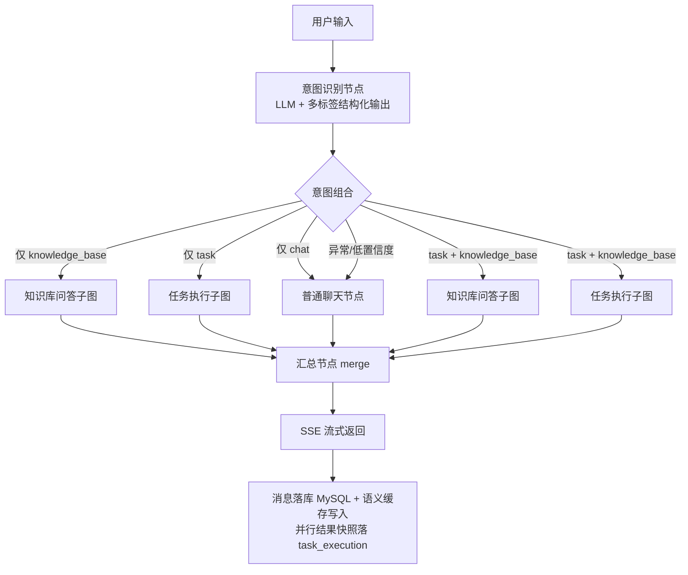
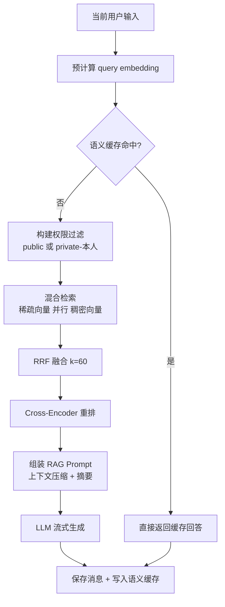
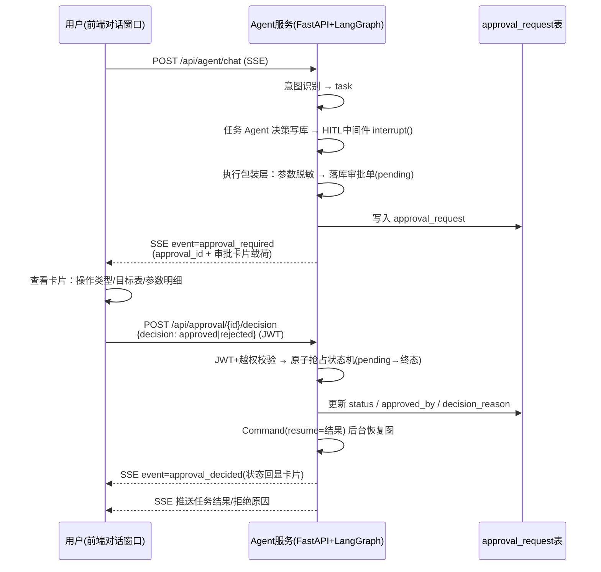
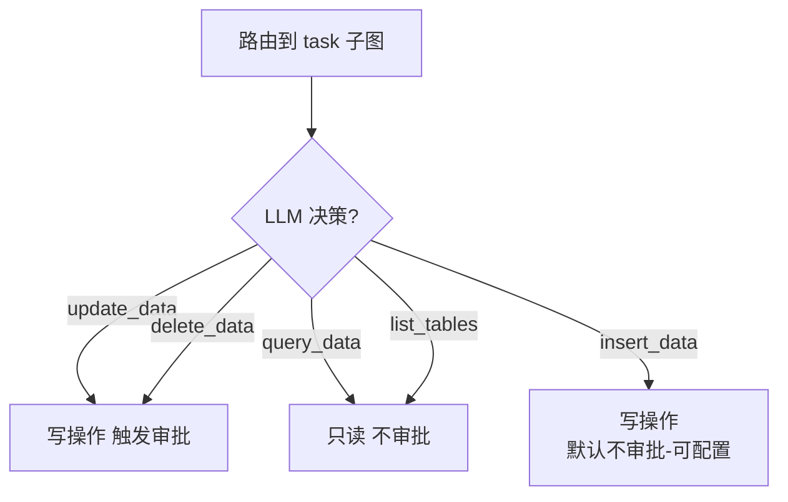
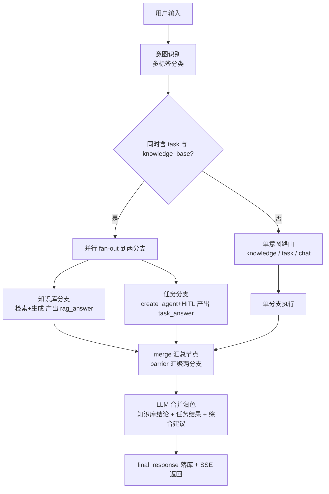
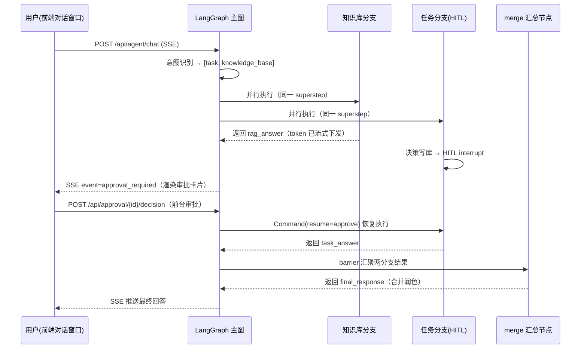

# lingxi-agent 智能化改造开发设计文档（LangChain + LangGraph）

> 版本：v1.0
> 日期：2026-09-04
> 状态：待评审

***

## 目录

1. [文档说明](#1-文档说明)
2. [现状分析](#2-现状分析)
3. [改造目标与技术选型](#3-改造目标与技术选型)
4. [总体架构设计](#4-总体架构设计)
5. [核心模块设计](#5-核心模块设计)
6. [流程图](#6-流程图)
7. \#7-关键功能实现
8. [数据表设计](#8-数据表设计)
9. [API 设计](#9-api-设计)
10. [配置项设计](#10-配置项设计)
11. [安全设计](#11-安全设计)
12. [影响范围与改动清单](#12-影响范围与改动清单)
13. [分阶段实施计划](#13-分阶段实施计划)
14. [风险与注意事项](#14-风险与注意事项)

***

## 1. 文档说明

### 1.1 背景

当前 lingxi-agent 项目是一个基于 FastAPI 的 RAG 问答系统，已具备知识库混合检索（Qdrant 稀疏向量(基于text-embedding-v4) + 稠密向量 + RRF 融合 + Cross-Encoder 重排序）、语义缓存、对话记忆（MySQL）、文件清洗切分与向量入库等能力。

本次改造的核心诉求：

1. 引入 **LangChain + LangGraph** 技术栈，实现基于**意图识别**的路由能力，将用户输入路由到：**知识库问答 / 任务执行 / 普通聊天** 三条链路；
2. **前台审批（Human-in-the-loop）**：当任务执行涉及**数据库删除或修改**操作时，必须经过**人工审批**后才能执行；审批的触发提示与决策动作均在**前台对话窗口**内完成（审批卡片），不再对接飞书审批流；
3. 知识库检索**完整保留现有检索流程**（混合检索 + 语义缓存 + 权限过滤）；
4. 技术栈使用**最新且稳定**的版本，版本间保证兼容；
5. 代码使用**最新 API**，不使用官方明确废弃的接口；
6. 代码设计符合**企业级**标准，关键点与函数均有详细注释；
7. 版本变更只改 `requirements.txt`，由用户安装依赖后再进入开发；
8. 先输出本设计文档（含流程图、关键功能实现方案、影响范围），评审通过后再实施。

### 1.2 已确认的设计决策

| 决策点          | 结论                                                                    |
| ------------ | --------------------------------------------------------------------- |
| 审批触发条件       | 仅当「路由到任务执行」且「LLM 决策是对数据库某张表做**删除或修改**」时触发审批；查询/插入不触发                  |
| 审批人确定方式      | **前台会话用户本人审批**（JWT 身份，仅发起人可提交决策；越权 403），不再对接飞书审批流 |
| 接口兼容策略       | **新增接口，保留旧接口**（`/api/conversations/chat` 维持不变，新增 `/api/agent/chat`）   |
| 任务执行工具范围（初期） | 只读查询、数据插入、数据更新（触发审批）、数据删除（触发审批），全部基于**结构化参数 + 表/列白名单**，禁止 LLM 直接拼 SQL |

***

## 2. 现状分析

### 2.1 当前技术栈

| 层次        | 技术                                                                                     | 说明                                 |
| --------- | -------------------------------------------------------------------------------------- | ---------------------------------- |
| Web 框架    | FastAPI 0.115 + Uvicorn                                                                | 异步 API 服务                          |
| ORM       | SQLAlchemy 2.0 (asyncio) + aiomysql                                                    | 异步数据库访问                            |
| 配置        | Pydantic v2 + pydantic-settings                                                        | `.env.dev` 环境配置                    |
| LLM       | `langchain-openai.ChatOpenAI`（通义千问 DashScope 兼容接口）                                     | 对话/摘要/意图                           |
| Embedding | 自研 `DashScopeEmbedding`（DashScope 原生 SDK 直连）                                           | text-embedding-v4，1024 维（稠密+稀疏双输出） |
| 向量库       | Qdrant（本地磁盘模式）                                                                         | 文档向量 + 语义缓存两个集合                    |
| 检索        | 自研 `HybridRetriever`：Qdrant 稀疏向量(text-embedding-v4) + 稠密向量 + RRF 融合 + Cross-Encoder 重排 | 核心检索链路                             |
| 记忆        | 自研 `MySQLChatMessageHistory` / `MySQLConversationSummaryMemory`                        | 消息持久化 + 长对话摘要压缩                    |
| 缓存        | 自研 `SemanticCache`（Qdrant 独立集合）                                                        | 语义级问答缓存                            |
| 认证        | JWT + bcrypt + 图片验证码                                                                   | 用户体系                               |
| 存储        | 腾讯云 COS                                                                                | 文件持久化                              |
| 追踪        | LangSmith                                                                              | 已接入                                |

### 2.2 当前模块结构

```
lingxi-agent/
├── app/main.py                 # FastAPI 入口：lifespan 初始化、路由注册、全局异常
├── api/routes/                 # 路由层
│   ├── auth.py                 # 验证码/注册/登录/me
│   ├── conversation.py         # 会话 CRUD + 流式对话（use_rag 参数二选一）
│   ├── file_process.py         # 文件清洗切分 + 双向量入库（同 doc_id 先删后插）+ 语义缓存失效
│   ├── metadata.py             # 元数据定义 CRUD
│   ├── attachments.py          # 附件
│   └── cache.py                # 语义缓存统计
├── core/                       # config / database / exceptions
├── models/                     # ORM 模型 + Pydantic Schema
├── rag/
│   ├── hybrid_retriever.py     # HybridRetriever（稀疏+稠密双路） / CrossEncoderReranker
│   ├── rag_conversation_service.py  # RAG 对话服务（检索 + 记忆 + 流式）
│   ├── conversation_service.py # 普通对话服务
│   ├── semantic_cache.py       # 语义缓存
│   └── memory_mysql.py         # MySQL 记忆
├── embeddings/embedding_deal.py # Embedding / Qdrant 客户端
├── ingestion/                  # COS / 解析 / 清洗 / 分块
├── prompt/prompt_storage.py    # 提示词集中管理
├── utils/                      # auth / captcha
└── requirements.txt
```

### 2.3 现有对话 API 流程（保持兼容，不修改）

```
POST /api/conversations/chat   (SSE)
  ├─ use_rag=true  → RAGConversationService.chat_with_rag
  │                  ├─ 预计算 query embedding
  │                  ├─ 语义缓存命中？→ 直接流式返回缓存回答
  │                  ├─ 混合检索（权限过滤 + 稀疏向量(text-embedding-v4) + 稠密向量 + RRF + 重排）
  │                  ├─ 上下文压缩 + 摘要（MySQL）
  │                  ├─ RAG Prompt → LLM 流式生成
  │                  └─ 保存消息 + 写缓存
  └─ use_rag=false → ConversationService.chat_with_memory（普通聊天）
```

### 2.4 现有检索流程（本次改造**原样保留**）

```
用户问题
  ├─ 1. 权限过滤：metadata.auth_option ∈ {public} ∪ {private ∧ create_username=当前用户}
  ├─ 2. 并行召回：稀疏向量召回（text-embedding-v4, top_k=k*5）  ∥  稠密向量（相似度搜索, top_k=k*5）
  ├─ 3. RRF 融合：score(d) = Σ 1/(k + rank_i(d))，k=60
  ├─ 4. Cross-Encoder 重排序（bge-reranker-base 本地模型, 候选 12 条）
  └─ 5. 返回 Top-K 文档（新知识优先，按 created_at 倒序）
```

***

## 3. 改造目标与技术选型

### 3.1 依赖版本矩阵（已写入 requirements.txt）

| 包                          | 版本     | 说明 / 兼容性说明                                               |
| -------------------------- | ------ | -------------------------------------------------------- |
| langchain-core             | 1.6.1  | 最新稳定版，提供 Message / Prompt / Document 等核心抽象               |
| langchain                  | 1.3.10 | 锁定原因：1.4.0 依赖已被官方 **yanked** 的 `langgraph==1.2.11`，安装会失败 |
| langchain-openai           | 1.6.0  | ChatOpenAI 官方适配（通义千问 DashScope 兼容接口）                     |
| langchain-qdrant           | 1.1.0  | QdrantVectorStore 集成，沿用现有向量库                             |
| langgraph                  | 1.2.10 | 锁定原因：1.2.11 已被官方 **yanked**（broken），1.2.10 为最新可用稳定版      |
| langgraph-checkpoint       | 4.2.0  | 图状态持久化基础库（由 langgraph 自动拉取）                              |
| langgraph-checkpoint-mysql | 3.0.0  | MySQL 检查点保存器，用于跨请求恢复审批中断点                                |
| openai                     | 3.8.0  | 最新稳定版（embedding\_deal.py 直连使用，旧 1.x 语法已废弃）               |
| ~~lark-oapi~~              | —      | 已移除（审批入口由飞书改为前台对话窗口，见 §5.6 变更记录）                       |
| qdrant-client              | 1.19.0 | 向量库客户端                                                   |
| langsmith                  | 0.12.1 | 链路追踪                                                     |

> 说明：`langchain-community` 官方已宣布 sunset（停止维护），本项目未使用，已从依赖中移除，避免安全隐患。

### 3.2 技术选型原则

1. **LangGraph 承担编排**：意图路由、条件分支、多意图**并行执行与自动汇聚**、任务执行、Human-in-the-loop 审批，全部由 StateGraph 表达，状态显式、可回放、可持久化；
2. **LangChain 承担模型抽象**：ChatOpenAI、Prompt、Message、Structured Output、Document 等；
3. **复用现有检索资产**：`HybridRetriever`、`SemanticCache` 等检索组件不重写，通过薄适配层接入图节点；稀疏向量与稠密向量均由 **text-embedding-v4** 一次调用双输出并存储于 Qdrant，**不再维护独立 BM25 内存索引**；
4. **审批采用官方 HITL 机制**：`create_agent` + `HumanInTheLoopMiddleware` + LangGraph `interrupt()` + `MySQLAsyncSaver` 检查点持久化，天然支持服务重启后继续审批流；
5. **API 全部使用最新官方接口**：`StateGraph/add_node/add_conditional_edges/interrupt/Command/with_structured_output` 等。任务 Agent 使用 `langchain.agents.create_agent`（LangGraph v1 官方推荐），**不使用已弃用的** **`langgraph.prebuilt.create_react_agent`**，也不使用已废弃的 `Chain`/`LLMChain`/`SequentialChain` 等旧 API。

***

## 4. 总体架构设计

### 4.1 架构分层

```
┌─────────────────────────────────────────────────────────────────────┐
│                         接入层（FastAPI）                            │
│  POST /api/agent/chat(SSE)   POST /api/approval/callback  查询接口  │
└───────────────────────────────┬─────────────────────────────────────┘
                                │
┌───────────────────────────────▼─────────────────────────────────────┐
│                      Agent 编排层（LangGraph）                       │
│  ┌──────────────┐    ┌──────────────────────────────────────────┐  │
│  │ IntentRouter │───►│          AgentStateGraph                 │  │
│  │  意图识别     │    │  intent_router → 条件路由                │  │
│  └──────────────┘    │   ├→ knowledge_subgraph（知识库问答）      │  │
│                      │   ├→ chat_node（普通聊天）                │  │
│                      │   └→ task_subgraph（任务执行 + 审批）      │  │
│                      └──────────────────────────────────────────┘  │
└───────────────┬────────────────────┬────────────────────┬──────────┘
                │                    │                    │
┌───────────────▼──────┐  ┌──────────▼─────────┐  ┌───────▼───────────────┐
│  知识服务（复用现状）  │  │  Agent 工具层       │  │ 审批服务（前台）         │
│  HybridRetriever      │  │  query/insert/     │  │  ApprovalService      │
│  SemanticCache        │  │  update/delete     │  │  审批卡片SSE载荷        │
│  MySQL 记忆           │  │  +表/列白名单       │  │  决策接口+中断恢复       │
└───────────────────────┘  └───────────────────┘  └───────────────────────┘
                │                    │                    │
┌───────────────▼────────────────────▼────────────────────▼──────────────┐
│                       基础设施层                                       │
│  Qdrant(向量+缓存)  MySQL(业务+检查点+审批单)  DashScope LLM/Embedding  │
│  COS(文件)  LangSmith(追踪)  JWT(认证)                                │
└───────────────────────────────────────────────────────────────────────┘
```

### 4.2 新增模块结构

```
lingxi-agent/
├── agent/                              # 新增：Agent 编排层
│   ├── __init__.py
│   ├── state.py                        # LangGraph 图状态定义（TypedDict + Reducer）
│   ├── graph_builder.py                # 组装主图 + 条件路由 + 编译（checkpointer）
│   ├── intent_router.py                # 意图识别节点（Structured Output）
│   ├── nodes/
│   │   ├── __init__.py
│   │   ├── knowledge_node.py           # 知识库问答节点（复用现有检索流程）
│   │   ├── chat_node.py                # 普通聊天节点
│   │   └── task_node.py                # 任务执行节点（create_agent + HITL 中间件）
│   ├── tools/
│   │   ├── __init__.py
│   │   ├── registry.py                 # 工具注册表（名称/风险等级/审批开关）
│   │   └── db_tools.py                 # 数据库工具（结构化参数 + 白名单 + 参数化执行）
│   ├── approval/
│   │   ├── __init__.py
│   │   ├── approval_service.py         # 审批业务（建单/SSE卡片载荷/决策受理/恢复图，幂等状态机）
│   │   └── decision.py                 # 前台审批决策受理（JWT 校验 + 后台恢复包装）
│   └── knowledge_service.py            # 知识服务薄适配层（调用现有 RAG 组件）
├── models/
│   ├── task_model.py                   # 新增：任务执行记录表
│   ├── task_schema.py                  # 新增：任务相关 Schema
│   ├── approval_model.py               # 新增：审批单表
│   └── approval_schema.py              # 新增：审批相关 Schema
├── api/routes/
│   ├── agent.py                        # 新增：/api/agent/chat (SSE) 等
│   └── approval.py                     # 新增：/api/approval/*（决策提交 + 状态查询 + 会话审批列表）
└── prompt/
    ├── prompt_storage.py               # 扩展：意图识别/任务执行提示词
```

***

## 5. 核心模块设计

### 5.1 图状态（AgentState）

```python
# agent/state.py
from typing import TypedDict, Annotated, Optional, Any
from langgraph.graph.message import add_messages

class AgentState(TypedDict, total=False):
    # ---- 对话上下文 ----
    conversation_id: str                # 会话 ID（= LangGraph thread_id）
    user_id: Optional[str]              # 用户 ID
    username: Optional[str]             # 用户名（用于知识库权限过滤）
    model: str                          # 模型名
    messages: Annotated[list, add_messages]   # 消息列表（含历史 + 当前输入）

    # ---- 意图识别（多标签） ----
    intents: list                      # 多意图列表，如 ["task","knowledge_base"] / ["chat"]
    intent_reason: Optional[str]       # LLM 分类理由（可观测）
    intent_confidence: Optional[float] # 置信度

    # ---- 知识库问答 ----
    context_docs: list                 # 检索到的文档
    context_text: Optional[str]        # 格式化后的上下文
    cached_answer: Optional[str]       # 语义缓存命中时直接使用
    rag_answer: Optional[str]          # 知识库分支产出（并行场景下与任务分支隔离）

    # ---- 任务执行 ----
    task_execution_id: Optional[str]    # 任务执行记录 ID
    tool_calls: list                    # 本次任务的工具调用序列（审计）
    tool_results: list                  # 工具执行结果
    pending_write: Optional[dict]       # 待审批的写操作（工具名/表/参数）
    approval_required: bool             # 是否需要审批
    approval_status: Optional[str]      # pending / approved / rejected
    approval_id: Optional[str]          # 审批单 ID

    # ---- 输出 ----
    task_answer: Optional[str]          # 任务分支产出（含审批后结果，供汇总节点合并）
    final_response: Optional[str]      # 汇总节点合并后的最终回答（供落库与回溯）
    error: Optional[str]               # 错误信息
```

### 5.2 意图识别（IntentRouter）

- 采用 `ChatOpenAI.with_structured_output()`（官方最新结构化输出 API，非废弃的 `output_parser` 手工解析）；
- **多标签分类**：同一输入可能同时命中「任务执行 + 知识库问答」，输出意图**列表**而非单一意图：

```python
class IntentResult(BaseModel):
    intents: list[Literal["knowledge_base", "task", "chat"]]  # 可含多个，如 ["task","knowledge_base"]
    reason: str          # 分类依据（可观测/审计）
    confidence: float    # 0~1（整体置信度，取最低子意图置信度）
```

- 提示词（放入 `prompt/prompt_storage.py`，集中管理）：
  - `knowledge_base`：与知识库中文档内容相关的提问（政策、说明书、FAQ 等）；
  - `task`：需要对**业务数据库数据**执行操作的请求（查询/新增/修改/删除某条数据、某张表）；
  - `chat`：寒暄、闲聊、通用知识问答，不涉及知识库文档与数据库操作。
- **意图组合规则**（路由函数执行，见 5.8）：
  - 仅 `["chat"]` → 普通聊天；
  - 仅 `["knowledge_base"]` / 仅 `["task"]` → 单分支；
  - `["task","knowledge_base"]` 同时命中 → **并行**执行任务子图与知识库子图，最后汇总；
  - `chat` 与其它意图并存时**丢弃 chat**（chat 仅作兜底，不参与并行）；
  - 异常输入（如同时命中 3 个）→ 按 `task > knowledge_base > chat` 优先级收敛。
- **降级策略**：LLM 调用失败、输出非法、置信度 < 0.5 时，默认路由到 `chat`，保证服务可用性；
- **安全策略**：命中 `task` 的输入，在进入任务执行前会再次由任务 Agent 判断是否真的需要写操作，双重确认降低误判。任务 Agent 的写工具全部必填 `user_intent_quote` 参数（用户原话中表达写意图的片段），缺失/空白或未命中写意图关键词时工具直接拒绝，引导模型反问用户（见 5.5.2）。

### 5.3 知识库问答节点（KnowledgeNode）

**复用现有检索流程**，通过薄适配层 `agent/knowledge_service.py` 调用现有组件，不改动 `rag/` 内部实现：

```python
# agent/knowledge_service.py（伪代码）
class KnowledgeService:
    def __init__(self, db): self.rag = RAGConversationService(db_session=db)

    async def get_cached(self, user_input, username, embedding):
        return await get_semantic_cache().get(user_input, username, precomputed_embedding=embedding)

    async def retrieve(self, user_input, username, embedding, k=4):
        return await self.rag.retrieve_context_public(...)   # 调用现有混合检索

    async def build_prompt_inputs(self, conversation_id):
        history = await self.rag.get_compressed_history_public(conversation_id)  # 复用压缩+摘要
        return history
```

节点逻辑：

1. 预计算 query embedding；
2. 语义缓存检查（命中 → 直接作为回答，写入消息）；
3. 未命中 → 混合检索（权限过滤 + 稀疏向量(text-embedding-v4) + 稠密向量 + RRF + 重排，`k=4`）；
4. 组装 RAG Prompt（复用 `RAG_SYSTEM_PROMPT_WITH_CONTEXT/WITHOUT_CONTEXT`）；
5. LLM 流式生成（供 API 层 `stream_mode="messages"` 转发 SSE），产出写入 `rag_answer`（并行场景下供 merge 节点合并）；
6. 回答落库（MySQL） + 写入语义缓存。

### 5.4 普通聊天节点（ChatNode）

- 复用 `ConversationService.chat_with_memory` 的 Prompt 组装与记忆逻辑；
- 不使用 RAG 检索，走 `CHAT_SYSTEM_PROMPT` + 最近历史；
- 支持流式输出。

### 5.5 任务执行节点（TaskNode）与工具层

#### 5.5.1 工具清单（初期）

| 工具名           | 能力              | 风险等级 | 是否触发审批       |
| ------------- | --------------- | ---- | ------------ |
| `list_tables` | 列出可操作的表（白名单）    | 只读   | 否            |
| `query_data`  | 结构化条件查询（SELECT） | 只读   | 否            |
| `search_knowledge` | 检索知识库文档（RAG-as-tool，任务执行需文档依据时调用） | 只读 | 否 |
| `insert_data` | 新增记录（INSERT）    | 写    | 否（可配置，默认不审批） |
| `update_data` | 修改记录（UPDATE）    | 写    | **是**        |
| `delete_data` | 删除记录（DELETE）    | 写    | **是**        |

> 工具通过注册表 `agent/tools/registry.py` 声明，每个工具带有 `requires_approval` 标记，未来扩展新工具只需在注册表声明，无需改动图逻辑。
> 写工具（`insert_data`/`update_data`/`delete_data`）签名均含必填参数 `user_intent_quote`，二次确认写操作意图（见 5.5.2）。
> `search_knowledge` 由独立执行器 `agent/tools/knowledge_tool.py` 提供，`username` 服务端注入（权限过滤），`k` clamp 到 [1,10]，返回上下文双重长度截断防止撑爆 Agent 上下文。

#### 5.5.2 结构化参数与安全执行

- **禁止 LLM 拼接 SQL**：工具入参为结构化字段（`table`、`columns`、`filters`、`values`），工具内部用 **SQLAlchemy Core + 绑定参数**构造语句（天然防注入）；
- **表/列白名单**：`AGENT_DB_ALLOWED_TABLES` 配置允许操作的表；列名校验防止越权访问敏感字段；
- **查询限制**：SELECT 默认 `LIMIT 50`、超时保护、结果字段裁剪；
- **写操作二次确认（双保险）**：所有写工具（`insert_data` / `update_data` / `delete_data`）必填 `user_intent_quote`（用户原话中表达该写操作意图的原文片段）。校验规则：
  1. 缺失 / 空白 → 直接拒绝（错误消息引导模型向用户确认，而非直接执行）；
  2. 超长（>200 字符）→ 截断；
  3. 未命中写意图关键词（如 更新 / 修改 / 删除 / 新增 等，词表见 `agent/tools/db_tools.py:WRITE_INTENT_KEYWORDS`）→ 视为缺少用户明确授权，拒绝并引导模型反问用户。
  该参数为函数必选参数，LangChain `StructuredTool` 的 pydantic schema 在工具调用层即拦截缺参；handler 内校验作为二道防线。同时进入 `user_intent_quote` 一并落审计，审批卡片展示该引用供审批人对照用户原话。
- **只读工具**：`list_tables` / `query_data` 由 `DbToolExecutor` 提供；`search_knowledge`（知识库检索）由 `KnowledgeToolExecutor`（`agent/tools/knowledge_tool.py`）提供——`username` 服务端从会话上下文注入（不暴露为工具参数，防止模型伪造身份越权检索私有文档），`k` clamp 到 [1,10] 防检索成本失控，返回上下文按「单文档 800 字 / 总量 4000 字符」双重截断防撑爆 Agent 上下文；工具调用进入 `tool_calls` 审计（与数据库工具合并取并集落库）；
- **审计**：每次工具调用（含参数、结果摘要、`user_intent_quote`）写入 `task_execution` 表。

#### 5.5.3 任务执行节点流程

1. 图路由到 `task` → 进入任务子图；
2. 使用 `langchain.agents.create_agent`（LangGraph v1 官方推荐的最新 Agent API，`langgraph.prebuilt.create_react_agent` 已在 v1 中弃用）创建任务 Agent，绑定工具 + LLM，并挂载 `HumanInTheLoopMiddleware`（官方 HITL 中间件，内置写操作审批中断能力）；
3. Agent 规划 → 若需政策/规则/流程依据，先调用 `search_knowledge` 检索知识库（只读，不触发审批）；
4. 若仅调用只读工具，直接执行并汇总结果；
5. 若 Agent 决定调用 `update_data` / `delete_data` → 中间件依据 `interrupt_on` 策略在**工具执行前**触发 `interrupt`（写操作审批门，见 5.6）；
6. 审批通过 → 恢复执行写工具 → 汇总结果；审批拒绝 → 终止并告知用户；
7. 任务结束，生成人类可读的执行报告作为回答。

#### 5.5.4 工具异常处理与循环兜底（P0 落地）

> 变更记录：任务 Agent 由「工具异常直接中断循环」升级为「异常转 ToolMessage 送回循环（模型自愈）+ 递归上限防死循环」。涉及 `agent/tools/db_tools.py`（`DbToolError` 基类）与 `agent/nodes/task_node.py`（工具绑定与循环配置）。超时体系（§变更二）同步落地：新增 `agent_tool_timeout_seconds` / `agent_llm_timeout_seconds` 配置，任务级整体超时语义回归 `agent_task_timeout_seconds`。

企业级 Agent 的标准做法是**错误进入循环而非中断循环**。基于 `create_agent` 的三层兜底（`langchain.agents.create_agent` 无 `max_iterations` 参数，迭代上限统一走 langgraph 递归机制）：

1. **参数校验错误**：`ToolNode` 默认捕获 → 转成 ToolInvocationError → 按默认模板转 ToolMessage（框架原生行为，无需改动）；
2. **业务执行异常（工具自愈）**：
   - `DbToolError` 由 `Exception` 改为继承 `langchain_core.tools.ToolException`（框架层只把 `ToolException` 视为"业务可恢复错误"）；
   - 工具绑定处设置 `handle_tool_error=_tool_error_content`：异常被捕获为 `{工具执行失败：<已脱敏消息>。请修正参数后重试；若仍失败，请如实告知用户暂无法完成。}` 的 ToolMessage 送回循环；
   - 模型收到错误后可**修正参数重试 / 换工具 / 如实告知用户**，而非直接中断；消息沿用 `_safe_error` 脱敏（不暴露 SQL/参数/堆栈），审计链路不变；
3. **递归上限（防死循环硬保护）**：
   - `create_agent` 内部默认 `recursion_limit=9999`（形同无限制），节点层在 `ainvoke` 的 config 中注入 `recursion_limit=AGENT_MAX_RECURSION_LIMIT`（100，约 25~50 轮往返，覆盖时优先于默认值，运行时验证成立）；
   - 达到上限抛 `GraphRecursionError` → 节点层捕获，落审计 `failed` 并产出友好错误「任务执行超过最大尝试次数，请将请求拆分或简化后重试」；
   - 与审批中断（`GraphInterrupt`）相互独立、无继承关系，两个 except 分支互不遮蔽；审批恢复场景 step 计数从检查点延续，100 上限不受影响。
4. **超时体系（三层，配置化）**：
   - **单次工具调用总时长**（`agent_tool_timeout_seconds`，默认 30s）：`_bind_tools` 用 `_with_tool_timeout` 统一包裹所有工具（`functools.wraps` 保留原签名，工具 schema 不退化）。超时抛 `DbToolError` → 走第 2 点通道送回循环（模型可感知超时并应对）；DB 工具的语句级 120s 上限在工具级统一超时内（通常查询远小于 30s，如业务需要可调大配置）；
   - **单次 LLM 推理**（`agent_llm_timeout_seconds`，默认 60s）：`ChatOpenAI(timeout=...)`，模型挂死不再无限等待；
   - **Agent 循环整体墙钟**（`agent_task_timeout_seconds`，默认 120s）：非审批模式下 `ainvoke` 外层 `asyncio.wait_for` 兜底，超时抛 `asyncio.TimeoutError` → 节点层落审计 `failed` + 友好错误；**审批模式下不设整体超时**（用户审批可能挂起较久，审批等待超时由 `APPROVAL_WAIT_TIMEOUT` 语义负责），仍受工具级/LLM 超时与递归上限保护。

### 5.6 前台审批（Human-in-the-loop）

> 变更记录：审批入口由「飞书审批流」改为「**前台对话窗口内审批卡片**」，不再依赖 lark-oapi 与飞书事件回调；HITL 中断/恢复机制（`HumanInTheLoopMiddleware` + `MySQLAsyncSaver` 检查点）保持不变。

基于 LangChain v1 官方 HITL 机制：`create_agent` + `HumanInTheLoopMiddleware`（内部触发 LangGraph `interrupt()`）+ `MySQLAsyncSaver` 检查点持久化。审批的**触发提示**与**决策动作**均在前台对话窗口完成：

```
任务 Agent（create_agent + HumanInTheLoopMiddleware）
  ├─ Agent 决策调用 update_data / delete_data
  ├─ 中间件在工具执行前 interrupt()
  │    （携带 HITLRequest：action_requests + review_configs，
  │     为每个待审批工具调用生成 action request）
  ├─ 中断状态持久化（thread_id=conversation_id，MySQL 检查点）
        │
        ▼
┌───────────── 执行包装层（approval_service）─────────────────┐
│  检测到 interrupt 后：                                       │
│  ① 从 action_requests 提取工具名/参数（脱敏）                │
│  ② 落库审批单（approval_request，status=pending）            │
│  ③ SSE 推送 event=approval_required + approval 完整载荷      │
│    （前端在消息流中渲染「审批卡片」，见 §7.5）               │
└──────────────────────────────┬───────────────────────────────┘
                               ▼
┌───────────── 前台对话窗口 ───────────────────────────────────┐
│  用户查看审批卡片（操作类型/目标表/参数明细/风险标识）        │
│  点击「同意执行」或「拒绝」                                   │
│  → POST /api/approval/{id}/decision  （JWT 鉴权）            │
└──────────────────────────────┬───────────────────────────────┘
                               ▼
审批服务：JWT + 越权校验 → 原子抢占状态机（pending→approved/rejected）
                               ▼
以 Command(resume=HITLResponse(decisions=[approve/reject])) 恢复图执行（后台任务）
   ├─ approved → 执行写工具 → 完成任务
   └─ rejected → 终止任务，生成"已拒绝"回答
                               ▼
恢复结果经原 SSE 连接推送（content + approval_decided 状态事件）；
SSE 已断开时前端经 GET /api/approval/{id} 轮询兜底。
```

**关键点**：

- 中断点状态（含待审批的工具调用）由 MySQL 检查点保存，**服务重启后仍可恢复**；
- `interrupt_on` 策略按工具名配置：`update_data` / `delete_data` → `allowed_decisions=["approve","reject"]`（不允许 edit/respond，保证审批语义严格）；`insert_data` 默认 `False`（自动放行），如需按运行时条件审批可通过 `when` 回调动态判断；
- 审批决策与恢复为异步后台任务，SSE 连接通过心跳保活，完成后推送最终结果（同时提供轮询接口兜底）；
- 审批单状态与图状态双写，通过 `approval_request.id` 关联，保证幂等（重复提交决策/重复恢复均被状态守卫拦截）；
- **多 action 批次决策**：模型平行 tool calling 时，一次中断可能含**多个待审批写操作**（如同轮 `update_data` + `delete_data`）。单次中断落一张审批单，`actions` 字段保存全部操作（脱敏），`approval_type`/`target_table`/`tool_params` 保存首个 action 供卡片头部展示；恢复时 `decisions` 数量与挂起工具数**一一对应**（LangChain HITL 中间件校验数量不一致会抛 `ValueError`），决策为批次级——同意/拒绝一次覆盖全部操作；
- 审批人 = 当前会话用户（JWT 身份），仅发起人本人可审批；越权提交返回 403。

### 5.7 记忆与消息持久化

- 图内 `messages` 为工作态；每次请求从 MySQL 加载历史（复用 `MySQLChatMessageHistory`），结束后写入新增消息；
- 长对话压缩与摘要复用现有 `MySQLConversationSummaryMemory` 逻辑（通过薄适配层暴露公开方法）；
- LangGraph 检查点仅服务于审批中断/恢复场景，与业务消息表互不冲突。

### 5.8 多意图并行路由与汇总（核心新增）

当用户输入**同时包含任务执行与知识库问答**（如"查一下订单数据，并对照知识库里的售后政策给出处理建议"）时，利用 LangGraph 原生 DAG 能力实现**并行 fan-out + 自动汇聚（barrier）**：

```
intent_router（多标签）
        │  条件路由（route_by_intents）
        ├─ 仅单意图 ──────────────► 对应单分支（knowledge / task_agent / chat）
        └─ ["task","knowledge_base"] ─► 同一 superstep 并行执行：
                                        ├─ knowledge 节点（复用现有检索，输出 rag_answer）
                                        └─ task_agent 节点（create_agent + HITL，输出 task_answer）
                                                 │
                                                 ▼
                                        merge 节点（等待所有前驱完成后自动汇聚，输出 final_response）
```

#### 5.8.1 并行机制（LangGraph 原生能力，无需引入额外并发框架）

| 能力   | LangGraph 机制                                                            | 本项目用法                                               |
| ---- | ----------------------------------------------------------------------- | --------------------------------------------------- |
| 并行执行 | 条件路由映射值可为**节点名列表**，同一 superstep 中无依赖节点并行运行                              | `route_by_intents` 返回 `["knowledge", "task_agent"]` |
| 自动汇聚 | 节点有**多条入边**时，LangGraph 在所有前驱节点完成后才执行（barrier/join）                      | `merge` 节点收敛两个分支                                    |
| 状态隔离 | 并行分支写入**不同字段**，避免 reducer 冲突                                            | 知识库分支写 `rag_answer`，任务分支写 `task_answer`             |
| 中断语义 | 任一分支触发 `interrupt` 会**暂停整个图**，其余分支已产出的结果保留在 state 中，resume 后继续执行到 merge | 任务分支审批中断时，`rag_answer` 已落 state，审批通过后直接进入汇总         |

#### 5.8.2 与前台审批的交互（并行 + 中断）

- 知识库分支通常先完成：`rag_answer` 写入 state，检索与生成结果**不因审批中断而丢失**；
- 任务分支命中写操作 → HITL 中间件 interrupt → 整个图暂停（thread\_id=conversation\_id 持久化）；
- SSE 行为：知识库答案的 token 在中断前已可流式下发 → 随后推送 `event=approval_required`（含审批卡片载荷）→ 前台渲染卡片，用户提交决策 → 后台恢复 → 任务分支完成 → merge 汇总 → 推送最终回答；
- 兜底：若前端连接断开，可通过 `GET /api/agent/tasks/{task_execution_id}` 轮询获得合并后的 `final_response`，审批单状态经 `GET /api/approval/{id}` 轮询。

#### 5.8.3 汇总节点（merge）

- **合并策略**：两条分支结果做最终 LLM 摘要（保证上下文连贯、去重、自然衔接），而非简单字符串拼接：
  - 输入：`rag_answer` + `task_answer` + 原用户输入；
  - 输出：`final_response`（结构化为「知识库结论 + 任务执行结果 + 综合建议」三段式，可视场景省略段）；
  - 若某分支失败/无结果，则汇总节点对剩余分支结果直接润色输出（容错）；
- **可观测性**：`final_response` 连同各分支原始结果一并落库 `task_execution`（含 `rag_answer`、`task_answer` 快照），便于审计与回溯；
- 汇总节点为普通 LLM 调用（非 Agent），无工具、无审批，天然适合作为 DAG 汇聚点。

***

## 6. 流程图

### 6.1 总体路由流程图



> 说明：`G`（知识库）与 `H`（任务）在同一 superstep 并行执行；`merge` 节点有多条入边，LangGraph 自动在其所有前驱完成后才执行（barrier）。

### 6.2 知识库问答子图（复用现有检索流程）



### 6.3 任务执行子图（含审批门）

```mermaid
flowchart TD
    A[路由到 task] --> B[任务 Agent<br/>create_agent + HITL中间件]
    B --> C{需要写库?<br/>update_data/delete_data}
    C -->|否| D[执行只读/插入工具]
    D --> E[生成执行报告]
    C -->|是| F[中间件在工具执行前中断<br/>HITLRequest 携带待审批工具]
    F --> G[执行包装层<br/>脱敏落库审批单]
    G --> H[中断状态持久化<br/>thread_id=conversation_id]
    H --> I[SSE 推送 approval_required<br/>前端渲染审批卡片]
    I --> J[用户在对话窗口审批<br/>POST /api/approval/{id}/decision]
    J --> K{审批结果}
    K -->|通过| L[恢复执行写工具]
    L --> E
    K -->|拒绝| M[终止任务<br/>生成拒绝回答]
    E --> N[SSE 返回 + 落库]
    M --> N
```

### 6.4 前台审批交互时序图



### 6.5 审批触发判定逻辑



### 6.6 多意图并行路由与汇总流程图



### 6.7 多意图并行 + 审批中断时序图



***

## 7. 关键功能实现

### 7.1 意图识别节点实现

```python
# agent/intent_router.py（设计示意，最终以实际编码为准）
from typing import Literal
from pydantic import BaseModel, Field
from langchain_openai import ChatOpenAI
from langchain_core.prompts import ChatPromptTemplate
from core.config import settings
from prompt.prompt_storage import INTENT_CLASSIFICATION_PROMPT

class IntentResult(BaseModel):
    """意图识别结构化输出（多标签：同一输入可命中多个意图）"""
    intents: list[Literal["knowledge_base", "task", "chat"]] = Field(description="意图列表")
    reason: str = Field(description="分类依据")
    confidence: float = Field(description="整体置信度 0~1")

class IntentRouter:
    """意图识别器：多标签 LLM 结构化输出 + 降级策略"""

    def __init__(self, model: str = "qwen-turbo"):
        self._llm = ChatOpenAI(
            model=model,
            openai_api_key=settings.api_key,
            openai_api_base="https://dashscope.aliyuncs.com/compatible-mode/v1",
            temperature=0,
        ).with_structured_output(IntentResult)   # 官方最新结构化输出 API

    async def classify(self, user_input: str, history_text: str = "") -> IntentResult:
        """
        对用户输入进行多标签意图分类。
        失败或异常时降级为 ["chat"]，保证主流程可用。
        """
        try:
            prompt = ChatPromptTemplate.from_messages([
                ("system", INTENT_CLASSIFICATION_PROMPT),
                ("human", "{input}"),
            ])
            result = await (prompt | self._llm).ainvoke({"input": user_input})
            if result.confidence < 0.5:          # 低置信度兜底
                return IntentResult(intents=["chat"], reason="置信度低于阈值", confidence=result.confidence)
            return self._normalize(result)
        except Exception:
            return IntentResult(intents=["chat"], reason="意图识别异常，降级为普通聊天", confidence=0)

    @staticmethod
    def _normalize(result: IntentResult) -> IntentResult:
        """
        意图归一化：去重、丢弃 chat（chat 仅作兜底）、异常多意图按优先级收敛。
        - ["task","knowledge_base"] → 保留两个，触发并行分支
        - 含 chat 的其它组合 → 丢弃 chat
        - 空列表 / 三个全命中 → 按 task > knowledge_base > chat 收敛
        """
        intents = list(dict.fromkeys(result.intents))          # 去重保序
        if "chat" in intents and len(intents) > 1:             # chat 不参与并行
            intents.remove("chat")
        if not intents or len(intents) > 2:
            intents = [i for i in ("task", "knowledge_base") if i in intents] or ["chat"]
        return IntentResult(intents=intents, reason=result.reason, confidence=result.confidence)
```

```python
# agent/graph_builder.py —— 意图组合路由函数（多标签 → 节点列表，实现并行 fan-out）
def route_by_intents(state: AgentState) -> str | list[str]:
    """
    根据多意图返回路由目标。
    - 返回节点名**列表**时，LangGraph 会在同一 superstep 并行执行多个节点；
    - 返回单个节点名则走单分支。
    """
    intents = set(state.get("intents", ["chat"]))
    if intents == {"task", "knowledge_base"}:
        return ["knowledge", "task_agent"]     # 并行 fan-out（关键）
    if "task" in intents:
        return "task_agent"
    if "knowledge_base" in intents:
        return "knowledge"
    return "chat"                              # 兜底
```

### 7.2 主图组装与审批中断/恢复

```python
# agent/graph_builder.py（设计示意）
from langgraph.graph import StateGraph, START, END
from langgraph.checkpoint.mysql.aio import MySQLAsyncSaver
from langgraph.types import Command
from langchain.agents import create_agent
from langchain.agents.middleware import HumanInTheLoopMiddleware
from agent.state import AgentState   # 外层图状态（含意图/审批字段）

def build_task_agent(llm, tools, checkpointer):
    """
    构建任务执行 Agent（LangGraph v1 官方推荐 API）。

    说明：
    - `langgraph.prebuilt.create_react_agent` 已在 LangGraph v1 中弃用，
      统一使用 `langchain.agents.create_agent`（底层仍运行在 LangGraph 上）；
    - `HumanInTheLoopMiddleware` 在写工具**执行前**触发 interrupt，
      通过 interrupt_on 策略实现审批门；中断状态由 checkpointer 持久化。
    """
    return create_agent(
        model=llm,
        tools=tools,
        system_prompt=TASK_AGENT_SYSTEM_PROMPT,
        middleware=[
            HumanInTheLoopMiddleware(
                interrupt_on={
                    # 写操作：仅允许 approve / reject，禁止 edit/respond，语义严格
                    "update_data": {"allowed_decisions": ["approve", "reject"]},
                    "delete_data": {"allowed_decisions": ["approve", "reject"]},
                    # 插入默认自动放行（可配置；如需动态判断可用 when 回调）
                    "insert_data": False,
                },
                description_prefix="数据库写操作待审批",
            ),
        ],
        checkpointer=checkpointer,   # 与主图共用 MySQL 检查点（thread_id=conversation_id）
    )

def build_graph(checkpointer) -> StateGraph:
    """构建主图：意图路由 + 知识库/聊天/任务分支 + 并行汇总"""
    g = StateGraph(AgentState)
    g.add_node("intent_router", intent_router_node)
    g.add_node("knowledge", knowledge_node)
    g.add_node("chat", chat_node)
    # 任务 Agent 作为子图节点嵌入主图；中间件 interrupt 会冒泡到主图 invoke
    g.add_node("task_agent", build_task_agent(llm, tools, checkpointer))
    g.add_node("merge", merge_node)           # 汇总节点（barrier：多入边自动汇聚）
    g.add_node("finalize", finalize_node)     # 收尾：落库 + 快照

    g.add_edge(START, "intent_router")
    g.add_conditional_edges(
        "intent_router",
        route_by_intents,                     # 多标签路由：可返回节点名列表 → 并行 fan-out
        # 映射值可为单个节点名或节点名列表；列表中的节点在同一 superstep 并行执行
        {"knowledge": "knowledge", "task_agent": "task_agent", "chat": "chat"},
    )
    # 三条分支统一汇入 merge（barrier），单分支时 merge 仅透传润色
    g.add_edge("knowledge", "merge")
    g.add_edge("chat", "merge")
    g.add_edge("task_agent", "merge")
    g.add_edge("merge", "finalize")
    g.add_edge("finalize", END)
    return g.compile(checkpointer=checkpointer)
```

**汇总节点（merge\_node）实现**：

```python
# agent/nodes/merge_node.py（设计示意）
from langchain_core.prompts import ChatPromptTemplate
from prompt.prompt_storage import MERGE_ANSWERS_PROMPT

async def merge_node(state: AgentState) -> dict:
    """
    汇总节点：合并知识库分支（rag_answer）与任务分支（task_answer）结果。

    执行策略：
    1. 仅一个分支有结果 → 直接作为 final_response（免 LLM 调用，省时省 token）；
    2. 两个分支均有结果 → LLM 合并润色（知识库结论 + 任务结果 + 综合建议）；
    3. 分支失败 → 由异常处理兜底为可读错误信息。
    """
    rag = state.get("rag_answer")
    task = state.get("task_answer")
    if rag and task:
        prompt = ChatPromptTemplate.from_messages([
            ("system", MERGE_ANSWERS_PROMPT),
            ("human", "用户问题：{question}\n知识库结论：{rag}\n任务执行结果：{task}"),
        ])
        final_response = await (prompt | llm).ainvoke({
            "question": state["messages"][-1].content,
            "rag": rag, "task": task,
        })
        return {"final_response": final_response.content}
    return {"final_response": rag or task or "暂无可用结果"}
```

**执行包装层（TaskExecutionService）—— 审批中断检测与恢复**：

```python
# agent/approval/approval_service.py（设计示意）
async def run_and_handle_approval(graph, inputs, config, sse_queue):
    """
    运行图并处理审批中断：
    1. 正常完成 → 直接输出；
    2. 命中 HITL interrupt → 参数脱敏落库审批单 + SSE 推送完整审批载荷，
       等待前台审批（POST /api/approval/{id}/decision）恢复
       （决策接口以 Command(resume=...) 恢复同一 thread）。
    """
    interrupted = None
    async for chunk in graph.astream(inputs, config=config, stream_mode="updates"):
        if "__interrupt__" in chunk:
            interrupted = chunk["__interrupt__"]
    if interrupted is None:
        return

    # 解析 HITLRequest：提取待审批工具调用（action_requests）
    hitl = interrupted[0].value                 # HITLRequest（action_requests + review_configs）
    approval_id = await save_pending_approval(hitl)     # ① 脱敏落库审批单
    await sse_queue.put({                               # ② SSE 推送完整审批载荷（见 §7.6）
        "event": "status", "status": "approval_required",
        "approval_id": approval_id, "approval": build_card_payload(hitl),
    })

# 前台审批提交后恢复（审批决策接口调用，见 §7.3）：
# approved → decisions=[{"type": "approve"}]
# rejected → decisions=[{"type": "reject", "message": "审批人拒绝原因"}]
# 注：HITLResponse/Decision 的具体构造方式以 langchain.agents.middleware 实际 API 为准，编码阶段核对官方文档
await graph.ainvoke(
    Command(resume={"decisions": [{"type": "approve"}]}),
    config={"configurable": {"thread_id": conversation_id}},
)
```

### 7.3 前台审批决策接口与中断恢复

> 变更记录：原「飞书审批客户端」（feishu_client.py + lark-oapi）随审批入口迁移至前台而整体移除；由下述 JWT 决策接口承担审批受理与恢复触发。

```python
# api/routes/approval.py（设计示意）
@router.post("/{approval_id}/decision")
async def submit_decision(
    approval_id: str,
    body: ApprovalDecisionIn,          # {decision: "approved"|"rejected", reason?: str}
    db: AsyncSession = Depends(get_db),
    current_user: User = Depends(get_current_user),   # JWT：审批人身份
):
    """
    前台审批决策接口：
    1. 越权校验：仅发起人本人可审批（requester_id == current_user.username）；
    2. 原子抢占：UPDATE ... WHERE status='pending'（幂等，重复提交被状态机拦截）；
    3. 回填 approved_by / decision_reason；
    4. 后台任务恢复图执行（独立 DB 会话），立即返回受理结果；
    5. 恢复结果经原 SSE 连接推送，断连时前端轮询 GET /api/approval/{id} 兜底。
    """
    ...
    spawn_background(_resume_in_background(approval_id, body.decision))
    return {"code": 0, "approval_id": approval_id, "status": body.decision}
```

恢复链路复用既有 `approval_service.resume_graph`：状态机抢占 → `Command(resume={"decisions":[...]})` 恢复同一 thread → 更新任务记录 → SSE 推送最终结果 → `set_completed` 结束等待。

### 7.4 数据库工具（结构化参数 + 白名单）

```python
# agent/tools/db_tools.py（设计示意）
from sqlalchemy import text
from core.database import async_engine

class DbToolExecutor:
    """
    数据库工具执行器：只接收结构化参数，禁止拼接 SQL。
    - table 必须命中白名单 AGENT_DB_ALLOWED_TABLES
    - 全部语句使用 SQLAlchemy Core / text() 绑定参数
    - SELECT 强制 LIMIT，防止拖库
    """

    async def query_data(self, table: str, columns: list[str], filters: dict, limit: int = 50) -> list[dict]:
        self._assert_table_allowed(table)                    # 白名单校验
        self._assert_columns_allowed(table, columns)         # 列名校验
        sql = text(f"SELECT {','.join(columns)} FROM `{table}` "
                   f"WHERE {self._build_where(filters)} LIMIT :limit")
        async with async_engine.connect() as conn:
            rows = (await conn.execute(sql, {**filters, "limit": limit})).mappings().all()
        return [dict(r) for r in rows]
```

### 7.5 审批卡片展示数据规范（前台可视化）

前台在对话消息流中渲染**审批卡片**（区别于普通 content 气泡的特殊消息组件）。卡片数据由 `approval_required` SSE 事件携带（见 §7.6），取自脱敏后的 `tool_params` 与审批单元数据。

#### 7.5.1 卡片重点展示数据

| 区块     | 字段                 | 来源                        | 说明                                                                 |
| -------- | -------------------- | --------------------------- | -------------------------------------------------------------------- |
| 头部     | 操作类型             | `approval_type`             | insert（蓝）/ update（橙）/ delete（红），附风险等级标识              |
| 头部     | 目标表               | `target_table`              | 明示写操作作用对象                                                   |
| 头部     | 状态角标             | `status`                    | 待审批（黄）/ 已同意（绿）/ 已拒绝（灰）                             |
| 明细     | 操作列表（多 action）   | `actions`                   | 一次中断含多个写操作时展示操作列表（每项含类型徽章+目标表+明细）；单 action 可缺省 |
| 明细     | 修改内容             | `tool_params.values`        | update：字段→新值 键值对表格                                         |
| 明细     | 影响范围（条件）     | `tool_params.filters`       | update/delete：WHERE 条件键值对，明示"将影响哪些行"                  |
| 明细     | 插入内容             | `tool_params.values`        | insert：字段→值 键值对表格                                           |
| 上下文   | 用户原始请求         | 会话最后一条用户消息        | 帮助用户回忆审批对应的任务上下文                                     |
| 上下文   | 发起人 / 发起时间    | `requester_id` / `created_at` | 审计信息                                                           |
| 操作     | 同意执行 / 拒绝按钮  | —                           | 仅 `status=pending` 时可点；审批人 = 发起人本人（JWT）               |
| 操作     | 拒绝原因（可选）     | `reason`                    | 拒绝时可选填，回传后写入 `decision_reason` 并透传给 LLM 生成拒绝说明 |
| 回显     | 审批人 / 审批时间    | `approved_by` / `updated_at` | 审批后卡片状态翻转回显                                              |
| 提示     | 等待超时说明         | —                           | 超时（默认 2h）后 SSE 结束等待，可经轮询接口获取结果                 |

#### 7.5.2 卡片状态流转（前端视角）

```
approval_required(pending) ──用户点击同意/拒绝──► 按钮禁用 + 「等待执行结果…」
        │                                            │
        │ SSE approval_decided                       │ SSE content（执行结果/拒绝说明）
        ▼                                            ▼
卡片状态翻转（已同意/已拒绝 + 审批人 + 时间） ◄──── 任务结果以普通消息继续输出
```

- **刷新/断线恢复**：前端加载会话历史时经 `GET /api/approvals?conversation_id=xxx` 查询 pending 审批单，重建可交互卡片；已终态审批单以只读卡片回显；
- **轮询兜底**：SSE 断开期间，前端以 `GET /api/approval/{id}` 轮询审批单状态，终态后停止并翻转卡片。

#### 7.5.3 脱敏规则（复用现有 `_mask_params`）

- 敏感键（password/secret/token/key/salt 等）值打码为 `******`；
- 超长值截断（前 16 + `...` + 后 8 字符）；列表/嵌套对象折叠为 `<N 项>`；
- 卡片仅展示必要摘要，完整参数以 `tool_params` 落库审计。

#### 7.5.4 前端实现落地（lingxi-agent-portal）

> 变更记录：以下为 §7.5/§7.6 规范在前端 `lingxi-agent-portal`（React + TS + Vite）的实现落地，2026-09-14 同步设计。

| 文件 | 职责 |
| ---- | ---- |
| `src/types/index.ts` | 新增 `ApprovalData`/`ApprovalStatus`/`ApprovalDecision` 类型；`Message` 扩展 `approval`（卡片数据）与 `approvalPending`（提交中）字段 |
| `src/services/llm.ts` | 新增审批 API：`listApprovals`（按会话查审批单，刷新重建卡片）、`submitApprovalDecision`（决策提交）、`getApprovalStatus`（SSE 断连轮询兜底），均自动携带 JWT |
| `src/components/ApprovalCard.tsx` | 审批卡片组件（六区块：头部操作类型/目标表/状态角标，明细 values+filters，上下文发起人/时间，操作同意/拒绝+拒绝原因，回显审批人/意见，提示超时说明）。决策提交由卡片内部直接调用 `submitApprovalDecision`，提交中禁用按钮、失败展示错误、成功等待 SSE `approval_decided` 回显翻转 |
| `src/components/MessageBubble.tsx` / `MessageList.tsx` | 消息存在 `approval` 数据时优先渲染 `ApprovalCard` 替代普通气泡 |
| `src/hooks/useChat.ts` | SSE `approval_required` → 将审批卡片载荷挂载到当前 assistant 消息（普通气泡暂停输出）；`approval_decided` → 翻转卡片状态（含审批人）；`content` → 审批后的执行结果/最终回答继续输出；加载历史/切换会话时经 `listApprovals` 按创建时间重建审批卡片 |

- **状态流转**（前端视角）：`approval_required` 插入卡片（pending，按钮可点）→ 点击同意/拒绝 → 按钮禁用 +「决策已受理」提示 → SSE `approval_decided` 翻转卡片（已同意/已拒绝 + 审批人）→ `content` 输出任务结果；
- **刷新/断线恢复**：`loadConversationMessages` 并行拉取消息与审批单列表，`reconcileApprovalMessages` 按 `created_at` 将审批卡片合并进消息流（终态只读回显，pending 可交互）；
- **轮询兜底**：SSE 断连期间前端可经 `getApprovalStatus`（`GET /api/approval/{id}`）轮询审批单状态，终态后停止并翻转卡片。

### 7.6 SSE 流式协议（新增接口）

沿用现有 `data: {...}\n\n` 分帧，扩展 `event` 字段区分消息类型：

```json
// 普通 token
data: {"event": "content", "content": "……"}

// 任务状态
data: {"event": "status", "status": "task_started"}

// 审批触发：携带完整审批卡片载荷（前端据此渲染审批卡片，见 §7.5）
data: {
  "event": "status",
  "status": "approval_required",
  "approval_id": "xxx",
  "approval": {
    "approval_type": "update",
    "target_table": "user",
    "tool_params": {"values": {"status": "disabled"}, "filters": {"username": "zhangsan"}},
    "requester_id": "zhangsan",
    "created_at": "2026-09-14 10:00:00",
    "status": "pending"
  }
}

// 审批决策回显：后台恢复前先推送，前端翻转卡片状态
data: {"event": "status", "status": "approval_decided", "approval_id": "xxx",
       "decision": "approved", "approved_by": "zhangsan"}

// 心跳（审批等待期，防连接超时）
data: {"event": "ping"}

// 完成
data: {"event": "done"}
```

> 前端处理要点：收到 `approval_required` 即在消息流插入审批卡片并进入等待态（此时连接保持，`ping` 心跳保活）；收到 `approval_decided` 翻转卡片状态；随后 `content` 帧为任务执行结果或拒绝说明；`done` 结束本轮流。

***

## 8. 数据表设计

### 8.1 task\_execution（任务执行记录，审计）

| 字段                        | 类型             | 说明                                                         |
| ------------------------- | -------------- | ---------------------------------------------------------- |
| id                        | varchar(36) PK | UUID                                                       |
| conversation\_id          | varchar(36)    | 关联会话                                                       |
| user\_id                  | varchar(36)    | 发起人                                                        |
| intent                    | varchar(64)    | 路由意图（task / knowledge\_base / task,knowledge\_base / chat） |
| status                    | varchar(32)    | running / completed / rejected / failed / canceled         |
| tool\_calls               | JSON           | 工具调用序列（名称、参数、结果摘要）                                         |
| rag\_answer               | text           | 知识库分支产出（并行场景快照，供审计/回溯）                                     |
| task\_answer              | text           | 任务分支产出（含审批后结果快照）                                           |
| result                    | text           | 最终回答（final\_response，含合并润色结果）                              |
| error                     | text           | 错误信息                                                       |
| created\_at / updated\_at | datetime       | 时间戳                                                        |

### 8.2 approval\_request（审批单）

> 变更记录：`feishu_instance_code` 废弃（保留列避免存量库迁移，代码不再写入）；`requester_id` 语义调整为**系统用户名**；新增 `decision_reason`（前台拒绝原因）；新增 `actions`（多 action 批次决策，2026-09-14）。

| 字段                        | 类型             | 说明                                                    |
| ------------------------- | -------------- | ----------------------------------------------------- |
| id                        | varchar(36) PK | UUID                                                  |
| task\_execution\_id       | varchar(36)    | 关联任务                                                 |
| conversation\_id          | varchar(36)    | 关联会话（= thread\_id）                                  |
| requester\_id             | varchar(64)    | 发起人（系统用户名，JWT username）                          |
| approval\_type            | varchar(32)    | update / delete / insert（首个 action）                |
| target\_table             | varchar(64)    | 目标表（首个 action）                                      |
| tool\_params              | JSON           | 首个待执行工具参数（脱敏，values/filters 分键，供审批卡片渲染）       |
| actions                   | JSON           | 全部待审批操作列表（脱敏，`[{approval_type,target_table,tool_params}]`；单 action 为单元素列表，供决策数量与明细渲染） |
| status                    | varchar(32)    | pending / approved / rejected / canceled                |
| feishu\_instance\_code    | varchar(128)   | **废弃**（历史列，不再写入）                                  |
| approved\_by              | varchar(64)    | 审批人（前台提交决策的 JWT username）                           |
| decision\_reason          | varchar(255)   | 审批意见（前台可选填写，默认空）                                  |
| callback\_payload         | JSON           | 审计载荷（前台模式存决策请求体摘要）                                |
| created\_at / updated\_at | datetime       | 时间戳                                                    |

> 索引：`idx_appr_instance(instance_code)`（废弃后可不再新建）、`idx_appr_conv(conversation_id, status)`（支撑"按会话查 pending 审批单"卡片重建）。
> 新表由 `Base.metadata.create_all` 在启动时自动创建（沿用现有机制）。

***

## 9. API 设计

### 9.1 新增接口

| 方法   | 路径                                     | 说明                            | 鉴权          |
| ---- | -------------------------------------- | ----------------------------- | ----------- |
| POST | `/api/agent/chat`                      | 智能对话（意图路由 + 知识库/任务/聊天），SSE 流式 | JWT         |
| POST | `/api/approval/{approval_id}/decision` | 前台审批决策（approved/rejected + 可选原因），受理后后台恢复图执行 | JWT（仅发起人） |
| GET  | `/api/approval?conversation_id=xxx`    | 按会话查询审批单列表（刷新后重建审批卡片）         | JWT（仅发起人）   |
| GET  | `/api/agent/tasks/{task_execution_id}` | 查询任务执行状态与结果（轮询兜底）             | JWT         |
| GET  | `/api/approval/{approval_id}`          | 查询审批单状态（轮询兜底）                 | JWT         |

> 变更记录：原 `POST /api/approval/callback`（飞书事件回调，无 JWT）随飞书对接移除而废弃。

请求体（`/api/agent/chat`）与现有 `ChatRequest` 对齐：

```json
{
  "conversation_id": "xxx",
  "messages": [{"role": "user", "content": "把用户张三的账号删除"}],
  "model": "qwen-turbo",
  "stream": true
}
```

> 说明：不再需要 `use_rag` 布尔开关，意图由系统自动识别；旧接口 `/api/conversations/chat` 与 `use_rag` 参数**原样保留**，供存量前端使用。

### 9.2 保留接口（零改动）

- `/api/conversations/chat`（含 `use_rag`）
- `/api/conversations/*` 会话 CRUD、消息列表
- `/api/auth/*`、`/api/file/process`、`/api/metadata/*`、`/api/attachments/*`、`/api/cache/*`

***

## 10. 配置项设计

在 `core/config.py` 增加（`.env.dev` / 生产 `.env` 注入）：

```ini
# ---- 审批（前台模式：无需飞书配置） ----
APPROVAL_WAIT_TIMEOUT=7200                # 审批等待超时（秒），超时后 SSE 结束等待、轮询兜底

# ---- 任务执行 ----
AGENT_DB_ALLOWED_TABLES=user,conversation,conversation_message   # 表白名单，逗号分隔
AGENT_QUERY_MAX_ROWS=50                  # 单次查询最大返回行数
AGENT_TASK_TIMEOUT_SECONDS=120           # 任务执行超时（非审批模式下 Agent 循环整体超时）
AGENT_TOOL_TIMEOUT_SECONDS=30            # 单次工具调用总时长上限
AGENT_LLM_TIMEOUT_SECONDS=60             # 单次 LLM 推理超时
AGENT_INSERT_REQUIRES_APPROVAL=false     # 插入操作是否审批（默认否）
```

> 变更记录：原 FEISHU_* 五项配置随飞书对接移除而废弃（`core/config.py` 中相应字段与 `agent/approval/feishu_client.py`、`callback.py` 一并清理）。

***

## 11. 安全设计

| 风险点         | 措施                                                     |
| ----------- | ------------------------------------------------------ |
| SQL 注入      | 工具仅接收结构化参数，语句全部绑定参数化执行；禁止 LLM 拼接 SQL                   |
| 越权访问数据      | 表/列白名单 + 权限过滤（复用现有 metadata.auth\_option 机制）+ 查询 LIMIT |
| 任务 Agent 失控 | 工具集最小化、每次调用审计落库、超时保护、审批门兜底                             |
| 审批决策接口伪造/越权 | JWT 鉴权 + 发起人本人校验（requester\_id 比对，越权 403）+ 原子抢占状态机（重复提交/重复恢复幂等拦截）+ 决策请求体审计落库 |
| 提示词注入       | 意图识别与工具描述中显式声明"仅处理授权范围内的数据库操作"；知识库内容注入的防御沿用现有提示词分层隔离   |
| 敏感信息泄露      | 日志与审计中不记录完整参数值（脱敏），审批表单仅展示必要摘要                         |
| 并发/重复审批     | 审批单状态机（pending→approved/rejected 单向流转）+ 恢复时再次校验状态      |

***

## 12. 影响范围与改动清单

> 遵循**最小改动原则**：现有已稳定的模块（检索、嵌入、文件处理、认证等）**不重写、不改逻辑**，仅新增少量公开方法供图节点复用。

### 12.1 新增文件（无风险）

| 文件                                                | 内容                   |
| ------------------------------------------------- | -------------------- |
| `agent/**`                                        | 图状态、节点、工具、审批、知识服务适配层 |
| `models/task_model.py` / `task_schema.py`         | 任务表与 Schema          |
| `models/approval_model.py` / `approval_schema.py` | 审批表与 Schema          |
| `api/routes/agent.py` / `approval.py`             | 新接口路由                |
| `docs/lingxi_agent_langgraph_redesign.md`         | 本文档                  |

### 12.2 修改文件（改动极小，需评审确认）

| 文件                                | 改动点                                                                                                                                                                                                                  | 影响范围               |
| --------------------------------- | -------------------------------------------------------------------------------------------------------------------------------------------------------------------------------------------------------------------- | ------------------ |
| `requirements.txt`                | 已改：新增 langgraph 生态、openai 3.x；升级 langchain 系列；**移除 lark-oapi**（前台审批，见 §5.6）                                                                                                                                         | 依赖安装（由用户执行）        |
| `core/config.py`                  | 新增任务执行配置项（纯新增字段，默认值兜底）；**移除 FEISHU_\* 配置**，新增 `APPROVAL_WAIT_TIMEOUT`                                                                                                                                                 | 无行为影响              |
| `.env.dev`                        | 移除飞书配置占位                                                                                                                                                                                                             | 仅本地开发              |
| `app/main.py`                     | lifespan 中初始化 Agent 图（含 MySQL 检查点）；注册 2 个新路由                                                                                                                                                                         | 启动流程扩展，失败降级不影响现有功能 |
| `prompt/prompt_storage.py`        | 新增意图识别/任务执行提示词（纯追加）                                                                                                                                                                                                  | 无                  |
| `rag/rag_conversation_service.py` | 新增 2\~3 个**公开薄方法**（如 `retrieve_context_public`、`get_compressed_history_public`），内部委托现有私有方法；移除 BM25 索引管理器初始化/重建，`rebuild_hybrid_index` 改为 `invalidate_kb_semantic_cache`（仅失效语义缓存），检索链路预计算稠密+稀疏双向量并全链路传递               | 检索行为不变，仅实现载体变化     |
| `rag/hybrid_retriever.py`         | 移除内存 `BM25Indexer`/持久化/同步机制，BM25 路改为 Qdrant **稀疏向量**查询（`query_points` + `using="sparse"`，查询侧与写入侧共用 text-embedding-v4 生成的稀疏向量，支持 `precomputed_sparse` 预计算复用）；RRF 双路融合与 Cross-Encoder 重排保留                             | 检索行为不变，依赖更少        |
| `embeddings/embedding_deal.py`    | 集合同时配置**稠密 + 稀疏**向量（兼容存量无名稠密向量，增量补充 sparse 配置）；`save_to_vectors` 双向量写入，同 `doc_id` 先删后插（Qdrant 删点即删全部向量）；`DashScopeEmbedding` 基于 text-embedding-v4 一次调用双输出（`embed_documents_with_sparse` / `embed_query_with_sparse`） | 写入侧新增稀疏向量，检索侧无需感知  |
| `api/routes/file_process.py`      | 移除 BM25 索引重建步骤，改为知识库变更后失效语义缓存（失败仅告警不阻断）                                                                                                                                                                              | 同 doc_id 自动先删后插    |
| `rag/memory_mysql.py`             | 如需可暴露历史加载公开方法（可选）                                                                                                                                                                                                    | 仅新增方法              |

### 12.3 明确不改动

- `rag/semantic_cache.py`、`rag/memory_mysql.py`、`ingestion/**`、`utils/**`（原样保留）
- `rag/hybrid_retriever.py`、`embeddings/embedding_deal.py` 已完成 **BM25→text-embedding-v4 稀疏向量**改造（见 §12.2）；`rag/bm25_index_manager.py` 已删除
- `api/routes/conversation.py`、`auth.py`、`metadata.py`、`attachments.py`、`cache.py`（旧接口原样保留）

***

## 13. 分阶段实施计划

| 阶段  | 内容                             | 产出                              | 验收标准                                       |
| --- | ------------------------------ | ------------------------------- | ------------------------------------------ |
| 0   | 用户按 requirements.txt 安装依赖      | 可运行环境                           | `pip install -r requirements.txt` 成功，服务可启动 |
| 1   | 意图识别 + 主图骨架（路由到知识库/聊天）         | `agent/` 基础模块、`/api/agent/chat` | 知识库问答与普通聊天流式正常，检索结果与旧接口一致                  |
| 2   | 任务执行子图 + 工具层（只读/插入）            | 工具注册表、db\_tools                 | 查询/插入任务可完成并出审计报告                           |
| 3   | 前台审批（写操作拦截 + interrupt + SSE 审批卡片 + 决策接口恢复） | 审批模块、审批表、决策接口                | update/delete 触发审批，前台卡片展示，通过后执行、拒绝后终止，重启可恢复 |
| 4   | 观测与加固                          | LangSmith 追踪完善、日志、超时、幂等         | 全链路可追踪，异常可降级                               |

***

## 14. 风险与注意事项

1. **依赖兼容**：已通过 PyPI 版本核对锁定版本组合（langchain 1.3.10 + langgraph 1.2.10 + langchain-core 1.6.1），langgraph 1.2.11 与 langchain 1.4.0 组合不可用（yanked），后续升级需重新验证；
2. **LLM 意图误判**：采用结构化输出 + 低置信度降级 + 任务写操作双保险（意图识别 + 写工具 `user_intent_quote` 强校验，见 5.5.2）降低误判概率；上线初期可开启意图结果日志抽查。多意图并行场景下，若误判为 `task+knowledge_base` 会导致一次额外检索/任务开销，通过意图归一化与置信度阈值控制，且单分支结果缺失时 merge 节点可容错输出；
   - **并行分支 + 审批中断（T3-9 已验证）**：LangGraph 中某节点触发 `GraphInterrupt` 会取消同超步中仍在执行的其他并行分支。`task+knowledge_base` 场景下任务分支先触发审批中断时，知识分支（检索 + LLM 生成较慢）会被取消，导致 `rag_answer` 缺失。实现上由 merge 节点在检测到「意图含 knowledge_base 但 rag_answer 为空」时重新执行知识分支以恢复结果（抑制流式、仅恢复文本），保证审批恢复后汇总完整。生产建议使用 Qdrant Server 模式（本地路径模式不允许多进程并发访问）。
3. **审批恢复依赖 MySQL 检查点**：`langgraph-checkpoint-mysql` 需独立的数据库表权限（自动建表）；生产环境建议与业务库隔离或单独 Schema；
4. **SSE 长连接**：审批等待期间连接保持，通过心跳保活；若连接断开，前端可轮询 `/api/agent/tasks/{id}` 兜底；
5. **前台审批语义**：审批人 = 发起人本人（JWT），决策接口做越权校验与原子抢占（幂等）；审批等待期 SSE 心跳保活，超时（`APPROVAL_WAIT_TIMEOUT`）后前端可轮询兜底；刷新页面后经会话审批列表接口重建卡片；单次中断含多个写操作（平行 tool calling）时合并为一张审批单（`actions` 字段），决策为**批次级**并保证 `decisions` 数量与挂起工具数一致，避免中间件数量校验抛错；
6. **数据库写操作范围**：初期白名单表由配置控制，务必在生产环境收敛到最小集合；
7. **API 生命周期监控**：`langgraph.prebuilt.create_react_agent` 已在 LangGraph v1 弃用，本项目统一使用 `langchain.agents.create_agent`；LangChain/LangGraph 迭代较快，开发与升级时应以官方文档为准持续跟进（`langchain.agents.middleware` 中 HITL 相关类的构造方式以实际版本 API 为准）；
8. **存量数据稀疏向量为空（T 系列新增）**：改造前写入 Qdrant 的点仅含稠密向量，稀疏路（text-embedding-v4 关键词）对这些点召回为空。集合已增量补充 `sparse` 向量配置（`update_collection`），但存量点需**重新上传文档**（走 `process_file` 同 `doc_id` 先删后插）后才会生成稀疏向量；检索侧稀疏路为空时自动降级为仅稠密路，不影响服务可用性。
